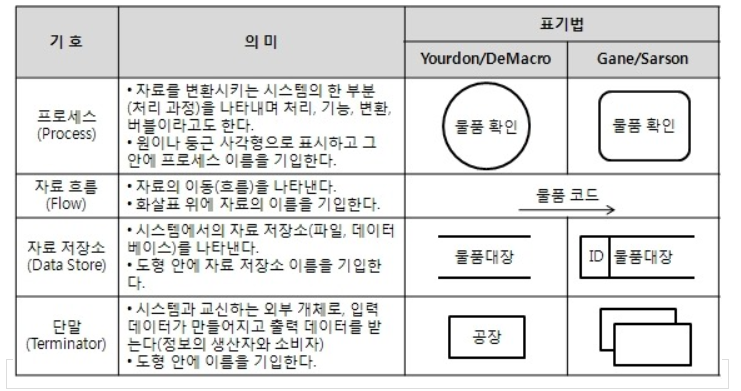

- 소프트웨어 생명 주기 : 소프트웨어를 개발하기 위한 설계, 운용, 유지보수 등의 과정을 각 단계별로 나눈 것
- 폭포수 모형: 각 단계를 확실히 매듭짓고 그 결과를 철저하게 검토하여 승인 과정을 거친 후에 다음 단계를 진행
  - 가장 오래 되고 가장 폭넓게 사용
  - 고전적 생명 주기 모형
  - 각 단계 후 결과물이 명확하게 산출
- 프로토타입 모형: 실제 개발될 소프트웨어에 대한 견본품을 만들어 최종 결과물을 예측
  - 사용자와 시스템 사이의 인터페이스에 중점
- 나선형 모형
  - 여러 번의 소프트웨어 개발 과정을 거쳐 점진적으로 개발
  - 위험 분석 기능 추가
  - 유지보수 과정x
  - 계획 수립 -> 위험 분석 -> 개발 및 검증 -> 고객 평가
- 애자일 모형
  - 요구사항 변화에 유연하게 대응할 수 있도록 일정한 주기를 반복하며 개발
  - 고객과 소통에 중점
  - 폭포수 모형과 대조적
  - 스크럼, XP, 칸반, Lean, 기능 중심 개발
- 애자일 개발 4가지 핵심 가치
  - 개인과 상호작용
  - 실행되는 SW
  - 고객과 협업
  - 변화에 반응하는 것
- 소프트웨어 공학
  - 소프트웨어의 위기를 극복하기 위한 방안으로 연구된 학문

------

- 스크럼(Scrum) 기법: 팀이 중심이 되어 개발
- 스크럼 팀
  - 제품 책임자 : 백로그 작성
  - 스크럼 마스터 : 가이드 역할
  - 개발팀 : 제품 개발
- 스크럼 개발 프로세스
  1. 스프린트 계획 회의: 단기 일정 수립
  2. 스프린트 : 실제 개발 작업 진행
  3. 일일 스크럼 회의 : 15분간 진행 상황 점검, 남은 시간 소멸차트 표시
  4. 스프린트 검토 회의 : 요구사항에 부합하는지 테스트
  5. 스프린트 회고 : 규칙 준수 여부 및 개선점 확인
- XP(eXtreme Programming) 기법: 고객의 참여와 개발 과정 반복을 극대화
  - 릴리즈 시간을 짧게 반복
- XP의 5가지 핵심 가치
  1. 의사소통
  2. 단순성
  3. 용기
  4. 존중
  5. 피드백
- XP 개발 프로세스
  - 릴리즈 계획 수립
  - 이터레이션: 실제 개발 작업
  - 승인 검사: 하나의 이터레이션 안에서 부분 완료 제품 구현시 수행하는 테스트
  - 소규모 릴리즈: 릴리즈 규모를 축소한 것
- XP의 주요 실천 방법
  - Pair Programming: 다른 사람과 함께 프로그래밍
  - Collective Ownership: 개발 코드에 대한 권한과 책임을 공동 소유
  - Test-Driven Development: 실제 코드 작성 전 테스트 케이스 먼저 작성
  - Whole Team: 각자 자신의 역할이 있고 책임을 가져야 함
  - Continuous integration: 모듈 단위 코드를 작업이 끝날 때마다 통합
  - Refactoring: 프로그램 기능의 변경 없이 시스템 재구성
  - Small Releases: 릴리즈 기간을 짧게 반복
- 현행 시스템 파악 절차
  - 1단계: 시스템 구성 파악, 시스템 기능 파악, 시스템 인터페이스 파악
  - 2단계: 아키텍처 구성 파악, 소프트웨어 구성 파악
  - 3단계: 하드웨어 구성 파악, 네트워크 구성 파악
- 운영체제: 컴퓨터 시스템의 자원을 효율적으로 관리, 사용자가 컴퓨터를 편리하고
  효율적으로 사용할 수 있도록 환경을 제공
  - 가용성, 성능, 기술 지원, 주변 기기, 구축 비용
- 데이터베이스 관리 시스템(DBMS): 사용자와 데이터베이스 사이에서 사용자 요구에 따라
  정보를 생성해 주고, 데이터베이스를 관리
  - 데이터의 종속성과 중복성 문제 해결
- 웹 애플리케이션 서버(WAS): 동적인 콘텐츠를 처리하기 위해 사용되는 미들웨어
- 오픈 소스: 제한 없이 사용할 수 있도록 소스 코드를 공개

------

- 요구사항: 어떤 문제를 해결하기 위해 제공하는 서비스에 대한 설명과 정상적으로 운영되는데 필요한 제약조건
- 기능 요구사항: 기능이나 수행과 관련된 요구사항
- 비기능 요구사항: 품질이나 제약사항과 관련된 요구사항
- 사용자 요구사항: 사용자 관점에서 본 시스템이 제공해야 할 요구사항
- 시스템 요구사항: 개발자 관점에서 본 시스템 전체가 사용자와 다른 시스템에 제공해야 할 요구사항
- 요구사항 개발 프로세스: 도출 -> 분석 -> 명세 -> 확인
- 요구공학: 요구사항을 정의하고, 분석 및 관리하는 프로세스를 연구하는 학문
- 요구사항 명세 기법
  - 정형 명세 기법: 수학적 원리 기반, 수학적 기호, 정형화된 표기법
  - 비정형 명세 기법: 상태/기능/객체 중심, 자연어 기반
- 요구사항 분석: 사용자의 요구사항을 이해하고 문서화
- 구조적 분석 기법: 자료의 흐름과 처리를 중심으로 요구사항 분석
  - 하향식 방법
  - 자료 흐름도, 자료 사전, 소단위 명세서, 개체 관계도, 상태 전이도, 제어 명세서
- 자료 흐름도: 자료의 흐름 및 변환 과정과 기능을 도형 중심으로 기술

- 자료 사전: 자료 흐름도에 있는 자료를 더 자세히 정의하고 기록

  - 자료 정의: =
  - 자료 연결: +
  - 자료 생략: ( )
  - 자료 선택: [ ]
  - 자료 반복: { }
  - 자료 설명: " "

- 요구사항 분석용 CASE

  - SADT: 블록 다이어그램 이용
  - SREM
  - PSL/PSA
  - TAGS

- HIPO(Hierarchy Input Process Output): 시스템 실행 과정인 입력,처리,출력 기능을 표현

  - 가시적 도표, 총체적 도표, 세부적 도표

- UML(Unified Modeling Language): 상호 간의 의사소통이 원활하게 이루어지도록 표준화한 대표적인 객체지향 모델링 언어

  - 구성 요소: 사물, 관계, 다이어그램

- UML 사물: 다이어그램 안에서 관계가 형성될 수 있는 대상

  - 구조 사물: 시스템의 개념적, 물리적 요소
  - 행동 사물: 요소들의 행위
  - 그룹 사물: 요소들을 묶어 표현
  - 주해 사물: 부가적인 설명이나 제약조건

- UML 관계: 사물과 사물 사이의 연관성 표현

  - 연관 관계(Association): 2개 이상 사물이 서로 관련
    - 실선
    - 1: 1개 객체
    - n: n개 객체
    - 0..1: 없거나 1개
    - 0..*: 없거나 다수
    - n..*: 최소 n개 이상 
    - n..m: n개~m개
  - 집합 관계(Aggregation): 하나의 사물이 다른 사물에 포함
    - 색칠 안한 마름표
  - 포함 관계(composition): 포함하는 사물의 변화가 포함되는 사물에게 영향
    - 색칠 한 마름표
  - 일반화 관계(Generalization): 하나의 사물이 더 일반적이거나 구체적인 관계
    - 색칠 안한 세모
  - 의존 관계(Dependency): 서로에게 영향을 주는 짧은 시간 동안만 연관을 유지
    - 점선 화살표
  - 실체화 관계(Realization): 사물이 할 수 있거나 해야 하는 기능, 서로를 그룹화 할 수 있는 관계
    - 색칠 안한 점선 화살표

- UML 다이어그램: 사물과 관계를 도형으로 표현

  - 정적 모델링 -> 구조적 다이어그램

  - 동적 모델링 -> 행위 다이어그램

  - 구조적 다이어 그램

  - | 종류                   | 내용 |
    | :--------------------- | ---- |
    | 클래스 다이어그램      |      |
    | 객체 다이어그램        |      |
    | 컴포넌트 다이어그램    |      |
    | 배치 다이어그램        |      |
    | 복합체 구조 다이어그램 |      |
    | 패키지 다이어그램      |      |

    