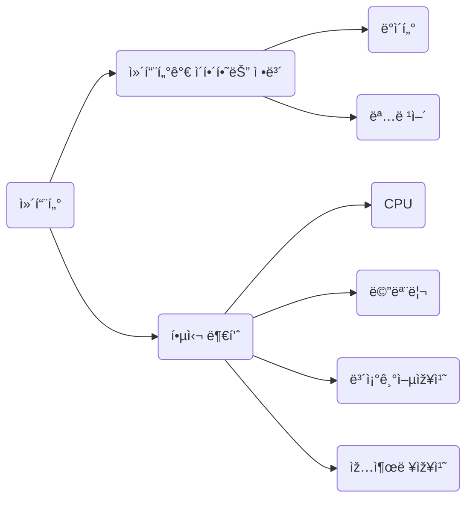

# 💻 Computer Science

### ì»´í“¨í„°ì˜ êµ¬ì„±

```mermaid
flowchart LR
    id0(컴퓨터) --> id1(컴퓨터가 ì´í•´í•˜ëŠ” ì •ë³´)
    id1(컴퓨터가 ì´í•´í•˜ëŠ” ì •ë³´) --> id2(ë°ì´í„°)
    id1(컴퓨터가 ì´í•´í•˜ëŠ” ì •ë³´) --> id3(명령어)
    id0(컴퓨터) --> id4(핵심 부품)
    id4(핵심 부품) --> id5(CPU)
    id4(핵심 부품) --> id6(메모리)
    id4(핵심 부품) --> id7(보조기억장치)
    id4(핵심 부품) --> id8(입출력장치)
```
