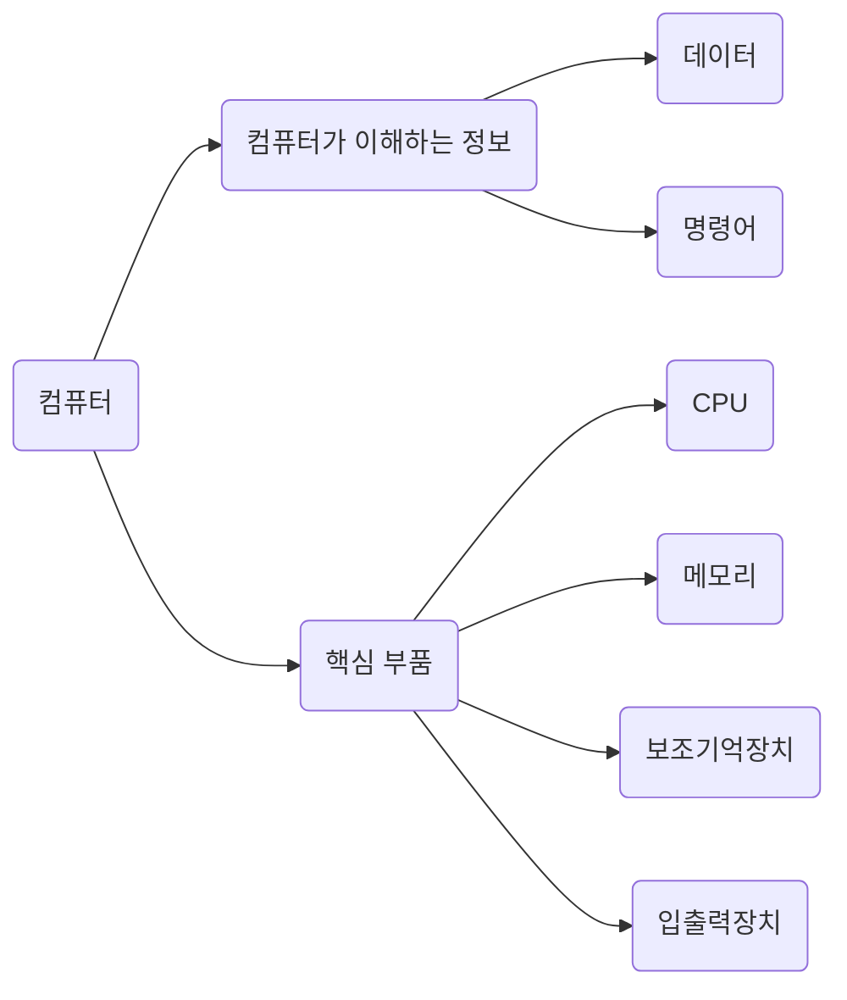

### 컴퓨터의 구성

## Computer System

* [x] [CPU (ALU, CU, Register)](computer-system/cpu.mdx)
* [x] [Memory (RAM, Cache Memory) and Memory hierarchy](computer-system/memory.mdx)
* [x] [Input/Output Devices](computer-system/io-devices.mdx)
* [x] [Bus](computer-system/bus.mdx)
* [x] [Data-representation (Binary, Octal, Hexadecimal)](computer-system/data-representation.mdx)
* [x] [Data Types (Integer, Floating Point, Fixed Point)](computer-system/data-types.mdx)
* [x] [Character Encodings (Unicode, ASCII)](computer-system/character-encodings.mdx)
* [x] [Concurrency and Parallelism](computer-system/concurrency-and-parallelism.mdx)

## Operating System

* [x] [Components of Operating System](operating-system/components.mdx)
* [x] [Kernel](operating-system/kernel.mdx)
* [x] [Process Management](operating-system/process-management.mdx)
* [x] [Memory Management (Virtual Memory, Paging, and Segmentation, Page Replacement Algorithm)](operating-system/memory-management.mdx)
* [x] [I/O Management](operating-system/io-management.mdx)
* [x] [File System(directory structure, permissions)](operating-system/file-system.mdx)

## Data Structures

* [x] Linear data
  * [x] [List](data-structures/list.mdx)
  * [x] [Stack](data-structures/stack.mdx)
  * [x] Queue
  * [ ] linked list
* [ ] Non-linear
  * [x] [Set](data-structures/set.mdx)
  * [x] [Binary tree](data-structures/binary-tree.mdx)
  * [x] [Tree](data-structures/tree.mdx)
  * [ ] [Heap](data-structures/heap.mdx)
  * [ ] graph

## Algorithms

* [x] [Recursion](algorithms/recursion.mdx)
* [x] [Dynamic Programming](algorithms/dynamic-programming.mdx)
* [x] [Brute Force Search](algorithms/brute-force-search.mdx)
* [x] [Greedy Algorithm](algorithms/greedy-algorithm.mdx)
* [x] [Sorting](algorithms/sorting.mdx)
* [x] [Selecting](algorithms/selecting.mdx)
* [x] [Searching](algorithms/searching.mdx)

## Database

* [ ] DBMS
* [ ] SQL and NoSQL
* [ ] Normalization and Denormalization
* [ ] Entity Relationship Model (ERM, ERD)
* [ ] DDL (Data Definition Language) - CREATE, ALTER, DROP
* [ ] DML (Data Manipulation Language) - SELECT, INSERT, UPDATE, DELETE
* [ ] DCL (Data Control Language) - GRANT, REVOKE
* [ ] DQL (Data Query Language) - SELECT
* [ ] Transaction - ACID(Atomicity, Consistency, Isolation, Durability)
* [ ] Database index
* [ ] Distributed database

## Networking

* [ ] OSI Model
* [ ] TCP/IP Model
* [ ] DNS, DHCP, NAT
* [ ] HTTP
* [ ] HTTPS & TLS/SSL
* [ ] Sockets
* [ ] Routing and Switching
* [ ] Firewall

## Security

* [ ] Encryption (Symmetric-key cryptography, Public-key cryptography)
* [ ] Cryptographic hash functions
* [ ] Cryptocurrencies
* [ ] encryption vulnerabilities
* [ ] Integrity and Confidentiality
* [ ] OWASP Top 10

## Compiler

* [ ] difference between compilers and interpreters
* [ ] preprocessing, lexical analysis, parsing, semantic analysis
* [ ] abstract syntax tree
* [ ] Interpreter
* [ ] Virtual machine
