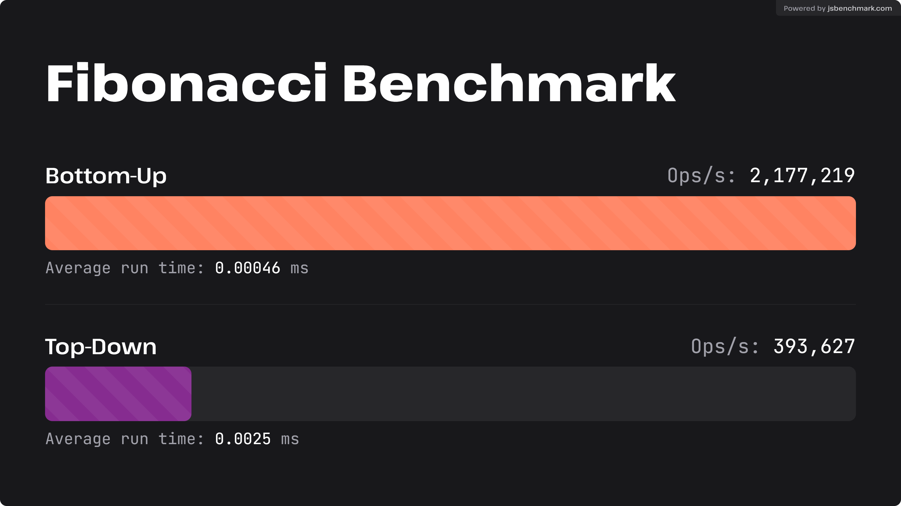

## 동적 계획법이란

동적 계획법(Dynamic Programming, DP)은 \*\*복잡한 문제를 작은 하위 문제로 나누어 풀고, 그 결과를 저장(memoization)\*\*하여 동일한 하위 문제를 반복해서 계산하지 않도록 하는 알고리즘 설계 기법입니다.


### 하향식 방법 (Top-Down Approach)

* 큰 문제를 재귀적으로 호출하면서 작은 하위 문제를 해결.
* 중복 계산을 방지하기 위해 \*\*메모이제이션(Memoization)\*\*을 사용.
* 필요한 경우에만 하위 문제를 계산.

하향식 방법을 통한 피보나치 수열 계산:

```javascript
function fibonacci(n) {
    const memo = {};
    
    function calcFibonacci(k) {
        if (k in memo) return memo[k]; // 이미 계산된 값 반환
        if (k === 0) return 0; // 기본 조건
        if (k === 1) return 1; // 기본 조건
    
        memo[k] = calcFibonacci(k - 1) + calcFibonacci(k - 2); // 계산 후 저장
        return memo[k];
    }
    
    return calcFibonacci(n);
}
```


### 상향식 방법 (Bottom-Up Approach)

* 작은 하위 문제부터 순차적으로 계산하며 테이블을 채워감.
* \*\*반복문(Tabulation)\*\*을 사용하여 결과를 저장.
* 모든 하위 문제를 미리 계산.

상향식 방법을 통한 피보나치 수열 계산:

```javascript
function fibonacci(n) {
    if (n < 2) return n; // 기본 조건
    
    const dp = [0, 1]; // 초기 값 설정
    
    for (let i = 2; i <= n; i++) {
        dp[i] = dp[i - 1] + dp[i - 2]; // 테이블 채우기
    }
    
    return dp[n];
}
```


### 하향식과 상향식의 비교

| **특징**       | **하향식(Top-Down)**            | **상향식(Bottom-Up)**              |
| ------------ | ---------------------------- | ------------------------------- |
| **핵심 아이디어**  | 큰 문제를 재귀적으로 분해, 결과 저장        | 작은 문제부터 순차적으로 계산, 결과 저장         |
| **구현 방식**    | 재귀 + 메모이제이션                  | 반복문 + 테이블화                      |
| **메모리 사용량**  | 재귀 호출 스택 + 메모이제이션 테이블        | 테이블 또는 최소화된 저장 공간               |
| **재귀 호출 문제** | 스택 오버플로우 위험                  | 없음                              |
| **계산 효율성**   | 필요한 문제만 계산 (lazy evaluation) | 모든 하위 문제를 계산 (eager evaluation) |
| **설계 난이도**   | 직관적 (재귀적 사고 방식에 적합)          | 구현 복잡 (순차적 사고 방식 필요)            |
| **속도 최적화**   | 초기 실행 속도 느림                  | 반복문 기반으로 초기 실행 속도 빠름            |




### 동적 계획법의 핵심 개념

1. **최적 부분 구조(Optimal Substructure)**
   * 문제의 최적 해가 하위 문제의 최적 해로부터 구성될 수 있는 경우.
   * 예: 피보나치 수열, 최단 경로 문제.
2. **중복되는 하위 문제(Overlapping Subproblems)**
   * 동일한 하위 문제가 여러 번 재계산되는 경우.
   * 예: 재귀로 피보나치 수열을 계산할 때 `fibonacci(4)`를 여러 번 호출.
3. **메모이제이션(Memoization)**
   * 이미 계산한 하위 문제의 결과를 저장하여 다시 계산하지 않음.
   * 보통 재귀 방식에서 사용.
4. **테이블화(Tabulation)**
   * 하위 문제를 작은 순서부터 계산해 결과를 테이블에 저장하는 방식.
   * 보통 반복문 방식에서 사용.


### 동적 계획법의 단계

1. 문제를 작은 하위 문제로 나눈다.
2. 각 하위 문제를 해결한다(작은 문제부터 순차적으로 해결).
3. 작은 문제의 결과를 저장(메모이제이션 또는 테이블화).
4. 저장된 결과를 사용하여 전체 문제를 해결한다.


### 예제: 피보나치 수열


#### 1. 재귀 방식 + 메모이제이션

```javascript
function fibonacciMemo(n, memo = {}) {
  if (n === 0) return 0;
  if (n === 1) return 1;

  if (memo[n]) return memo[n]; // 이미 계산된 값 반환

  memo[n] = fibonacciMemo(n - 1, memo) + fibonacciMemo(n - 2, memo); // 계산 후 저장
  return memo[n];
}

console.log(fibonacciMemo(50)); // 출력: 12586269025
```

* **시간 복잡도**: O(n)
* **공간 복잡도**: O(n) (재귀 호출 스택 + 메모이제이션)


#### 2. 반복문 방식 + 테이블화

```javascript
function fibonacciTabulation(n) {
  if (n === 0) return 0;
  if (n === 1) return 1;

  const dp = [0, 1]; // 초기 값 설정

  for (let i = 2; i <= n; i++) {
    dp[i] = dp[i - 1] + dp[i - 2]; // 테이블 채우기
  }

  return dp[n];
}

console.log(fibonacciTabulation(50)); // 출력: 12586269025
```

* **시간 복잡도**: O(n)
* **공간 복잡도**: O(n) (테이블 크기)


### 예제: 배낭 문제(Knapsack Problem)


#### 문제 설명

* 물건이 각각의 \*\*가치(value)\*\*와 \*\*무게(weight)\*\*를 가진다.
* 배낭에 넣을 수 있는 최대 무게(capacity)가 주어질 때, 최대의 가치를 얻도록 물건을 선택해야 한다.


#### 입력

* `weights = [2, 3, 4, 5]` (무게 배열)
* `values = [3, 4, 5, 6]` (가치 배열)
* `capacity = 5` (최대 용량)


#### DP 해결 방법

* **dp\[i]\[w]**: 첫 번째 `i`개의 물건을 고려할 때, 무게 `w`까지의 배낭에 넣을 수 있는 최대 가치.
* 점화식:
  * `dp[i][w] = dp[i-1][w]` (현재 물건을 넣지 않음)
  * `dp[i][w] = max(dp[i-1][w], dp[i-1][w - weights[i-1]] + values[i-1])` (현재 물건을 넣는 경우)


#### 구현

```javascript
function knapsack(values, weights, capacity) {
  const n = values.length;
  const dp = Array.from({ length: n + 1 }, () => Array(capacity + 1).fill(0));

  for (let i = 1; i <= n; i++) {
    for (let w = 0; w <= capacity; w++) {
      if (weights[i - 1] <= w) {
        // 물건을 넣을 수 있는 경우
        dp[i][w] = Math.max(
          dp[i - 1][w], // 현재 물건을 넣지 않음
          dp[i - 1][w - weights[i - 1]] + values[i - 1] // 현재 물건을 넣음
        );
      } else {
        // 물건을 넣을 수 없는 경우
        dp[i][w] = dp[i - 1][w];
      }
    }
  }

  return dp[n][capacity]; // 최대 가치 반환
}

const values = [3, 4, 5, 6];
const weights = [2, 3, 4, 5];
const capacity = 5;

console.log(knapsack(values, weights, capacity)); // 출력: 7
```


### 예제: 문자열 편집 거리(Edit Distance)


#### 문제 설명

* 두 문자열 `word1`과 `word2`를 변환하기 위해 최소한의 연산(insert, delete, replace)을 수행해야 한다.
* 이때 필요한 최소 연산 횟수를 계산.


#### 입력

* `word1 = "horse"`
* `word2 = "ros"`


#### DP 해결 방법

* **dp\[i]\[j]**: 문자열 `word1`의 첫 `i`글자와 `word2`의 첫 `j`글자를 일치시키는 데 필요한 최소 연산 수.
* 점화식:
  * `dp[i][j] = dp[i-1][j-1]` (글자가 같을 때)
  * `dp[i][j] = 1 + min(dp[i-1][j], dp[i][j-1], dp[i-1][j-1])` (삽입, 삭제, 교체 중 최소값)


#### 구현

```javascript
function minDistance(word1, word2) {
  const m = word1.length;
  const n = word2.length;
  const dp = Array.from({ length: m + 1 }, () => Array(n + 1).fill(0));

  // 초기 값 설정
  for (let i = 0; i <= m; i++) dp[i][0] = i;
  for (let j = 0; j <= n; j++) dp[0][j] = j;

  for (let i = 1; i <= m; i++) {
    for (let j = 1; j <= n; j++) {
      if (word1[i - 1] === word2[j - 1]) {
        dp[i][j] = dp[i - 1][j - 1]; // 글자가 같으면 연산 필요 없음
      } else {
        dp[i][j] = 1 + Math.min(
          dp[i - 1][j],    // 삭제
          dp[i][j - 1],    // 삽입
          dp[i - 1][j - 1] // 교체
        );
      }
    }
  }

  return dp[m][n];
}

console.log(minDistance("horse", "ros")); // 출력: 3
```


### 동적 계획법의 장단점


#### 장점

1. **효율성**: 중복된 계산을 방지하여 시간 복잡도를 크게 줄임.
2. **명확성**: 문제를 단계적으로 해결할 수 있음.


#### 단점

1. **공간 소모**: 테이블 크기가 커질수록 메모리 사용량 증가.
2. **설계 복잡성**: 점화식을 정확히 정의해야 하며, 문제를 하위 문제로 나누는 것이 어려울 수 있음.
