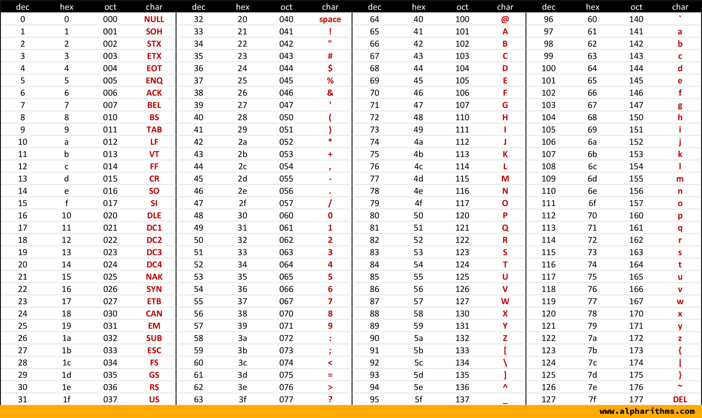

## 문자열 인코딩이란

문자열 인코딩(Character Encodings)은 컴퓨터 시스템에서 텍스트 데이터를 저장하고 전송하는 방법을 정의합니다. 문자열 인코딩은 각 문자에 고유한 숫자 값을 할당하여 컴퓨터가 텍스트를 이해하고 처리할 수 있도록 합니다. 다음은 몇 가지 주요 문자열 인코딩 방식입니다:

## ASCII

아스키 코드는 전자 통신을 위한 문자 인코딩 표준이다

128개의 코드 포인트만 가지고 있으며 그 중 95개만이 인쇄 가능한 문자이다

인쇄 가능한 문자는 숫자 0~~9, 알파벳 소문자 a~~z, 대문자 A\~Z 그리고 구두점 기호 등이 있다

## EUC-KR

한국어를 표현하기 위해 설계된 문자 인코딩 형식입니다. 유니코드가 표준화되기 이전에 한국어 문자를 컴퓨터에서 효율적으로 저장하고 처리하기 위해 사용되었다.

KS X 1001은 2350개의 완성형 한글(모든 초성-중성-종성이 조합된 형태)과 약간의 특수 문자, 기호를 포함한다

## Unicode

유니코드는 디지털화할 수 있는 전 세계의 모든 문자 체계에서 텍스트 사용을 지원하도록 설계된 텍스트 인코딩 표준이다.

유니코드는 기본문자 단위를 인코딩하는 것을 목표로 한다

문자 뿐만 아니라 이모지도 인코딩한다

### 인코딩 형식 차이점

| 인코딩        | 바이트 크기  | ASCII 효율성 | 다국어 효율성 | 사용 사례                    |
| ---------- | ------- | --------- | ------- | ------------------------ |
| **UTF-8**  | 1\~4바이트 | 최고        | 중간      | 웹, 이메일, 파일 저장            |
| **UTF-16** | 2\~4바이트 | 낮음        | 높음      | Windows, Java, 일부 데이터베이스 |
| **UTF-32** | 4바이트    | 낮음        | 낮음      | 유니코드 연구, 특정 응용 프로그램      |

### 유니코드에서 한글

11,172개의 한글을 나타낼 수 있다

십진수 유니코드 = `{(초성) × 588} + {(중성) × 28} + (종성)] + 44032`

* Hangul Syllables (AC00–D7A3)
* Hangul Jamo (1100–11FF)
* Hangul Compatibility Jamo (3130–318F)
* Hangul Jamo Extended-A (A960–A97F)
* Hangul Jamo Extended-B (D7B0–D7FF)

## **EUC-KR과 UTF-8 비교**

| **특징**         | **EUC-KR**           | **UTF-8**         |
| -------------- | -------------------- | ----------------- |
| **문자 집합**      | KS X 1001와 KS X 1003 | 유니코드              |
| **한글 표현**      | 2바이트                 | 2\~3바이트           |
| **비 ASCII 문자** | 한국어만 지원              | 전 세계 언어 지원        |
| **호환성**        | 한국어 전용 환경에 적합        | 전 세계 표준 (웹, 네트워크) |
| **사용 범위**      | 과거 한국어 환경            | 현대 시스템 전반         |
