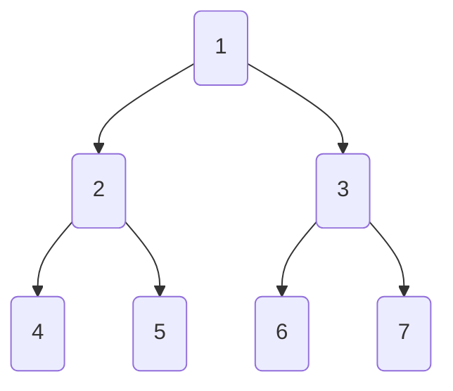
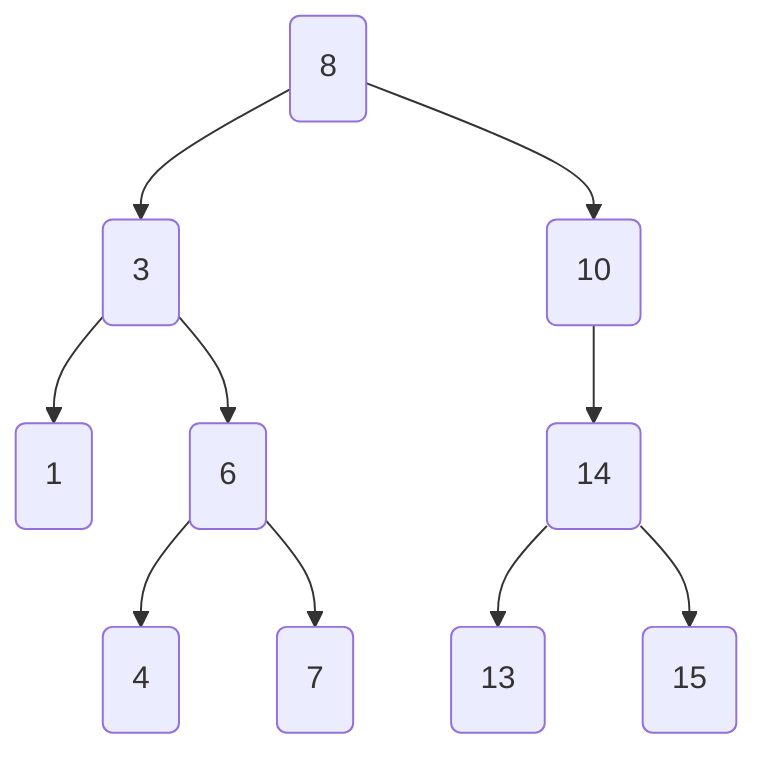
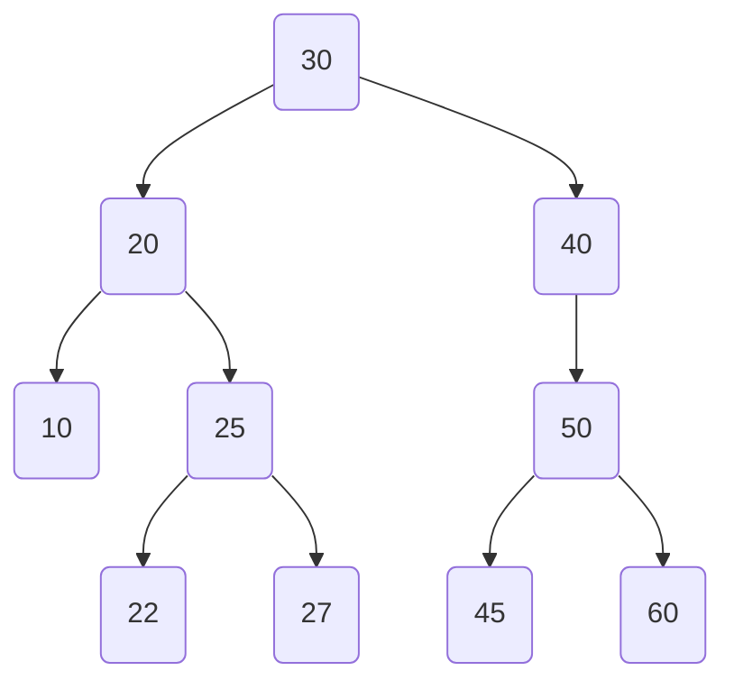

## 이진 트리란

이진 트리(Binary Tree)는 각 노드가 최대 두 개의 자식 노드를 가지는 계층적 데이터 구조입니다.

완전 이진 트리(Complete Binary Tree)는 마지막 레벨을 제외한 모든 레벨이 완전히 채워져 있고, 마지막 레벨은 왼쪽부터 채워져 있는 이진 트리입니다. 높이가 h일 때 트리의 크기는 2^h - 1입니다. 반대로 n개의 노드가 있을 때 트리의 높이는 logn입니다.




## 이진 트리의 기본 동작

시간 복잡도는 평균적인으로 O(log n)이지만, 최악인 편향 트리(Skewed Tree)의 경우 O(n)입니다.

| **Operation** | **Signature**          | **Description**         | **Performance** |
| ------------- | ---------------------- | ----------------------- | --------------- |
| **Insert**    | D × value → D          | 이진 트리에 값을 추가합니다.       | O(log n)        |
| **Delete**    | D × value → D          | 이진 트리에서 값을 제거합니다.       | O(log n)        |
| **Search**    | D × value → boolean    | 이진 트리에 값이 존재하는지 확인합니다. | O(log n)        |
| **Traverse**  | D → value[]            | 이진 트리의 모든 값을 순회합니다.     | O(n)            |


- 전위 순회(Preorder Traversal): 루트 노드 → 왼쪽 서브트리 → 오른쪽 서브트리 순서로 순회합니다.
- 중위 순회(Inorder Traversal): 왼쪽 서브트리 → 루트 노드 → 오른쪽 서브트리 순서로 순회합니다.
- 후위 순회(Postorder Traversal): 왼쪽 서브트리 → 오른쪽 서브트리 → 루트 노드 순서로 순회합니다.


## 이진 트리의 구현

```javascript
class Node {
  constructor(value) {
    this.value = value; // 노드의 값
    this.left = null; // 왼쪽 자식
    this.right = null; // 오른쪽 자식
  }
}

class BinaryTree {
  constructor() {
    this.root = null; // 트리의 루트 노드
  }

  // 노드 삽입
  insert(value) {
    const newNode = new Node(value);
    if (this.root === null) {
      this.root = newNode; // 트리가 비어있으면 루트로 설정
      return;
    }

    let current = this.root;
    while (true) {
      if (value < current.value) {
        // 왼쪽 서브트리로 이동
        if (!current.left) {
          current.left = newNode;
          return;
        }
        current = current.left;
      } else {
        // 오른쪽 서브트리로 이동
        if (!current.right) {
          current.right = newNode;
          return;
        }
        current = current.right;
      }
    }
  }

  // 노드 탐색
  search(value) {
    let current = this.root;
    while (current) {
      if (value === current.value) return true; // 값이 일치하면 true 반환
      current = value < current.value ? current.left : current.right;
    }
    return false; // 값을 찾지 못하면 false 반환
  }

  // 전위 순회
  preorderTraversal(node = this.root, result = []) {
    if (node) {
      result.push(node.value); // 현재 노드 추가
      this.preorderTraversal(node.left, result); // 왼쪽 방문
      this.preorderTraversal(node.right, result); // 오른쪽 방문
    }
    return result;
  }

  // 중위 순회
  inorderTraversal(node = this.root, result = []) {
    if (node) {
      this.inorderTraversal(node.left, result); // 왼쪽 방문
      result.push(node.value); // 현재 노드 추가
      this.inorderTraversal(node.right, result); // 오른쪽 방문
    }
    return result;
  }

  // 후위 순회
  postorderTraversal(node = this.root, result = []) {
    if (node) {
      this.postorderTraversal(node.left, result); // 왼쪽 방문
      this.postorderTraversal(node.right, result); // 오른쪽 방문
      result.push(node.value); // 현재 노드 추가
    }
    return result;
  }
}

// 트리 사용 예제
const tree = new BinaryTree();
tree.insert(10);
tree.insert(5);
tree.insert(15);
tree.insert(3);
tree.insert(7);

console.log("중위 순회:", tree.inorderTraversal()); // [3, 5, 7, 10, 15]
console.log("전위 순회:", tree.preorderTraversal()); // [10, 5, 3, 7, 15]
console.log("후위 순회:", tree.postorderTraversal()); // [3, 7, 5, 15, 10]
console.log("15 탐색 결과:", tree.search(15)); // true
console.log("20 탐색 결과:", tree.search(20)); // false
```


## 이진 탐색 트리 (Binary Search Tree)

이진 탐색 트리(Binary Search Tree; BST)는 이진 트리의 일종으로, 각 노드의 왼쪽 서브트리에는 해당 노드보다 작은 값의 노드만, 오른쪽 서브트리에는 해당 노드보다 큰 값의 노드만 존재합니다.

- 노드의 정렬 규칙: 왼쪽 서브트리의 모든 노드는 해당 노드보다 작은 값을 가지며, 오른쪽 서브트리의 모든 노드는 해당 노드보다 큰 값을 가집니다. 이 규칙은 모든 노드에 대해 재귀적으로 적용됩니다.
- 중복 노드: 허용하는 형태의 이진 탐색 트리도 있지만, 대부분의 경우 중복 노드를 허용하지 않습니다.
- 시간 복잡도: 균형 트리의 경우 O(log n)이지만, 삽입 순서에 따라 한쪽으로 치우친 편향 트리의 경우 O(n)로 성능이 저하될 수 있습니다.



```javascript
class Node {
  constructor(value) {
    this.value = value; // 노드의 값
    this.left = null; // 왼쪽 자식
    this.right = null; // 오른쪽 자식
  }
}

class BinarySearchTree {
  constructor() {
    this.root = null; // 트리의 루트 노드
  }

  // 값 삽입
  insert(value) {
    const newNode = new Node(value);
    if (!this.root) {
      this.root = newNode; // 트리가 비어 있으면 루트로 설정
      return;
    }

    let current = this.root;
    while (true) {
      if (value < current.value) {
        // 왼쪽으로 이동
        if (!current.left) {
          current.left = newNode;
          return;
        }
        current = current.left;
      } else {
        // 오른쪽으로 이동
        if (!current.right) {
          current.right = newNode;
          return;
        }
        current = current.right;
      }
    }
  }

  // 값 탐색
  search(value) {
    let current = this.root;
    while (current) {
      if (value === current.value) return true; // 값을 찾으면 true 반환
      current = value < current.value ? current.left : current.right; // 값 비교 후 이동
    }
    return false; // 값을 찾지 못하면 false 반환
  }

  // 노드 삭제
  delete(value, node = this.root) {
    if (!node) return null; // 트리가 비어있으면 null 반환

    if (value < node.value) {
      node.left = this.delete(value, node.left); // 왼쪽 서브트리에서 삭제
    } else if (value > node.value) {
      node.right = this.delete(value, node.right); // 오른쪽 서브트리에서 삭제
    } else {
      // 삭제할 노드를 찾음
      if (!node.left) return node.right; // 자식이 없거나 하나일 경우
      if (!node.right) return node.left;

      // 자식이 둘일 경우: 오른쪽 서브트리의 최소값으로 대체
      let minLargerNode = this.findMin(node.right);
      node.value = minLargerNode.value;
      node.right = this.delete(minLargerNode.value, node.right);
    }
    return node;
  }

  // 최소값 찾기 (삭제에서 사용)
  findMin(node) {
    while (node.left) {
      node = node.left;
    }
    return node;
  }

  // 전위 순회
  preorderTraversal(node = this.root, result = []) {
    if (node) {
      result.push(node.value);
      this.preorderTraversal(node.left, result);
      this.preorderTraversal(node.right, result);
    }
    return result;
  }

  // 중위 순회
  inorderTraversal(node = this.root, result = []) {
    if (node) {
      this.inorderTraversal(node.left, result);
      result.push(node.value);
      this.inorderTraversal(node.right, result);
    }
    return result;
  }

  // 후위 순회
  postorderTraversal(node = this.root, result = []) {
    if (node) {
      this.postorderTraversal(node.left, result);
      this.postorderTraversal(node.right, result);
      result.push(node.value);
    }
    return result;
  }

  // 트리 형태로 시각화하여 console.log로 출력하는 함수
  print() {
    const lines = [];
    const traverse = (node, prefix = "", childrenPrefix = "") => {
      if (node) {
        lines.push(`${prefix}${node.value}`);
        if (node.left || node.right) {
          if (node.left) {
            traverse(node.left, `${childrenPrefix}├── `, `${childrenPrefix}│   `);
          }
          if (node.right) {
            traverse(node.right, `${childrenPrefix}└── `, `${childrenPrefix}    `);
          }
        }
      }
    };
    traverse(this.root);
    console.log(lines.join("\n"));
  }
}

// 사용 예제
const bst = new BinarySearchTree();
bst.insert(15);
bst.insert(10);
bst.insert(20);
bst.insert(8);
bst.insert(12);
bst.insert(17);
bst.insert(25);

console.log("BST 전위 순회:", bst.preorderTraversal()); // [15, 10, 8, 12, 20, 17, 25]
console.log("BST 중위 순회:", bst.inorderTraversal()); // [8, 10, 12, 15, 17, 20, 25]
console.log("BST 후위 순회:", bst.postorderTraversal()); // [8, 12, 10, 17, 25, 20, 15]

console.log("20 탐색:", bst.search(20)); // true
console.log("30 탐색:", bst.search(30)); // false

bst.delete(15); // 루트 노드 삭제
console.log("15 삭제 후 중위 순회:", bst.inorderTraversal()); // [8, 10, 12, 17, 20, 25]
```


## 자가 균형 이진 탐색 트리 (Self-Balancing Binary Search Tree)

자가 균형 이진 탐색 트리(Self-Balancing Binary Search Tree)는 삽입, 삭제, 탐색 등의 연산을 수행할 때 트리의 균형을 유지하는 이진 탐색 트리입니다. 대표적인 자가 균형 이진 탐색 트리로는 AVL 트리, 레드-블랙 트리, B-트리 등이 있습니다.


### 탄생 목적

단순한 이진 탐색 트리의 경우 삽입, 삭제, 탐색 등의 연산을 수행할 때 평균적으로는 O(log n)의 시간 복잡도를 가지지만, 편향 트리의 경우 O(n)의 시간 복잡도를 가집니다. 자가 균형 이진 탐색 트 리는 이러한 최악의 성능을 개선하기 위해 고안되었습니다.


### AVL 트리 (AVL Tree)

AVL 트리는 Adelson-Velsky와 Landis의 이름을 딴 자가 균형 이진 탐색 트리로, 각 노드의 왼쪽 서브트리와 오른쪽 서브트리의 높이 차이가 1 이하인 이진 탐색 트리입니다. 이러한 특성을 유지하기 위해 삽입, 삭제 연산 시 회전(Rotation)을 수행합니다.


#### AVL 트리의 특징

- 높이 균형: 각 노드의 왼쪽 서브트리와 오른쪽 서브트리의 높이 차이가 1 이하입니다.
- 시간 복잡도: 균형을 유지하므로 모든 연산의 시간 복잡도는 **O(log n)**입니다.
- 회전: 노드의 삽입, 삭제 시 높이 균형을 유지하기 위해 회전 연산을 수행합니다.
- 높이 속성: 각 노드에 height 속성을 추가하여 높이를 저장합니다. 이 값은 균형 조건을 확인하는 데 사용됩니다.


#### AVL 트리의 회전

- LL 회전: 오른쪽으로 회전
- RR 회전: 왼쪽으로 회전
- LR 회전: 왼쪽-오른쪽으로 회전
- RL 회전: 오른쪽-왼쪽으로 회전



```javascript
class AVLNode {
  constructor(key) {
    this.key = key;
    this.left = null;
    this.right = null;
    this.height = 1; // 노드의 높이
  }
}

class AVLTree {
  constructor() {
    this.root = null;
  }

  // 노드 높이를 계산
  getHeight(node) {
    return node ? node.height : 0;
  }

  // 노드의 균형 계수(Balance Factor)를 계산
  getBalanceFactor(node) {
    return node ? this.getHeight(node.left) - this.getHeight(node.right) : 0;
  }

  // 오른쪽으로 회전 (LL)
  rotateRight(y) {
    const x = y.left;
    const T2 = x.right;

    // 회전 수행
    x.right = y;
    y.left = T2;

    // 높이 갱신
    y.height = Math.max(this.getHeight(y.left), this.getHeight(y.right)) + 1;
    x.height = Math.max(this.getHeight(x.left), this.getHeight(x.right)) + 1;

    // 새로운 루트 반환
    return x;
  }

  // 왼쪽으로 회전 (RR)
  rotateLeft(x) {
    const y = x.right;
    const T2 = y.left;

    // 회전 수행
    y.left = x;
    x.right = T2;

    // 높이 갱신
    x.height = Math.max(this.getHeight(x.left), this.getHeight(x.right)) + 1;
    y.height = Math.max(this.getHeight(y.left), this.getHeight(y.right)) + 1;

    // 새로운 루트 반환
    return y;
  }

  // 노드 삽입
  insert(node, key) {
    // 1. 일반적인 BST 삽입
    if (!node) return new AVLNode(key);
    if (key < node.key) node.left = this.insert(node.left, key);
    else if (key > node.key) node.right = this.insert(node.right, key);
    else return node; // 중복 키는 허용하지 않음

    // 2. 노드 높이 갱신
    node.height = Math.max(this.getHeight(node.left), this.getHeight(node.right)) + 1;

    // 3. 균형 계수 계산
    const balance = this.getBalanceFactor(node);

    // 4. 균형이 깨진 경우 회전 수행
    // LL 회전
    if (balance > 1 && key < node.left.key) {
      return this.rotateRight(node);
    }

    // RR 회전
    if (balance < -1 && key > node.right.key) {
      return this.rotateLeft(node);
    }

    // LR 회전
    if (balance > 1 && key > node.left.key) {
      node.left = this.rotateLeft(node.left);
      return this.rotateRight(node);
    }

    // RL 회전
    if (balance < -1 && key < node.right.key) {
      node.right = this.rotateRight(node.right);
      return this.rotateLeft(node);
    }

    // 균형이 유지된 경우 현재 노드 반환
    return node;
  }

  // 트리에 삽입
  add(key) {
    this.root = this.insert(this.root, key);
  }

  // 중위 순회 (In-order Traversal)
  inOrderTraversal(node) {
    if (node) {
      this.inOrderTraversal(node.left);
      console.log(node.key);
      this.inOrderTraversal(node.right);
    }
  }

  // 트리 출력
  printTree() {
    this.inOrderTraversal(this.root);
  }
}

// 사용 예시
const avl = new AVLTree();
avl.add(10);
avl.add(20);
avl.add(30); // RR 회전 발생
avl.add(40);
avl.add(50);
avl.add(25); // LR 회전 발생

console.log("In-order Traversal:");
avl.printTree();
```


### 레드-블랙 트리 (Red-Black Tree)

레드-블랙 트리는 균형 이진 탐색 트리로, 각 노드는 레드(Red) 또는 블랙(Black) 색상을 가집니다.  트리가 삽입과 삭제를 수행해도 높이를 일정 수준(2 * log (n+1) )으로 유지하여 O(log n)의 시간 복잡도를 보장합니다. AVL 트리와 유사하지만, AVL 트리보다는 삽입, 삭제 연산 시 회전을 덜 수행하고, 레드-블랙 트리의 규칙을 준수하면서 균형을 유지합니다. 레드-블랙 트리는 다음과 같은 규칙을 따릅니다.

- 노드 색상: 노드는 레드 또는 블랙 색상을 가집니다.
- 루트 노드: 루트 노드는 블랙 색상입니다.
- 외부 노드: 모든 외부 노드(NIL 노드)는 블랙 색상입니다.
- 레드 노드: 레드 노드의 자식은 모두 블랙 노드입니다.
- 경로에서 블랙 노드 수: 루트 노드부터 외부 노드까지의 경로에서 만나는 블랙 노드의 수는 동일합니다.


#### Red-Black Tree의 주요 연산

1. 삽입
    1. 새 노드는 항상 **빨간색**으로 삽입됩니다.
    2. 삽입 후 트리가 Red-Black 조건을 위반하면 **재조정(Rebalancing)**이 필요합니다:
          - **Case 1**: 부모 노드가 검은색인 경우 → 그대로 유지 (문제 없음)
          - **Case 2**: 부모 노드가 빨간색이지만, 삼촌 노드도 빨간색인 경우 → **Recoloring** (색상 변경)
          - **Case 3**: 부모 노드가 빨간색이고 삼촌 노드가 검은색인 경우 → **회전** (Rotation)
2. 삭제
    1. 삭제 시 노드의 색상에 따라 조건 위반이 발생할 수 있습니다:
        - 삭제한 노드가 빨간색 → 추가 작업 필요 없음.
        - 삭제한 노드가 검은색 → 균형 조건 위반 가능 → **재조정(Rebalancing)** 필요.
    2. 회전(Rotation) 또는 재색(Recoloring)을 통해 트리를 복구합니다.


#### Red-Black Tree의 구현

```javascript
class RedBlackNode {
  constructor(key, color = "RED") {
    this.key = key;
    this.color = color; // "RED" or "BLACK"
    this.left = null;
    this.right = null;
    this.parent = null;
  }
}

class RedBlackTree {
  constructor() {
    this.TNULL = new RedBlackNode(null, "BLACK"); // 리프 노드 (TNULL)
    this.root = this.TNULL; // 초기 루트는 TNULL
  }

  // 중위 순회 (트리 출력용)
  inOrderTraversal(node) {
    if (node !== this.TNULL) {
      this.inOrderTraversal(node.left);
      console.log(`${node.key} (${node.color})`);
      this.inOrderTraversal(node.right);
    }
  }

  // 왼쪽 회전
  rotateLeft(x) {
    const y = x.right;
    x.right = y.left;
    if (y.left !== this.TNULL) {
      y.left.parent = x;
    }
    y.parent = x.parent;
    if (x.parent === null) {
      this.root = y;
    } else if (x === x.parent.left) {
      x.parent.left = y;
    } else {
      x.parent.right = y;
    }
    y.left = x;
    x.parent = y;
  }

  // 오른쪽 회전
  rotateRight(x) {
    const y = x.left;
    x.left = y.right;
    if (y.right !== this.TNULL) {
      y.right.parent = x;
    }
    y.parent = x.parent;
    if (x.parent === null) {
      this.root = y;
    } else if (x === x.parent.right) {
      x.parent.right = y;
    } else {
      x.parent.left = y;
    }
    y.right = x;
    x.parent = y;
  }

  // 삽입 후 균형 복구
  fixInsert(node) {
    while (node.parent.color === "RED") {
      if (node.parent === node.parent.parent.left) {
        const uncle = node.parent.parent.right;

        // Case 1: 삼촌이 빨간색
        if (uncle.color === "RED") {
          uncle.color = "BLACK";
          node.parent.color = "BLACK";
          node.parent.parent.color = "RED";
          node = node.parent.parent; // 조부모로 이동
        } else {
          // Case 2 & 3: 삼촌이 검은색
          if (node === node.parent.right) {
            node = node.parent;
            this.rotateLeft(node); // 왼쪽 회전
          }
          node.parent.color = "BLACK";
          node.parent.parent.color = "RED";
          this.rotateRight(node.parent.parent); // 오른쪽 회전
        }
      } else {
        const uncle = node.parent.parent.left;

        // Case 1: 삼촌이 빨간색
        if (uncle.color === "RED") {
          uncle.color = "BLACK";
          node.parent.color = "BLACK";
          node.parent.parent.color = "RED";
          node = node.parent.parent;
        } else {
          // Case 2 & 3: 삼촌이 검은색
          if (node === node.parent.left) {
            node = node.parent;
            this.rotateRight(node); // 오른쪽 회전
          }
          node.parent.color = "BLACK";
          node.parent.parent.color = "RED";
          this.rotateLeft(node.parent.parent); // 왼쪽 회전
        }
      }
    }
    this.root.color = "BLACK"; // 루트는 항상 검은색
  }

  // 삽입
  insert(key) {
    const newNode = new RedBlackNode(key);
    newNode.left = this.TNULL;
    newNode.right = this.TNULL;

    let parent = null;
    let current = this.root;

    while (current !== this.TNULL) {
      parent = current;
      if (key < current.key) {
        current = current.left;
      } else {
        current = current.right;
      }
    }

    newNode.parent = parent;

    if (parent === null) {
      this.root = newNode;
    } else if (key < parent.key) {
      parent.left = newNode;
    } else {
      parent.right = newNode;
    }

    this.fixInsert(newNode);
  }

  // 트리 출력
  printTree() {
    this.inOrderTraversal(this.root);
  }
}

// 사용 예시
const rbt = new RedBlackTree();
rbt.insert(20);
rbt.insert(15);
rbt.insert(25);
rbt.insert(10);
rbt.insert(5);

console.log("In-order Traversal:");
rbt.printTree();
```


### 무게 균형 트리 (Weight-Balanced Binary Tree)

무게 균형 트리(Weight-Balanced Binary Tree; WBBT)는 자체 균형 이진 탐색 트리의 일종으로, 각 노드에서 왼쪽과 오른쪽 서브트리의 노드 개수를 기반으로 유지하는 이진트리입니다. AVL 트리나 레드-블랙 트리처럼 높이를 기반으로 균형을 유지하는 것이 아니라, 노드의 개수(Weight)를 기반으로 균형을 유지합니다.


#### 무게 균형 트리의 특징


- 균형 조건
  - 특정 균형 계수 α(보통 1/2 ≤ α ≤ 1)와 함께, 모든 노드는 다음 조건을 만족해야 합니다
    - `α * (w_left + w_right + 1) ≤ w_left + 1`
    - `α * (w_left + w_right + 1) ≤ w_right + 1`
    - `w_left`와 `w_right`는 각각 왼쪽과 오른쪽 서브트리의 노드 개수입니다.
- 시간 복잡도: 무게 균형 트리는 노드의 개수를 기반으로 균형을 유지하므로, 모든 연산의 시간 복잡도는 **O(log n)**입니다.
- 회전: 노드의 삽입, 삭제 시 노드의 개수를 기반으로 회전 연산을 수행합니다.


#### 무게 균형 트리의 구현

```javascript
class WBBTNode {
  constructor(key) {
    this.key = key;
    this.left = null;
    this.right = null;
    this.weight = 1; // 노드의 개수 (자신 포함)
  }
}

class WBBT {
  constructor(alpha = 0.5) {
    this.root = null;
    this.alpha = alpha; // 균형 계수
  }

  // 노드의 weight 반환
  getWeight(node) {
    return node ? node.weight : 0;
  }

  // 노드의 weight 업데이트
  updateWeight(node) {
    if (node) {
      node.weight = 1 + this.getWeight(node.left) + this.getWeight(node.right);
    }
  }

  // 균형 검사
  isBalanced(node) {
    if (!node) return true;
    const totalWeight = this.getWeight(node);
    const leftWeight = this.getWeight(node.left);
    const rightWeight = this.getWeight(node.right);
    return (
      this.alpha * totalWeight <= leftWeight + 1 &&
      this.alpha * totalWeight <= rightWeight + 1
    );
  }

  // 왼쪽 회전
  rotateLeft(node) {
    const newRoot = node.right;
    node.right = newRoot.left;
    newRoot.left = node;

    // weight 업데이트
    this.updateWeight(node);
    this.updateWeight(newRoot);

    return newRoot;
  }

  // 오른쪽 회전
  rotateRight(node) {
    const newRoot = node.left;
    node.left = newRoot.right;
    newRoot.right = node;

    // weight 업데이트
    this.updateWeight(node);
    this.updateWeight(newRoot);

    return newRoot;
  }

  // 트리를 균형 상태로 복구
  rebalance(node) {
    this.updateWeight(node);

    const leftWeight = this.getWeight(node.left);
    const rightWeight = this.getWeight(node.right);

    // LL 회전
    if (leftWeight > this.alpha * (leftWeight + rightWeight + 1)) {
      if (this.getWeight(node.left.left) < this.getWeight(node.left.right)) {
        node.left = this.rotateLeft(node.left); // LR 상황
      }
      return this.rotateRight(node);
    }

    // RR 회전
    if (rightWeight > this.alpha * (leftWeight + rightWeight + 1)) {
      if (this.getWeight(node.right.right) < this.getWeight(node.right.left)) {
        node.right = this.rotateRight(node.right); // RL 상황
      }
      return this.rotateLeft(node);
    }

    return node;
  }

  // 노드 삽입
  insert(node, key) {
    if (!node) return new WBBTNode(key);

    if (key < node.key) {
      node.left = this.insert(node.left, key);
    } else if (key > node.key) {
      node.right = this.insert(node.right, key);
    } else {
      return node; // 중복 키는 허용하지 않음
    }

    return this.rebalance(node);
  }

  // 트리에 삽입
  add(key) {
    this.root = this.insert(this.root, key);
  }

  // 중위 순회 (In-order Traversal)
  inOrderTraversal(node) {
    if (node) {
      this.inOrderTraversal(node.left);
      console.log(node.key);
      this.inOrderTraversal(node.right);
    }
  }

  // 트리 출력
  printTree() {
    this.inOrderTraversal(this.root);
  }
}

// 사용 예시
const wbbt = new WBBT(0.6); // α 값 설정
wbbt.add(10);
wbbt.add(20);
wbbt.add(30); // RR 회전 발생
wbbt.add(5);
wbbt.add(25); // RL 회전 발생
wbbt.add(1);

console.log("In-order Traversal:");
wbbt.printTree();
```
