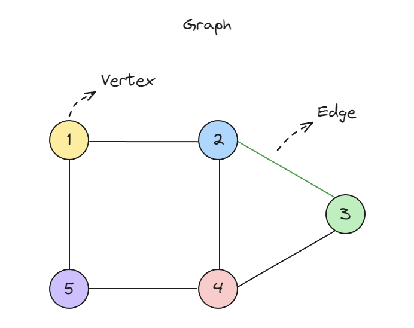

# Graph

**그래프(Graph)**는 **정점(Vertices)**과 **간선(Edges)**으로 이루어진 데이터 구조로, 정점들 간의 관계를 표현하는 데 사용됩니다. 그래프는 소셜 네트워크, 지도, 네트워크 연결, 경로 탐색 등의 다양한 문제를 해결하는 데 유용합니다.


## 그래프의 구성 요소

1. **정점(Vertex, Point, Node)**
   그래프에서 데이터가 저장되는 기본 단위입니다. 예를 들어, 도시를 나타낼 수 있습니다.
2. **간선(Edge, Link, Arc, Arrow, Line)**
   두 정점을 연결하는 선입니다. 예를 들어, 도시 간의 도로를 나타낼 수 있습니다.
3. **차수(Degree)**
   정점에 연결된 간선의 개수입니다.
4. **이웃(Neighbor)**
   정점 A와 B가 간선으로 연결되어 있을 때, A와 B는 서로 이웃입니다.
5. **방향성**
   - **무방향 그래프(Undirected Graph)**: 간선에 방향이 없습니다. 정점 A와 B가 연결되면 A에서 B로, B에서 A로 이동 가능합니다.
   - **방향 그래프(Directed Graph)**: 간선에 방향이 있습니다. 정점 A에서 B로 이동 가능하지만, B에서 A로는 이동할 수 없습니다.
6. **가중치(Weight)**
   간선에 비용이나 거리가 부여될 수 있습니다. 예: 도로의 길이.




## 그래프의 종류

1. **무방향 그래프(Undirected Graph)**
   - 간선에 방향이 없는 그래프입니다.
   - 정점 A와 B가 연결되어 있으면 A에서 B로, B에서 A로 이동 가능합니다.
2. **방향 그래프(Directed Graph)**
    - 간선에 방향이 있는 그래프입니다.
    - 정점 A에서 B로 이동 가능하지만, B에서 A로는 이동할 수 없습니다.
3. **가중 그래프(Weighted Graph)**
    - 간선에 가중치가 있는 그래프입니다.
    - 간선에 비용이나 거리가 부여됩니다.
4. **순환 그래프(Cyclic Graph)**
    - 한 정점에서 출발해 다시 돌아와 출발점으로 돌아올 수 있는 그래프입니다.


## 그래프의 표현 방법

1. **인접 행렬(Adjacency Matrix)**
   - 2차원 배열로 그래프를 표현합니다.
   - 정점 A와 B가 연결되어 있으면 `matrix[A][B] = 1`로 표현합니다.
   - 무방향 그래프의 경우 `matrix[B][A] = 1`로도 표현합니다.
   - 가중치가 있는 경우 `matrix[A][B] = weight`로 표현합니다.
   - 장점: 간선의 존재 여부를 빠르게 확인할 수 있습니다.
   - 단점: 정점의 개수가 많을 경우 메모리 낭비가 발생합니다.

```javascript
const graph = [
  [0, 1, 1, 0],
  [1, 0, 1, 1],
  [1, 1, 0, 1],
  [0, 1, 1, 0],
];
```

2. **인접 리스트(Adjacency List)**
    - 연결 리스트로 그래프를 표현합니다.
    - 각 정점마다 연결된 정점들을 리스트로 저장합니다.
    - 무방향 그래프의 경우 양방향으로 저장합니다.
    - 가중치가 있는 경우 정점과 가중치를 함께 저장합니다.
    - 장점: 메모리를 효율적으로 사용할 수 있습니다.
    - 단점: 간선의 존재 여부를 확인하는 데 시간이 더 걸립니다.

```javascript
const graph = {
  A: ["B", "C"],
  B: ["A", "C", "D"],
  C: ["A", "B", "D"],
  D: ["B", "C"],
};
```


## 방법별 복잡도 비교

- `V`: 정점(Vertex)의 개수
- `E`: 간선(Edge)의 개수

- 인접 행렬 방식: 행렬의 크기를 변경하거나 복사해야 하기 때문에 정점을 추가하거나 제거할 때 시간이 더 걸립니다.
- 인접 리스트 방식: 모든 정점을 순회하면서 간선을 찾아야 하기 때문에 정점과 간선을 제거할 때 시간이 더 걸립니다.

| 연산         | 인접 행렬   | 인접 리스트 |
|--------------|-------------|-------------|
| 정점 추가    | O(V^2)      | O(1)        |
| 간선 추가    | O(1)        | O(1)        |
| 정점 제거   | O(V^2)      | O(V+E)      |
| 간선 제거   | O(1)        | O(V)        |
| 그래프 저장 | O(V^2)      | O(V+E)      |
| 두 정점 연결 확인 | O(1)    | O(V)        |


## 인접 리스트를 이용한 그래프 구현

```javascript
class Graph {
  constructor() {
    this.adjacencyList = {};
  }

  addVertex(vertex) {
    this.adjacencyList[vertex] = [];
  }

  removeVertex(vertex) {
    delete this.adjacencyList[vertex];

    for (const v in this.adjacencyList) {
      this.adjacencyList[v] = this.adjacencyList[v].filter(
        (e) => e !== vertex
      );
    }
  }

  addEdge(vertex1, vertex2) {
    this.adjacencyList[vertex1].push(vertex2);
    this.adjacencyList[vertex2].push(vertex1);
  }

  removeEdge(vertex1, vertex2) {
    this.adjacencyList[vertex1] = this.adjacencyList[vertex1].filter(
      (v) => v !== vertex2
    );
    this.adjacencyList[vertex2] = this.adjacencyList[vertex2].filter(
      (v) => v !== vertex1
    );
  }

  print() {
    for (const vertex in this.adjacencyList) {
      console.log(`${vertex}: ${this.adjacencyList[vertex].join("")}`);
    }
  }
}

const graph = new Graph();
graph.addVertex("A");
graph.addVertex("B");
graph.addVertex("C");

graph.addEdge("A", "B");
graph.addEdge("A", "C");
graph.addEdge("B", "C");

graph.print();
console.log("Removing edge A-B");
graph.removeEdge("A", "B");
graph.print();

console.log("Removing vertex A");
graph.removeVertex("A");
graph.print();
```


## 인접 행렬을 이용한 그래프 구현

```javascript
class GraphMatrix {
  constructor(size) {
    this.size = size;
    this.adjacencyMatrix = Array.from({ length: size }, () =>
      Array(size).fill(0)
    );
  }

  // 간선 추가
  addEdge(vertex1, vertex2) {
    this.adjacencyMatrix[vertex1][vertex2] = 1;
    this.adjacencyMatrix[vertex2][vertex1] = 1; // 무방향 그래프
  }

  // 간선 제거
  removeEdge(vertex1, vertex2) {
    this.adjacencyMatrix[vertex1][vertex2] = 0;
    this.adjacencyMatrix[vertex2][vertex1] = 0;
  }

  // 그래프 출력
  printGraph() {
    console.log(this.adjacencyMatrix);
  }
}

// 예제 사용
const matrixGraph = new GraphMatrix(3); // 3개의 정점
matrixGraph.addEdge(0, 1);
matrixGraph.addEdge(0, 2);
matrixGraph.addEdge(1, 2);

matrixGraph.printGraph();
// [
//   [0, 1, 1],
//   [1, 0, 1],
//   [1, 1, 0]
// ]
```


## 깊이 우선 탐색

**깊이 우선 탐색**(Depth First Search, **DFS**)은 그래프를 탐색하는 알고리즘 중 하나입니다. 시작 정점에서 한 방향으로 최대한 깊게 탐색한 후, 다른 방향의 정점을 탐색합니다. 모든 정점을 탐색할 때까지 반복합니다. 방문한 정점을 추적하기 위해 별도의 메모리(일반적으로 스택)가 필요합니다.

```javascript
const exampleGraph = {
  A: ['B', 'C'],
  B: ['A', 'D', 'E'],
  C: ['A', 'F'],
  D: ['B'],
  E: ['B', 'F'],
  F: ['C', 'E']
};
```

```javascript
function depthFirstSearch(graph, start, visited = new Set()) {
  visited.add(start);
  console.log(start); // 방문한 정점 출력

  for (const neighbor of graph[start]) {
    if (!visited.has(neighbor)) {
      depthFirstSearch(graph, neighbor, visited);
    }
  }
}

depthFirstSearch(exampleGraph, 'A'); // A -> B -> D -> E -> F -> C
```


## 너비 우선 탐색

**너비 우선 탐색**(Breadth First Search, **BFS**)은 그래프를 탐색하는 알고리즘 중 하나입니다. 시작 정점에서 인접한 정점을 모두 방문한 후, 방문한 정점을 기준으로 다시 인접한 정점을 방문합니다. 발견했지만 아직 방문하지 않은 정점을 추적하기 위해 별도의 메모리(일반적으로 큐)가 필요합니다.

```javascript
function breadthFirstSearch(graph, start) {
  const visited = new Set();
  const queue = [start];

  while (queue.length > 0) {
    const vertex = queue.shift();
    if (!visited.has(vertex)) {
      visited.add(vertex);
      console.log(vertex); // 방문한 정점 출력

      for (const neighbor of graph[vertex]) {
        if (!visited.has(neighbor)) {
          queue.push(neighbor);
        }
      }
    }
  }
}

breadthFirstSearch(exampleGraph, 'A'); // A -> B -> C -> D -> E -> F
```
