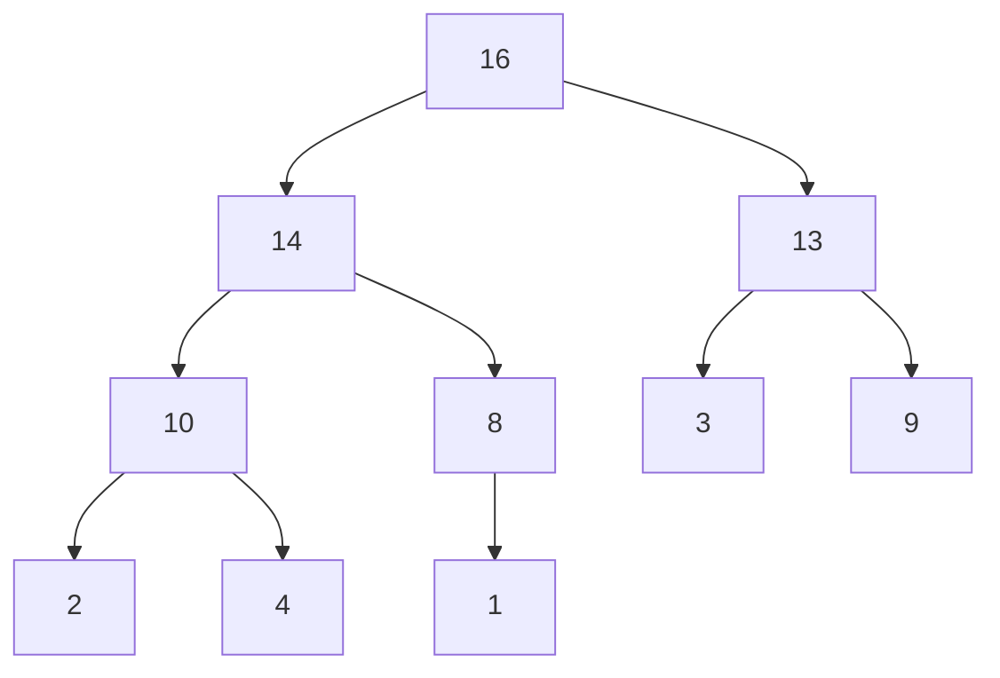
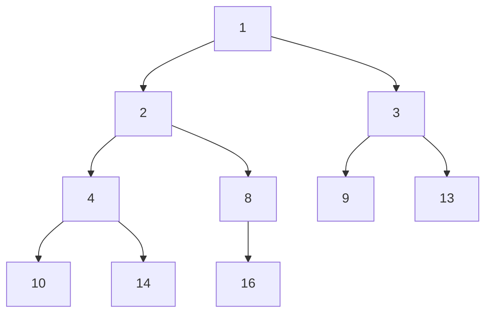

## 힙이란

**힙**(Heap)은 특정 우선순위를 유지하면서 삽입과 삭제를 효율적으로 수행할 수 있도록 설계되었습니다. **최대 힙(Max-Heap)** 과 **최소 힙(Min-Heap)** 두 가지 유형이 있으며, 각각에서 부모 노드와 자식 노드 간에 특정 우선순위 관계를 유지합니다.


## 힙의 주요 특징

1. **완전 이진 트리(Complete Binary Tree)**
   - 힙은 항상 완전 이진 트리 형태를 유지합니다. 즉, 모든 레벨이 채워지고 마지막 레벨의 노드가 왼쪽부터 채워집니다.

2. **힙 속성(Heap Property)**
   - 최대 힙(Max-Heap)
     - 부모 노드의 값이 항상 자식 노드의 값보다 크거나 같습니다.
   - 최소 힙(Min-Heap)
     - 부모 노드의 값이 항상 자식 노드의 값보다 작거나 같습니다.

3. **효율성**
   - 힙은 삽입과 삭제 연산이 **O(log n)**의 시간 복잡도를 가집니다.
   - 최댓값 또는 최솟값을 찾는 연산은 항상 O(1)입니다.

4. **우선순위 큐(Priority Queue)**
   - 힙은 우선순위 큐를 구현하는 데 사용됩니다. 우선순위 큐는 가장 높은 우선순위의 요소를 먼저 제거하는 자료구조입니다.


## 힙의 종류

1. **최대 힙(Max-Heap)**
   - 부모 노드의 값이 항상 자식 노드의 값보다 크거나 같은 힙입니다.
   - 최대값은 항상 루트 노드에 위치합니다.




2. **최소 힙(Min-Heap)**
    - 부모 노드의 값이 항상 자식 노드의 값보다 작거나 같은 힙입니다.
    - 최소값은 항상 루트 노드에 위치합니다.




## 힙의 기본 동작

| **Operation** | **Signature**                     | **Description**                                          | Performance |
|---------------|-----------------------------------|----------------------------------------------------------|-------------|
| Insert        | H × value → H                     | 힙에 새로운 요소를 추가합니다.                            | O(log n)    |
| Extract Max  | H → value                         | 최대 힙에서 최대값을 제거하고 반환합니다.                 | O(log n)    |
| Extract Min  | H → value                         | 최소 힙에서 최소값을 제거하고 반환합니다.                 | O(log n)    |
| Peek          | H → value                         | 최대/최소값을 반환하지만 제거하지 않습니다.               | O(1)        |
| Heapify       | H → H                             | 주어진 배열을 힙으로 변환합니다.                          | O(n)        |


## 배열 기반의 힙 구현


### 최대 힙(Max-Heap) 구현


```javascript
class MaxHeap {
  constructor() {
    this.heap = [];
  }

  // 부모 노드의 인덱스를 반환
  getParentIndex(childIndex) {
    return Math.floor((childIndex - 1) / 2);
  }

  // 왼쪽 자식 노드의 인덱스를 반환
  getLeftChildIndex(parentIndex) {
    return 2 * parentIndex + 1;
  }

  // 오른쪽 자식 노드의 인덱스를 반환
  getRightChildIndex(parentIndex) {
    return 2 * parentIndex + 2;
  }

  // 힙에 값을 추가
  insert(value) {
    this.heap.push(value); // 배열의 끝에 값을 추가
    this.heapifyUp(); // 힙 속성을 유지
  }

  // 루트(최대값)를 제거하고 반환
  extractMax() {
    if (this.heap.length === 0) return null;
    if (this.heap.length === 1) return this.heap.pop();

    const max = this.heap[0];
    this.heap[0] = this.heap.pop(); // 마지막 값을 루트로 이동
    this.heapifyDown(); // 힙 속성을 유지
    return max;
  }

  // 힙 속성을 위로 유지 (삽입 시 호출)
  heapifyUp() {
    let index = this.heap.length - 1;
    while (
      index > 0 &&
      this.heap[index] > this.heap[this.getParentIndex(index)]
    ) {
      const parentIndex = this.getParentIndex(index);
      this.swap(index, parentIndex); // 부모와 스왑
      index = parentIndex; // 인덱스를 부모로 이동
    }
  }

  // 힙 속성을 아래로 유지 (삭제 시 호출)
  heapifyDown() {
    let index = 0;
    const length = this.heap.length;

    while (true) {
      const leftChildIndex = this.getLeftChildIndex(index);
      const rightChildIndex = this.getRightChildIndex(index);
      let largest = index;

      if (
        leftChildIndex < length &&
        this.heap[leftChildIndex] > this.heap[largest]
      ) {
        largest = leftChildIndex;
      }

      if (
        rightChildIndex < length &&
        this.heap[rightChildIndex] > this.heap[largest]
      ) {
        largest = rightChildIndex;
      }

      if (largest === index) break;

      this.swap(index, largest);
      index = largest;
    }
  }

  // 두 요소를 스왑
  swap(index1, index2) {
    [this.heap[index1], this.heap[index2]] = [this.heap[index2], this.heap[index1]];
  }

  // 힙 출력
  printHeap() {
    console.log(this.heap);
  }
}
```


### 최소 힙(Min-Heap) 구현


```javascript
class MinHeap {
  constructor() {
    this.heap = [];
  }

  // 부모 노드의 인덱스를 반환
  getParentIndex(childIndex) {
    return Math.floor((childIndex - 1) / 2);
  }

  // 왼쪽 자식 노드의 인덱스를 반환
  getLeftChildIndex(parentIndex) {
    return 2 * parentIndex + 1;
  }

  // 오른쪽 자식 노드의 인덱스를 반환
  getRightChildIndex(parentIndex) {
    return 2 * parentIndex + 2;
  }

  // 두 요소를 스왑
  swap(index1, index2) {
    [this.heap[index1], this.heap[index2]] = [this.heap[index2], this.heap[index1]];
  }

  // 힙에 요소 추가
  insert(value) {
    this.heap.push(value); // 요소를 끝에 추가
    this.heapifyUp(); // 힙 속성을 유지
  }

  // 최상위 요소 제거 및 반환
  extractMin() {
    if (this.heap.length === 0) {
      throw new Error("Heap is empty");
    }
    if (this.heap.length === 1) {
      return this.heap.pop();
    }

    const minValue = this.heap[0]; // 최소값 저장
    this.heap[0] = this.heap.pop(); // 마지막 요소를 루트로 이동
    this.heapifyDown(); // 힙 속성을 복구
    return minValue;
  }

  // 위로 힙 정렬
  heapifyUp() {
    let index = this.heap.length - 1;

    while (
      index > 0 &&
      this.heap[index] < this.heap[this.getParentIndex(index)]
    ) {
      this.swap(index, this.getParentIndex(index));
      index = this.getParentIndex(index);
    }
  }

  // 아래로 힙 정렬
  heapifyDown() {
    let index = 0;

    const leftChildIndex = this.getLeftChildIndex(index);
    const rightChildIndex = this.getRightChildIndex(index);

    while (leftChildIndex < this.heap.length) {
      let smallerChildIndex = leftChildIndex;

      if (
        rightChildIndex < this.heap.length &&
        this.heap[rightChildIndex] < this.heap[smallerChildIndex]
      ) {
        smallerChildIndex = rightChildIndex;
      }

      if (this.heap[index] <= this.heap[smallerChildIndex]) {
        break;
      }

      this.swap(index, smallerChildIndex);
      index = smallerChildIndex;
    }
  }

  // 힙 내용 출력
  printHeap() {
    console.log(this.heap);
  }
}

// 예제 사용법
const minHeap = new MinHeap();

minHeap.insert(10);
minHeap.insert(20);
minHeap.insert(5);
minHeap.insert(15);

console.log("Min Heap 상태:");
minHeap.printHeap();

console.log("최소값 추출:", minHeap.extractMin());
console.log("Min Heap 상태:");
minHeap.printHeap();
```


## 우선순위 큐

**우선순위 큐**(Priority Queue)는  각 요소가 우선순위를 가지고 있는 데이터 구조로, 큐에서 요소를 삽입하거나 제거할 때 우선순위에 따라 정렬된 순서로 처리됩니다. 일반적인 큐(FIFO)와 달리, 우선순위 큐는 **우선순위가 높은 요소**가 먼저 처리됩니다.


## 우선순위 큐의 기본 동작

| **Operation** | **Signature**                     | **Description**                                          | Performance |
|---------------|-----------------------------------|----------------------------------------------------------|-------------|
| Enqueue       | PQ × value × priority → PQ        | 우선순위 큐에 요소를 추가합니다.                          | O(log n)    |
| Dequeue       | PQ → value                         | 우선순위 큐에서 우선순위가 가장 높은 요소를 제거합니다.  | O(log n)    |
| IsEmpty       | PQ → boolean                       | 우선순위 큐가 비어 있는지 확인합니다.                     | O(1)        |


## 힙 기반의 우선순위 큐의 구현

우선순위가 1인 요소가 가장 높은 우선순위를 가질 경우 최소 힙을 사용하여 우선순위가 가장 높은 요소를 루트에 위치시킵니다. 반대로, 우선순위가 1인 요소가 가장 높은 우선순위를 가질 경우 최대 힙을 사용하여 우선순위가 가장 높은 요소를 루트에 위치시킵니다.

```javascript
// 우선순위 큐 구현
class PriorityQueue {
  constructor() {
    this.minHeap = new MinHeap();
  }

  enqueue(element, priority) {
    this.minHeap.insert({ element, priority });
  }

  dequeue() {
    return this.minHeap.remove();
  }

  isEmpty() {
    return this.minHeap.heap.length === 0;
  }

  printQueue() {
    console.log(this.minHeap.heap);
  }
}

// 예제 사용
const pq = new PriorityQueue();
pq.enqueue('Task 1', 2);
pq.enqueue('Task 2', 1);
pq.enqueue('Task 3', 3);

pq.printQueue(); // [{ element: 'Task 2', priority: 1 }, {element: "Task 1", priority: 2},...]
```
