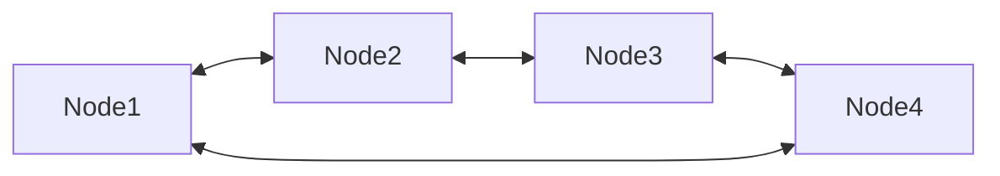

## 리스트란

**리스트**(List)는 추상 자료형(ADT, Abstract Data Type) 중 하나로, 순서가 있는 데이터 요소들의 집합입니다. 리스트는 여러 프로그래밍 언어에서 기본 자료 구조로 제공되며, 다양한 상황에서 사용됩니다. 다음은 리스트의 주요 특징, 동작, 구현 방법, 그리고 사용 예제에 대한 설명입니다.


## 리스트의 주요 특징

1. **순서 보장**: 리스트에 저장된 데이터는 삽입 순서가 유지됩니다.
2. **중복 허용**: 동일한 값을 가진 요소가 여러 번 포함될 수 있습니다.
3. **인덱스 기반 접근**: 리스트의 각 요소는 고유한 인덱스를 가지며, 이를 통해 요소에 접근할 수 있습니다.
4. **가변 크기**: 대부분의 구현에서 리스트는 크기가 동적으로 조정됩니다.


## 리스트의 기본 동작

| **Operation** | **Signature**                     | **Description**                                          | Performance |
| ------------- | --------------------------------- | -------------------------------------------------------- | ----------- |
| **Create**    | → L                               | 새로운 리스트를 생성합니다.                              | O(1)        |
| **Is Empty**  | L → boolean                       | 리스트가 비어있는지 확인합니다.                          | O(1)        |
| **Size**      | L → number                        | 리스트에 얼마나 많은 요소가 있는지 확인합니다.           | O(1)        |
| **Add**       | L × position x value → L          | 리스트의 특정 위치에 요소를 삽입합니다.                  | O(n)        |
| **Remove**    | L × position → L                  | 리스트의 특정 위치의 요소를 제거합니다.                  | O(n)        |
| **At**        | L × position → value \| undefined | 위치가 주어지면, 해당 위치의 요소의 값을 반환합니다.     | O(1)        |
| **Find**      | L × value → boolean               | 값이 주어지면, 해당 값이 리스트에 존재하는지 확인합니다. | O(n)        |


## 리스트의 추가 동작


| **Operation**         | **Signature**          | **Description**                          | Performance |
| :-------------------- | :--------------------- | :--------------------------------------- | ----------- |
| Add at front          | L × value → L          | 리스트의 맨 앞에 새 값을 추가합니다.     | O(n)        |
| **Add at back**       | L × value → L          | 리스트의 맨 뒤에 새로운 값을 추가합니다. | O(1)        |
| **Remove from front** | L → value \| undefined | 리스트의 맨 앞에서 값을 제거합니다.      | O(n)        |
| **Remove from back**  | L → value \| undefined | 리스트의 맨 뒤에서 값을 제거합니다.      | O(1)        |
| **At front**          | L → value \| undefine  | 리스트의 맨 앞에 있는 값을 가져옵니다.   | O(1)        |
| **At back**           | L → value \| unde      | 리스트의 맨 뒤에서 값을 가져옵니다.      | O(1)        |


## 리스트의 구현 방법

리스트는 주로 두 가지 방식으로 구현됩니다:


### 배열(Array) 기반 구현

- **특징**:
  - 고정된 크기의 배열로 리스트를 구현하거나, 크기를 동적으로 조정하는 배열을 사용.
  - 요소들은 메모리상에서 연속적으로 저장됨.
  - 빠른 인덱스 접근이 가능 (O(1)).
- **단점**:
  - 요소 삽입/삭제 시, 연속적인 메모리 재배치가 필요할 수 있음 (O(n)).
- **언어 예시**:
  - Python의 `list`
  - Java의 `ArrayList`
  - C++의 `std::vector`


```javascript
class List {
  constructor() {
    this.elements = [];
  }

  add(value) {
    this.elements.push(value);
  }

  remove(position) {
    this.elements.splice(position, 1);
  }

  at(position) {
    return this.elements[position];
  }

  find(value) {
    return this.elements.includes(value);
  }

  size() {
    return this.elements.length;
  }

  isEmpty() {
    return this.elements.length === 0;
  }
}

const list = new List();
list.add(1);
list.add(2);
list.add(3);
console.log(list.size()); // 3
console.log(list.at(1)); // 2
console.log(list.find(2)); // true
list.remove(1);
console.log(list.size()); // 2
console.log(list.at(1)); // 3
```


### 연결 리스트(Linked List) 기반 구현

- **특징**:
  - 요소를 노드(Node)로 구현하며, 각 노드는 데이터와 다음 노드의 참조를 포함.
  - 메모리가 연속적일 필요가 없음.
  - 삽입/삭제가 빠름 (O(1) - 리스트의 처음 또는 중간).
- **단점**:
  - 인덱스를 기반으로 접근하려면 순차적으로 탐색해야 함 (O(n)).
- **종류**:
  - 단일 연결 리스트(Singly Linked List)
  - 이중 연결 리스트(Doubly Linked List)
  - 환형 연결 리스트(Circular Linked List)


```javascript
class Node {
  constructor(value) {
    this.value = value;
    this.next = null;
  }
}

class LinkedList {
  constructor() {
    this.head = null;
  }

  add(value) {
    const node = new Node(value);
    if (!this.head) {
      this.head = node;
    } else {
      let current = this.head;
      while (current.next) {
        current = current.next;
      }
      current.next = node;
    }
  }

  remove(position) {
    if (position === 0) {
      this.head = this.head.next;
    } else {
      let current = this.head;
      let prev = null;
      let index = 0;
      while (index < position) {
        prev = current;
        current = current.next;
        index++;
      }
      prev.next = current.next;
    }
  }

  at(position) {
    let current = this.head;
    let index = 0;
    while (index < position) {
      current = current.next;
      index++;
    }
    return current.value;
  }

  find(value) {
    let current = this.head;
    while (current) {
      if (current.value === value) {
        return true;
      }
      current = current.next;
    }
    return false;
  }

  size() {
    let current = this.head;
    let count = 0;
    while (current) {
      count++;
      current = current.next;
    }
    return count;
  }

  isEmpty() {
    return this.head === null;
  }
}

const list = new LinkedList();
list.add(1);
list.add(2);
list.add(3);
console.log(list.size()); // 3
console.log(list.at(1)); // 2
console.log(list.find(2)); // true
list.remove(1);
console.log(list.size()); // 2
console.log(list.at(1)); // 3
```


## 원형 리스트 (Circular List)


원형 리스트는 연결 리스트의 변형으로, 마지막 노드가 첫 번째 노드를 가리키는 리스트입니다. 이로 인해 리스트의 끝과 시작이 연결되어 있어, 리스트의 끝에 도달하면 다시 처음으로 돌아가는 특징을 가집니다. 일반적으로 단일 연결 리스트 또는 이중 연결 리스트를 기반으로 구현됩니다.




### 이중 연결 리스트 기반 구현

```javascript
class Node {
  constructor(data) {
    this.data = data; // 노드 데이터
    this.prev = null; // 이전 노드
    this.next = null; // 다음 노드
  }
}

class DoublyCircularLinkedList {
  constructor() {
    this.head = null; // 첫 번째 노드
    this.tail = null; // 마지막 노드
    this.size = 0;    // 노드 개수
  }

  // 새 노드를 리스트의 끝에 추가
  append(data) {
    const newNode = new Node(data);
    if (this.head === null) {
      // 리스트가 비어있는 경우
      this.head = newNode;
      this.tail = newNode;
      newNode.next = newNode; // 자기 자신을 가리킴
      newNode.prev = newNode;
    } else {
      // 리스트가 비어있지 않은 경우
      newNode.prev = this.tail;
      newNode.next = this.head;
      this.tail.next = newNode;
      this.head.prev = newNode;
      this.tail = newNode; // 새로운 노드를 tail로 설정
    }
    this.size++;
  }

  // 리스트의 특정 위치에 삽입
  insertAt(data, index) {
    if (index < 0 || index > this.size) {
      console.error("Index out of bounds");
      return;
    }

    const newNode = new Node(data);

    if (index === 0) {
      // 리스트의 맨 앞에 삽입
      if (this.size === 0) {
        this.append(data);
      } else {
        newNode.next = this.head;
        newNode.prev = this.tail;
        this.head.prev = newNode;
        this.tail.next = newNode;
        this.head = newNode;
      }
    } else {
      // 리스트 중간 또는 끝에 삽입
      let current = this.head;
      for (let i = 0; i < index - 1; i++) {
        current = current.next;
      }
      newNode.next = current.next;
      newNode.prev = current;
      current.next.prev = newNode;
      current.next = newNode;

      if (index === this.size) {
        this.tail = newNode; // 삽입한 노드가 새로운 tail
      }
    }

    this.size++;
  }

  // 특정 데이터 삭제
  remove(data) {
    if (this.size === 0) return null;

    let current = this.head;
    let removedNode = null;

    do {
      if (current.data === data) {
        removedNode = current;

        if (this.size === 1) {
          // 리스트에 노드가 하나뿐인 경우
          this.head = null;
          this.tail = null;
        } else {
          current.prev.next = current.next;
          current.next.prev = current.prev;

          if (current === this.head) {
            this.head = current.next;
          }

          if (current === this.tail) {
            this.tail = current.prev;
          }
        }

        this.size--;
        break;
      }
      current = current.next;
    } while (current !== this.head);

    return removedNode;
  }

  // 리스트 출력 (데이터만 출력)
  print() {
    if (this.size === 0) {
      console.log("List is empty");
      return;
    }

    const result = [];
    let current = this.head;

    do {
      result.push(current.data);
      current = current.next;
    } while (current !== this.head);

    console.log(result.join(" <-> "));
  }

  // 리스트를 순환하며 특정 작업 수행
  traverse(callback) {
    if (this.size === 0) return;

    let current = this.head;

    do {
      callback(current);
      current = current.next;
    } while (current !== this.head);
  }
}
```
