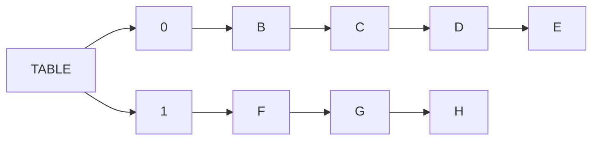

## 집합(Set)이란?

컴퓨터 과학에서 집합(Set)은 고유한 요소들로 이루어진 모임을 의미합니다. 집합은 수학적인 개념을 컴퓨터 과학에 적용한 추상 자료형(ADT, Abstract Data Type) 중 하나입니다. 집합은 중복된 요소를 포함하지 않으며, 순서가 없습니다.


## 집합의 기본 동작

집합은 다음과 같은 기본 동작을 지원합니다.

| **Operation** | **Signature**          | **Description**                              |
| ------------- | ---------------------- | -------------------------------------------- |
| **Add**       | S × value → S          | 집합에 값을 추가합니다.                      |
| **Remove**    | S × value → S          | 집합에서 값을 제거합니다.                    |
| **Contains**  | S × value → boolean    | 특정 값이 집합에 존재하는지 확인합니다.       |
| **Size**      | S → number             | 집합에 있는 요소의 개수를 반환합니다.         |
| **Is Empty**  | S → boolean            | 집합이 비어 있는지 확인합니다.                |
| **Clear**     | S → S                  | 집합의 모든 요소를 제거합니다.               |


## 집합의 대수 연산

아래는 집합의 대수 연산에 대한 표이다.

| **Operation** | **Signature**          | **Description**                              |
| ------------- | ---------------------- | -------------------------------------------- |
| **Union**     | S × S → S              | 두 집합의 합집합을 반환합니다.                |
| **Intersection** | S × S → S           | 두 집합의 교집합을 반환합니다.                |
| **Difference** | S × S → S             | 두 집합의 차집합을 반환합니다.                |
| **Subset**    | S × S → boolean        | 한 집합이 다른 집합의 부분집합인지 확인합니다. |


자바스크립트에서는 표준 내장 객체인 `Set`의 메서드로 대수 연산을 지원합니다.

- `Set.prototype.union(other)`: 두 집합의 합집합을 반환합니다.
- `Set.prototype.intersection(other)`: 두 집합의 교집합을 반환합니다.
- `Set.prototype.difference(other)`: 두 집합의 차집합을 반환합니다.
- `Set.prototype.symmetricDifference(other)`: 두 집합의 대칭 차집합을 반환합니다.
- `Set.prototype.isSubsetOf(other)`: 한 집합이 다른 집합의 부분집합인지 확인합니다.
- `Set.prototype.isSupersetOf(other)`: 한 집합이 다른 집합의 상위집합인지 확인합니다.
- `Set.prototype.isDisjointFrom(other)`: 두 집합이 서로 교집합이 없는지 확인합니다.


## 집합의 구현

자바스크립트에서는 표준 내장 객체인 `Set`을 지원하며, `new Set()`으로 집합을 생성할 수 있습니다. 아래는 집합을 객체를 사용하여 구현한 예시입니다.

```javascript
class Set {
  constructor() {
    this.items = {}; // 집합 요소를 저장할 객체
  }

  // 기본 동작

  add(value) {
    if (!this.contains(value)) {
      this.items[value] = value; // 집합에 값 추가
    }
    return this;
  }

  remove(value) {
    if (this.contains(value)) {
      delete this.items[value]; // 집합에서 값 제거
    }
    return this;
  }

  contains(value) {
    return this.items.hasOwnProperty(value); // 특정 값이 집합에 존재하는지 확인
  }

  size() {
    return Object.keys(this.items).length; // 집합의 크기 반환
  }

  isEmpty() {
    return this.size() === 0; // 집합이 비어 있는지 확인
  }

  clear() {
    this.items = {}; // 집합의 모든 요소 제거
    return this;
  }

  // 대수 연산

  union(otherSet) {
    const unionSet = new Set();
    this.values().forEach(value => unionSet.add(value));
    otherSet.values().forEach(value => unionSet.add(value));
    return unionSet;
  }

  intersection(otherSet) {
    const intersectionSet = new Set();
    this.values().forEach(value => {
      if (otherSet.contains(value)) {
        intersectionSet.add(value);
      }
    });
    return intersectionSet;
  }

  difference(otherSet) {
    const differenceSet = new Set();
    this.values().forEach(value => {
      if (!otherSet.contains(value)) {
        differenceSet.add(value);
      }
    });
    return differenceSet;
  }

  subset(otherSet) {
    return this.values().every(value => otherSet.contains(value));
  }

  // 보조 메서드

  values() {
    return Object.values(this.items); // 집합의 모든 요소 반환
  }
}

```


## 가방(Bags)이란?

가방(Bags)은 집합과 유사하지만, 가방은 중복된 요소를 포함할 수 있습니다. 가방은 순서가 없는 컬렉션으로, 요소의 추가와 제거만을 지원합니다.


## 가방의 기본 동작

가방은 다음과 같은 기본 동작을 지원합니다.

| **Operation** | **Signature**          | **Description**                              |
| ------------- | ---------------------- | -------------------------------------------- |
| **Add**       | B × value → B          | 가방에 값을 추가합니다.                      |
| **Remove**    | B × value → B          | 가방에서 값을 제거합니다.                    |
| **Contains**  | B × value → boolean    | 특정 값이 가방에 존재하는지 확인합니다.       |
| **Size**      | B → number             | 가방에 있는 요소의 개수를 반환합니다.         |
| **Is Empty**  | B → boolean            | 가방이 비어 있는지 확인합니다.                |
| **Clear**     | B → B                  | 가방의 모든 요소를 제거합니다.               |


## 가방의 구현

가방 구현에서는 객체를 사용하지만, 값이 중복될 수 있기 때문에 값의 개수를 저장해야 합니다. 아래는 객체를 사용하여 가방을 구현한 예시입니다.

```javascript
class Bag {
  constructor() {
    this.items = {}; // 가방 요소를 저장할 객체
  }

  // 기본 동작

  add(value) {
    if (!this.contains(value)) {
      this.items[value] = (this.items[value] || 0) + 1; // 가방에 값 추가
    }
    return this;
  }

  remove(value) {
    if (this.contains(value)) {
      this.items[value] -= 1; // 가방에서 값 제거
      if (this.items[value] === 0) {
        delete this.items[value];
      }
    }
    return this;
  }

  contains(value) {
    return this.items.hasOwnProperty(value); // 특정 값이 가방에 존재하는지 확인
  }

  size() {
    return Object.values(this.items).reduce((acc, count) => acc + count, 0); // 가방의 크기 반환
  }

  isEmpty() {
    return this.size() === 0; // 가방이 비어 있는지 확인
  }

  clear() {
    this.items = {}; // 가방의 모든 요소 제거
    return this;
  }
}

```


## 맵(Map)이란?

맵(Map, Associative Array, Dictionary)은 키-값 쌍으로 이루어진 데이터의 집합을 의미합니다. 맵은 키와 값이 일대일 관계를 가지며, 키는 중복될 수 없습니다. 맵은 순서가 없는 컬렉션으로, 키를 기반으로 데이터를 저장하고 검색합니다.


## 맵의 기본 동작

맵은 다음과 같은 기본 동작을 지원합니다.

| **Operation** | **Signature**          | **Description**                              |
| ------------- | ---------------------- | -------------------------------------------- |
| **Set**       | M × key × value → M    | 맵에 키-값 쌍을 추가합니다.                  |
| **Get**       | M × key → value        | 특정 키에 해당하는 값을 반환합니다.           |
| **Remove**    | M × key → M            | 특정 키에 해당하는 값을 제거합니다.           |
| **Contains**  | M × key → boolean      | 특정 키가 맵에 존재하는지 확인합니다.         |
| **Size**      | M → number             | 맵에 있는 키-값 쌍의 개수를 반환합니다.       |
| **Is Empty**  | M → boolean            | 맵이 비어 있는지 확인합니다.                  |
| **Clear**     | M → M                  | 맵의 모든 키-값 쌍을 제거합니다.             |


## 맵의 구현

자바스크립트에서는 표준 내장 객체인 `Map`을 지원하며, `new Map()`으로 맵을 생성할 수 있습니다. 아래는 객체를 사용하여 맵을 구현한 예시입니다.

```javascript
class Map {
  constructor() {
    this.items = {}; // 맵 요소를 저장할 객체
  }

  // 기본 동작

  set(key, value) {
    this.items[key] = value; // 맵에 키-값 쌍 추가
    return this;
  }

  get(key) {
    return this.items[key]; // 특정 키에 해당하는 값을 반환
  }

  remove(key) {
    if (this.contains(key)) {
      delete this.items[key]; // 특정 키에 해당하는 값을 제거
    }
    return this;
  }

  contains(key) {
    return this.items.hasOwnProperty(key); // 특정 키가 맵에 존재하는지 확인
  }

  size() {
    return Object.keys(this.items).length; // 맵의 크기 반환
  }

  isEmpty() {
    return this.size() === 0; // 맵이 비어 있는지 확인
  }

  clear() {
    this.items = {}; // 맵의 모든 요소 제거
    return this;
  }
}

```


## 해시 테이블 (Hash Table)

해시 테이블(Hash Table)은 키-값 쌍을 저장하는 자료구조로, 키를 해시 함수를 통해 해시값으로 변환한 뒤, 해당 해시값을 인덱스로 사용하여 값을 저장하거나 검색합니다. 해시 테이블은 빠른 검색 속도를 제공합니다.


### 해시(Hash) 함수

해시는 임의의 길이의 데이터를 고정된 길이의 데이터로 매핑하는 함수입니다. 해시 값은 테이블의 어디에 데이터를 저장해야 할지를 결정합니다. 해시 함수는 동일한 입력에 대해 항상 동일한 해시값을 반환해야 하며, 해시 충돌을 최소화해야 합니다.

```javascript
// 간단한 해시 함수 예시
const hash = (key, size) => {
  return key.toString().length % size; 
};
```


## 해싱 충돌 해결 1. 체이닝(Chaining)

체이닝은 해시 충돌이 발생했을 때, 같은 해시값을 가진 데이터를 연결 리스트로 연결하는 방식입니다. 체이닝은 간단하고 효율적인 방법이지만, 메모리를 많이 사용할 수 있습니다.

체이닝 해시 테이블의 예시




### 체이닝 해시 테이블의 구현

```javascript
class LinkedListNode {
  constructor(key, value) {
    this.key = key;
    this.value = value;
    this.next = null;  // 다음 노드를 가리키는 포인터
  }
}

class HashTable {
  constructor(size = 50) {
    this.table = new Array(size);
  }

  // 해시 함수 (단순화된 예시)
  _hash(key) {
    let hash = 0;
    for (let i = 0; i < key.length; i++) {
      hash = (hash << 5) - hash + key.charCodeAt(i);  // 각 문자의 아스키 코드 값으로 해싱
    }
    return hash % this.table.length;  // 배열 크기로 나누어 인덱스 범위 맞추기
  }

  // 키-값 쌍 삽입
  set(key, value) {
    const index = this._hash(key);  // 키를 해시하여 인덱스 계산
    const newNode = new LinkedListNode(key, value);  // 새로운 노드 생성

    if (!this.table[index]) {
      // 해당 인덱스에 데이터가 없으면 새로운 노드를 삽입
      this.table[index] = newNode;
    } else {
      // 해당 인덱스에 이미 노드가 있으면 체이닝을 사용하여 새 노드를 리스트 앞에 추가
      let current = this.table[index];
      while (current) {
        if (current.key === key) {
          current.value = value;  // 키가 이미 존재하면 값만 업데이트
          return;
        }
        if (current.next === null) {
          current.next = newNode;  // 마지막 노드 뒤에 새 노드를 추가
          return;
        }
        current = current.next;
      }
    }
  }

  // 키로 값 조회
  get(key) {
    const index = this._hash(key);  // 키를 해시하여 인덱스 계산
    let current = this.table[index];

    while (current) {
      if (current.key === key) {
        return current.value;  // 키가 일치하면 값을 반환
      }
      current = current.next;
    }

    return undefined;  // 해당 키가 없다면 undefined 반환
  }

  // 키로 값 삭제
  delete(key) {
    const index = this._hash(key);  // 키를 해시하여 인덱스 계산
    let current = this.table[index];
    let prev = null;

    while (current) {
      if (current.key === key) {
        if (prev) {
          prev.next = current.next;  // 이전 노드가 다음 노드를 가리키게 하여 삭제
        } else {
          this.table[index] = current.next;  // 첫 번째 노드 삭제시, 인덱스에 다음 노드 연결
        }
        return true;
      }
      prev = current;
      current = current.next;
    }

    return false;  // 해당 키가 없다면 false 반환
  }

  // 해시 테이블 출력
  display() {
    this.table.forEach((bucket, index) => {
      if (bucket) {
        let current = bucket;
        let bucketContent = '';
        while (current) {
          bucketContent += `[${current.key}: ${current.value}] -> `;
          current = current.next;
        }
        console.log(`${index}: ${bucketContent.slice(0, -4)}`);
      }
    });
  }
}

// 사용 예시
const hashTable = new HashTable();

hashTable.set('name', 'Alice');
hashTable.set('age', 25);
hashTable.set('city', 'New York');
hashTable.set('name', 'Bob');  // 'name' 키 값 업데이트

console.log(hashTable.get('name'));  // 'Bob'
console.log(hashTable.get('age'));  // 25
hashTable.delete('age');
console.log(hashTable.get('age'));  // undefined

hashTable.display();
```


## 해싱 충돌 방법 2. 개방 주소법 - 선형 탐사(Linear Probing)

개방 주소법은 해시 충돌이 발생했을 때, 다음 장소를 시도하고 비어 있는 공간을 찾을 때까지 반복하는 방식입니다. 테이블에 데이터가 계속 채워지면 삽입과 검색 시간이 길어질 수 있습니다. 테이블이 가득 차게되면 무한 루프에 빠질 위험이 있습니다. 이에 대한 지표로 부하 계수(load factor)를 사용합니다. 부하계수는 테이블에 저장된 데이터 수를 테이블 크기로 나눈 값입니다. 부하 계수가 0.75를 넘어가면 테이블 크기를 늘리는 등의 조치를 취하여 해시 충돌을 방지할 수 있습니다.


### 부하 계수

```bash
부하 계수 = 데이터 수 / 테이블 크기
```


### 선형 탐사 해시 테이블의 구현

```javascript
class HashTable {
  constructor(size = 50) {
    this.table = new Array(size);  // 해시 테이블 초기화
    this.size = size;
    this.keys = 0;  // 현재 해시 테이블에 저장된 항목 수
    this.loadFactorThreshold = 0.75;  // 부하 계수 임계값
  }

  // 해시 함수 (단순화된 예시)
  _hash(key) {
    let hash = 0;
    for (let i = 0; i < key.length; i++) {
      hash = (hash << 5) - hash + key.charCodeAt(i);  // 아스키 코드 값을 기반으로 해시 계산
    }
    return hash % this.size;  // 테이블 크기로 나누어 인덱스 값 계산
  }

  _loadFactor() {
    return this.keys / this.size;  // 부하 계수 계산
  }

  _resize() {
    const newSize = this.size * 2;  // 테이블 크기를 2배로 확장
    const newTable = new Array(newSize);

    this.table.forEach(item => {
      if (item) {
        let index = this._hash(item.key);
        while (newTable[index]) {
          index = (index + 1) % newSize;  // 다음 인덱스로 이동
        }
        newTable[index] = item;  // 새 테이블에 항목 삽입
      }
    });

    this.table = newTable;
    this.size = newSize;
  }

  // 선형 탐사를 통한 삽입
  set(key, value) {

    // 부하 계수가 임계값을 넘으면 테이블 크기 확장
    if (this._loadFactor() > this.loadFactorThreshold) {
      this._resize();  
    }

    let index = this._hash(key);
    let originalIndex = index;

    // 테이블에 키가 이미 존재하면 값을 업데이트
    while (this.table[index] && this.table[index].key !== key) {
      index = (index + 1) % this.size;  // 선형 탐사로 다음 인덱스 찾기

      // 테이블을 한 바퀴 돌았을 때 원래 인덱스로 돌아오면 더 이상 삽입할 수 없음
      if (index === originalIndex) {
        throw new Error('Hash table is full');
      }
    }

    if (!this.table[index]) {
      this.keys++;
    }

    this.table[index] = { key, value };  // 해당 인덱스에 키와 값을 삽입
  }

  // 선형 탐사를 통한 값 조회
  get(key) {
    let index = this._hash(key);
    let originalIndex = index;

    while (this.table[index]) {
      if (this.table[index].key === key) {
        return this.table[index].value;  // 값을 찾으면 반환
      }

      index = (index + 1) % this.size;  // 선형 탐사로 다음 인덱스 찾기

      if (index === originalIndex) {
        break;  // 원래 인덱스로 돌아왔을 때는 테이블에 키가 없다는 의미
      }
    }

    return undefined;  // 해당 키를 찾을 수 없으면 undefined 반환
  }

  // 키로 값 삭제
  delete(key) {
    let index = this._hash(key);
    let originalIndex = index;

    while (this.table[index]) {
      if (this.table[index].key === key) {
        this.table[index] = undefined;  // 해당 키의 값을 삭제
        this.keys--;
        return true;
      }

      index = (index + 1) % this.size;  // 선형 탐사로 다음 인덱스 찾기

      if (index === originalIndex) {
        break;  // 원래 인덱스로 돌아왔을 때는 테이블에 키가 없다는 의미
      }
    }

    return false;  // 해당 키를 삭제할 수 없으면 false 반환
  }

  // 해시 테이블 상태 출력
  display() {
    this.table.forEach((item, index) => {
      if (item) {
        console.log(`${index}: [${item.key}: ${item.value}]`);
      }
    });
  }
}

// 사용 예시
const hashTable = new HashTable();

hashTable.set('name', 'Alice');
hashTable.set('age', 25);
hashTable.set('city', 'New York');

console.log(hashTable.get('name'));  // 'Alice'
console.log(hashTable.get('age'));  // 25
console.log(hashTable.get('city')); // 'New York'

hashTable.delete('age');
console.log(hashTable.get('age'));  // undefined

hashTable.display();
```


## 해싱 충돌 방법 2. 개방 주소법 - 이중 해싱(Double Hashing)

개방 주소법에서 **이중 해싱**이란 해시 충돌이 발생했을 때, 두 번째 해시 함수를 사용하여 다음 인덱스를 계산하는 방식입니다. 이중 해싱은 선형 탐사보다 더 효율적으로 해시 충돌을 해결할 수 있습니다.


- **이중 해싱**은 두 개의 해시 함수를 사용하여 충돌을 해결하는 방식입니다.
- 첫 번째 해시 함수는 초기 인덱스를 계산하고, 충돌 시 두 번째 해시 함수의 값을 이용해 이동 간격을 계산하여 다음 인덱스를 찾습니다.
- 선형 탐사와 달리 이중 해싱은 균등한 분포를 유지하면서 충돌을 해결할 수 있습니다.


### 해싱함수

- 첫 번째 해시 함수: `hash1(key) = hash(key) % tableSize`
- 두 번째 해시 함수: `hash2(key) = 1 + (hash(key) % (tableSize - 1))`
- 최종 인덱스 계산:

```javascript
index = (hash1(key) + i * hash2(key)) % tableSize
```


### 주의 사항

- 이중 해싱에서 모든 슬롯 순환을 보장하기 위해 테이블 크기는 소수(prime number)로 설정하는 것이 좋습니다.
- 이중 해싱은 선형 탐사보다 효율적이지만, 두 번째 해시 함수를 잘 선택해야 합니다.
- 두 번째 해시 함수는 0을 반환하지 않도록 주의해야 합니다. 0을 반환하면 충돌이 발생할 때 무한 루프에 빠질 수 있습니다.


### 이중 해싱 해시 테이블의 구현

```javascript
class HashTable {
  constructor(size = 11) {
    // 초기 크기를 소수로 설정
    this.table = new Array(size);
    this.size = size; // 테이블 크기
    this.keys = 0; // 저장된 항목 수
    this.loadFactorThreshold = 0.75; // 부하 계수 임계값
  }

  // 첫 번째 해시 함수
  _hash1(key) {
    let hash = 0;
    for (let i = 0; i < key.length; i++) {
      hash = (hash << 5) - hash + key.charCodeAt(i);
      hash |= 0; // 32비트 정수로 변환
    }
    return Math.abs(hash % this.size); // 테이블 크기로 나머지를 계산
  }

  // 두 번째 해시 함수 (테이블 크기와 서로소를 생성하도록 설정)
  _hash2(key) {
    let hash = 0;
    for (let i = 0; i < key.length; i++) {
      hash = (hash << 5) - hash + key.charCodeAt(i);
      hash |= 0; // 32비트 정수로 변환
    }
    return 1 + Math.abs(hash % (this.size - 1)); // 1 이상을 반환
  }

  // 부하 계수 계산
  _loadFactor() {
    return this.keys / this.size;
  }

  // 소수를 구하는 함수 (주어진 수보다 큰 첫 번째 소수를 반환)
  _findNextPrime(num) {
    const isPrime = n => {
      if (n < 2) return false; // 2 미만은 소수가 아님
      if (n === 2 || n === 3) return true; // 2와 3은 소수
      if (n % 2 === 0 || n % 3 === 0) return false; // 짝수와 3의 배수 제외

      // 5 이상의 숫자는 6k ± 1만 확인
      for (let i = 5; i * i <= n; i += 6) {
        if (n % i === 0 || n % (i + 2) === 0) return false;
      }
      return true;
    };

    let next = num + 1; // num보다 큰 숫자부터 시작
    while (!isPrime(next)) {
      next++; // 소수를 찾을 때까지 증가
    }
    return next;
  }

  // 테이블 크기 확장 및 재해싱
  _resize() {
    const newSize = this._findNextPrime(this.size * 2); // 가장 가까운 소수를 새로운 크기로 설정
    const oldTable = this.table;
    this.table = new Array(newSize);
    this.size = newSize;
    this.keys = 0;

    for (const bucket of oldTable) {
      if (bucket) {
        this.set(bucket.key, bucket.value); // 기존 데이터를 재해싱하여 삽입
      }
    }
  }

  // 데이터 삽입
  set(key, value) {
    if (this._loadFactor() > this.loadFactorThreshold) {
      this._resize(); // 부하 계수 초과 시 테이블 확장
    }

    let index = this._hash1(key); // 첫 번째 해시 함수로 인덱스 계산
    const stepSize = this._hash2(key); // 두 번째 해시 함수로 이동 간격 계산
    let originalIndex = index;

    // 충돌이 발생하면 이중 해싱으로 탐색
    while (this.table[index] && this.table[index].key !== key) {
      index = (index + stepSize) % this.size;

      if (index === originalIndex) {
        throw new Error('Hash table is full');
      }
    }

    if (!this.table[index]) {
      this.keys++; // 새 항목 삽입 시 항목 수 증가
    }

    this.table[index] = { key, value }; // 데이터 저장
  }

  // 데이터 조회
  get(key) {
    let index = this._hash1(key);
    const stepSize = this._hash2(key);
    let originalIndex = index;

    while (this.table[index]) {
      if (this.table[index].key === key) {
        return this.table[index].value; // 키에 해당하는 값을 반환
      }

      index = (index + stepSize) % this.size;

      if (index === originalIndex) {
        break; // 원래 위치로 돌아왔을 경우 탐색 종료
      }
    }

    return undefined; // 키를 찾을 수 없는 경우
  }

  // 데이터 삭제
  delete(key) {
    let index = this._hash1(key);
    const stepSize = this._hash2(key);
    let originalIndex = index;

    while (this.table[index]) {
      if (this.table[index].key === key) {
        this.table[index] = undefined; // 항목 삭제
        this.keys--;
        return true;
      }

      index = (index + stepSize) % this.size;

      if (index === originalIndex) {
        break; // 원래 위치로 돌아왔을 경우 종료
      }
    }

    return false; // 키를 찾지 못한 경우
  }

  // 해시 테이블 상태 출력
  display() {
    this.table.forEach((item, index) => {
      if (item) {
        console.log(`${index}: [${item.key}: ${item.value}]`);
      }
    });
  }
}

// 사용 예시
const hashTable = new HashTable();

hashTable.set('name', 'Alice');
hashTable.set('age', 25);
hashTable.set('city', 'New York');
hashTable.set('country', 'USA');
hashTable.set('language', 'JavaScript');

console.log(hashTable.get('name')); // 'Alice'
console.log(hashTable.get('age')); // 25
console.log(hashTable.get('city')); // 'New York'

hashTable.delete('age');
console.log(hashTable.get('age')); // undefined

hashTable.display();
```
