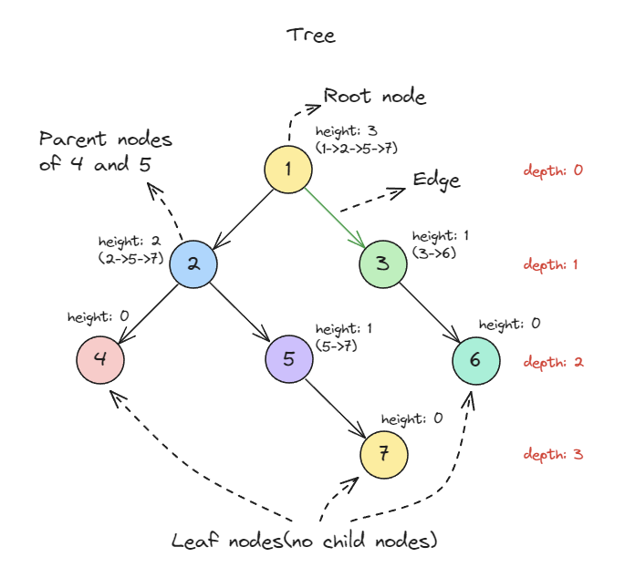
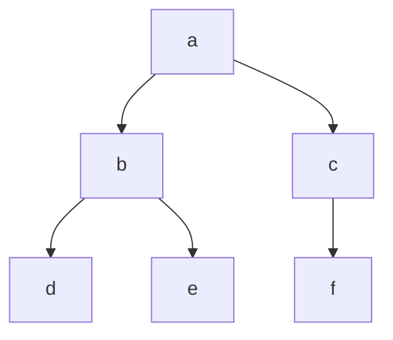
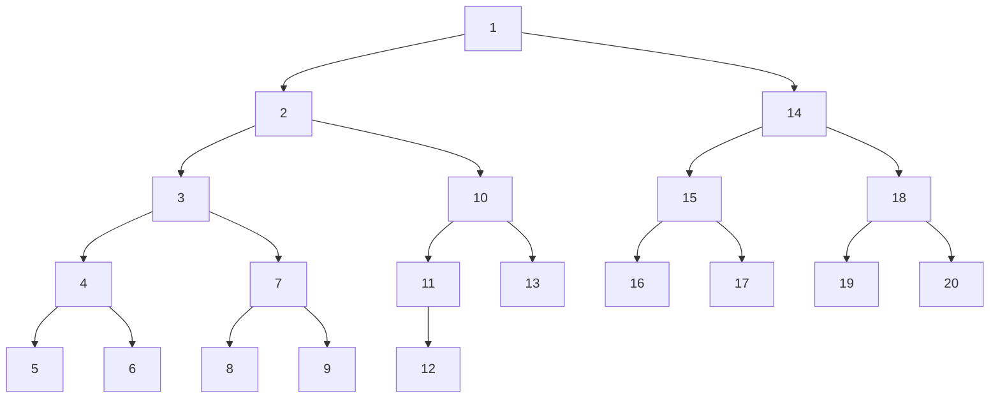
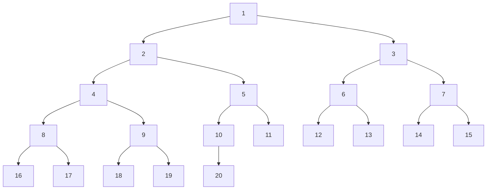

## 트리(Tree)와 포레스트(Forest)란


### 트리(Tree)란

트리(Tree)는 계층적 구조를 가진 데이터 구조입니다. 노드(Node)들로 구성되며, 하나의 루트 노트(Root) 노드를 가지고, 각 노드는 0개 이상의 자식(Child) 노드를 가질 수 있습니다. 트리에는 순환 구조(cycle)나 루프(loop)가 존재하지 않습니다.


* **특징**: 방향성이 없음. 연결되어 있음. 순환되지 않음.
* **노드(node/vertex/edge)**: 데이터를 가지는 트리의 기본 원소
* **루트 노드(root node)**: 부모 노드가 없는 트리의 최상위 노드
* **리프 노드(leaf node)**: 자식 노드가 없는 노드
* **엣지(edge, branch, link)**: 노드와 노드의 연결
* 높이(height): 해당 노드에서 리프 노드까지의 하향 경로 길이
* **깊이(depth)**: 해당 노드에서 루트까지의 경로 길이
* 루트 노드의 깊이는 0이다
* 리프 노드의 높이는 0이다
* n개의 정점을 가진 트리는 n-1개의 간선을 가진다




### 포레스트(Forest)란

포레스트(Forest)는 하나 이상의 트리로 구성된 데이터 구조입니다. 각 트리는 독립적이며, 각 트리의 루트 노드는 서로 다릅니다. 단일 트리에서 루트 노드를 제거하면 포레스트가 됩니다.


## 트리의 구현


left,right 속성을 가지는 Node 클래스를 정의하여 간단하게 트리를 구현할 수 있습니다.




```javascript
class TreeNode {
  constructor(value) {
    this.value = value;
    this.left = null;
    this.right = null;
  }
}
```

```javascript
const a = new TreeNode("a");
const b = new TreeNode("b");
const c = new TreeNode("c");
const d = new TreeNode("d");
const e = new TreeNode("e");
const f = new TreeNode("f");

a.left = b;
a.right = c;

b.left = d;
b.right = e;

c.right = f;
```


## 깊이 우선 탐색


깊이 우선 탐색(DFS, Depth First Search)은 루트 노드 먼저 방문하고 동일한 알고리즘으로 모든 자식을 탐색합니다. 다른 가지로 이동하기 전에 가능한 한 브랜치에 깊게 들어가는 것에서 "**깊이 우선 탐색**"이라 이름이 붙여졌습니다.


20개의 노드를 가지는 깊이 우선 탐색의 예시. 노드 방문 순서를 숫자로 표시한다(루트 노드는 1이다)



1. a 노드 탐색
   1. a 노드의 왼쪽 노드 b 탐색
      1. b 노드의 왼쪽 노드 d 탐색
      2. b 노드의 오른쪽 노드 e 탐색
   2. a노드의 오른쪽 노드 c 탐색
      1. c노드의 오른쪽 노드 f 탐색

```javascript
function depthFirstSearch(root) {
  if (!root) {
    return;
  }
  const result = [];
  const stack = [root];

  while (stack.length) {
    const node = stack.pop();
    result.push(node.value);

    if (node.right) {
      stack.push(node.right);
    }

    if (node.left) {
      stack.push(node.left);
    }
  }

  return result
}
```

```javascript
depthFirstSearch(a) // [ 'a', 'b', 'd', 'e', 'c', 'f' ]
```


## 너비 우선 탐색

너비 우선 탐색(BFS, Breadth First Search)은 루트 노드에서 시작하여 다음 레벨(높이)의 모든 자식을 방문합니다. 그 다음 또 다시 그 다음 레벨의 모든 자식을 방문합니다.


20개의 노드를 가지는 너비 우선 탐색의 예시. 노드 방문 순서를 숫자로 표시한다(루트 노드는 1이다)




1. a 노드 탐색
2. a 노드의 왼쪽 노드 b 탐색
3. a 노드의 오른쪽 노드 c 탐색
4. b 노드의 왼쪽 노드 d 탐색
5. b 노드의 오른쪽 노드 e 탐색
6. c 노드의 오른쪽 노드 f 탐색

```javascript
function breadthFirstSearch(root) {
  const result = [];
  const queue = [root];

  while (queue.length) {
    const node = queue.shift();
    result.push(node.value);

    if (node.left) {
      queue.push(node.left);
    }

    if (node.right) {
      queue.push(node.right);
    }
  }

  return result;
}
```

```javascript
breadthFirstSearch(a) // [ 'a', 'b', 'c', 'd', 'e', 'f' ]
```


## B-트리(B-Tree)

B-트리(B-Tree)는 **균형 이진 탐색 트리**의 일반화된 형태로, 데이터베이스나 파일 시스템 등에서 데이터를 효율적으로 관리하기 위해 사용됩니다. 이 트리는 노드 하나에 여러 키를 저장하며, 키와 자식 간의 관계를 유지해 트리의 균형을 유지합니다.


### B-트리의 주요 특징

1. **균형 유지**: B-트리는 항상 균형을 유지하며, 삽입 및 삭제 시에도 높이가 크게 변하지 않습니다.
2. **다중 자식 노드**: 각 노드는 여러 키를 가질 수 있으며, 이를 통해 자식 노드의 수를 증가시킵니다.
3. **키 정렬**: 각 노드의 키는 항상 정렬된 상태를 유지합니다.
4. **탐색 효율성**: 트리의 높이를 최소화해 탐색 속도를 빠르게 유지합니다.
5. **디스크 입출력 최소화**: B-트리는 주로 대규모 데이터에서 디스크 입출력을 줄이기 위해 설계되었습니다.


### B-트리의 구성 요소

* **노드**: 노드는 키(key)와 자식(child)으로 구성됩니다.
* 차수(order): B-트리의 차수 `m`은 각 노드가 가질 수 있는 최소 키와 최대 키의 개수를 결정합니다.
  * 각 노드는 **최소 ⌈m/2⌉개** 키를 가져야 합니다(루트 노드는 예외).
  * 각 노드는 **최대 m-1개**의 키를 가질 수 있습니다.
  * 자식 노드의 수는 키 개수 + 1입니다.


### B-트리 주요 연산

1. **탐색(Search)**: O(log n)
2. **삽입(Insertion)**: O(log n)
   * 키를 삽입한 후, 노드가 가득 차면 분할(Split)됩니다.
3. **삭제(Deletion)**: O(log n)
   * 키를 삭제한 후, 노드가 최소 키 개수 조건을 위반하면 병합(Merge)이나 재분배(Redistribution)가 이루어집니다.

```javascript
class BTreeNode {
  constructor(t, isLeaf) {
    this.t = t; // 최소 차수
    this.isLeaf = isLeaf; // 리프 노드 여부
    this.keys = []; // 키 배열
    this.children = []; // 자식 노드 배열
  }

  // B-트리 탐색
  search(key) {
    let i = 0;

    // 현재 노드에서 키를 찾는다
    while (i < this.keys.length && key > this.keys[i]) {
      i++;
    }

    // 키가 현재 노드에 있다면 반환
    if (this.keys[i] === key) {
      return this;
    }

    // 리프 노드면 찾을 수 없음
    if (this.isLeaf) {
      return null;
    }

    // 자식 노드에서 검색
    return this.children[i].search(key);
  }

  // 노드가 가득 찼을 때 분할
  splitChild(index, node) {
    const t = this.t;

    // 새로운 노드 생성 (node의 오른쪽 분할)
    const newNode = new BTreeNode(t, node.isLeaf);
    newNode.keys = node.keys.splice(t - 1); // 오른쪽 키 복사

    // 리프가 아니면 자식도 분할
    if (!node.isLeaf) {
      newNode.children = node.children.splice(t);
    }

    // 현재 노드에 새로운 자식 삽입
    this.children.splice(index + 1, 0, newNode);
    this.keys.splice(index, 0, node.keys.pop()); // 중간 키를 부모로 이동
  }

  // 삽입 시 호출
  insertNonFull(key) {
    let i = this.keys.length - 1;

    if (this.isLeaf) {
      // 리프 노드에 삽입
      while (i >= 0 && key < this.keys[i]) {
        i--;
      }
      this.keys.splice(i + 1, 0, key);
    } else {
      // 적절한 자식 노드 탐색
      while (i >= 0 && key < this.keys[i]) {
        i--;
      }
      i++;

      // 자식 노드가 가득 찼다면 분할
      if (this.children[i].keys.length === 2 * this.t - 1) {
        this.splitChild(i, this.children[i]);
        if (key > this.keys[i]) {
          i++;
        }
      }

      // 분할 후 삽입
      this.children[i].insertNonFull(key);
    }
  }
}

class BTree {
  constructor(t) {
    this.t = t; // 최소 차수
    this.root = new BTreeNode(t, true);
  }

  // 키 삽입
  insert(key) {
    const root = this.root;

    // 루트 노드가 가득 찬 경우
    if (root.keys.length === 2 * this.t - 1) {
      const newRoot = new BTreeNode(this.t, false);
      newRoot.children.push(root);
      newRoot.splitChild(0, root);

      // 적절한 자식에 삽입
      const i = key > newRoot.keys[0] ? 1 : 0;
      newRoot.children[i].insertNonFull(key);

      this.root = newRoot;
    } else {
      root.insertNonFull(key);
    }
  }

  // 키 탐색
  search(key) {
    return this.root.search(key);
  }
}

// 테스트
const btree = new BTree(3); // 최소 차수 3
btree.insert(10);
btree.insert(20);
btree.insert(5);
btree.insert(6);
btree.insert(12);
btree.insert(30);
btree.insert(7);
btree.insert(17);

console.log('Search 6:', btree.search(6)); // 키 6을 검색
console.log('Search 15:', btree.search(15)); // 키 15를 검색
```

