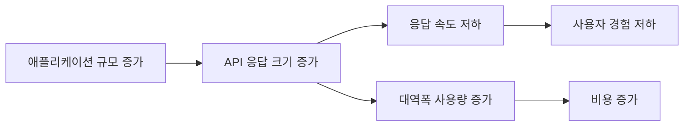

## API 응답 압축

현대 웹 및 모바일 애플리케이션에서 API(Application Programming Interface)는 핵심적인 역할을 담당합니다. 클라이언트와 서버 간의 원활한 데이터 교환을 가능하게 하지만, 전송되는 데이터의 양이 많아질수록 응답 속도가 느려지고 네트워크 대역폭 사용량이 증가하는 문제가 발생할 수 있습니다. **HTTP API 응답 압축**은 이러한 문제를 해결하는 효과적인 방법입니다. 서버에서 클라이언트로 전송되는 응답 본문(response body)의 크기를 줄여 전송 속도를 높이고 대역폭 사용량을 절감하는 기술입니다.

### 응답 압축의 장점

HTTP API 응답에 압축을 적용하면 다음과 같은 주요 이점을 얻을 수 있습니다.

1. **전송 속도 향상:** 데이터 크기가 작아지므로 네트워크를 통해 더 빠르게 전송될 수 있습니다. 이는 사용자 경험(UX) 향상으로 직결됩니다. 특히 모바일 환경과 같이 네트워크 속도가 불안정한 경우 효과가 큽니다.
2. **대역폭 사용량 절감:** 전송되는 데이터 총량이 줄어들어 네트워크 대역폭 사용량을 크게 절약할 수 있습니다. 이는 특히 모바일 데이터 요금이나 종량제 클라우드 서비스를 사용하는 경우 비용 절감 효과로 이어집니다.
3. **서버 부하 감소 (간접적):** 서버가 전송해야 할 데이터 양이 줄어들어, 동일한 시간 동안 더 많은 요청을 처리하거나 네트워크 I/O 관련 부하를 줄이는 데 간접적으로 기여할 수 있습니다. (단, 압축 자체는 CPU 자원을 사용합니다.)

### HTTP 압축은 어떻게 동작하나요?

HTTP 압축은 클라이언트와 서버 간의 **콘텐츠 협상(Content Negotiation)** 메커니즘을 통해 이루어집니다. 주요 과정은 다음과 같습니다.

1. **클라이언트 요청 (Request):**
    * 클라이언트는 서버에 API 요청을 보낼 때, 자신이 이해하고 처리할 수 있는 압축 알고리즘 목록을 `Accept-Encoding` HTTP 헤더에 담아 전송합니다.
    * 예: `Accept-Encoding: gzip, deflate, br` (클라이언트는 gzip, deflate, Brotli 압축 해제를 지원함을 의미)

2. **서버 처리 및 응답 (Response):**
    * 서버는 클라이언트로부터 받은 `Accept-Encoding` 헤더를 확인합니다.
    * 서버는 자신이 지원하고 클라이언트도 지원하는 압축 알고리즘 중 하나를 선택합니다. (일반적으로 우선순위가 정해져 있습니다. 예: Brotli > gzip)
    * 선택된 알고리즘을 사용하여 API 응답 본문(예: JSON, XML 데이터)을 압축합니다.
    * HTTP 응답 헤더에 `Content-Encoding` 헤더를 추가하여 어떤 압축 알고리즘을 사용했는지 명시합니다.
    * 예: `Content-Encoding: gzip`
    * 압축된 응답 본문과 함께 전체 응답을 클라이언트로 전송합니다.

3. **클라이언트 처리:**
    * 클라이언트는 서버로부터 응답을 받으면 `Content-Encoding` 헤더를 확인합니다.
    * 헤더에 명시된 압축 알고리즘(예: gzip)을 사용하여 응답 본문의 압축을 해제(Decompress)합니다.
    * 클라이언트 애플리케이션은 압축 해제된 원본 데이터를 사용하여 후속 작업을 처리합니다.

### 주로 사용되는 압축 알고리즘

* **Gzip:** 1992년 0.1 버전이 발표되었으며, 가장 널리 사용되고 오랫동안 표준처럼 쓰여온 압축 방식입니다. Deflate 알고리즘에 기반하며, 대부분의 웹 서버와 클라이언트에서 기본적으로 지원합니다. 압축률과 압축/해제 속도 간의 균형이 좋습니다.
* **Deflate:** 1993년 개발된 Gzip과 유사한 알고리즘으로 헤더/푸터 구조가 약간 다릅니다. Gzip만큼 보편적으로 사용되지는 않으며, 간혹 호환성 문제가 발생할 수도 있어 Gzip 사용이 더 권장됩니다.
* **Brotli (br):** 2013년 Google에서 웹 폰트의 전송 크기를 줄이기 위해 처음 개발되었습니다. 일반적으로 Gzip보다 더 높은 압축률을 제공하며, 특히 텍스트 기반 데이터(HTML, CSS, JS, JSON, XML 등) 압축에 매우 효과적입니다. 최신 웹 브라우저와 웹 서버(Nginx, Apache 등)에서 지원이 확대되고 있습니다. **Brotli는 일반적으로 HTTPS 환경에서만 사용 가능**합니다.

### 구현 방법

<Note>Nodejs에서는 압축 기능을 제공하는 `node:zlib` 모듈을 사용할 수 있습니다.</Note>

* **서버 측:**
  * 대부분의 웹 서버(Nginx, Apache 등) 및 애플리케이션 프레임워크(Spring Boot, Express.js, Django 등)는 HTTP 응답 압축 기능을 내장하고 있거나 간단한 설정을 통해 활성화할 수 있습니다.
  * 보통 특정 MIME 타입(예: `application/json`, `text/xml`, `text/plain` 등)에 대해서만 압축을 적용하도록 설정합니다. 이미지(JPEG, PNG)나 비디오 파일처럼 이미 압축된 형식의 데이터는 다시 압축하지 않도록 주의해야 합니다.
  * 어떤 압축 알고리즘을 우선적으로 사용할지 설정할 수 있습니다. (예: Brotli 우선, 없으면 Gzip)
* **클라이언트 측:**
  * 최신 웹 브라우저 및 대부분의 표준 HTTP 클라이언트 라이브러리(예: Python의 `requests`, JavaScript의 `Workspace` 또는 `axios`)는 자동으로 `Accept-Encoding` 헤더를 요청에 포함시키고, 서버로부터 `Content-Encoding` 헤더와 함께 압축된 응답을 받으면 **자동으로 압축을 해제**해 줍니다. 따라서 클라이언트 개발자는 대부분 압축 해제 과정을 직접 신경 쓸 필요가 없습니다.

### 고려사항 및 모범 사례

* **CPU 사용량:** 압축 과정은 서버의 CPU 자원을 소모하고, 압축 해제는 클라이언트의 CPU 자원을 소모합니다. 트래픽이 매우 많은 서버의 경우, 과도한 압축 레벨 설정은 오히려 서버 성능에 부담을 줄 수 있습니다. 압축 레벨과 성능 간의 적절한 균형점을 찾아야 합니다.
* **작은 크기의 데이터:** 응답 본문의 크기가 매우 작은 경우(예: 수백 바이트 미만), 압축으로 얻는 이득이 미미하거나 압축 관련 메타데이터 오버헤드로 인해 오히려 크기가 약간 증가할 수도 있습니다. 이런 경우에는 압축을 적용하지 않는 것이 나을 수 있으며, 많은 서버 설정에서 최소 크기 임계값을 지정할 수 있습니다.
* **이미 압축된 데이터:** 이미지(JPEG, PNG, GIF), 비디오(MP4), 오디오(MP3), PDF 파일 등은 이미 자체적으로 효율적인 압축 알고리즘이 적용되어 있습니다. 이러한 형식의 데이터에 HTTP 압축(Gzip, Brotli 등)을 추가로 적용하는 것은 비효율적이며 CPU 자원만 낭비하게 됩니다. 압축은 주로 텍스트 기반 형식(JSON, XML, HTML, CSS, JavaScript 등)에 적용하는 것이 효과적입니다.
* **보안 (BREACH 공격 등):** 과거에는 특정 조건 하에서 HTTPS 암호화와 HTTP 압축을 함께 사용할 때, 응답 내용의 일부를 추측할 수 있는 BREACH와 같은 보안 취약점 가능성이 제기되었습니다. 하지만 이는 주로 동적으로 변하는 비밀 정보(예: CSRF 토큰)가 응답 본문에 포함되고, 이것이 압축 크기에 영향을 미치는 경우에 해당합니다. 최신 웹 환경 및 보안 권장 사항(예: TLS 1.3 사용, 적절한 캐싱 정책, 최신 라이브러리 사용 등)을 따르면 이러한 위험은 크게 완화됩니다. API 응답 설계 시 민감 정보 노출에 주의하는 것이 근본적인 해결책이 될 수 있습니다.
