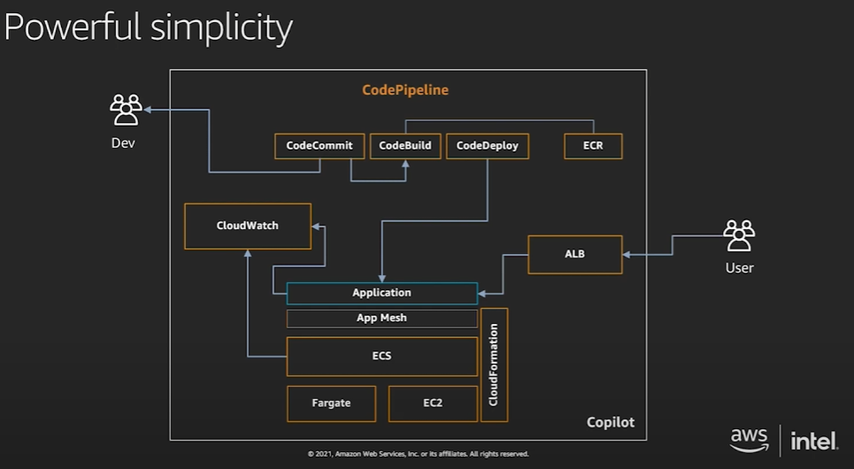
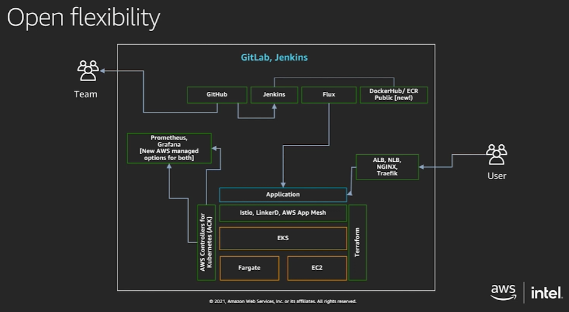

# AWS Container Service

## Management - 컨테이너 오케스트레이션

- AWS Elastic Container Service(ECS)
  - 컨테이너 오케스트레이션 기능을 AWS가 담당.
  - 단순성 간편성에 초점
  - ECS 3 구성 요소:
    - ECS 클러스터: 작업이 실행되는 논리적 그룹
    - ECS 작업: 실제 컨테이너 작업(최소 실행 단위)
    - ECS 서비스: 작업을 지속적으로 관리, 실패한 작업을 자동으로 대체하여 작업 수 유지

- Amazon Elastic Kubernetes Service(EKS)
  - 컨테이너 오케스트레이션 기능을 쿠버네티스가 담당
  - 쿠버네티스 기반.
  - 유연한 확장성에 중점

## Hosting - 컴퓨팅 옵션

- AWS Fargate:
  - AWS 서버에서 컨테이너 실행(serverless)
  - AWS는 하드웨어, OS, 컨테이너 런타임 까지 책임 관리.
  - 컨테이너가 사용하는 자원량에 따른 요금
- Amazon Elastic Compute Cloud(EC2)
  - EC2 인스턴스 내에서 실행되는 컨테이너 런타임에서 컨테이너 실행.
  - AWS는 하드웨어만 책임 관리.

## Image Registry - 이미지 저장소

> **컨테이너 레지스트리**는 컨테이너 이미지를 저장하고 액세스하는 데 사용되는 리포지토리 또는 리포지토리 컬렉션

- Amazon Elastic Container Registry(ECR)
  - *AWS* 관리형 컨테이너 이미지 레지스트리 서비스
  - 권환 제어 및 수명 주기 정책 규칙 설정
  - 이미지 취약성 스캐닝 기능
  - 퍼블릿/프라이빗 레포지토리 및 퍼블릭 갤러리
  - 교차 리전/교차 계정 복제

## 컨테이너를 지원하는 도구 및 서비스

- AWS Lightsail: 쉽고 빠르게 가상 서버 구축
- AWS App Runner: 완전관리형 애플리케이션 서비스. 컨테이너 레지스트리 또는 소스 코드 레포지토리로 부터 간단하게 바로 배포. 컨테이너/인프라 지식 없이도 구축 가능
- AWS Lambda Container: Lambda 함수를 컨테이너 기반 이미지로 배포
- Amazon CloudWatch Container Insights: 컨테이너화 된 애플리케이션 또는 마이크로 서비스에 대한 모니터링, 트러블 슈팅 및 알람을 위한 완전 관리형 관측 서비스
