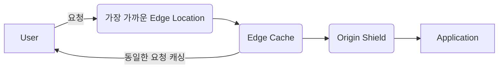
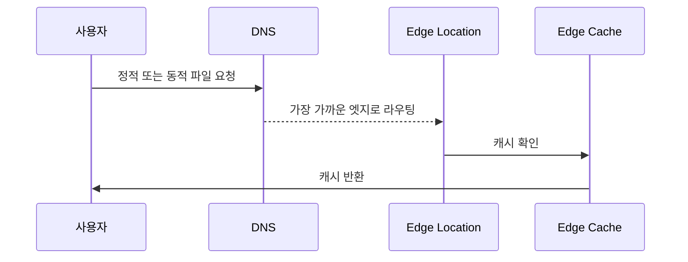
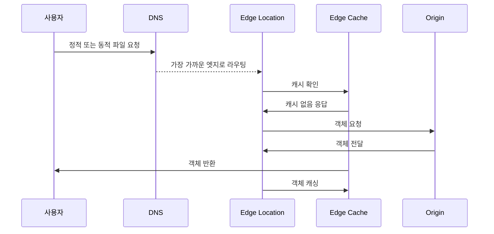

# CloudFront

```mermaid
flowchart LR
    User[User] -->|요청| Edge(가장 가까운 Edge Location)
   Edge-->Cache(Edge Cache)--> Origin(Origin Shield) --> Application
   Cache-->|동일한 요청 캐싱| User
```

- AWS의 CDN 서비스

```mermaid
sequenceDiagram
    사용자->>DNS: 정적 또는 동적 파일 요청
    DNS-->>Edge Location: 가장 가까운 엣지로 라우팅
    Edge Location->>Edge Cache: 캐시 확인
    Edge Cache->>사용자: 캐시 반환

```

```mermaid
sequenceDiagram
    사용자->>DNS: 정적 또는 동적 파일 요청
    DNS-->>Edge Location: 가장 가까운 엣지로 라우팅
    Edge Location->>Edge Cache: 캐시 확인
    Edge Cache->>Edge Location: 캐시 없음 응답
    Edge Location->>Origin: 객체 요청
    Origin->>Edge Location: 객체 전달
    Edge Cache->>사용자: 객체 반환
    Edge Location->>Edge Cache: 객체 캐싱
    
```

