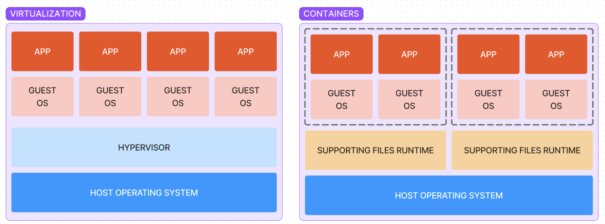
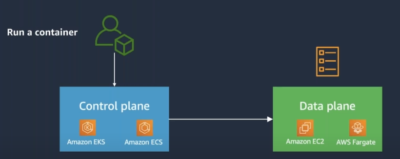

# Container

>  데스크톱, 기존 IT 또는 클라우드 등 어디에서나 코드를 실행할 수 있도록 애플리케이션 코드가 라이브러리 및 종속성과 함께 일반적인 방식으로 패키징되는 실행 가능한 소프트웨어 단위 - IBM

> 컨테이너는 전체 런타임 환경, 즉 실행에 필요한 모든 파일을 사용하여 애플리케이션을 패키징하고 격리할 수 있는 기술 - Red Hat

> 컨테이너는 어떤 환경에서나 실행하기 위해 필요한 모든 요소를 포함하는 소프트웨어 패키지 - Google

- 비유 
  - 가상 머신 -> 아파트 1가구. 가구 별 독립 공간 
  - 컨테이너 -> 셰어하우스 방 하나. 거실 주방 등 공유

| 특성             | 가상 머신 (VM)           | 컨테이너                  |
| ---------------- | ------------------------ | ------------------------- |
| **가상화 수준**  | 하드웨어 가상화          | 운영 체제 수준 가상화     |
| **자원 소모**    | 무겁고 더 많은 자원 소모 | 가벼우며 적은 자원 소모   |
| **시작 시간**    | 오래 걸림                | 빠르게 시작 및 중지 가능  |
| **이식성**       | 낮음 (플랫폼 종속성)     | 높음 (패키지화된 의존성)  |
| **보안 및 격리** | 높은 격리 수준           | 상대적으로 낮은 격리 수준 |

## VM 대비 컨테이너의 장점

- **경량**: 게스트 OS 필요없이 호스트 OS 커널을 공유하여 전체 OS 인스턴스가 필요 없고, 애플리케이션 정보만 포함되어 있어 크기가 작음.

- **높은 이식 가능성**: 컨테이너 이미지가 모든 종속성을 포함하여 거의 어느 환경에서나 쉽게 사용할 수 있고 배포가 용이하다.

- **최신 아키텍처 지원**: 서버리스나 마이크로서비스와 같은 최신 아키텍처에서 잘 동작

- **빠른 속도**: VM은 게스트 OS 위에서 실행하기 때문에 오버헤드가 있지만, 컨테이너는 직접 응용프로그램을 실행하여 실행 속도 및 처리 속도가 더 빠르다

- **책임 분리**: 개발 팀은 개발에 집중하고, 운영 팀은 배포와 관리에 집중

  

## 컨테이너 이미지

컨테이너에서 애플리케이션 실행을 위한 정보를 저장한 읽기 전용 파일

- 패키징된 애플리케이션
- 라이브러리
- 종속성
- 실행 환경

## 도커 이미지 vs 컨테이너

이미지: 애플리케이션 실행을 위해 필요한 정보를 기록한 파일

컨테이너: 이미지를 사용해 만든 가상화된 런타임 환경

## 컨테이너 오케스트레이션

- 관리해야 하는 컨테이너 수가 증가함에 따라 여러 컨테이너를 여러 인스턴스에서 사용하는 환경에서 자동화의 필요성
- 컨테이너화된 애플리케이션 및 서비스 배포 및 실행과 관련된 운영 작업을 자동화
- 사용자가 **원하는 상태(Desired State)**로 동작하도록 **관리(Schedule)**

## 하이퍼바이저

하나의 물리적 컴퓨터에서 여러 운영체제를 동작시키기 위해 여러 운영 체제 인스턴스(가상머신)를 실행하고 물리적 컴퓨팅 리소스를 공유할 수 있도록 하는 소프트웨어 계층

### 타입1: Bare-metal Hypervisor

- 물리적 하드웨어에서 직접 실행
- 리소스(CPU, 메모리, 스토리지 등)와 직접 상호 작용
- 호스트 OS를 대신함
- 주로 서버 기반 환경에서 사용

### 타입2: Hosted Hypervisor

- OS에서 애플리케이션으로서 실행
- 호스트 OS를 통해 리소스에 액세스
- 호스트 OS 위에서 실행되고 대체 게스트 OS에 대한 쉽게 빠른 액세스
- 주로 개별 PC 사용자에게서 사용