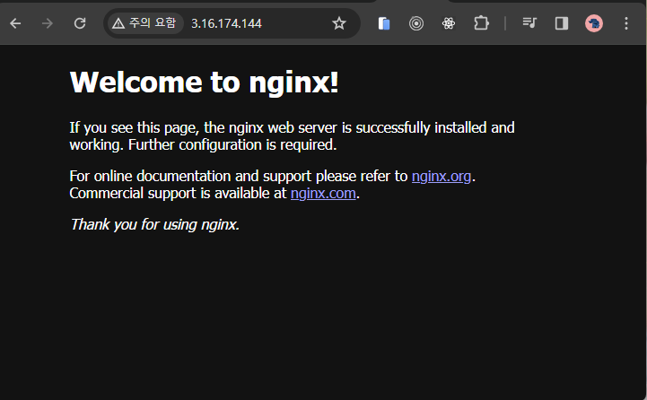
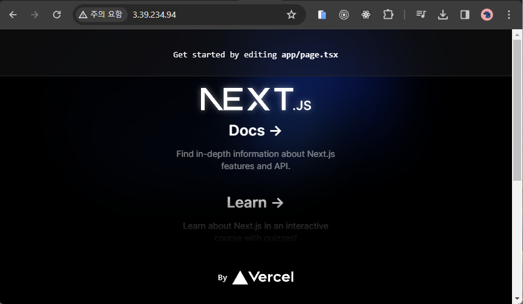

## AWS EC2를 사용하여 Nextjs 배포하기


### 1.인스턴스  접속하기

- 공개키 권한 설정
- ssh을 사용하여 연결

```bash
chmod 400 "seoul-ec2.pem"
ssh -i "seoul-ec2.pem" ec2-user@ec2-3-39-234-94.ap-northeast-2.compute.amazonaws.com
```


### 2.Node 설치

```bash
sudo yum update -y
sudo yum install -y nodejs
```

```bash
node -v
npm -v
```


### 3.Nextjs 설치

nextjs 프로젝트 설치 또는 프로젝트 가져오기

```bash
npx create-next-app@latest 
cd my-app
```

```bash
# or git clone your project and install dependency
```


### 4.pm2 설치하기

무중단 운영을 위한 pm2 전역 설치

```bash
npm install -g pm2
```

pm2를 사용해 nextjs 서버 실행

```bash
pm2 start npm --name "next" -- run dev
```

pm2 실행중인 프로세스 확인(Optional)

```bash
pm2 list
```

pm2 서버 중지 및 재시작 방법(Optional)

```bash
pm2 stop all  # 모든 프로세스 중지
pm2 restart all  # 모든 프로세스 재시작
```


### 5.nginx 설치하기

nginx 설치

```bash
sudo yum update -y
sudo amazon-linux-extras install nginx1.12
```

```bash
# amazon-linux-extras이 되지 않을 때
sudo yum install nginx
```

nginx 시작 및 활성화하기

```bash
sudo systemctl start nginx
sudo systemctl enable nginx
```

nginx 상태 확인하기

```bash
sudo systemctl status nginx
```

퍼블릭 ip를 통해 접근하여 nginx 상태 확인하기




### 6.nginx 설정하기

vi로 파일 열기

```bash
vi /etc/nginx/conf.d/default.conf
```

localhost 3000과 연결하기 위한 설정 작성

```bash
server {
    listen 80;
    server_name http://3.39.234.94/;

    location / {
        proxy_pass http://127.0.0.1:3000;
        proxy_http_version 1.1;
        proxy_set_header Upgrade $http_upgrade;
        proxy_set_header Connection 'upgrade';
        proxy_set_header Host $host;
        proxy_cache_bypass $http_upgrade;
    }

    # 다른 설정들...
}
```

:wq로 저장하기

```bash
:wq
```

nginx 재시작

```bash
sudo systemctl restart nginx
```


### 7.퍼블릭 ip에서 확인하기



