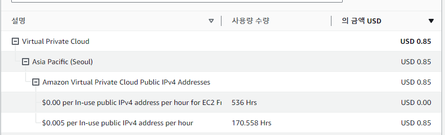
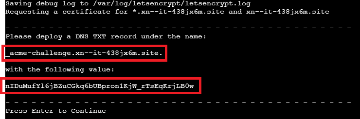
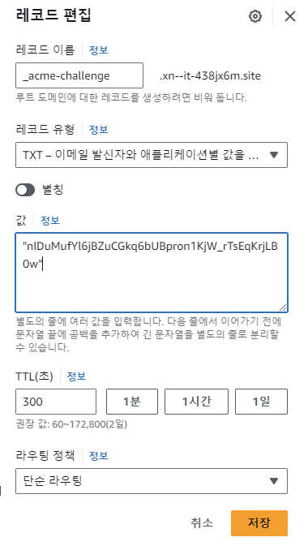
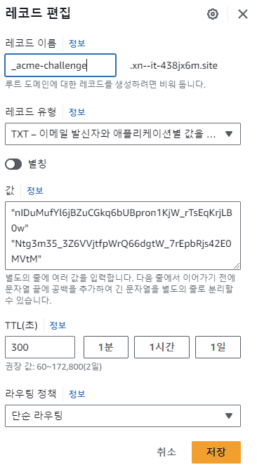
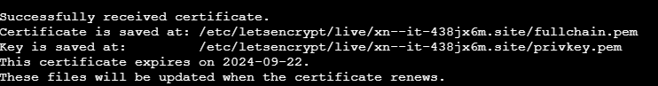

# alb에서 cartbot을 통한 https로 전환


## ALB는 비싸다

프리티어에서는 aws ec2에 대한 Public IPv4 하나 이외에는 시간당 $0.005의 비용이 부과됩니다.

1개 당 한달 기준 0.005/h *24/day* 31 days = **$3.72** 과금

**ALB**의 경우 멀티 리전을 통해 최소 2개 이상의 퍼블릭 ip를 사용해야 하므로 ip 비용으로만 매 달 $7 이상 비용을 내야 합니다.

트래픽이 적은 경우 alb는 유지비가 많이 들기 때문에 단순히 https 때문에 사용하기에는 비효율적입니다




## Certbot 설치

백엔드 → nginx와 certbot를 활용하여  ec2내에서 인증서 설정

[Certbot Instructions](https://certbot.eff.org/instructions?ws=nginx&os=pip)

```bash
# 업데이트
sudo yum update

# 종속성 설치
sudo dnf install python3 augeas-libs

# 파이썬 가상환경 세팅
sudo python3 -m venv /opt/certbot/
sudo /opt/certbot/bin/pip install --upgrade pip

#(선택사항: 만약 certbot이 이미 존재한다면 제거)
sudo yum remove certbot

# Certbot 설치
sudo /opt/certbot/bin/pip install certbot certbot-nginx

# 심볼릭 링크 등록
sudo ln -s /opt/certbot/bin/certbot /usr/bin/certbot

#nginx 설정에 따라 인증서를 받아 등록
sudo certbot --nginx
```


## Certbot 인증서 받기

```bash
sudo certbot certonly --manual --preferred-challenges dns -d "*.xn--it-438jx6m.site" -d "xn--it-438jx6m.site"site
```

주어진 서브 도메인에 대해서 **TXT 레코드**로 주어진 값을 등록






레코드 생성 후 dns에 전파되었는지 확인(아래 주소에서 쉽게 테스트가능)

전파가 되었다면 Enter를 눌러 다음으로 이동

[https://toolbox.googleapps.com/apps/dig/#TXT/_acme-challenge.domain.com](https://toolbox.googleapps.com/apps/dig/#TXT/_acme-challenge.domain.com)

위의 과정을 한 번 더 반복. 같은 레코드에 주어진 값을 다음 줄에 입력하고 저장 후 전파가 완료 되었으면 다음으로 이동



성공적으로 생성되면 인증서에 대한 주소를 알 수 있다.

[domain]에 대해서 아래의 경로를 가짐

`/etc/letsencrypt/live/[domain]/fullchain.pem`

`/etc/letsencrypt/live/[domain]/privkey.pem`




## nginx 설정 변경

```bash
sudo nano /etc/nginx/nginx.conf
```

**80포트**: https로 301 리디렉션

**443포트**: 4000번포트(nestjs앱)으로 연결

```bash
...
server {
 listen       80;
 listen       [::]:80;
 server_name  api.xn--it-438jx6m.site;
 return 301 https://$host$request_uri;
}

server {
 listen       443 ssl http2;
 listen       [::]:443 ssl http2;
 server_name  api.xn--it-438jx6m.site;
 root         /usr/share/nginx/html;

 ssl_certificate "/etc/letsencrypt/live/xn--it-438jx6m.site/fullchain.pem";
 ssl_certificate_key "/etc/letsencrypt/live/xn--it-438jx6m.site/privkey.pem";
 ssl_session_cache shared:SSL:1m;
 ssl_session_timeout  10m;
 ssl_ciphers PROFILE=SYSTEM;
 ssl_prefer_server_ciphers on;
 
 include /etc/nginx/default.d/*.conf;
 location / {
  proxy_pass http://127.0.0.1:4000;
 }
}
...
```

nginx 문법 테스트 및 재시동

```bash
sudo nginx -t
sudo systemctl restart nginx
```

---

[공지 – AWS Public IPv4 주소 요금 변경 및 Public IP Insights 기능 출시 | Amazon Web Services](https://aws.amazon.com/ko/blogs/korea/new-aws-public-ipv4-address-charge-public-ip-insights/)

[[AWS] 퍼블릭IPv4 유료화에 따른 대체 구성 방법](https://blog.nuricloud.com/aws-alternatives-to-public-ipv4-charges/)

[Scaling the dual-stack network design in AWS - IPv6 on AWS](https://docs.aws.amazon.com/whitepapers/latest/ipv6-on-aws/scaling-the-dual-stack-network-design-in-aws.html)
