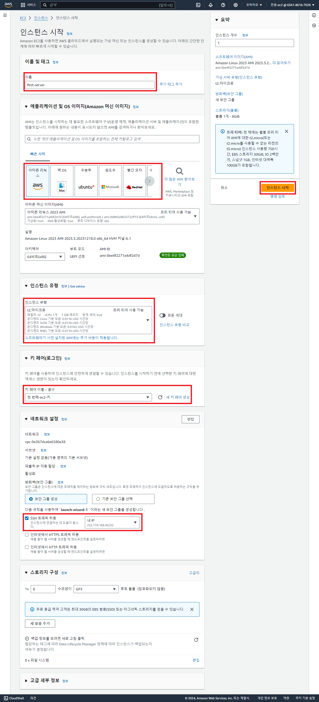
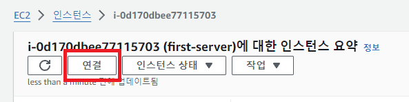
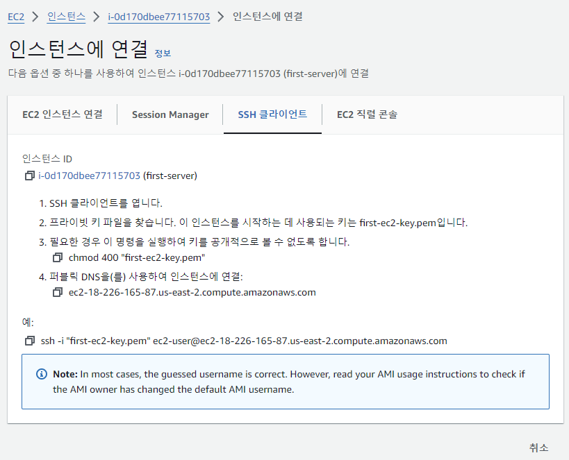
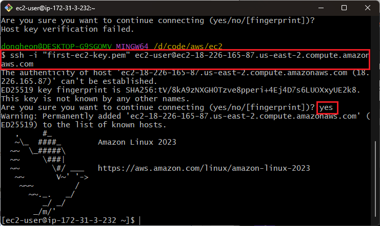
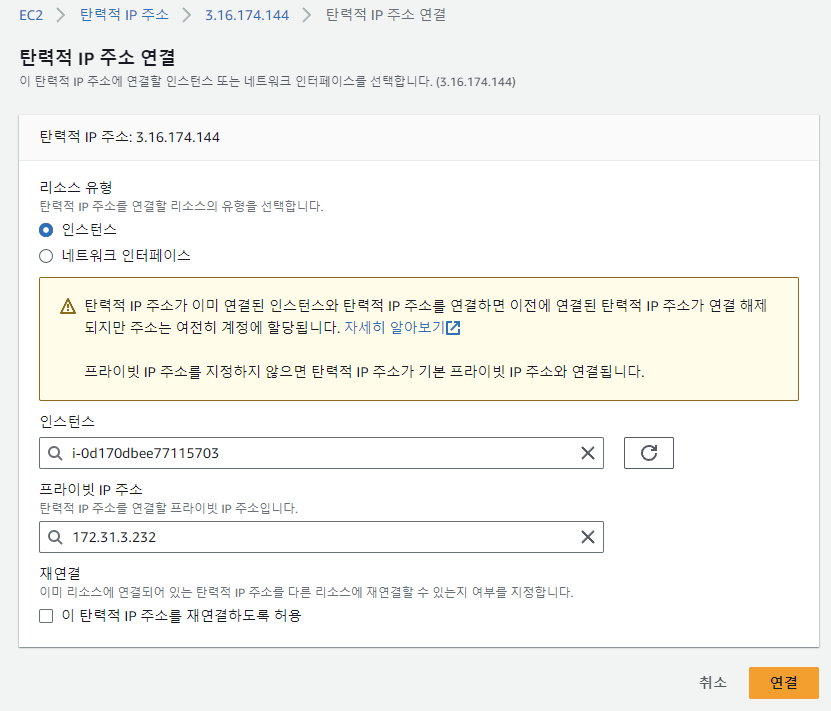
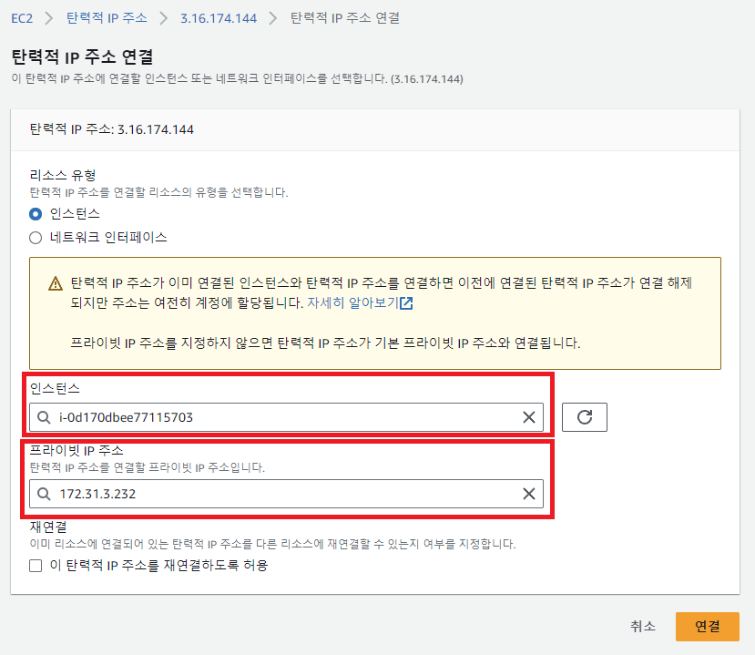
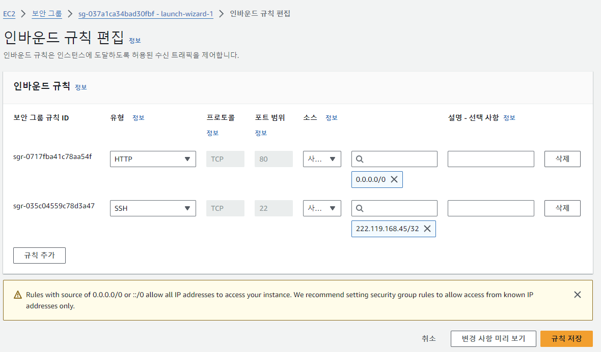
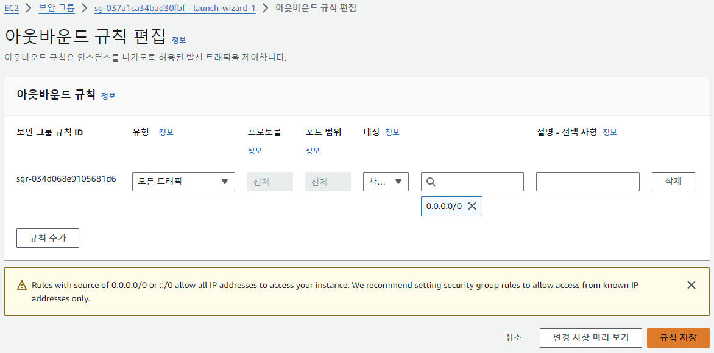

## EC2 인스턴스 생성하기

1. 인스턴스 생성하기

2. 인스턴스 연결하기

## 인스턴스 생성 시 필요 정보

1. Amazon Machine Image(AMI)
2. 인스턴스 사양(유형)
3. 사용될 네트워크 및 스토리지
4. 보안 그룹 설정

## EC2 서버 외부에 공개하기

- ec2 서버를 퍼블릭 서브넷에 배치
  
  
- 퍼블릭 IP 주소를 EC2에 부여
  
  
- 보안 그룹에서 외부 접근 허가
  
  

