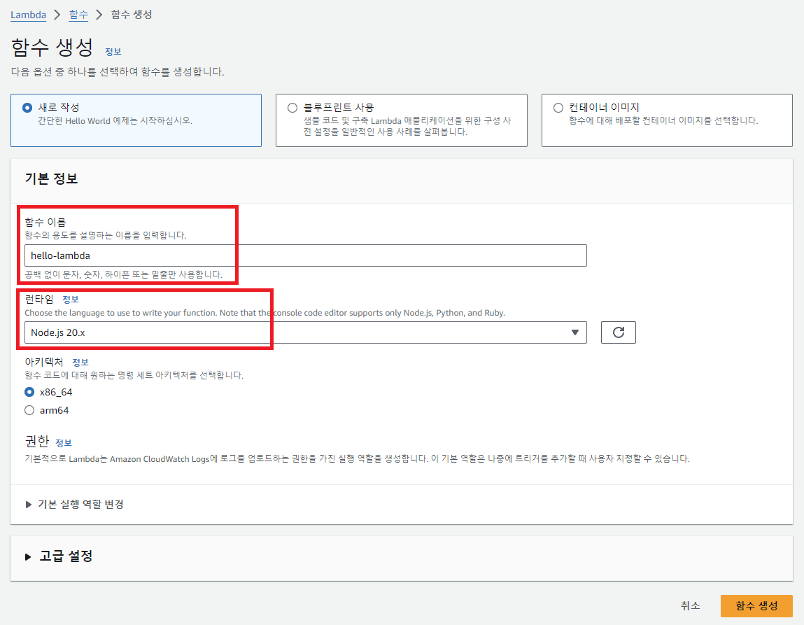
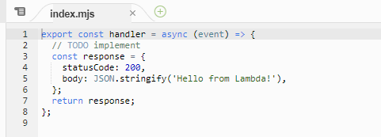
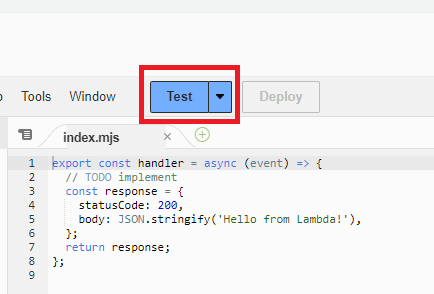
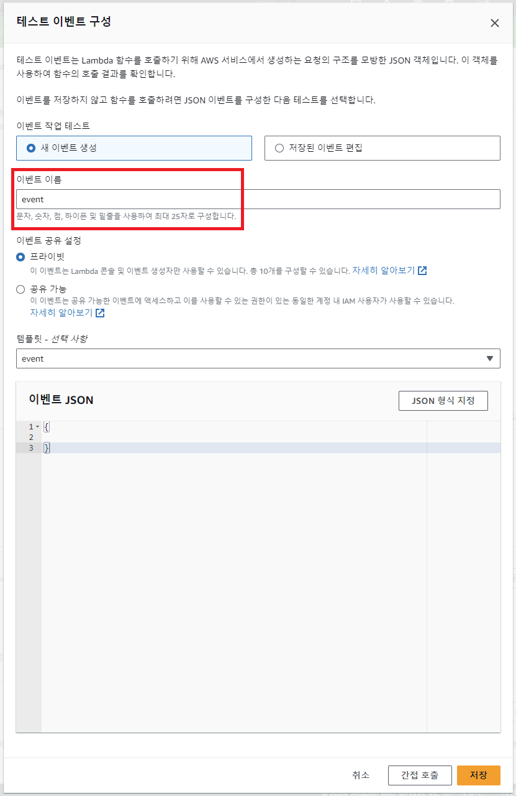
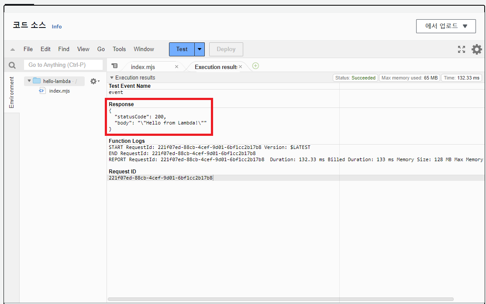
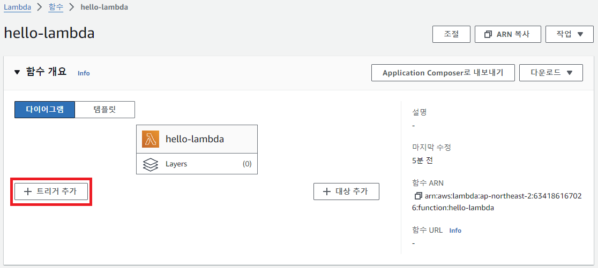
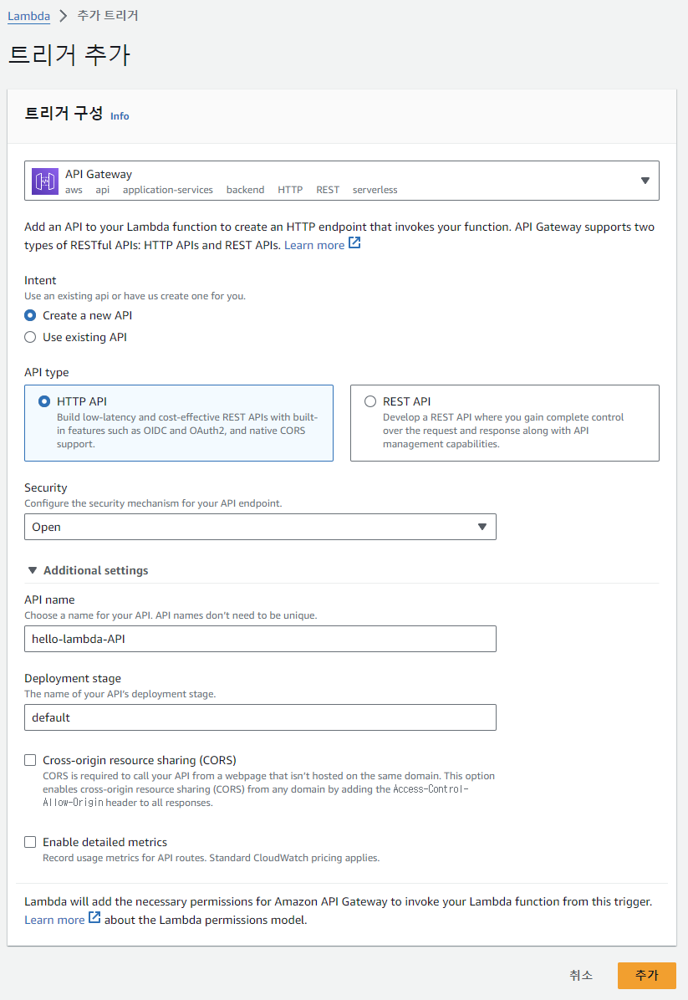
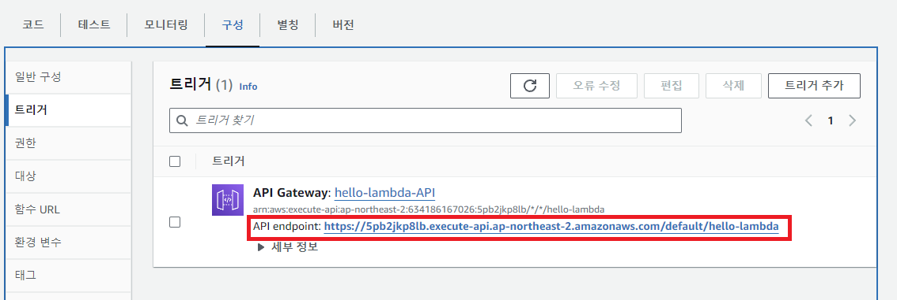
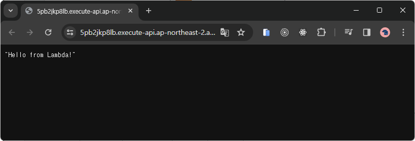

# Start Lambda

Lambda 함수 생성

Lambda 함수 생성 시 기본 코드

Test 버튼을 눌러 Lambda 함수를 테스트

이벤트 이름을 입력하고 저장

다시 Test 버튼을 눌러 생성한 이벤트를 사용하여 Lambda 함수 테스트

## API Gateway를 통한 트리거

트리거 추가 버튼으로 트리거 추가 페이지로 이동

api endpoint를 확인하고 해당 endpoint로 이동

