# use lambda with s3


썸네일 생성 Lambda 함수 만들기

url:<https://docs.aws.amazon.com/ko_kr/lambda/latest/dg/with-s3-tutorial.html>

1. **버킷** 생성
2. 원본 버킷에 테스트를 위한 이미지 업로드
3. s3와 cloudwatch 사용을 위한 **권한 정책** 생성
4. 해당 정책을 사용하는 **실행 역할** 생성
5. 해당 실행 역할을 가지는 **Lambda 함수** 생성
6. S3 트리거 추가
7. 테스트 이벤트 생성 및 테스트


## 버킷 2개 생성

- 원본을 저장하는 버킷
- 리사이즈된 이미지를 저장할 버킷

버킷을 하나만 사용하게 되면 무한 루프 문제에 빠질 수 있음

원본 저장 -> 저장 이벤트 발생 -> 리사이즈 된 이미지 저장 -> 저장 이벤트 발생 -> ...

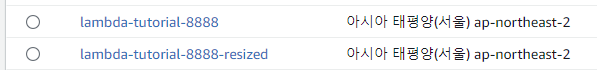


## 테스트용 이미지업로드

테스트를 위해 원본 버킷에 이미지를 1개 미리 업로드 해둔다.

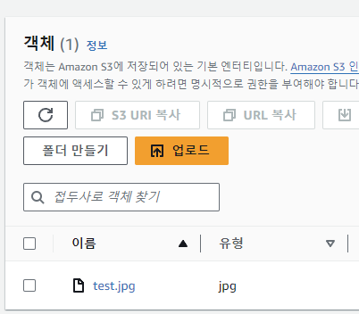


## 권한 정책 생성

s3와 cloudwatch에 접근하기 위한 권한 정책을 생성한다

- s3 읽기: 저장 이벤트 발생 시 불러오기
- s3 쓰기: 리사이즈된 이미지 저장
- cloudWatch 쓰기: 함수 실행 후 로그 저장

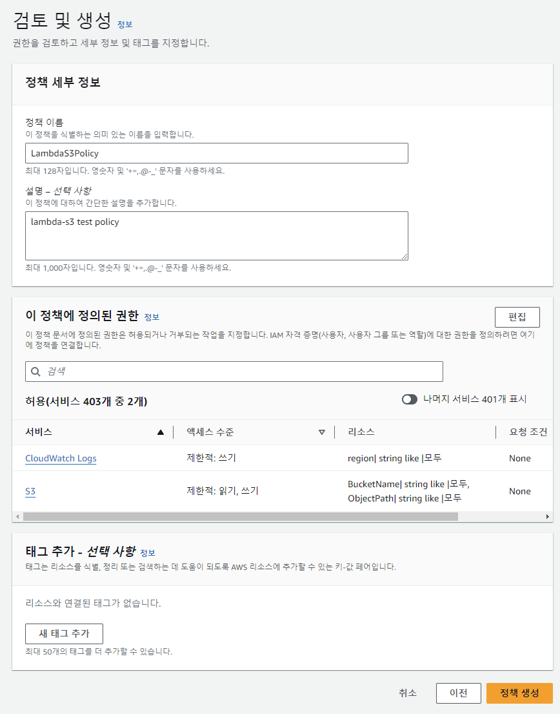

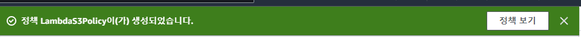


## 실행 역할 생성

위에서 만든 권한 정책을 사용하는 역할을 생성

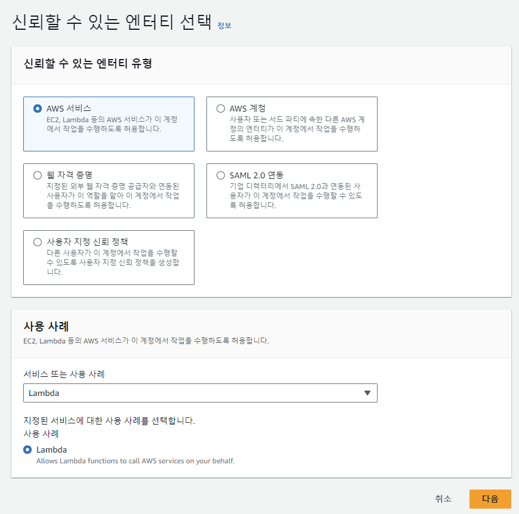

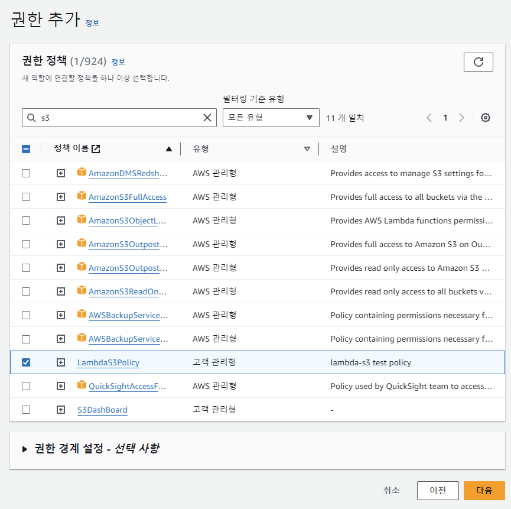


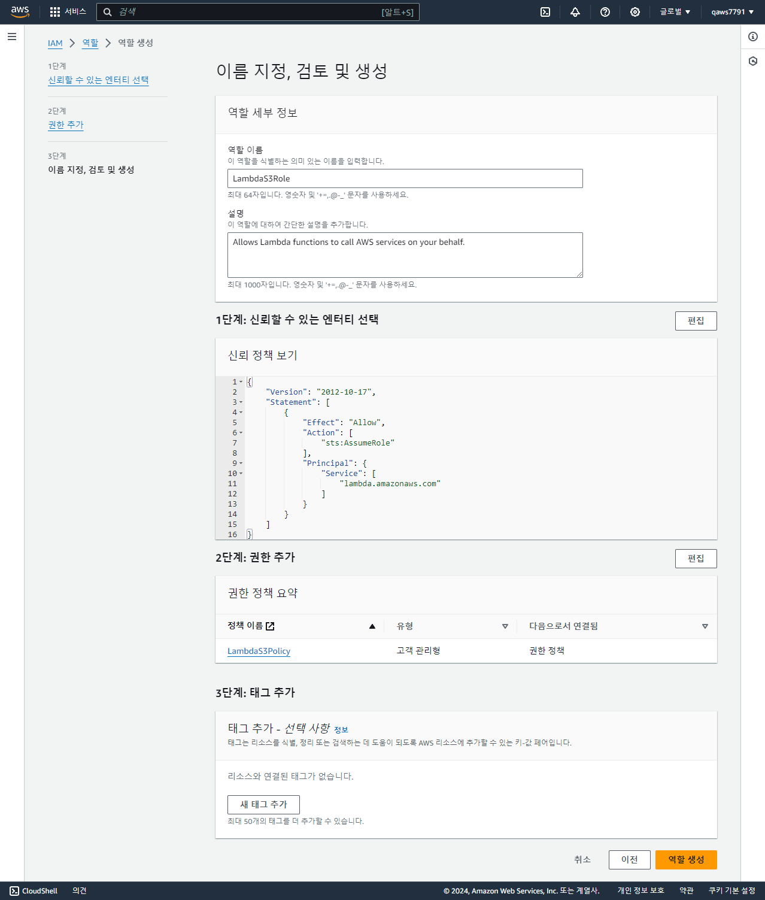

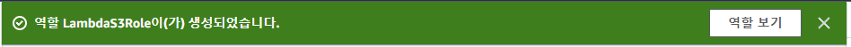


## Lambda 함수 생성


```javascript
// dependencies
import {
  S3Client,
  GetObjectCommand,
  PutObjectCommand,
} from '@aws-sdk/client-s3'

import { Readable } from 'stream'

import sharp from 'sharp'
import util from 'util'

// create S3 client
const s3 = new S3Client({ region: 'ap-northeast-2' })

// define the handler function
export const handler = async (event, context) => {
  // Read options from the event parameter and get the source bucket
  console.log(
    'Reading options from event:\n',
    util.inspect(event, { depth: 5 })
  )
  const srcBucket = event.Records[0].s3.bucket.name

  // Object key may have spaces or unicode non-ASCII characters
  const srcKey = decodeURIComponent(
    event.Records[0].s3.object.key.replace(/\+/g, ' ')
  )
  const dstBucket = srcBucket + '-resized'
  const dstKey = 'resized-' + srcKey

  // Infer the image type from the file suffix
  const typeMatch = srcKey.match(/\.([^.]*)$/)
  if (!typeMatch) {
    console.log('Could not determine the image type.')
    return
  }

  // Check that the image type is supported
  const imageType = typeMatch[1].toLowerCase()
  if (imageType != 'jpg' && imageType != 'png') {
    console.log(`Unsupported image type: ${imageType}`)
    return
  }

  // Get the image from the source bucket. GetObjectCommand returns a stream.
  try {
    const params = {
      Bucket: srcBucket,
      Key: srcKey,
    }
    var response = await s3.send(new GetObjectCommand(params))
    var stream = response.Body

    // Convert stream to buffer to pass to sharp resize function.
    if (stream instanceof Readable) {
      var content_buffer = Buffer.concat(await stream.toArray())
    } else {
      throw new Error('Unknown object stream type')
    }
  } catch (error) {
    console.log(error)
    return
  }

  // set thumbnail width. Resize will set the height automatically to maintain aspect ratio.
  const width = 200

  // Use the sharp module to resize the image and save in a buffer.
  try {
    var output_buffer = await sharp(content_buffer).resize(width).toBuffer()
  } catch (error) {
    console.log(error)
    return
  }

  // Upload the thumbnail image to the destination bucket
  try {
    const destparams = {
      Bucket: dstBucket,
      Key: dstKey,
      Body: output_buffer,
      ContentType: 'image',
    }

    const putResult = await s3.send(new PutObjectCommand(destparams))
  } catch (error) {
    console.log(error)
    return
  }

  console.log(
    'Successfully resized ' +
      srcBucket +
      '/' +
      srcKey +
      ' and uploaded to ' +
      dstBucket +
      '/' +
      dstKey
  )
}

```

```bash
npm install --arch=x64 --platform=linux sharp@0.32.6
```

루트 폴더를 `.zip`로 압축 -> 함수로 업로드

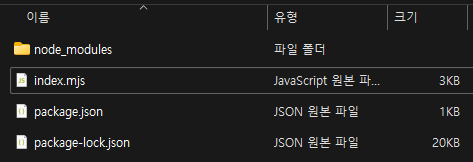


위에서 만든 역할을 가지는 lambda 함수 생성

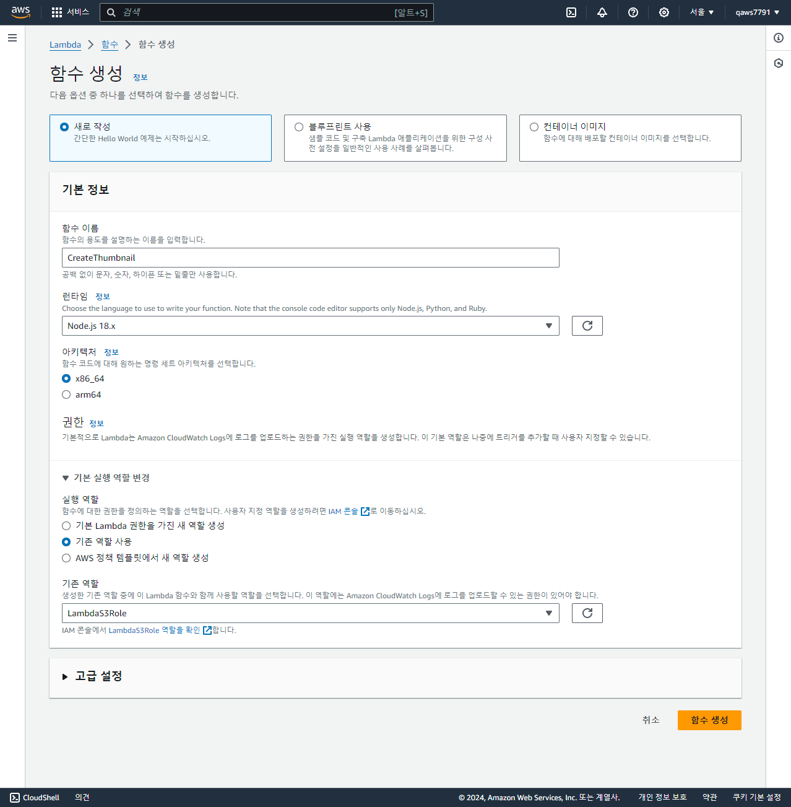

`zip 파일`을 업로드

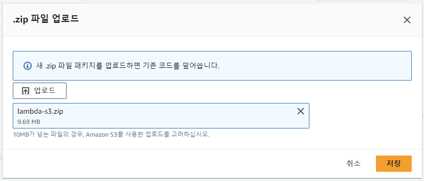


## S3 트리거 추가

s3에서 생성 이벤트가 발생하면 lambda 함수가 실행되도록 s3의 `All object create events` 트리거를 추가

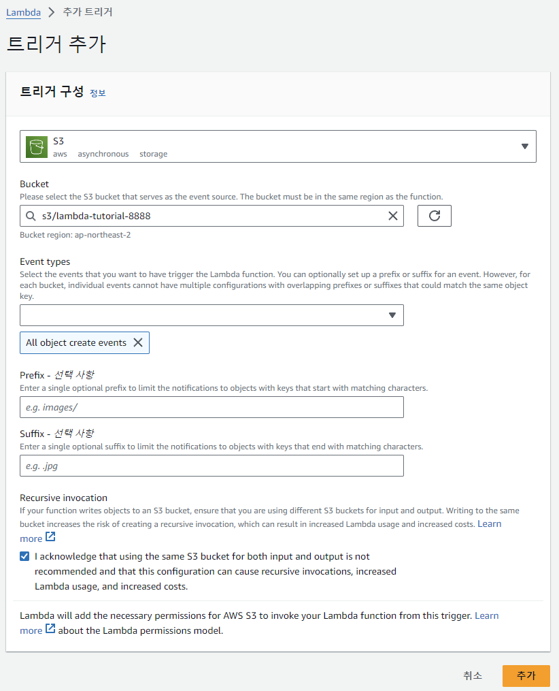


## 테스트 이벤트 생성 및 테스트

테스트 이벤트를 생성하여 처음에 업로드한 테스트용 이미지에 대해서 리사이즈된 이미지를 생성하는지 테스트

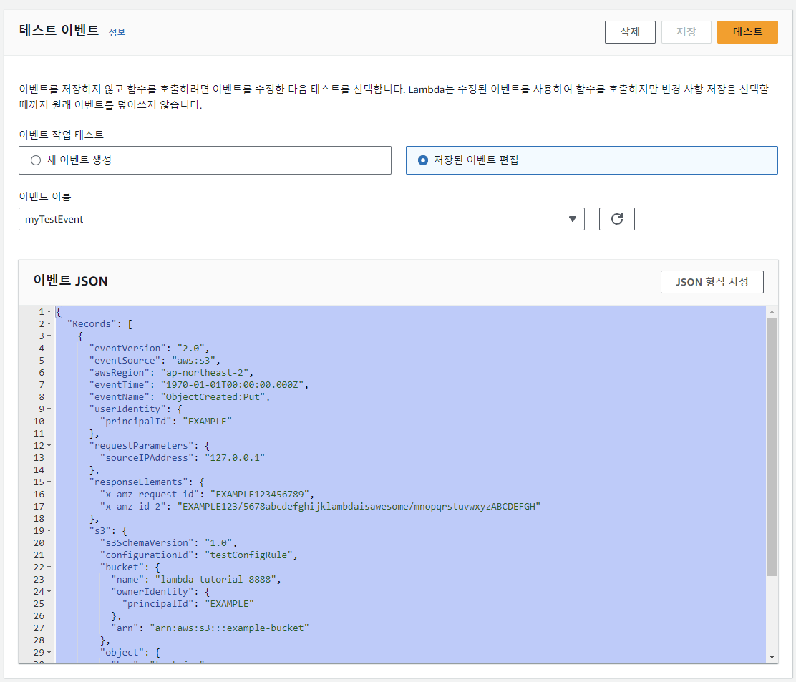

```json
{
  "Records": [
    {
      "eventVersion": "2.0",
      "eventSource": "aws:s3",
      "awsRegion": "ap-northeast-2",
      "eventTime": "1970-01-01T00:00:00.000Z",
      "eventName": "ObjectCreated:Put",
      "userIdentity": {
        "principalId": "EXAMPLE"
      },
      "requestParameters": {
        "sourceIPAddress": "127.0.0.1"
      },
      "responseElements": {
        "x-amz-request-id": "EXAMPLE123456789",
        "x-amz-id-2": "EXAMPLE123/5678abcdefghijklambdaisawesome/mnopqrstuvwxyzABCDEFGH"
      },
      "s3": {
        "s3SchemaVersion": "1.0",
        "configurationId": "testConfigRule",
        "bucket": {
          "name": "lambda-tutorial-8888",
          "ownerIdentity": {
            "principalId": "EXAMPLE"
          },
          "arn": "arn:aws:s3:::example-bucket"
        },
        "object": {
          "key": "test.jpg",
          "size": 1024,
          "eTag": "0123456789abcdef0123456789abcdef",
          "sequencer": "0A1B2C3D4E5F678901"
        }
      }
    }
  ]
}
```

resized 버킷에 리사이즈 된 이미지가 정상적으로 업로드 되었는지 확인

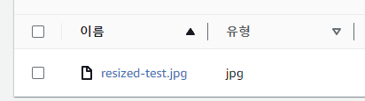
