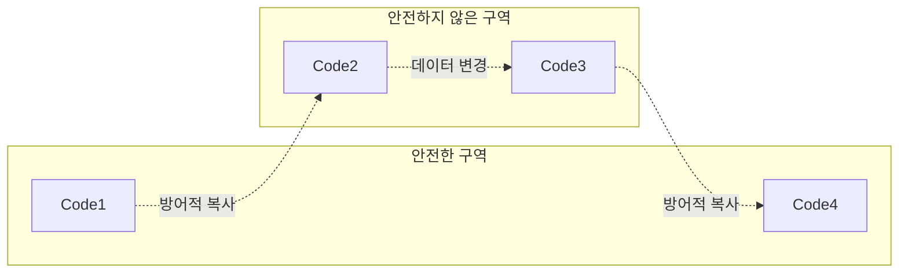

# 함수형 프로그래밍


## 함수형 프로그래밍이란

**부수 효과(side effect)**없이 **순수 함수**만 사용하는 프로그래밍

- 부수 효과(side effect): 함수가 반환하는 값 이외의 값을 변경하는 것
  - 예를 들어, 전역 변수나 인자로 전달된 객체의 속성을 변경하는 것
  - 부수 효과가 있는 함수는 같은 입력에 대해 항상 같은 출력을 반환하지 않는다
  - 부수 효과가 있는 함수는 외부 상태에 의존하기 때문에 예측하기 어렵고 테스트하기 어렵다

- 부수 효과 예시:
  - I/O 작업: 파일 읽기 콘솔 출력 등
  - 데이터베이스 작업: 데이터베이스에 데이터 추가, 수정, 삭제 등
  - 네트워크 작업: API 호출 등
  - DOM 조작: DOM 요소 추가, 삭제, 수정 등
  - 타임스탬프: 현재 시간 가져오기 등
  - 랜덤 값 생성: Math.random() 등

- 순수 함수(pure functions): 같은 입력에 대해 항상 같은 출력을 반환하는 함수.
  - 평가 도중에 다른 값이나 외부 상태의 영향을 받지 않는다
  - 부수 효과가 없다

하지만 부수 효과는 프로그래밍에서 필요하기 때문에 함수형 프로그래밍이 부수 효과를 피하는 것일 뿐 배제하는 것은 아니다


### 명령형과 선언적 프로그래밍

함수형 프로그래밍은 크게 보면 선언적(declarative) 프로그래밍에 해당한다.

- 명령형 프로그래밍은 컴퓨터에게 원하는 작업을 어떻게 하는지 설명한다
- 선언적 프로그래밍은 컴퓨터에게 원하는 결과를 설명한다


### 함수형 프로그래밍의 지향점

- 무상태성(stateless): 함수형 프로그래밍은 상태를 가지지 않는다. 기존 상태를 변경하지 않고 새로운 상태를 계산한다.
- 불변성(immutable): 함수형 프로그래밍은 데이터를 변경하지 않는다
- 참조 투명성(referential transparency): 코드의 어느 곳에서나 표현식을 해당 값으로 대체할 수 있다
  - 참조적으로 투명하지 않은 예시: 난수를 반환하는 함수, 현재 시간을 반환하는 함수, 예외를 발생시키는 함수 등
- 고차 함수(higher-order function): 함수를 인자로 받거나 함수를 반환하는 함수
  - 고차 함수 예시: `map`, `filter`, `reduce` 등
- 지연 평가(lazy evaluation): 표현식은 필요할 때까지 평가되지 않습니다. 이러한 방식은 특정 상황에서 성능을 향상시킬 수 있습니다.
- 분해와 합성(decomposition and composition): 함수형 프로그래밍은 작은 함수로 나누어 작성하고 합성한다


### 함수형 프로그래밍의 장점

- 하나의 함수가 하나의 기능만 담당하기 때문에 코드가 간결해진다
- 시스템의 상태를 예측하기 쉽다
- 재사용성이 높아진다
- 코드를 테스트하기 쉽다


## 참조 투명성

참조 투명성(referential transparency)은 같은 입력에 대해 항상 같은 출력을 반환하는 성질을 말합니다. 즉, 어떤 함수가 주어졌을 때, 그 함수의 결과를 다른 값으로 대체해도 프로그램의 동작이 변하지 않는다는 것입니다


## 커링

커링(currying)은 다중 인자를 받는 함수를 단일 인자를 받는 함수로 변환하는 기법입니다. 커링을 사용하면 일반적인 함수를 부분적으로 적용하여 전문적인 함수를 만들 수 있습니다.

```javascript
const add = (a, b) => a + b;
const addCurried = (a) => (b) => a + b;
const add5 = addCurried(5); // 5를 더하는 함수
const result = add5(3); // 8
```


## 합성

합성(composition)은 여러 개의 함수를 조합하여 새로운 함수를 만드는 기법입니다. 일반적으로 함수형 프로그래밍은 하나의 일을 하는 작은 함수를 만들고, 이 작은 함수들을 조합하여 더 큰 함수나 특정 기능을 구현하는 방식으로 사용합니다.

합성을 구현하는 방법으로는 `compose`와 `pipe`가 있습니다. 차이점은 실행 순서입니다. compose는 오른쪽에서 왼쪽으로 함수를 합성하고, pipe는 왼쪽에서 오른쪽으로 함수를 합성합니다. 즉, compose는 마지막 함수부터 실행되고, pipe는 첫 번째 함수부터 실행됩니다. 일반적으로 사람들은 글을 읽는 방향과 같은 방향으로 실행되는 pipe를 더 선호합니다.

- `compose`: 오른쪽에서 왼쪽으로 함수를 합성합니다. 즉, 마지막 함수부터 실행됩니다
- `pipe`: 왼쪽에서 오른쪽으로 함수를 합성합니다. 즉, 첫 번째 함수부터 실행됩니다

```javascript
const compose = (...fns) => (x) => fns.reduceRight((acc, fn) => fn(acc), x);
const pipe = (...fns) => (x) => fns.reduce((acc, fn) => fn(acc), x);
```


## 액션과 계산, 데이터

- 액션: 호출하는 시점이나 횟수에 의존하거나 외부 시스템과 상호작용하는 함수.
  - 상태 변경 보장
  - 순서 보장
  - 실행 횟수 보장
- 계산: 입력값을 계산하여 반환(출력)하는 함수
  - 정확한 계산
  - 효율적인 계산 수식
  - 테스트
- 데이터: 이벤트에 대한 결과
  - 효율적 접근
  - 안전한 데이터 보관
  - 데이터 분석


### 계산보다 액션

- 테스트하기 쉽다 - 계산은 같은 입력에 대해 항상 같은 값을 반환하므로 테스트하기 쉽습니다
- 정적 분석이 쉽다
- 조합하기 쉽다


### 액션을 부르면 액션이다

어떤 함수가 내부에서 액션을 사용한다면 이 함수도 액션이 됩니다. 이 함수가 언제 실행하는지가 이 함수 내부의 액션 호출 시점에 영향을 주기 때문입니다.


### 자바스크립트에서 액션이 되는 것들

- DOM 관련 메서드
  - `document.METHOD`
- alert, confirm 호출
  - `alert`, `confirm`
- 콘솔 출력
  - `console.log`
- 날짜, 시간과 관련된 작업
  - new Date()
- 참조 사용
  - 변수, 속성, 배열, 객체
- 상태 변경
  - 값 할당
  - 속성 변경, 삭제


### 액션은 어렵다

액션은 소프트웨어를 사용하는 가장 큰 이유이지만 그만큼 잘못 사용하면 위험합니다

1. 액션을 필요할 때만 최대한 적게 사용해야 합니다.
2. 액션은 가장 작게 만들어야 합니다. 불필요한 부분은 제거하거나 빼내야 합니다
   1. 암묵적 입력과 출력을 제거하여 계산으로 만들기
3. 액션이 외부 세계와 상호작용하는 것을 제한 할 수 있다
4. 엑션이 호출 시점에 의존하는 것을 제한할 수 있다


### 재사용하기

- 전역 변수에 의존하지 않기 & 전역변수를 변경하지 않고 값을 반환하기
- 특정 조건에서 실행된다고 가정하지 않기


### 액션에서 계산으로 변경하기

- 계산 부분은 별도의 함수로 분리하기
- 암묵적 입력은 인자(명시적 입력)로, 암묵적 출력은 반환 값(명시적 출력)으로 변경하기
  - 암묵적 입력: 인자가 아닌 입력
  - 암묵적 출력: 반환 값이 아닌 출력


## 작게 분리된 코드의 장점

- 재사용하기 쉽다
- 유지보수가 쉽다
- 테스트가 쉽다


## 데이터 불변성 유지

데이터 불변성(immutable data)은 데이터가 생성된 이후에 변경되지 않는 성질을 말합니다. 즉, 데이터가 생성된 이후에는 그 데이터를 변경할 수 없고, 새로운 데이터를 만들어야 한다는 것입니다. 데이터 불변성을 유지하면 데이터의 상태를 예측하기 쉬워지고, 코드의 가독성이 높아지며, 버그를 줄일 수 있습니다. 또한, 데이터 불변성을 유지하면 여러 스레드에서 동시에 데이터를 읽고 쓸 때 발생할 수 있는 문제를 방지할 수 있습니다. `Immutable.js`와 `Immer`와 같은 라이브러리를 사용하여 데이터 불변성을 유지할 수 있습니다.

- `var`, `let` 보다는 `const`를 사용하여 변수를 선언합니다
- 원시값을 가지는 데이터는 그냥 변경하는 것으로 충분하지만, 객체나 배열 같은 참조형 데이터는 속성을 변경하는 대신 새로운 객체나 배열 복사본을 만들어서 대체하도록 합니다.


### Copy on Write

1. 복사본 생성
2. 복사본 변경
3. 복사본 반환


### 불변 데이터

- 변경 가능한 데이터를 읽는 것 -> 액션
- 불변 데이터를 읽는 것 -> 계산


### 구조적 공유

전체 데이터를 복사하지 않고 내부 데이터가 같은 데이터를 참조하는 방법

복사본 간에 영향을 미치지 않게 하려면 깊은 복사를 사용하여 전체를 복사할 수 있다. 깊은 복사는 모든 데이터 구조를 복사하기 때문에 성능에 부정적 영향을 줄 수 있다

다른 방법으로는 `Object.freeze()`과 같은 메서드를 사용하여 데이터를 변경되지 않도록 할 수 있다. 변경되지 않는 데이터는 얕은 복사로 변경해도 안전하다

구조적 공유는 데이터를 복사할 때 데이터가 변경되지 않는 부분에 대해서는 복사를 하는 대신 재사용하는 방법이다

- 얕은 복사: 복사본의 속성이 복사본이 만들어진 원본 객체와 같은 참조를 공유하는 복사 - 적은 비용
- 깊은 복사: 원본과 복사본이 완전히 독립적인 복사 - 많은 비용

```javascript
//name="john"인 사람의 age를 20으로 수정
const people = [
  { name: "john", age: 25 },
  { name: "jane", age: 30 },
  { name: "bob", age: 35 },
];

const setAgeByName = (people, name, age) => {
  return people.map((p) => {
    return p.name === name ? { ...p, age } : p;
  });
};

const changedPeople = setAgeByName(people, "john", 20);
```


## 방어적 복사

방어적 복사는 불변성 코드에서 데이터가 변경될 수도 있는 코드와 데이터를 주고받기 위한 방법으로, 데이터를 내보내거나 가져올 때 **깊은 복사본**을 만들어 사용합니다

깊은 복사: `JSON.stringify()` - 객체 -> JSON 문자열, `JSON.parse()` - 문자열 -> js 객체



```javascript
const function_safe(data) => {
 const copy = deep_copy(data)
 changeMutableData(copy)
 return deep_copy(copy)
}
```

[cloneDeep](https://lodash.com/docs/4.17.15#cloneDeep)


# 계층형 설계

- 패턴1: 직접 구현
- 패턴 2: 추상화 벽
- 패턴 3: 작은 인터페이스
- 패턴 4: 편리한 계층


## 패턴 1: 직접 구현

- 한 함수에서는 자신보다 낮은 추상화 계층 중 같은 계층에 있는 함수들을 호출한다
- 함수 내의 추상화 수준이 제각각이라면 구체화 수준을 같도록 추출·정리한다
- 더 작은 함수로 분리할수록 재사용 및 테스트하기 하기 쉬워진다

```javascript
const makeItem = (name, price) => {
  return {
    name,
    price,
  };
};

const addItem = (cart, item) => {
  return cart.push(item);
};

const isInCart = (cart, name) => {
  return cart.some((c) => c.name === name);
};
```

```javascript
// 넥타이를 하나 사면 넥타이 클립을 하나 무료로 주는 코드
const freeTieClipWhenBuyTie = (cart) => {
  const hasTie = isInCart(cart, "tie");
  const hasTieClip = isInCart(cart, "tie clip");
  if (hasTie && !hasTieClip) {
    const tieClip = makeItem("tie clip", 0);
    return addItem(cart, tieClip);
  }
  return cart;
};
```


### 목적별 계층

1. 장바구니 비지니스 규칙
2. 일반 비지니스 규칙
3. 장바구니 기본 동작
4. 제품 기본 동작
5. copy-on-write 동작
6. 자바스크립트 기능


## 패턴 2: 추상화 벽

세부 구현을 감춘 함수로 구성하여 누구나 함수 이름만 보고 직관적으로 사용할 수 있도록 한다

추상화 벽 위에 있는 함수는 분리되어 있기 때문에 추상화 벽 내의 함수가 어떤 데이터 구조인지 알지 않아도 됩니다

- 미래에 구현이 바뀔 것으로 예상될 때 쉽게 바꿀 수 있다
- 구체적인 구현을 내부로 숨겨 코드를 쉽게 사용할 수 있다
- 팀 간에 서로 신경쓰지 않고 작업하며(커뮤니케이션 비용 감소), 팀 간 책임을 명확히 나눌 수 있다
- 추상화 벽에 코드가 많아지면, 구현이 바뀔 때 변경해야 할 코드가 많아집니다


## 패턴 3: 작은 인터페이스

인터페이스를 최소화하여 하위 계층에 불필요한 기능이 쓸데없이 커지는 것을 막기

시계 할인 마케팅을 구현하기 위한 두 가지 방법

- 추상화 벽에 만들기
- 추상화 벽 위에 만들기

장바구니에 제품을 담을 때 로그 남기기

- add_item() 안에서 호출하기 -> add_item 함수가 계산에서 액션으로 바뀜
- add_item_to_cart() 핸들러 함수 안에서 호출하기 -> 핸들러 함수는 원래 액션이기 때문에 바뀌는 것이 없음


## 패턴 4: 편리한 계층

코드가 편하다면 설계를 그래도 두고 조금 벗어나도 그냥 사용하는 것이 나을 수 있다

나중에 너무 지저분해진다고 생각될 때 다시 패턴을 적용하면 된다

편리한 계층은 설계와 기능 사이에서 어느 지점에 머물지를 생각


## 호출 그래프

세 가지 비기능적 요구사항


### 유지보수성

쉽게 변경할 수 있는가

- 위로 연결된 함수가 적은 함수일수록(호출 그래프의 상단에 위치할 수록) 고치기 쉽다


### 테스트성

테스트가 중요한가

- 위로 많이 연결된 함수일수록(하단에 위치한 코드) 테스트가 중요하다


### 재사용성

재사용하기 좋은가

- 하단에 위치한 함수가 적을 수록 재사용하기 더 쉽습니다


## 일급함수
