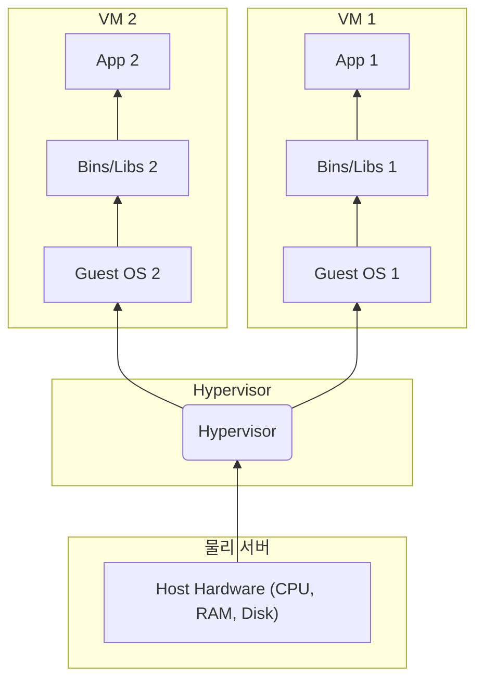
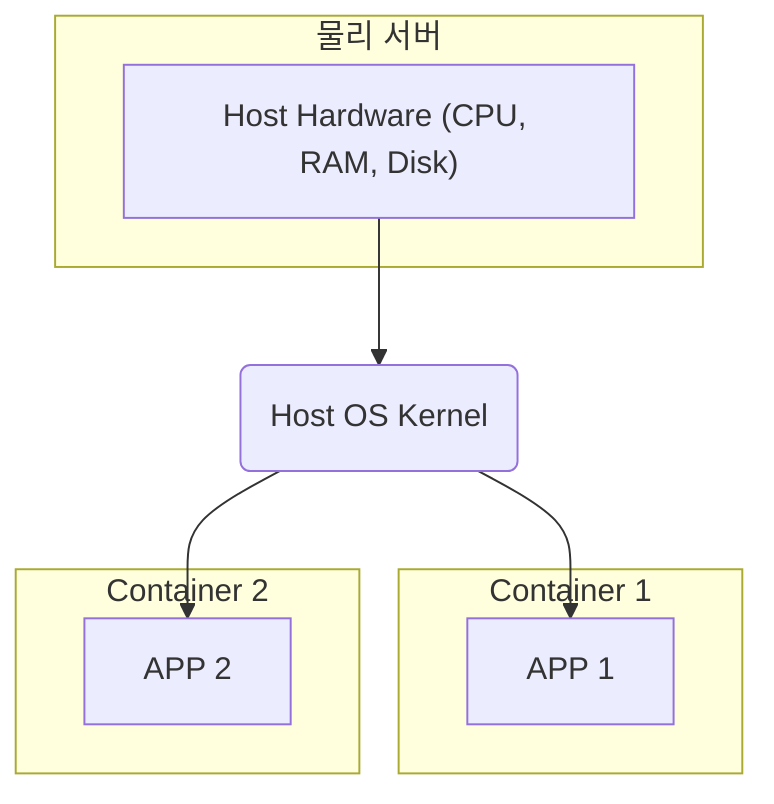

## 챕터 시작하기

웹 애플리케이션을 개발하고 사용자에게 선보이는 과정은 단순히 코드를 작성하는 것 이상을 포함합니다. 개발된 애플리케이션이 안정적으로 동작할 환경을 구축하고, 여러 팀원이 동일한 환경에서 협업하며, 최종적으로 실제 서비스 환경에 문제없이 배포하는 과정은 예상치 못한 난관으로 가득 차 있을 때가 많습니다. 이 첫 번째 챕터에서는 이러한 문제들이 왜 발생하는지 살펴보고, 이를 해결하기 위해 등장한 가상화(Virtualization) 기술과 컨테이너(Container) 기술의 개념을 이해하며, 왜 컨테이너 기술이 현대 웹 개발에 필수적인 요소로 자리 잡게 되었는지 알아봅니다.

## 1.1 전통적인 배포 방식의 문제점

과거에는 개발된 웹 애플리케이션을 물리적인 서버(Bare-metal)나 미리 준비된 특정 운영체제(OS) 환경에 직접 배포하는 방식이 일반적이었습니다. 예를 들어, 완성된 Java 웹 애플리케이션(.war 파일)을 Tomcat 서버에 복사하거나, PHP 코드를 FTP 또는 SSH를 통해 웹 서버의 지정된 디렉토리로 전송하는 식입니다.

이러한 전통적인 방식은 단순해 보일 수 있지만, 규모가 커지고 복잡도가 증가함에 따라 여러 가지 고질적인 문제점을 드러냈습니다.

* 👿**의존성 지옥 (Dependency Hell):** 하나의 서버에 여러 애플리케이션을 배포해야 하는 경우를 생각해 봅시다. A 애플리케이션은 Python 2.7 버전과 특정 라이브러리 X 버전 1.0이 필요하고, B 애플리케이션은 Python 3.8 버전과 라이브러리 X 버전 2.0이 필요하다면 어떻게 될까요? 동일한 서버 환경에서는 이러한 서로 다른 버전의 언어 런타임이나 라이브러리 요구사항을 동시에 충족시키기 매우 어렵거나 불가능합니다. 이는 라이브러리 충돌로 이어져 애플리케이션 오작동의 원인이 됩니다.
* 🌎**환경 불일치 (Environment Inconsistency):** 개발자의 로컬 PC 환경, QA 팀의 테스트 환경, 실제 사용자가 접속하는 운영(Production) 환경은 시간이 지남에 따라 구성이 달라지기 쉽습니다. 운영체제 패치 버전, 설치된 라이브러리 버전, 시스템 설정 값 등의 미묘한 차이가 개발 환경에서는 발생하지 않던 버그를 테스트나 운영 환경에서 발생시키는 주범이 됩니다. 이것이 바로 그 악명 높은 **"제 PC에서는 잘 되는데요?"** 신드롬입니다.
* 🖥️**자원 비효율성 (Resource Underutilization):** 특정 애플리케이션만을 위해 고성능 서버 전체를 할당하는 경우가 많았습니다. 이 경우, 애플리케이션이 서버의 CPU, 메모리, 디스크 용량 등 하드웨어 자원을 전부 활용하지 못하여 상당한 자원 낭비가 발생합니다.
* 🐌**느린 프로비저닝 및 확장 (Slow Provisioning/Scaling):** 새로운 서비스를 배포하거나 기존 서비스의 트래픽 증가에 대응하기 위해 서버를 추가해야 할 때, 운영체제 설치, 필요한 모든 소프트웨어 및 라이브러리 설치, 환경 설정 등 일련의 과정에 많은 시간과 노력이 소요됩니다. 서비스 확장이 민첩하게 이루어지기 어렵습니다.
* 🤯**어려운 롤백 (Difficult Rollbacks):** 새로운 버전의 애플리케이션을 배포했는데 심각한 오류가 발견될 경우, 이전 버전으로 되돌리는(롤백) 작업이 복잡하고 위험 부담이 큽니다. 때로는 어떤 변경 사항이 문제를 일으켰는지 추적하는 것조차 어려울 수 있습니다.

이러한 문제점들은 개발 및 운영의 복잡성을 증가시키고, 배포 실패 위험을 높이며, 결국 서비스의 안정성과 비즈니스 민첩성을 저해하는 요인이 되었습니다.

## 1.2 가상 머신(Virtual Machine) 소개 및 특징

전통적인 배포 방식의 문제점, 특히 서버 자원의 비효율성과 환경 격리 문제를 해결하기 위해 **가상화(Virtualization)** 기술과 이를 기반으로 한 **가상 머신(Virtual Machine, VM)**이 등장했습니다.

**가상화**는 물리적인 하드웨어 리소스(CPU, RAM, 디스크, 네트워크 등)를 논리적으로 분할하여 여러 개의 독립적인 가상 환경을 생성하는 기술입니다. 이때 **하이퍼바이저(Hypervisor)**라는 소프트웨어가 물리 하드웨어와 가상 머신 사이에서 이 분할 및 관리 역할을 수행합니다. 하이퍼바이저는 크게 두 가지 유형으로 나뉩니다.

* **1형, Type 1 (Native or Bare-metal):** 하드웨어 위에 직접 설치되어 실행됩니다. (예: VMware ESXi, Microsoft Hyper-V, KVM) 높은 성능과 안정성을 제공하여 주로 서버 환경에서 사용됩니다.
* **2형, Type 2 (Hosted):** 일반적인 운영체제(예: Windows, macOS) 위에 애플리케이션처럼 설치되어 실행됩니다. (예: VirtualBox, VMware Workstation) 개발 및 테스트 목적으로 주로 사용됩니다.

**1형과 2형의 주요 차이점**

* **리소스 할당**: 1형은 기본 시스템 리소스에 직접 접근하여 자체 리소스 할당 전략을 구현할 수 있음
* **관리 용이성**: 1형은 구성 관리를 위해 시스템 관리자 수준의 지식이 요구됨, 2형은 애플리케이션처럼 다루기 때문에 사용자 수준의 지식만으로 가능
* **성능**: 1형은 VM에 비해 더 높은 성능을 제공, 2형은 운영 체제가 제공하는 리소스만 사용 가능하여 비교적 낮은 성능
* **격리**: 1형은 각 가상 환경에 대해 더 높은 수준의 격리를 제공

가상 머신은 이 하이퍼바이저 위에서 생성되며, 마치 독립된 컴퓨터처럼 자신만의 **게스트 운영체제(Guest OS)**와 커널, 그리고 애플리케이션 실행에 필요한 라이브러리 및 애플리케이션 자체를 포함합니다.

**가상 머신의 주요 특징 및 장점:**

* 🧱**강력한 격리 (Strong Isolation):** 각 VM은 독립적인 커널을 가진 완전한 운영체제를 포함하므로, VM 간에는 매우 높은 수준의 격리가 보장됩니다. 한 VM의 문제가 다른 VM에 영향을 미치지 않으며, 서로 다른 운영체제(예: Linux VM과 Windows VM)를 동일한 물리 서버에서 동시에 실행할 수 있습니다. 이는 의존성 충돌 문제를 효과적으로 해결합니다.
* 💽**하드웨어 에뮬레이션 (Full Hardware Emulation):** VM은 자체적인 가상 하드웨어(CPU, RAM, 네트워크 카드 등)를 갖습니다.
* 🛠️**관리 용이성 (Manageability):** VM은 스냅샷(특정 시점의 상태 저장), 복제(Cloning), 마이그레이션(다른 물리 서버로 이동) 등의 기능을 통해 환경 백업, 복구, 배포를 용이하게 합니다.

**하지만 가상 머신에도 단점은 존재합니다.**

* **자원 오버헤드 (Resource Overhead):** 가장 큰 단점은 각 VM마다 완전한 운영체제 커널과 시스템 파일들을 포함해야 한다는 것입니다. 이는 상당한 디스크 공간과 메모리를 차지하며, 여러 VM을 동시에 실행할 경우 CPU 자원 소모도 커집니다.
* **성능 저하 (Performance Penalty):** 하이퍼바이저를 거치면서 물리 하드웨어 성능을 100% 활용하지 못하고 약간의 성능 저하가 발생할 수 있습니다.
* **느린 부팅 속도 (Slow Boot Time):** VM은 완전한 OS를 부팅해야 하므로, 시작하는 데 수십 초에서 몇 분까지 시간이 소요될 수 있습니다.
* **낮은 집적도 (Lower Density):** 자원 오버헤드로 인해 동일한 물리 하드웨어에서 실행할 수 있는 VM의 수는 제한적입니다.

가상 머신은 분명 큰 진보였지만, 특히 가볍고 빠르게 애플리케이션을 배포하고 확장해야 하는 현대 웹 서비스 환경에서는 이러한 오버헤드와 느린 속도가 부담이 되기 시작했습니다.

## 1.3 컨테이너(Container) 기술 소개 및 특징

<Note>컨테이너의 핵심은 호스트 운영체제의 커널 위에서 격리된 공간을 가진다는 것입니다.</Note>

가상 머신의 오버헤드를 줄이면서도 애플리케이션 간 격리라는 장점을 유지하기 위해 등장한 기술이 바로 **컨테이너(Container)**입니다. 컨테이너는 **운영체제 수준 가상화(OS-level Virtualization)** 기술을 사용합니다.

가장 큰 차이점은 컨테이너가 **호스트 운영체제(Host OS)의 커널을 공유**한다는 것입니다. 즉, 각 컨테이너마다 별도의 Guest OS를 설치할 필요가 없습니다. 대신, 컨테이너는 호스트 OS의 커널 위에서 실행되지만, 각 컨테이너는 자신만의 격리된 **사용자 공간(User Space)**을 가집니다. 이 격리된 공간에는 애플리케이션 실행에 필요한 라이브러리(Bins/Libs)와 애플리케이션 코드만 패키징됩니다.

이러한 격리는 주로 Linux 커널의 **네임스페이스(Namespaces)**와 **컨트롤 그룹(Control Groups, cgroups)** 같은 기술을 통해 구현됩니다.

* **Namespaces:** 프로세스, 네트워크 인터페이스, 마운트 포인트, 사용자 ID 등을 컨테이너별로 격리하여, 각 컨테이너가 마치 독립된 시스템에서 실행되는 것처럼 보이게 합니다.
* **cgroups:** 컨테이너가 사용할 수 있는 CPU, 메모리, 디스크 I/O 등의 하드웨어 리소스를 제한하고 관리합니다.

**Docker**는 이러한 컨테이너 기술을 누구나 쉽고 편리하게 사용할 수 있도록 표준화하고 관련 도구들을 제공하는 오픈소스 플랫폼입니다.

**컨테이너의 주요 특징 및 장점:**

* ⚡**경량성 및 속도 (Lightweight & Fast):** Guest OS가 없으므로 이미지 크기가 훨씬 작고(수십\~수백 MB 수준), 메모리 사용량도 적습니다. 컨테이너는 호스트 OS 위에서 일반 프로세스처럼 실행되므로, 시작 속도가 매우 빠릅니다(수 초 이내).
* 🏢**높은 집적도 (High Density):** 자원 오버헤드가 적어 동일한 하드웨어에 훨씬 더 많은 수의 컨테이너를 실행할 수 있습니다. 이는 서버 자원 활용률을 극대화합니다.
* 📦**프로세스 수준 격리 (Process-level Isolation):** 각 컨테이너는 독립된 파일 시스템, 프로세스 공간, 네트워크 인터페이스를 가지므로 애플리케이션과 그 의존성을 효과적으로 격리합니다. 의존성 지옥 문제를 해결합니다.
* ✈️**일관성 및 이식성 (Consistency & Portability):** 애플리케이션과 필요한 모든 종속성을 컨테이너 이미지라는 하나의 패키지로 묶습니다. 이 이미지만 있으면 개발자의 로컬 환경, 테스트 서버, 운영 서버 어디에서든 동일한 환경으로 애플리케이션을 실행할 수 있습니다.

**컨테이너의 제한 사항:**

* **커널 공유 의존성 (Shared Kernel Dependency):** 모든 컨테이너는 호스트 OS의 커널을 공유합니다. 따라서 Linux 호스트에서는 기본적으로 Linux 기반 컨테이너만 실행할 수 있으며, Windows 컨테이너를 직접 실행할 수는 없습니다 (그 반대도 마찬가지). (단, Docker Desktop 같은 도구는 내부적으로 VM 기술(WSL2, Hyper-V)을 사용하여 이러한 제약을 우회합니다.)
* **상대적으로 약한 격리 수준 (Weaker Isolation than VMs):** 컨테이너는 커널을 공유하므로, 만약 호스트 커널 자체에 심각한 보안 취약점이 있다면 이론적으로는 다른 컨테이너나 호스트 시스템에 영향을 미칠 가능성이 있습니다. (물론 이는 매우 드문 경우이며, 지속적인 보안 강화가 이루어지고 있습니다.) VM은 하드웨어 수준에서부터 격리되므로 격리 수준 자체는 더 강력하다고 볼 수 있습니다.

## 1.4 가상 머신 vs. 컨테이너: 차이점 비교 분석

이제 가상 머신과 컨테이너의 주요 차이점을 명확히 비교해 보겠습니다.

| 특징 (Feature)            | 가상 머신 (Virtual Machine, VM)             | 컨테이너 (Container)                      |
| :------------------------ | :------------------------------------------ | :---------------------------------------- |
| **격리 수준 (Isolation)** | 강력함 (하드웨어/OS 커널 수준 격리)         | 좋음 (프로세스/사용자 공간 수준 격리)       |
| **자원 사용량 (Resource)**| 높음 (VM마다 전체 Guest OS 필요)            | 낮음 (호스트 OS 커널 공유)                |
| **성능 (Performance)** | 약간의 오버헤드 발생 (하이퍼바이저 경유)    | 거의 네이티브 성능 (Native Performance) |
| **시작 시간 (Startup)** | 느림 (OS 부팅 필요, 수십 초 \~ 몇 분)        | 빠름 (일반 프로세스 실행, 수 초 이내)     |
| **집적도 (Density)** | 낮음                                        | 높음                                      |
| **크기 (Size)** | 큼 (수 GB \~ 수십 GB)                        | 작음 (수 MB \~ 수백 MB)                    |
| **OS 유연성 (OS)** | 높음 (서로 다른 OS 실행 가능)               | 제한적 (호스트 OS 커널과 호환 필요)       |
| **주요 용도 (Use Case)** | 완전한 OS 환경 격리, 다양한 OS 실행 필요 시 | 애플리케이션 배포, 마이크로서비스, 개발/테스트 |

**간단한 비유:**

* **가상 머신(VM):** 각자 마당, 기반 시설(수도, 전기 등)을 갖춘 **단독 주택**과 같습니다. 독립성은 보장되지만 집을 짓고 유지하는 데 자원이 많이 듭니다.
* **컨테이너:** 하나의 큰 건물(호스트 OS) 안에 있는 **아파트**와 같습니다. 건물의 기반 시설(커널)은 공유하지만, 각 세대(컨테이너)는 독립된 생활 공간(사용자 공간)을 가집니다. 더 효율적으로 공간(자원)을 활용할 수 있습니다.

어떤 기술이 절대적으로 우월하다기보다는, 해결하려는 문제와 상황에 따라 적합한 기술이 다릅니다. 하지만 애플리케이션을 빠르고 효율적으로 개발, 테스트, 배포하는 것이 중요한 현대 웹 개발 환경에서는 **컨테이너 기술이 압도적인 이점**을 제공하는 경우가 많습니다.

## 1.5 컨테이너 기술이 웹 개발에 미치는 영향

컨테이너 기술, 특히 Docker의 등장은 웹 개발 생태계에 혁신적인 변화를 가져왔습니다. 웹 개발자의 입장에서 컨테이너 기술이 구체적으로 어떤 긍정적인 영향을 미치는지 정리하면 다음과 같습니다.

* **"제 PC에서는 잘 되는데요?" 문제 해결:** 애플리케이션과 모든 의존성을 컨테이너 이미지 하나로 패키징함으로써, 개발, 테스트, 운영 환경 어디서든 동일한 실행 환경을 보장합니다. 환경 불일치로 인한 예측 불가능한 오류 발생 가능성을 크게 줄여줍니다.
* **개발 환경 구성 간소화:** `docker-compose up` 명령어 하나로 로컬 환경에 복잡한 멀티 컨테이너 애플리케이션(예: 프론트엔드 서버, 백엔드 API 서버, 데이터베이스, 캐시 서버 등) 전체를 몇 분 만에 실행할 수 있습니다. 새로운 팀원이 프로젝트에 합류했을 때 개발 환경 설정에 소요되는 시간을 획기적으로 단축시킵니다.
* **마이크로서비스 아키텍처 구현 용이성:** 각 마이크로서비스를 독립된 컨테이너로 개발, 배포, 확장할 수 있습니다. 서비스별로 다른 기술 스택이나 라이브러리 버전을 사용하더라도 서로 영향을 주지 않으므로, 폴리글랏(Polyglot) 프로그래밍과 독립적인 배포 파이프라인 구축이 용이해집니다.
* **CI/CD (지속적 통합/지속적 배포) 파이프라인 효율화:** 빌드 결과물인 Docker 이미지는 이식성이 뛰어나므로, CI/CD 파이프라인의 각 단계(빌드, 테스트, 배포)에서 일관된 아티팩트를 사용하여 프로세스의 신뢰성과 효율성을 높입니다.
* **개발/운영 환경 일치성 (Dev/Prod Parity) 향상:** 개발 단계에서 사용한 컨테이너 이미지를 거의 그대로 운영 환경 배포에 사용할 수 있어, 개발 환경과 운영 환경 간의 차이를 최소화하고 배포 안정성을 높입니다.
* **핵심 로직 집중:** 개발자가 인프라 구성이나 의존성 관리 문제에 쏟는 시간을 줄이고, 비즈니스 가치를 창출하는 애플리케이션 코드 개발 자체에 더 집중할 수 있도록 돕습니다.

