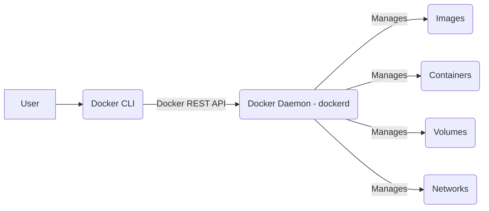
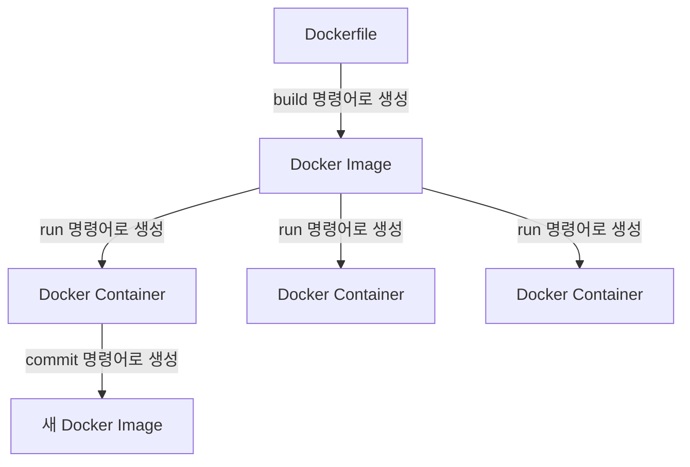

## 2.1 Docker의 탄생 배경과 역사

컨테이너라는 개념 자체는 Docker 이전에도 존재했습니다. 유닉스 계열 시스템의 `chroot` 명령어를 시작으로 FreeBSD의 Jails, Solaris의 Zones, 그리고 Linux의 LXC(Linux Containers) 등 운영체제 수준의 격리 기술은 꾸준히 발전해왔습니다. 하지만 이러한 기술들은 사용법이 복잡하고 표준화되지 않아 특정 전문가 그룹 외에는 널리 활용되기 어려웠습니다.

이러한 상황 속에서 **2013년, 솔로몬 하이크스(Solomon Hykes)** 가 PaaS(Platform as a Service) 기업 **dotCloud**의 내부 프로젝트로 개발하던 기술을 **Docker** 라는 이름으로 오픈소스로 공개하면서 컨테이너 기술의 대중화 시대가 열렸습니다. Docker가 폭발적인 인기를 얻게 된 이유는 다음과 같습니다.

* 😊**사용 편의성:** 기존의 LXC 같은 기술보다 훨씬 간결하고 직관적인 커맨드 라인 인터페이스(CLI)를 제공하여 개발자들이 쉽게 컨테이너를 생성, 실행, 관리할 수 있게 했습니다.
* 📦**이미지(Image) 개념 도입:** 애플리케이션 실행에 필요한 모든 것(코드, 런타임, 라이브러리, 환경 변수, 설정 파일 등)을 포함하는 **이미지** 라는 개념을 도입하고, 이를 쉽게 만들고 공유할 수 있는 `Dockerfile`이라는 명세 방식을 제시했습니다. 이로 인해 애플리케이션의 이식성이 획기적으로 향상되었습니다.
* 🏘️**생태계 조성 (Docker Hub):** 이미지를 저장하고 공유할 수 있는 중앙 저장소인 **Docker Hub** 를 제공함으로써, 개발자들은 필요한 소프트웨어가 미리 구성된 이미지를 쉽게 찾아 사용하거나 자신이 만든 이미지를 공유할 수 있게 되었습니다. 이는 마치 소스 코드를 위한 GitHub처럼, 컨테이너 이미지 생태계의 폭발적인 성장을 이끌었습니다.
* ✅**표준화:** Docker는 컨테이너 기술의 사실상 표준(de facto standard)으로 자리 잡으며, 컨테이너를 빌드하고, 배포하고, 실행하는 방식을 통일시켰습니다.

이후 Docker는 컨테이너 기술의 핵심 부분을 오픈소스 커뮤니티와 함께 발전시키기 위해 **OCI(Open Container Initiative)** 같은 표준화 기구 설립에 기여하고, 핵심 실행 엔진 부분을 `containerd`, `runc` 등으로 분리하여 [Moby 프로젝트](https://mobyproject.org/)라는 이름 아래 개방형으로 관리하는 등 지속적으로 발전하고 있습니다. 덕분에 Docker는 특정 회사에 종속되지 않고 업계 표준 기술로서 더욱 견고하게 자리매김하게 되었습니다.

<Note>Moby는 Docker에서 소프트웨어 컨테이너화를 활성화하고 가속하기 위해 만든 오픈소스 프로젝트입니다</Note>

## 2.2 Docker의 핵심 개념 소개

Docker를 효과적으로 사용하기 위해서는 몇 가지 핵심 개념을 정확히 이해하는 것이 중요합니다. 마치 요리를 배우기 전에 기본적인 조리 도구와 재료의 용도를 알아야 하는 것과 같습니다.

### 2.2.1 Docker 엔진 (Engine)

**Docker 엔진** 은 컨테이너를 생성하고 실행하며 관리하는 핵심 소프트웨어입니다. 사용자의 명령을 받아 이미지 생성, 컨테이너 실행, 네트워킹, 스토리지 관리 등 Docker의 모든 작업을 실제로 수행하는 주체입니다. 일반적으로 Docker 엔진은 다음과 같은 주요 컴포넌트로 구성됩니다.

* **Docker 데몬 (Docker Daemon, `dockerd`):** 백그라운드에서 실행되는 서비스(프로세스)입니다. 이미지, 컨테ainer, 네트워크, 볼륨과 같은 Docker 객체를 관리하는 실질적인 작업을 수행합니다. 외부의 API 요청을 수신하고 처리합니다.
* **REST API:** Docker 데몬과 상호작용하기 위한 표준 인터페이스입니다. Docker CLI 클라이언트뿐만 아니라 다른 애플리케이션에서도 이 API를 통해 Docker 데몬을 제어할 수 있습니다.
* **Docker CLI (Command Line Interface):** 사용자가 터미널에서 Docker와 상호작용하기 위해 사용하는 클라이언트 도구입니다. 사용자가 `docker run`, `docker build` 같은 명령어를 입력하면, CLI는 이 명령을 REST API를 통해 Docker 데몬에게 전달하고 그 결과를 사용자에게 보여줍니다.

*\<center\>그림 2-1: Docker 엔진 구성 요소 관계\</center\>*

**비유:** Docker 엔진은 자동차의 **엔진**과 같습니다. 자동차(컨테이너)가 움직이도록(실행되도록) 실제 동력을 제공하고 모든 부품(이미지, 네트워크 등)을 관리하는 핵심 역할을 합니다. 또는, 컨테이너라는 제품을 만들고 관리하는 **공장 관리자** 에 비유할 수도 있습니다.

### 2.2.2 이미지 (Image)

Docker 이미지는 컨테이너를 생성하기 위한 **읽기 전용 템플릿(Read-only Template)** 입니다. 컨테이너를 실행하는 데 필요한 모든 것, 즉 애플리케이션 코드, 필요한 라이브러리 및 종속성, 실행 환경(런타임), 시스템 도구, 환경 설정 등을 포함하고 있습니다.

이미지는 여러 개의 **레이어(Layer)** 로 구성됩니다. Dockerfile의 각 명령어는 새로운 레이어를 생성할 수 있으며, 이미지를 빌드할 때 이 레이어들이 순서대로 쌓여 최종 이미지를 형성합니다. 이러한 레이어 구조는 다음과 같은 장점을 갖습니다.

* ⚡**효율성:** 여러 이미지가 동일한 베이스 레이어(예: Ubuntu OS 레이어)를 공유할 수 있어 디스크 공간을 절약합니다.
* ♻️**재사용성:** 이미지 빌드 시 변경되지 않은 레이어는 캐시되어 재사용되므로 빌드 속도가 빨라집니다.
* 🔢**버전 관리:** 레이어 구조 덕분에 이미지의 변경 이력을 추적하고 관리하기 용이합니다.

<Note>비유적으로 Docker 이미지는 집을 짓기 위한 **설계도(Blueprint)** , 쿠키를 찍어내는 **쿠키 틀(Cookie Cutter)** , 또는 객체 지향 프로그래밍에서의 **클래스(Class)** 와 같습니다. 그 자체로는 실행되지 않지만, 실행 가능한 실제(컨테이너)를 만드는 데 필요한 모든 정보를 담고 있는 틀입니다.</Note>

예를 들어, `nginx` 이미지는 웹 서버 Nginx를 실행하는 데 필요한 모든 파일과 설정을 포함하고 있으며, `node:18-alpine` 이미지는 Node.js 18 버전 런타임과 Alpine Linux 기반의 최소한의 운영체제 파일을 포함하고 있습니다.

### 2.2.3 컨테이너 (Container)

Docker 컨테이너는 Docker 이미지의 **실행 가능한 인스턴스(Runnable Instance)** 입니다. 즉, 이미지를 기반으로 실제로 메모리에 로드되어 실행되는 상태를 의미합니다. 이미지라는 설계도를 바탕으로 지어진 **집**, 쿠키 틀로 찍어낸 **쿠키**, 클래스로부터 생성된 **객체(Object) 또는 인스턴스(Instance)** 에 해당합니다.

하나의 이미지로부터 여러 개의 독립적인 컨테이너를 생성할 수 있습니다. 각 컨테이너는 이미지의 파일 시스템 위에 **쓰기 가능한 레이어(Writable Layer)** 를 추가하여 실행 중에 생성되거나 변경되는 데이터를 저장합니다. 컨테이너는 호스트 OS의 커널을 공유하지만, 자체적인 격리된 환경(파일 시스템, 프로세스, 네트워크)을 가지므로 다른 컨테이너나 호스트 시스템에 영향을 주지 않고 독립적으로 실행됩니다.

컨테이너는 매우 가볍고 빠르게 시작되며, 애플리케이션과 그 종속성을 패키징하여 어디서든 동일하게 실행될 수 있도록 보장합니다.

### 2.2.4 레지스트리 (Registry)

Docker 레지스트리는 Docker 이미지를 **저장하고 배포(공유)하는 시스템** 입니다. 이미지를 빌드한 후, 이 레지스트리에 업로드(`push`)하여 다른 사람과 공유하거나 다른 환경에서 다운로드(`pull`)하여 사용할 수 있습니다.

* **Docker Hub:** Docker 사에서 제공하는 **기본 공개 레지스트리**입니다. 수많은 공식 이미지(예: Ubuntu, Nginx, Node.js, MySQL 등)와 사용자들이 직접 만들어 올린 다양한 이미지가 저장되어 있습니다. GitHub가 소스 코드의 저장소 역할을 하는 것처럼, Docker Hub는 Docker 이미지의 저장소 역할을 합니다. 계정을 만들면 누구나 이미지를 올리고 받을 수 있으며, 비공개(Private) 저장소 기능도 제공합니다.
* **Private Registry:** 보안상의 이유나 내부 정책으로 인해 이미지를 외부에 공개하고 싶지 않을 경우, 자체 서버에 직접 레지스트리를 구축하거나 클라우드 서비스 제공업체(예: AWS ECR, Google GCR, Azure ACR, GitHub Packages, GitLab Container Registry 등)에서 제공하는 프라이빗 레지스트리 서비스를 사용할 수 있습니다.

<Note>레지스트리는 Docker 이미지들을 모아 놓은 **앱 스토어(App Store)** 또는 설계도들을 보관하는 **도서관(Library)** 과 같습니다. 필요한 이미지를 찾아 다운로드하고, 내가 만든 이미지를 업로드하여 보관하거나 공유하는 곳입니다.</Note>

### 2.2.5 Dockerfile

Dockerfile은 Docker 이미지를 **자동으로 빌드하기 위한 명령어가 순서대로 나열된 텍스트 파일**입니다. 개발자는 이 파일에 어떤 베이스 이미지를 사용할지, 어떤 파일을 이미지에 복사할지, 어떤 소프트웨어를 설치할지, 어떤 환경 변수를 설정할지, 그리고 컨테이너가 시작될 때 어떤 명령어를 실행할지 등을 명시합니다. Docker 엔진은 이 `Dockerfile`을 읽어들여 그 지침에 따라 순차적으로 레이어를 쌓아 최종 이미지를 생성합니다.

<Note>Dockerfile은 맛있는 케이크(이미지)를 만들기 위한 상세한 **레시피(Recipe)** 또는 설계도(이미지)에 포함된 구체적인 **건축 시공 지침서**와 같습니다. 이미지 제작 과정을 코드처럼 명확하게 정의하고 재현 가능하게 만들어 줍니다.</Note>

## 2.3 Docker 생태계 둘러보기

Docker는 단순히 엔진, 이미지, 컨테이너 개념에만 국한되지 않고, 컨테이너 기술을 더 편리하고 강력하게 활용할 수 있도록 돕는 다양한 도구와 플랫폼으로 구성된 풍부한 생태계를 가지고 있습니다. 웹 개발자에게 특히 유용한 몇 가지 도구는 다음과 같습니다.

* **Docker Desktop:** Windows 및 macOS 사용자를 위한 Docker 설치 프로그램입니다. Docker 엔진, Docker CLI 클라이언트뿐만 아니라, Docker Compose, Kubernetes(선택 사항) 등 개발에 필요한 여러 도구들을 함께 패키징하여 제공합니다. 복잡한 설정 없이 로컬 개발 환경에서 Docker를 쉽게 사용할 수 있도록 도와줍니다. (Windows에서는 WSL2, macOS에서는 HyperKit 또는 Virtualization Framework 같은 가상화 기술을 내부적으로 활용합니다.)
* **Docker Compose:** 여러 개의 컨테이너로 구성된 애플리케이션을 정의하고 실행하기 위한 도구입니다. `docker-compose.yml`이라는 YAML 파일을 사용하여 여러 서비스(컨테이너)의 설정(이미지, 포트, 볼륨, 네트워크 등)과 서비스 간의 의존성을 한 곳에서 관리할 수 있습니다. 예를 들어, 웹 서버 컨테이너, API 서버 컨테이너, 데이터베이스 컨테이너를 함께 띄워야 하는 복잡한 애플리케이션 개발 환경을 `docker-compose up` 명령어 하나로 쉽게 구축하고 관리할 수 있게 해줍니다. 이 문서의 뒷부분(Part 3)에서 매우 중요하게 다룰 예정입니다.
* **Container Orchestration:** Docker Swarm이나 Kubernetes(K8s) 같은 도구들은 개발 단계를 넘어, 실제 운영 환경에서 수많은 컨테이너를 효율적으로 관리하기 위한 **오케스트레이션** 기능을 제공합니다. 컨테이너의 자동 배포, 스케일링(확장/축소), 네트워킹 설정, 로드 밸런싱, 고가용성 확보 등 복잡한 운영 작업을 자동화하고 단순화해줍니다. 이 문서에서는 오케스트레이션 도구 자체를 깊이 다루지는 않지만(Part 6에서 간단히 소개), Docker 기술이 실제 서비스 운영으로 확장될 때 이러한 도구들이 중요한 역할을 한다는 점을 알아두는 것이 좋습니다.
