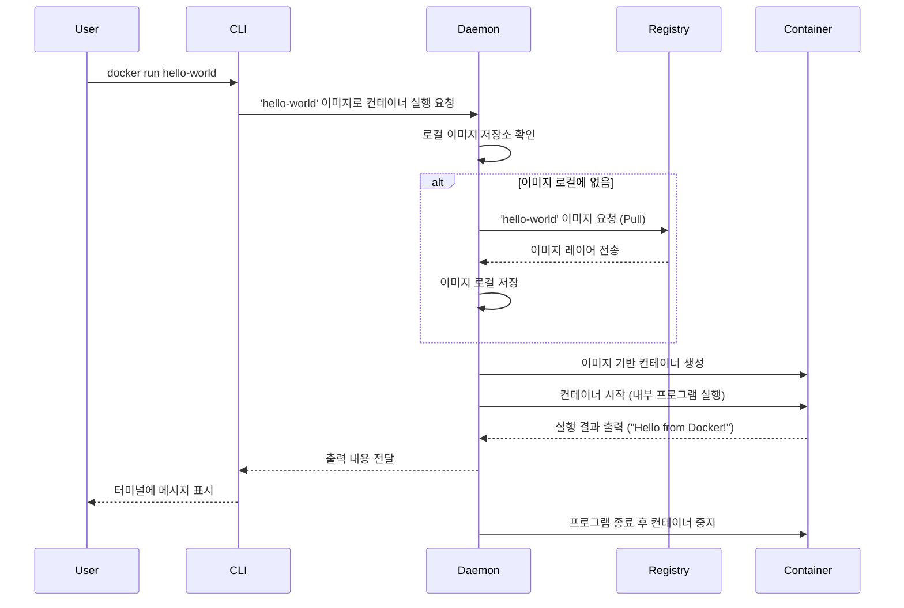
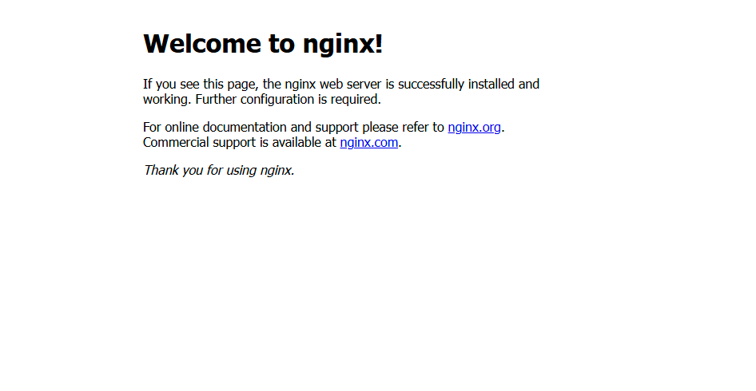

축하합니다\! 이전 챕터를 통해 여러분의 개발 환경에 Docker를 성공적으로 설치했습니다. 이제 이론적인 배경을 넘어, 실제로 Docker 명령어를 입력하고 컨테이너가 실행되는 마법 같은 순간을 경험해 볼 차례입니다.

이번 챕터에서는 가장 기본적인 Docker 명령어를 사용하여 미리 만들어진 이미지를 통해 첫 컨테이너를 실행해 봅니다. "Hello World" 예제를 통해 Docker의 핵심 동작 원리를 다시 한번 확인하고, 이어서 간단한 웹 서버(Nginx) 컨테이너를 실행하여 포트 포워딩과 같은 실용적인 개념까지 맛볼 것입니다. Docker와의 첫 만남이 즐거운 경험이 될 수 있도록 차근차근 진행해 보겠습니다.


## 4.1 첫 컨테이너 실행하기

Chapter 3에서 설치를 확인하기 위해 이미 사용해 본 `docker run hello-world` 명령어를 다시 한번 실행해 봅시다. 이번에는 단순히 성공 여부를 확인하는 것을 넘어, 이 명령 하나에 담긴 Docker의 핵심 작동 과정을 자세히 이해하는 데 초점을 맞추겠습니다.

터미널을 열고 다음 명령어를 입력하세요. (Linux 사용자는 필요시 앞에 `sudo`를 붙이거나, 이전 챕터에서 설명한 대로 사용자 그룹 설정을 완료해야 합니다.)

```bash
docker run hello-world
```

명령어를 실행하면 터미널에 다음과 유사한 메시지가 출력될 것입니다.

```bash
Hello from Docker!
This message shows that your installation appears to be working correctly.

To generate this message, Docker took the following steps:
 1. The Docker client contacted the Docker daemon.
 2. The Docker daemon pulled the "hello-world" image from the Docker Hub.
    (amd64)
 3. The Docker daemon created a new container from that image which runs the
    executable that produces the output you are currently reading.
 4. The Docker daemon streamed that output to the Docker client, which sent it
    to your terminal.
```

이 간단한 명령어 뒤에서는 다음과 같은 일련의 과정이 자동으로 진행됩니다.

1. **클라이언트-데몬 통신:** 사용자가 입력한 `docker run hello-world` 명령을 Docker CLI(클라이언트)가 받아서 Docker 데몬(서버)에게 전달합니다.
2. **로컬 이미지 확인:** Docker 데몬은 로컬 시스템(자신의 이미지 저장소)에 `hello-world`라는 이름의 이미지가 이미 다운로드되어 있는지 확인합니다.
3. **이미지 다운로드 (Pull):** 만약 로컬에 이미지가 없다면, Docker 데몬은 설정된 기본 레지스트리(보통 Docker Hub)에 접속하여 `hello-world` 이미지를 검색하고 다운로드합니다. 이미지 이름 뒤에 특정 태그(버전)를 명시하지 않으면 기본적으로 `:latest` 태그가 붙은 이미지를 찾습니다. 이미지 다운로드는 여러 개의 레이어(layer) 단위로 진행될 수 있습니다.
4. **컨테이너 생성:** 다운로드한 `hello-world` 이미지를 기반으로 새로운 컨테이너를 생성합니다. 이미지는 읽기 전용 템플릿이고, 컨테이너는 이 템플릿으로부터 생성된 실제 실행 인스턴스입니다.
5. **컨테이너 실행:** 생성된 컨테이너 내부에서 `hello-world` 이미지에 정의된 실행 파일(프로그램)을 실행합니다. 이 프로그램은 "Hello from Docker\!" 메시지와 함께 위에서 설명한 단계들을 화면에 출력하도록 만들어져 있습니다.
6. **출력 전달 및 종료:** 컨테이너 내부에서 실행된 프로그램의 출력 결과가 Docker 데몬을 통해 Docker 클라이언트로 전달되고, 최종적으로 사용자의 터미널 화면에 표시됩니다. `hello-world` 프로그램은 메시지 출력이 끝나면 바로 종료되며, 이에 따라 컨테이너도 중지(Exited) 상태가 됩니다.

이 `docker run hello-world` 명령은 Docker의 가장 기본적인 작업 흐름, 즉 **이미지 가져오기(Pull) → 컨테이너 생성(Create) → 컨테이너 실행(Run)** 사이클을 명확하게 보여줍니다.




## 4.2 이미지 미리 받아보기: `docker pull`

`docker run` 명령어는 로컬에 이미지가 없을 때 자동으로 이미지를 다운로드하는 편리한 기능을 제공합니다. 하지만 때로는 컨테이너를 실행하기 전에 필요한 이미지를 미리 다운로드하고 싶을 수 있습니다. 예를 들어, 이미지 크기가 매우 크거나 네트워크 상태가 불안정할 때, 또는 특정 버전의 이미지를 미리 확보해 놓고 싶을 때 유용합니다. 이때 사용하는 명령어가 `docker pull` 입니다.

다음 명령어를 사용하여 Nginx 웹 서버 이미지를 미리 다운로드해 봅시다.

```bash
docker pull nginx
```

명령어를 실행하면 Docker 데몬이 Docker Hub에서 `nginx` 이미지(정확히는 `nginx:latest` 이미지)를 찾아 다운로드하는 과정이 터미널에 표시됩니다. 여러 개의 레이어가 병렬 또는 순차적으로 다운로드되는 것을 볼 수 있습니다.

```
Using default tag: latest
latest: Pulling from library/nginx
a2abf6c4d29d: Pull complete
a9edb18cadd1: Pull complete
589b7251471a: Pull complete
1ae07a135341: Pull complete
Nginx Image Layers Downloading... (실제 출력은 다를 수 있습니다)
Digest: sha256:......
Status: Downloaded newer image for nginx:latest
docker.io/library/nginx:latest
```

이제 `nginx` 이미지가 로컬 시스템에 저장되었으므로, 이후 `docker run nginx ...` 명령을 실행하면 다시 이미지를 다운로드하지 않고 바로 로컬 이미지를 사용하여 컨테이너를 생성하고 실행하게 됩니다.


## 4.3 간단한 웹 서버 컨테이너 실행해보기

`hello-world`는 Docker가 잘 작동하는지 확인하는 좋은 방법이었지만, 실제 애플리케이션과는 거리가 멉니다. 이제 웹 개발자에게 좀 더 친숙하고 실용적인 예제로 넘어가 봅시다. 경량 고성능 웹 서버인 Nginx를 컨테이너로 실행해 보겠습니다.

터미널에 다음 명령어를 입력하세요.

```bash
docker run --name my-nginx -d -p 8080:80 nginx
# 출력: 0c18a321178d09573c40e2d5c09dc94b7838f982ffe1223878b6434dd1a12d85 (컨테이너 ID)
```

명령어가 성공적으로 실행되면 긴 문자열 형태의 컨테이너 ID가 출력될 것입니다. 이 명령어는 `hello-world` 예제보다 조금 더 복잡해 보이는데, 각 부분이 어떤 의미인지 자세히 살펴보겠습니다.

* `docker run`: 컨테이너를 생성하고 실행하는 기본 명령어입니다.
* `--name my-nginx`: 생성되는 컨테이너에 `my-nginx`라는 사람이 식별하기 쉬운 **이름을 지정**합니다. 이름을 지정하지 않으면 Docker가 임의의 재미있는 이름(예: `vigilant_murdock`)을 자동으로 붙여줍니다. 이름을 지정하면 나중에 컨테이너를 관리(중지, 삭제 등)할 때 편리합니다.
* `-d` 또는 `--detach`: 컨테이너를 **백그라운드(Detached mode)에서 실행** 하도록 지정합니다. 웹 서버처럼 오랫동안 실행되어야 하는 서비스는 백그라운드에서 실행하는 것이 일반적입니다. 이 옵션이 없으면 터미널이 Nginx 서버의 로그 출력에 계속 연결되어 있어 다른 작업을 할 수 없게 됩니다. `-d` 옵션을 사용하면 컨테이너 ID만 출력하고 터미널은 다시 사용 가능한 상태가 됩니다.
* `-p 8080:80` 또는 `--publish 8080:80`: **포트 포워딩(Port Forwarding) 또는 포트 매핑(Port Mapping)** 설정입니다. 컨테이너 외부(호스트 머신)의 포트와 컨테이너 내부의 포트를 연결하는 중요한 기능입니다.
  * `8080`: 콜론(:) 앞의 숫자는 **호스트 머신의 포트 번호**입니다. 즉, 우리가 웹 브라우저 등 외부에서 컨테이너 내부의 서비스에 접속하기 위해 사용할 포트입니다.
  * `80`: 콜론(:) 뒤의 숫자는 **컨테이너 내부에서 서비스가 리슨(listen)하는 포트 번호** 입니다. Nginx 웹 서버는 기본적으로 컨테이너 내부의 80번 포트에서 웹 요청을 기다립니다.
  * 따라서 `-p 8080:80`은 호스트 머신의 8080번 포트로 들어오는 요청을 컨테이너 내부의 80번 포트로 전달하라는 의미입니다.
  * **비유:** 사무실의 대표 전화번호(호스트 포트 `8080`)로 전화하면 특정 내선번호(컨테이너 포트 `80`)를 가진 담당자에게 연결해주는 것과 비슷합니다. 호스트 포트는 여러분의 PC나 서버에서 사용 중이지 않은 다른 포트(예: `8888`)로 변경할 수도 있습니다 (`-p 8888:80`).
* `nginx`: 실행할 컨테이너의 기반이 되는 **이미지 이름**입니다. 4.2에서 `docker pull nginx`를 실행했다면 로컬 이미지를 사용할 것이고, 아니라면 Docker Hub에서 자동으로 이미지를 다운로드한 후 컨테이너를 실행합니다.

**실행 확인:**



이제 웹 브라우저를 열고 주소창에 `http://localhost:8080` 을 입력해 보세요. (만약 Docker를 원격 서버에 설치했다면 `localhost` 대신 해당 서버의 IP 주소를 입력해야 합니다.)

"Welcome to nginx\!" 라는 메시지가 담긴 Nginx 기본 환영 페이지가 보인다면 성공입니다\! 여러분은 방금 Docker 컨테이너로 웹 서버를 실행하고, 포트 포워딩을 통해 호스트 머신에서 해당 웹 서버에 접속하는 데 성공했습니다.

**컨테이너 중지 및 삭제:**

실행한 Nginx 컨테이너를 중지하고 싶다면 다음 명령어를 사용합니다.

```bash
docker stop my-nginx
# 출력: my-nginx (컨테이너 이름)
```

더 이상 필요하지 않아 완전히 삭제하고 싶다면 다음 명령어를 사용합니다. (중지된 상태에서만 삭제 가능)

```bash
docker rm my-nginx
# 출력: my-nginx (컨테이너 이름)
```
