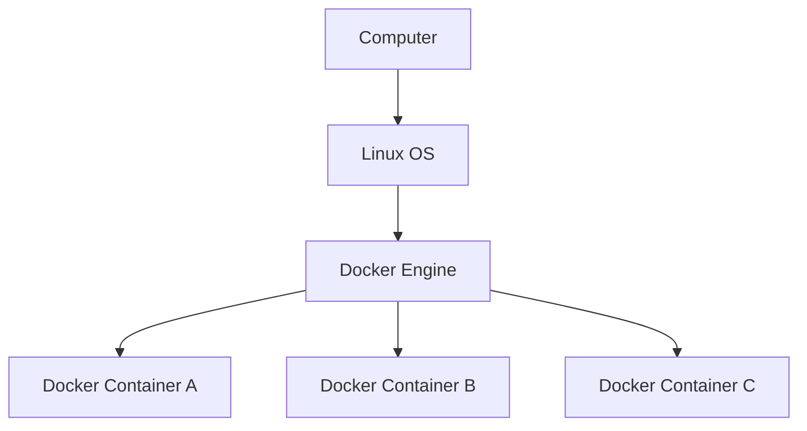

# Docker

> [!NOTE]
>
> 도커는 리눅스 운영체제 및 64비트 운영체제에서 동작한다

- 도커 엔진: 컨테이너를 생성하거나 구동시키기 위한 소프트웨어(리눅스 이외의 windows,macOS 운영체제도 지원)
- 이미지: 컨테이너를 만들기 위해 소스 코드를 포함하는 일종의 틀
- 컨테이너: 이미지를 통해 만들어 내는 일종의 인스턴스

- 독립된 환경: 서버 환경을 격리시키기 위해 사용 -> 어느 환경에서나 동작을 보장
- 이미지 재사용와 레지스트리를 통한 공유: 어디서나 쉽게 다운로드 받아 사용 할 수 있다
- 도커 허브: 대부분의 이미지들은 이미 **도커 허브**에 준비되어 있다(공식 이미지를 사용하는 것이 좋다)
- 컨테이너 생애주기(컨테이너는 영구적이지 않다): 소프트웨어 업데이트 등의 상황에서 컨테이너를 계속 업데이트 하기 보다는 이미지를 새로 만들고 컨테이너를 다시 생성한다.
- Volumes: 도커 컨테이너에서 생성되고 사용되는 데이터를 지속하기 위한 메커니즘으로 호스트 머신의 볼륨을 컨테이너에 마운트하여 사용할 수 있다.(https://docs.docker.com/engine/storage/volumes/)

### 도커의 단점

- 도커 사용을 위해 리눅스가 필수이다.(당연히 리눅스 사용법을 알아야 한다)
- 호스트 서버의 문제가 모든 컨테이너에 영향을 미칠 수 있다