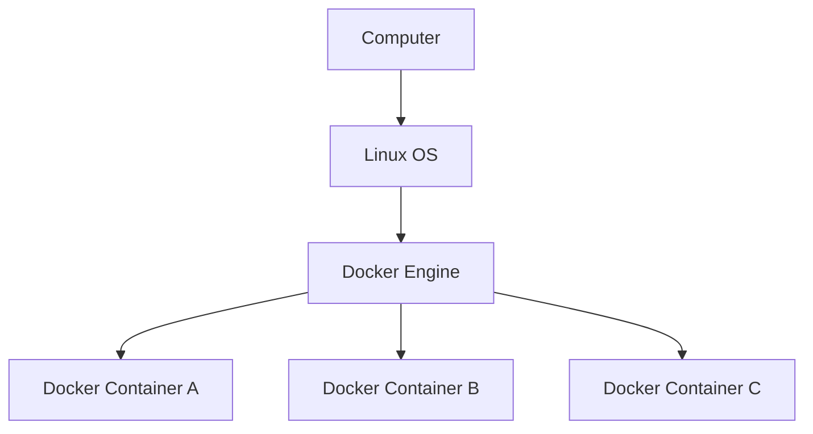

<Note>도커는 리눅스 운영체제 및 64비트 운영체제에서 동작한다</Note>

- 도커 엔진: 컨테이너를 생성하거나 구동시키기 위한 소프트웨어(리눅스 이외의 windows,macOS 운영체제도 지원)
- 이미지: 컨테이너를 만들기 위해 소스 코드를 포함하는 일종의 틀
- 컨테이너: 이미지를 통해 만들어 내는 일종의 인스턴스




## 도커의 장점

- **이식성:** 어디서든 동일하게 실행되는 환경을 보장합니다.
- **격리성:** 각 애플리케이션을 독립된 환경에서 실행하여 충돌을 방지합니다.
- **효율성:** 가상 머신(VM)보다 가볍고 빠르게 실행됩니다.
- **확장성:** 필요에 따라 컨테이너 수를 쉽게 늘리거나 줄일 수 있습니다.
- **협업 용이성:** 동일한 환경을 쉽게 공유하여 개발 및 테스트 효율을 높입니다.

- 도커 허브: 대부분의 이미지들은 이미 **도커 허브**에 준비되어 있다(공식 이미지를 사용하는 것이 좋다)
- 컨테이너 생애주기(컨테이너는 영구적이지 않다): 소프트웨어 업데이트 등의 상황에서 컨테이너를 계속 업데이트 하기 보다는 이미지를 새로 만들고 컨테이너를 다시 생성한다.
- Volumes: 도커 컨테이너에서 생성되고 사용되는 데이터를 지속하기 위한 메커니즘으로 호스트 머신의 볼륨을 컨테이너에 마운트하여 사용할 수 있다.[https://docs.docker.com/engine/storage/volumes/](https://docs.docker.com/engine/storage/volumes/)


## 도커의 단점

- 도커 사용을 위해 리눅스가 필수이다.(당연히 리눅스 사용법을 알아야 한다)
- 호스트 서버의 문제가 모든 컨테이너에 영향을 미칠 수 있다


## 1. Docker 설치 (Installation)

Docker를 사용하기 위한 첫 단계는 시스템에 Docker를 설치하는 것입니다.

- **Docker Desktop (Mac, Windows, Linux GUI):** 개발 환경에 가장 적합한 버전입니다. 사용자 친화적인 인터페이스와 함께 Docker Engine, Docker CLI 클라이언트, Docker Compose 등을 포함합니다.
  - [Docker Desktop 다운로드 및 설치 가이드](https://docs.docker.com/desktop/)
  - *설치 전 시스템 요구 사항을 반드시 확인하세요.*
- **Docker Engine (Linux Server):** 주로 서버 환경에서 사용됩니다. CLI를 통해 Docker를 관리합니다.
  - [Linux 배포판별 설치 가이드](https://docs.docker.com/engine/install/)
- **Docker 예제 프로젝트:** Docker를 활용한 다양한 애플리케이션 구성 예제를 참고할 수 있습니다.
  - [Awesome Compose (GitHub)](https://github.com/docker/awesome-compose)
- **공식 문서:** Docker에 대한 가장 정확하고 상세한 정보를 제공합니다.
  - [Docker 공식 문서](https://docs.docker.com)

---


## 2. Docker 핵심 개념 (Core Concepts)

Docker를 효과적으로 사용하기 위해 알아야 할 핵심 개념들입니다.


### 2.1. 이미지 (Images)

- 애플리케이션 실행에 필요한 모든 것(코드, 런타임, 라이브러리, 환경 변수, 설정 파일 등)을 포함하는 **읽기 전용 템플릿**입니다.
- 마치 클래스(Class)와 같으며, 이 이미지를 기반으로 컨테이너(인스턴스)를 생성합니다.
- 이미지는 **레이어(Layer)** 구조로 되어 있어 효율적인 빌드와 배포가 가능합니다. Dockerfile의 각 명령어는 하나의 레이어를 생성할 수 있습니다.


### 2.2. 컨테이너 (Containers)

- Docker 이미지의 **실행 가능한 인스턴스**입니다. 이미지라는 템플릿을 사용하여 실제로 애플리케이션을 실행하는 독립된 환경입니다.
- 마치 객체(Object)/인스턴스(Instance)와 같습니다. 하나의 이미지로 여러 개의 컨테이너를 생성할 수 있습니다.
- 컨테이너는 호스트 시스템 및 다른 컨테이너와 격리되어 실행됩니다.
- 기본적으로 컨테이너가 삭제되면 내부 데이터도 함께 사라집니다 (Stateless). 데이터 영속성을 위해서는 **볼륨(Volume)** 을 사용해야 합니다.


### 2.3. Dockerfile

- Docker 이미지를 어떻게 빌드할지 정의하는 **텍스트 파일**입니다.
- 어떤 베이스 이미지(Base Image)를 사용할지, 어떤 파일을 복사할지, 어떤 명령어를 실행할지, 어떤 포트를 열지 등을 명시합니다.
- 주요 명령어:
  - `FROM`: 베이스 이미지를 지정합니다.
  - `WORKDIR`: 작업 디렉토리를 설정합니다.
  - `COPY` 또는 `ADD`: 파일이나 디렉토리를 이미지 내부로 복사합니다.
  - `RUN`: 이미지 빌드 과정에서 명령어를 실행합니다 (예: 패키지 설치).
  - `CMD` 또는 `ENTRYPOINT`: 컨테이너가 시작될 때 실행될 기본 명령어를 설정합니다.
  - `EXPOSE`: 컨테이너가 사용할 포트를 명시합니다. (실제 포트 매핑은 `docker run -p` 옵션으로 수행)
  - `ENV`: 환경 변수를 설정합니다.


### 2.4. 레지스트리 (Registry) / Docker Hub

- Docker 이미지를 저장하고 공유하는 **저장소**입니다.
- **Docker Hub**는 Docker 사에서 제공하는 기본 공개 레지스트리이며, 수많은 공식 및 비공식 이미지가 저장되어 있습니다.
  - [Docker Hub](https://hub.docker.com/)
- 기업 내부용이나 자체 관리를 위해 Private Registry를 구축하여 사용할 수도 있습니다 (예: Harbor, AWS ECR, Google GCR, Azure ACR).


### 2.5. 볼륨 (Volumes)

- 컨테이너의 데이터를 **호스트 시스템이나 외부 스토리지에 영속적으로 저장**하기 위한 메커니즘입니다.
- 컨테이너가 삭제되어도 데이터는 보존됩니다.
- 여러 컨테이너 간에 데이터를 공유하는 데 사용될 수 있습니다.
- Docker가 관리하는 영역에 데이터를 저장하여 백업이나 마이그레이션이 용이합니다. (`docker run -v` 또는 `--mount` 옵션 사용)


### 2.6. 네트워크 (Networks)

- 컨테이너들이 서로 통신하거나 외부와 통신할 수 있도록 **네트워크 환경을 제공**합니다.
- Docker는 기본적으로 `bridge`, `host`, `none` 등의 네트워크 드라이버를 제공하며, 사용자 정의 네트워크를 생성하여 컨테이너들을 논리적으로 그룹화하고 격리할 수 있습니다.
- 같은 네트워크에 속한 컨테이너들은 컨테이너 이름을 사용하여 서로 통신할 수 있습니다. (`docker run --network` 옵션 사용)


### 2.7. 도커 컴포즈 (Docker Compose)

- **여러 개의 컨테이너**로 구성된 애플리케이션을 정의하고 실행하기 위한 도구입니다.
- `docker-compose.yml` 파일을 사용하여 서비스(컨테이너), 네트워크, 볼륨 등을 정의하고, 단일 명령어로 전체 애플리케이션 스택을 관리할 수 있습니다. (예: 웹 서버, 데이터베이스, 캐시 서버 동시 실행)

---


## 3. 이미지 관련 명령어 (Working with Images)

Docker 이미지를 관리하는 주요 명령어입니다.


### 3.1. 이미지 빌드 (`docker build`)

- **Dockerfile을 사용하여 새로운 이미지를 생성합니다.**

    ```bash
    # 현재 디렉토리의 Dockerfile을 사용하여 'my-app:1.0' 이름과 태그로 이미지 빌드
    docker build -t my-app:1.0 .

    # 특정 Dockerfile 지정하여 빌드
    docker build -f /path/to/MyDockerfile -t my-app:latest .

    # 빌드 캐시 사용하지 않고 빌드 (매번 새로 빌드)
    docker build --no-cache -t my-app:latest .

    # 빌드 시 인수 전달
    docker build --build-arg USER=myuser -t my-app:latest .
    ```

  - `-t <repository_name>:<tag>`: 이미지 이름과 태그를 지정합니다. 태그를 생략하면 기본값인 `latest`가 사용됩니다.
  - `.` (마지막 인수): 빌드 컨텍스트(Dockerfile 및 빌드에 필요한 파일들이 있는 경로)를 지정합니다. 보통 현재 디렉토리를 의미합니다.
  - `--no-cache`: 이미지 빌드 시 레이어 캐시를 사용하지 않습니다.
  - `--build-arg`: Dockerfile 내의 `ARG` 명령어로 정의된 변수에 값을 전달합니다.


### 3.2. 로컬 이미지 목록 보기 (`docker images`)

- **로컬 시스템에 저장된 이미지 목록을 확인합니다.**

    ```bash
    docker images

    # 특정 레포지토리의 이미지 필터링
    docker images ubuntu

    # Dangling 이미지(이름과 태그가 없는 중간 레이어 이미지)만 표시
    docker images -f dangling=true
    ```


### 3.3. 이미지 태그 지정 (`docker tag`)

- **기존 이미지에 새로운 이름이나 태그를 부여합니다.** 주로 Docker Hub 등에 푸시하기 전에 사용됩니다.

    ```bash
    # 'my-app:1.0' 이미지를 'myusername/my-app:1.0'으로 태그 지정
    docker tag my-app:1.0 myusername/my-app:1.0

    # 'my-app:1.0' 이미지를 'my-app:stable' 태그로도 지정
    docker tag my-app:1.0 my-app:stable
    ```


### 3.4. 이미지 삭제 (`docker rmi` 및 `docker image prune`)

- **로컬 시스템에서 하나 이상의 이미지를 삭제합니다.** 해당 이미지를 사용하는 컨테이너가 없어야 삭제 가능합니다.

    ```bash
    # 특정 이미지 삭제 (이름:태그 또는 이미지 ID 사용)
    docker rmi my-app:1.0
    docker rmi <image_id>

    # 강제 삭제 (실행 중인 컨테이너가 참조해도 삭제 시도) - 주의해서 사용!
    docker rmi -f <image_id>
    ```

- **사용되지 않는 이미지(Dangling 이미지) 모두 삭제:**

    ```bash
    docker image prune

    # 사용되지 않는 모든 이미지(태그가 있지만 컨테이너에서 사용되지 않는 이미지 포함) 삭제 - 주의!
    docker image prune -a
    ```

---


## 4. 컨테이너 관련 명령어 (Working with Containers)

Docker 컨테이너를 생성, 실행, 관리하는 주요 명령어입니다.


### 4.1. 컨테이너 생성 및 실행 (`docker run`)

- **이미지를 기반으로 새로운 컨테이너를 생성하고 시작합니다.** 가장 많이 사용되고 옵션이 많은 명령어 중 하나입니다.

    ```bash
    # 'ubuntu:latest' 이미지로 컨테이너 실행 후 기본 명령어 실행 (보통 bash 셸)
    # -it: 대화형(interactive) TTY 모드로 실행 (셸 사용 시 필수)
    docker run -it ubuntu

    # 컨테이너에 'my-ubuntu-container' 이름 부여
    docker run -it --name my-ubuntu-container ubuntu

    # 백그라운드에서 컨테이너 실행 (Detached 모드)
    docker run -d nginx

    # 호스트의 8080 포트를 컨테이너의 80 포트와 매핑
    docker run -d -p 8080:80 --name my-webserver nginx

    # 컨테이너 종료 시 자동으로 삭제되도록 설정
    docker run -it --rm ubuntu

    # 호스트의 /host/path 디렉토리를 컨테이너의 /container/path 볼륨으로 마운트
    docker run -d -v /host/path:/container/path my-app:latest

    # Docker 관리 볼륨 'my-data'를 컨테이너의 /data 디렉토리에 마운트
    docker run -d -v my-data:/data --name db postgres

    # 환경 변수 설정
    docker run -d -e MYSQL_ROOT_PASSWORD=secret --name mariadb mariadb

    # 특정 네트워크에 연결하여 실행
    docker run -d --network my-custom-network --name api my-api:latest
    ```

  - `-d`: Detached 모드 (백그라운드 실행)
  - `-it`: Interactive + TTY 모드 (셸 접속 등)
  - `--name <container_name>`: 컨테이너 이름 지정
  - `-p <host_port>:<container_port>`: 포트 포워딩/매핑
  - `--rm`: 컨테이너 종료 시 자동 삭제
  - `-v <host_path>:<container_path>`: 호스트-컨테이너 볼륨 마운트 (Bind Mount)
  - `-v <volume_name>:<container_path>`: 명명된 볼륨 마운트
  - `-e <KEY>=<VALUE>`: 환경 변수 설정
  - `--network <network_name>`: 연결할 네트워크 지정


### 4.2. 컨테이너 목록 보기 (`docker ps`)

- **실행 중인 컨테이너 목록을 확인합니다.**

    ```bash
    docker ps

    # 중지된 컨테이너를 포함한 모든 컨테이너 목록 보기
    docker ps -a

    # 가장 최근에 생성된 컨테이너 보기
    docker ps -l

    # 컨테이너 ID만 표시
    docker ps -q
    ```


### 4.3. 컨테이너 시작/중지/재시작 (`docker start`, `docker stop`, `docker restart`, `docker kill`)

- **이미 생성되어 중지된 컨테이너를 시작하거나, 실행 중인 컨테이너를 중지/재시작합니다.** (컨테이너 이름 또는 ID 사용)

    ```bash
    # 컨테이너 시작
    docker start my-ubuntu-container

    # 컨테이너 중지 (Graceful Shutdown 시도)
    docker stop my-webserver

    # 컨테이너 즉시 중지 (강제 종료)
    docker kill my-webserver

    # 컨테이너 재시작
    docker restart my-webserver
    ```

  - `stop`: 컨테이너에 SIGTERM 신호를 보내 정상 종료를 시도하고, 일정 시간(기본 10초) 후 응답 없으면 SIGKILL로 강제 종료합니다.
  - `kill`: 즉시 SIGKILL 신호를 보내 컨테이너를 강제 종료합니다.


### 4.4. 컨테이너 접속 및 로그 확인 (`docker exec`, `docker logs`)

- **실행 중인 컨테이너 내부에서 명령어를 실행하거나 셸에 접속합니다.**

    ```bash
    # 실행 중인 'my-webserver' 컨테이너에서 'ls /' 명령어 실행
    docker exec my-webserver ls /

    # 실행 중인 'my-ubuntu-container' 컨테이너의 bash 셸에 접속
    docker exec -it my-ubuntu-container /bin/bash
    ```

  - `-it`: 대화형 TTY 모드로 접속 (셸 사용 시 필수)
- **컨테이너의 로그를 확인합니다.**

    ```bash
    # 'my-app' 컨테이너의 전체 로그 출력
    docker logs my-app

    # 실시간으로 로그 스트리밍 (-f: follow)
    docker logs -f my-app

    # 최근 10줄의 로그만 출력
    docker logs --tail 10 my-app

    # 타임스탬프와 함께 로그 출력
    docker logs -t my-app
    ```


### 4.5. 컨테이너 삭제 (`docker rm` 및 `docker container prune`)

- **중지된 컨테이너를 삭제합니다.** 실행 중인 컨테이너는 `-f` 옵션을 사용해야 삭제 가능합니다.

    ```bash
    # 중지된 'my-ubuntu-container' 삭제
    docker rm my-ubuntu-container

    # 실행 중인 'my-webserver' 강제 삭제 - 주의!
    docker rm -f my-webserver

    # 중지된 모든 컨테이너 삭제
    docker container prune
    ```


### 4.6. 파일 복사 (`docker cp`)

- **호스트와 컨테이너 간에 파일을 복사합니다.**

    ```bash
    # 호스트의 'local.txt' 파일을 'my-container'의 '/tmp/' 디렉토리로 복사
    docker cp local.txt my-container:/tmp/

    # 'my-container'의 '/app/config.yml' 파일을 호스트의 현재 디렉토리로 복사
    docker cp my-container:/app/config.yml .
    ```


### 4.7. 리소스 상세 정보 확인 (`docker inspect`)

- **컨테이너, 이미지, 볼륨, 네트워크 등의 상세 정보를 JSON 형식으로 출력합니다.**

    ```bash
    docker inspect my-container
    docker inspect my-image:latest
    docker inspect my-volume
    docker inspect my-network
    ```

---


## 5. 데이터 관리 (Volumes)

컨테이너의 데이터를 영속적으로 관리하기 위한 볼륨 관련 명령어입니다.

- **볼륨 생성:**

    ```bash
    docker volume create my-db-data
    ```

- **볼륨 목록 보기:**

    ```bash
    docker volume ls
    ```

- **볼륨 상세 정보 보기:**

    ```bash
    docker volume inspect my-db-data
    ```

- **볼륨 삭제:** (해당 볼륨을 사용하는 컨테이너가 없어야 함)

    ```bash
    docker volume rm my-db-data
    ```

- **사용되지 않는 모든 볼륨 삭제:** (매우 주의! 중요한 데이터가 삭제될 수 있음)

    ```bash
    docker volume prune
    ```

- **컨테이너 실행 시 볼륨 사용:** (`-v` 또는 `--mount` 옵션)

    ```bash
    # 명명된 볼륨 'my-data'를 컨테이너의 '/app/data'에 마운트
    docker run -d --name webapp -v my-data:/app/data my-webapp

    # 호스트의 '/path/on/host' 디렉토리를 컨테이너의 '/path/in/container'에 마운트 (Bind Mount)
    docker run -d --name webapp -v /path/on/host:/path/in/container my-webapp

    # --mount 옵션 사용 (더 명시적)
    docker run -d --name db --mount source=my-db-data,target=/var/lib/mysql postgres
    ```

---


## 6. 네트워크 관리 (Networks)

컨테이너 간 통신을 위한 네트워크 관련 명령어입니다.

- **네트워크 생성:** (기본 드라이버는 bridge)

    ```bash
    docker network create my-app-network
    ```

- **네트워크 목록 보기:**

    ```bash
    docker network ls
    ```

- **네트워크 상세 정보 보기:**

    ```bash
    docker network inspect my-app-network
    ```

- **네트워크 삭제:** (해당 네트워크를 사용하는 컨테이너가 없어야 함)

    ```bash
    docker network rm my-app-network
    ```

- **사용되지 않는 모든 네트워크 삭제:**

    ```bash
    docker network prune
    ```

- **실행 중인 컨테이너를 네트워크에 연결/해제:**

    ```bash
    docker network connect my-app-network my-container
    docker network disconnect my-app-network my-container
    ```

- **컨테이너 실행 시 특정 네트워크 지정:**

    ```bash
    docker run -d --name api --network my-app-network my-api-image
    docker run -d --name db --network my-app-network my-db-image
    # 이제 'api' 컨테이너와 'db' 컨테이너는 이름으로 서로 통신 가능
    ```

---


## 7. Docker Hub 및 레지스트리 (Docker Hub & Registries)

이미지를 공유하고 가져오기 위한 레지스트리 관련 명령어입니다.

- **Docker Hub 또는 Private Registry에 로그인:**

    ```bash
    # Docker Hub 로그인
    docker login

    # 특정 Private Registry 로그인
    docker login my-registry.example.com
    ```

  - 로그인 시 사용자 이름과 비밀번호(또는 Access Token)를 입력합니다.

- **레지스트리에서 이미지 가져오기 (`docker pull`):**

    ```bash
    # Docker Hub에서 공식 Nginx 이미지의 최신 버전(latest) 가져오기
    docker pull nginx

    # 특정 버전의 이미지 가져오기
    docker pull ubuntu:20.04

    # Private Registry에서 이미지 가져오기
    docker pull [my-registry.example.com/my-app:1.2](https://my-registry.example.com/my-app:1.2)
    ```

- **레지스트리로 이미지 보내기 (`docker push`):** (먼저 `docker tag`로 이미지 이름을 `[<registry-host>/]<username>/<repository>:<tag>` 형식으로 맞춰야 할 수 있음)

    ```bash
    # Docker Hub의 내 계정으로 이미지 푸시 (먼저 'docker tag my-image myusername/my-image:tag' 실행 필요)
    docker push myusername/my-image:tag

    # Private Registry로 이미지 푸시
    docker push [my-registry.example.com/my-app:1.2](https://my-registry.example.com/my-app:1.2)
    ```

- **Docker Hub에서 이미지 검색:**

    ```bash
    docker search mysql
    ```

---


## 8. 다중 컨테이너 애플리케이션 관리 (Docker Compose)

`docker-compose.yml` 파일이 있는 디렉토리에서 실행합니다.

- **애플리케이션 생성 및 시작 (백그라운드):**

    ```bash
    docker-compose up -d
    ```

- **애플리케이션 중지 및 컨테이너/네트워크 등 제거:**

    ```bash
    docker-compose down

    # 볼륨까지 함께 제거 (주의!)
    docker-compose down -v
    ```

- **애플리케이션의 컨테이너 목록 보기:**

    ```bash
    docker-compose ps
    ```

- **애플리케이션의 로그 보기:**

    ```bash
    docker-compose logs

    # 특정 서비스 로그 실시간 보기
    docker-compose logs -f webserver
    ```

- **서비스 내에서 명령어 실행:**

    ```bash
    docker-compose exec webserver /bin/bash
    ```

- **이미지 빌드 (또는 재빌드):**

    ```bash
    docker-compose build
    ```

---


## 9. 시스템 및 정리 (System & Cleanup)

Docker 시스템 정보 확인 및 불필요한 리소스 정리 명령어입니다.

- **Docker 시스템 정보 확인:**

    ```bash
    docker info
    ```

- **Docker 버전 확인 (클라이언트 및 서버):**

    ```bash
    docker version
    ```

- **실행 중인 컨테이너 리소스 사용량 실시간 보기:**

    ```bash
    docker stats
    ```

- **사용되지 않는 모든 리소스 정리 (컨테이너, 네트워크, 이미지(dangling), 빌드 캐시):**

    ```bash
    docker system prune

    # 사용되지 않는 모든 이미지(태그가 있지만 사용되지 않는 이미지 포함)까지 정리 - 주의!
    docker system prune -a

    # 사용되지 않는 볼륨까지 포함하여 모든 리소스 정리 - 매우 주의! 데이터 손실 가능성!
    docker system prune -a --volumes
    ```

  - 개별 리소스 정리 명령어:
    - `docker container prune` (중지된 컨테이너)
    - `docker image prune` (dangling 이미지)
    - `docker volume prune` (사용되지 않는 볼륨)
    - `docker network prune` (사용되지 않는 네트워크)

---


## 10. 도움말 보기 (`docker --help`)

- **Docker 명령어 및 옵션에 대한 도움말을 확인합니다.**

    ```bash
    # 전체 Docker 명령어 목록 및 설명
    docker --help

    # 특정 명령어(예: run)에 대한 상세 도움말
    docker run --help
    ```

---

이 문서는 Docker의 기본적인 사용법과 주요 명령어를 다룹니다. Docker는 이 외에도 다양한 기능과 옵션을 제공하므로, 실제 사용하면서 공식 문서를 참조하여 더 깊이 학습하는 것이 좋습니다.
