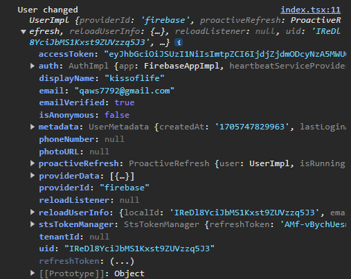

# firebase auth


## 이메일 기반 회원가입

회원가입 시 입력 정보

- 닉네임
- 이메일
- 비밀번호

1. `createUserWithEmailAndPassword()`함수 를 통해 이메일 사용자 생성
2. `updateProfile()` 함수를 통해  `displayName` 업데이트
3. `sendEmailVerification()` 함수를 통해 이메일 확인을 위한 메일 전송

```typescript
interface SignupDto {
  email: string;
  password: string;
  username: string;
}
```

```typescript
export const signupWithEmail = async ({
  email,
  password,
  username,
}: SignupDto) => {
  if (!email || !password || !username) return;

  try {
    const userCredential = await createUserWithEmailAndPassword(
      auth,
      email,
      password,
    );

    await Promise.all([
      sendEmailVerification(userCredential.user),
      updateProfile(userCredential.user, {
        displayName: username,
      }),
    ])

    return { success: true, user: userCredential.user };
  } catch (error) {
    console.log(error);
    return { success: false, error };
  }
};
```


🔴 이메일 사용자를 생성한 순간부터 로그인이 가능하다

🟠 이메일 인증이 되었는지 여부는  `user[emailVerified]`  Boolean 속성을 통해 확인 할 수 있다




## 회원가입 시 db에 유저 정보 저장


### 이메일 회원가입

가입하는 함수 내에서 `createUserWithEmailAndPassword()` 후에 `createUser()` 호출

```javascript
const signUpWithEmail = async ({ email, password, username }: SignUpDto) => {
  if (!email || !password || !username) return;

  try {
    const userCredential = await createUserWithEmailAndPassword(
      auth,
      email,
      password,
    );

    await UserService.createUser({
      ...
    });
 ...
  }
};
```


### 소셜 로그인

소셜 로그인에는 회원가입을 하는 함수가 없다

`signInWithPopup()` 후에 반환되는 `userCredential`를 사용하여 새로운 유저인지 확인


```javascript
const signInWithGoogle = async () => {
  try {
    const userCredential = await signInWithPopup(auth, googleProvider);

    const additionalUserInfo = getAdditionalUserInfo(userCredential);

    if (additionalUserInfo?.isNewUser) {
      await UserService.createUser({
          ...
      });
    }
 ...
};
```

