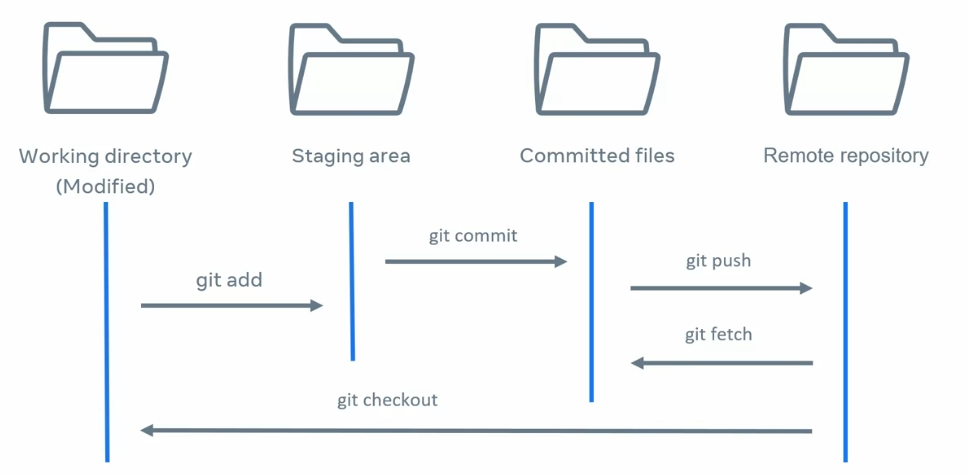

# git

## git 시작하기

- `git init`
- `git config --global user.email <"email">`
- `git config --global user.name <"name">`

------

## git 커밋하기

1. `git add <file>`
2. `git commit -m <"message">`

------

## git log 보기

1. `git log`
2. `git checkout <되돌릴 log id>`  : 특정 커밋으로 되돌리기
3. `git checkout` : 최신 커밋으로 되돌리기

------

## git 원격저장소 연결

1. 레포지토리 만들기
2. `git remote add origin https://github.com/qaws7791/TIL.git`
3. `git push -u origin master` : 원격저장소에 올리기

------

## git 원격저장소를 내려받기

1. `git clone https://github.com/qaws7791/TIL.git .` : 마지막에 마침표 주의( 현재 폴더를 최상위 폴더로 함)

------

## git 원격저장소의 커밋을 로컬 저장소에 업데이트

1. `git pull origin master`

------

## git 원격저장소 url 변경하기

1. `git remote -v` 원격 저장소 url 확인
2. `git remote set-url origin http://github.com/user/repo.git`

------

## 브랜치(branch)

- 버전제어하에 있는 개체 복제
- HAED 포인터를 통해 브랜치를 이동할 수 있다
- 하나의 브랜치에는 한 사람만 작업하는것이 바람직하다. 꼬이면 안되기 때문
- 작업 전 미리 브랜치 규칙을 정하는 것이 일반적
