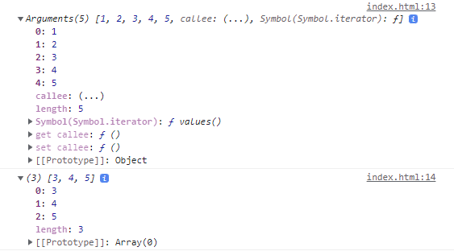

# 전개 구문과 나머지 매개변수

## 전개 구문(spread)

### 구문

```javascript
myFunction(...iterableObj);
```

spread 프로퍼티를 제외한 iterable 객체 전용

* 기존에 함수의 인수로 배열을 사용하기 위해 썼던 `apply()`를 대체할 수 있다.

  ```javascript
  function sum(x, y, z) {
      return x + y + z;
  }
  const numbers = [1, 2, 3];
  console.log(sum(numbers));
  console.log(sum(numbers[0], numbers[1], numbers[2]));
  console.log(sum(...numbers));
  console.log(sum.apply(null, numbers));
  ```

### 배열 합치기 (배열 리터럴 전개)

```javascript
const numbers = [1, 2, 3];
const numbers2 = [4, 5, 6];
console.log([numbers, numbers2]); // [[1,2,3],[4,5,6]]
console.log([...numbers, ...numbers2]); // [1,2,3,4,5,6]
```


### 문자열을 배열로 분해하기

```javascript
const greeting = "Hello";
const arrayOfChars = [...greeting];
console.log(arrayOfChars); //  ['H', 'e', 'l', 'l', 'o']
```


### 배열 복사

> [!CAUTION]
>
> 단 1레벨 깊이에서만 효과적으로 동작

```javascript
const numbers = [1, 2, 3];
const numbers2 = numbers;
numbers2.push(4);
console.log(numbers); // [1,2,3,4]
console.log(numbers2); // [1,2,3,4]
```

```javascript
const numbers = [1, 2, 3];
const numbers2 = [...numbers];
numbers2.push(4);
console.log(numbers); // [1,2,3]
console.log(numbers2); // [1,2,3,4]
```


### 객체 리터럴 전개

```javascript
const user = {
    name: "foo",
    age: 20,
};
user2 = { ...user };
user2.name = "bar";
console.log(user.name, user2.name); // foo bar
```


## 나머지 매개변수(rest)

함수에서 정해지지 않은 수의 매개변수를 배열로 받을 수 있다.

```javascript
function sum(...theArgs) {
  let total = 0;
  for (const arg of theArgs) {
    total += arg;
  }
  return total;
}

console.log(sum(1, 2, 3));
// expected output: 6

console.log(sum(1, 2, 3, 4));
// expected output: 10
```

* 나머지 매개변수는 매개변수 앞에 `...`을 붙여 사용한다
* 나머지 매개변수를 사용하면 모든 후속 매개변수를 배열에 저장하고
* 마지막 매개변수 하나에만 나머지 매개변수로 설정할 수 있다.

```javascript
function printArgs(first, second, ...moreArgs) {
	console.log(first, second) // 1 2
	console.log(moreArgs) // [3,4,5]
}
printArgs(1,2,3,4,5)
```

### Arguments와 나머지매개변수의 차이점

* `Arguments`는 배열이 아니다 -> \[\[Prototype]]: Object 이다
  * `callee`와 같은 기능도 있다.
  * Array 메서드를 사용하기 위해 변환이 필요하다.
  * 전체 매개변수를 포함한다.
* `나머지매개변수`는 실제 배열이다 -> \[\[Prototype]]: Array 이다
  * 사용자가 정의한 매개변수를 제외한 나머지만을 가진다.




