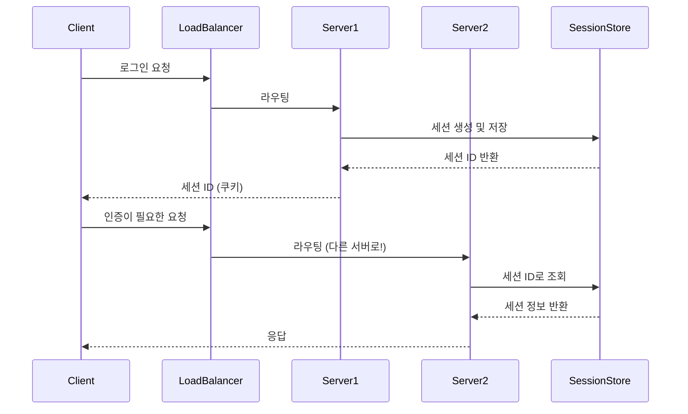
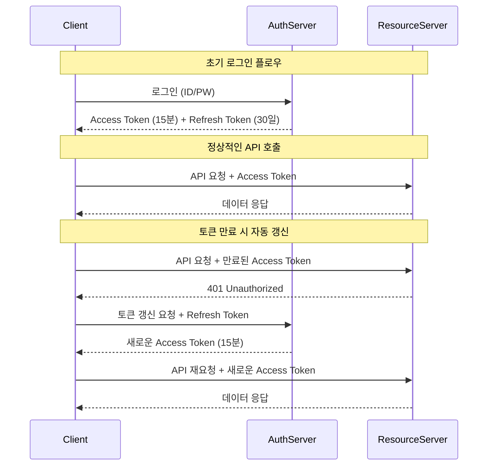
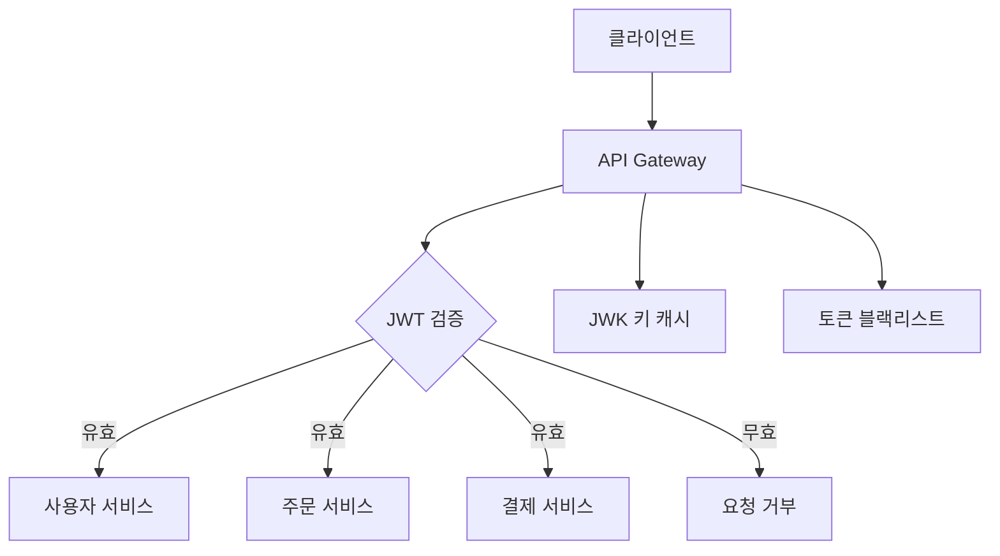

## 들어가며

현대 웹 애플리케이션에서 사용자 인증은 더 이상 단순한 로그인/로그아웃의 문제가 아닙니다. 마이크로서비스 아키텍처의 확산, 모바일 앱의 보편화, 그리고 글로벌 사용자 기반을 가진 서비스들의 등장으로 인해 인증 시스템은 훨씬 복잡하고 정교한 설계를 요구하게 되었습니다.

JSON Web Token(JWT)은 이러한 현대적 요구사항을 만족하는 대표적인 인증 방식으로 자리잡았습니다. 하지만 JWT를 단순히 "세션 대신 사용하는 토큰"이라고 이해하고 적용한다면, 오히려 보안상 더 큰 위험을 초래할 수 있습니다.

Netflix의 기술 블로그에서 언급한 바와 같이, "JWT는 도구일 뿐이며, 잘못 사용하면 세션보다 훨씬 위험한 결과를 가져올 수 있다"는 점을 항상 염두에 두어야 합니다. 이는 JWT의 무상태(stateless) 특성이 가져다주는 이점과 함께, 토큰 자체에 정보를 담고 있다는 근본적인 차이점에서 비롯됩니다.

1부에서는 JWT를 도입하기 전 반드시 이해해야 할 핵심 개념들과, 안전하면서도 확장 가능한 JWT 아키텍처를 설계하는 방법을 다룹니다. 특히 실무에서 자주 발생하는 설계상의 함정들을 미리 파악하고, 이를 피할 수 있는 구체적인 방법들을 제시하겠습니다.

------


# 1장: JWT를 선택하기 전에 반드시 알아야 할 기본 개념들


## 1.1 JWT가 세션 기반 인증과 다른 점을 명확히 이해해야 하는 이유


### 1.1.1 세션 기반 인증의 작동 원리와 한계점

세션 기반 인증은 오랫동안 웹 애플리케이션의 표준적인 인증 방식이었습니다. 사용자가 로그인하면 서버는 고유한 세션 ID를 생성하여 클라이언트에게 쿠키로 전달하고, 서버 메모리나 데이터베이스에 해당 세션의 상태 정보를 저장합니다. 이후 클라이언트의 모든 요청에는 이 세션 ID가 포함되어 전송되며, 서버는 세션 저장소에서 해당 ID를 조회하여 사용자의 인증 상태와 권한 정보를 확인합니다.

하지만 세션 기반 인증은 몇 가지 근본적인 한계를 가지고 있습니다. 첫째, 서버가 모든 활성 세션을 메모리나 데이터베이스에 보관해야 하므로 상당한 저장 공간을 요구합니다. 둘째, 로드 밸런서를 통해 여러 서버로 트래픽을 분산할 때 세션 정합성 문제가 발생할 수 있습니다. 예를 들어, 사용자가 A 서버에서 로그인했지만 다음 요청이 B 서버로 라우팅된다면, B 서버는 해당 세션 정보를 찾을 수 없게 됩니다.

이러한 문제를 해결하기 위해 **'스티키 세션(Sticky Session)'** 방식을 사용하거나, **Redis**와 같은 중앙집중식 세션 저장소를 도입하는 것이 일반적입니다. 하지만 이 방법들은 각각 다른 복잡성을 가져옵니다. 스티키 세션은 특정 서버에 장애가 발생했을 때 해당 서버를 사용하던 모든 사용자가 로그아웃되는 문제가 있고, 중앙집중식 저장소는 **단일 장애점(Single Point of Failure)**이 될 위험이 있습니다.




### 1.1.2 JWT의 무상태(Stateless) 특성이 가져오는 패러다임의 변화

JWT는 이러한 세션 기반 인증의 한계를 극복하기 위해 등장했습니다. JWT의 가장 핵심적인 특징은 **무상태성(Statelessness)** 입니다. 즉, 서버가 사용자의 인증 상태를 별도로 저장하지 않고, 모든 필요한 정보를 토큰 자체에 담아서 클라이언트에게 전달합니다.

이는 인증에 대한 사고방식의 근본적인 변화를 요구합니다. 세션 기반 인증에서는 "서버가 사용자가 누구인지 기억하고 있다"는 개념이었다면, JWT에서는 "사용자가 자신이 누구인지 증명할 수 있는 증명서를 가지고 다닌다"는 개념입니다. 마치 신분증을 가지고 다니는 것과 비슷합니다 - 어디를 가더라도 신분증만 제시하면 본인임을 증명할 수 있는 것처럼, JWT도 어떤 서버에 요청하더라도 토큰만 있으면 사용자의 신원과 권한을 확인할 수 있습니다.

Google의 마이크로서비스 아키텍처에 대한 기술 문서에서는 이를 **"자가 서명된 토큰(Self-contained Token)"**이라고 표현합니다. 토큰 자체가 모든 필요한 정보를 포함하고 있어서, 별도의 데이터베이스 조회 없이도 토큰의 유효성과 사용자 정보를 확인할 수 있습니다.

하지만 이러한 무상태성은 양날의 검입니다. 장점으로는 <u>서버의 확장성이 크게 개선되고, 마이크로서비스 간의 인증 처리가 간편해집니다</u>. 반면 단점으로는 <u>토큰이 한 번 발급되면 만료 시점까지는 강제로 무효화하기 어렵다</u>는 점이 있습니다. 이는 보안 사고 발생 시 즉각적인 대응을 어렵게 만들 수 있습니다.


### 1.1.3 실제 기업들의 JWT 도입 사례와 경험담

Uber의 엔지니어링 블로그에 따르면, 초기에는 세션 기반 인증을 사용했지만 서비스가 글로벌로 확장되면서 여러 데이터센터 간의 세션 동기화 문제가 심각해졌습니다. 특히 라이더와 드라이버가 실시간으로 위치를 주고받아야 하는 상황에서, 세션 저장소의 지연시간이 서비스 품질에 직접적인 영향을 미쳤습니다.

JWT 도입 후에는 각 지역의 서버가 독립적으로 토큰을 검증할 수 있게 되어 응답 속도가 크게 개선되었습니다. 하지만 동시에 토큰 탈취 시의 피해 범위가 확대될 수 있다는 새로운 보안 고민이 생겨났고, 이를 해결하기 위해 <u>토큰의 짧은 만료시간과 리프레시 토큰 메커니즘을 정교하게 설계해야 했습니다</u>.

반면 Stack Overflow의 개발팀은 흥미로운 결정을 내렸습니다. JWT의 이론적 장점에도 불구하고, 자사 서비스의 특성상 세션 기반 인증이 더 적합하다고 판단했습니다. 사용자들이 오랜 시간 동안 사이트에 머물면서 다양한 활동을 하는 패턴을 고려할 때, 세션 무효화의 즉시성이 JWT의 확장성보다 더 중요한 가치라고 본 것입니다.

이처럼 JWT와 세션 기반 인증 중 어떤 것이 "더 좋다"는 절대적 기준은 없습니다. 중요한 것은 각 방식의 트레이드오프를 명확히 이해하고, 자신의 서비스 특성에 맞는 선택을 하는 것입니다.


## 1.2 액세스 토큰과 리프레시 토큰을 분리해야 하는 보안상의 이유


### 1.2.1 단일 토큰 방식의 보안 취약점과 실제 피해 사례

많은 개발자들이 JWT를 처음 도입할 때 범하는 실수 중 하나는 액세스 토큰 하나만으로 모든 인증을 처리하려고 하는 것입니다. 표면적으로는 간단해 보이지만, 이 방식은 심각한 보안 취약점을 가지고 있습니다.

2019년 한 해외 핀테크 스타트업에서 실제로 발생한 사례를 살펴보겠습니다. 이 회사는 모바일 뱅킹 앱에서 24시간 만료되는 단일 JWT 토큰을 사용했습니다. 토큰에는 사용자 ID, 계좌 정보, 그리고 거래 권한이 모두 포함되어 있었습니다. 어느 날 사용자 중 한 명이 공용 와이파이에서 앱을 사용하다가 토큰이 탈취되었습니다.

문제는 여기서 시작되었습니다. 해커는 탈취한 토큰을 이용해 23시간 동안 자유롭게 사용자의 계좌에 접근할 수 있었습니다. 회사는 토큰이 탈취되었다는 사실을 뒤늦게 알아챘지만, JWT의 무상태 특성상 해당 토큰을 즉시 무효화할 방법이 없었습니다. 결국 해커는 여러 차례에 걸쳐 소액의 거래를 실행했고, 피해자가 이를 발견했을 때는 이미 상당한 금액이 빠져나간 후였습니다.

이 사건 이후 해당 회사는 전면적인 인증 시스템 개편을 진행했습니다. 핵심은 토큰의 생명주기를 세분화하고, 각각 다른 보안 수준을 적용하는 것이었습니다.


### 1.2.2 액세스 토큰과 리프레시 토큰의 역할 분담 원칙

액세스 토큰과 리프레시 토큰을 분리하는 것은 **"권한 분산의 원칙"**에 기반합니다. 이는 보안 분야에서 오랫동안 사용되어온 **"최소 권한 원칙(Principle of Least Privilege)"**의 시간적 적용이라고 볼 수 있습니다.

**액세스 토큰**은 실제 API에 접근할 때 사용되는 토큰으로, 짧은 수명(보통 10분~1시간)을 가집니다. 이 토큰에는 사용자의 기본적인 신원 정보와 현재 세션에서 필요한 최소한의 권한 정보만 포함됩니다. 마치 호텔에서 하루짜리 키카드를 받는 것과 비슷합니다.

**리프레시 토큰**은 새로운 액세스 토큰을 발급받을 때만 사용되는 토큰으로, 상대적으로 긴 수명(보통 몇 주~몇 개월)을 가집니다. 하지만 이 토큰으로는 일반적인 API에 직접 접근할 수 없습니다. <u>오직 인증 서버의 토큰 갱신 엔드포인트에서만 사용</u>할 수 있습니다. 이는 호텔의 프런트 데스크에서 새로운 키카드를 발급받을 때 보여주는 신분증과 같은 역할입니다.

Microsoft의 Azure AD 문서에서는 이를 "토큰의 폭발 반경 최소화(Minimizing Token Blast Radius)"라고 표현합니다. 만약 액세스 토큰이 탈취되더라도 짧은 시간 후에는 자동으로 만료되어 피해를 최소화할 수 있고, 리프레시 토큰이 탈취되더라도 직접적인 데이터 접근은 불가능하다는 것입니다.




### 1.2.3 토큰 순환(Token Rotation) 전략으로 보안 강화하기

한 단계 더 나아가, 많은 보안 전문가들은 **"리프레시 토큰 순환(Refresh Token Rotation)"** 전략을 권장합니다. 이는 <u>리프레시 토큰을 사용해서 새로운 액세스 토큰을 발급받을 때마다, 리프레시 토큰 자체도 새로 발급하는 방식</u>입니다.

Auth0의 보안 가이드라인에 따르면, 이 방식은 리프레시 토큰이 탈취되더라도 정당한 사용자가 토큰을 한 번만 사용하면 탈취자의 토큰은 자동으로 무효화된다는 장점이 있습니다. 예를 들어, 해커가 리프레시 토큰을 탈취했지만 정당한 사용자가 먼저 해당 토큰을 사용해 새로운 액세스 토큰을 받았다면, 해커의 토큰은 이미 무효화된 상태가 됩니다.

하지만 이 전략은 구현상의 복잡성을 증가시킵니다. 특히 사용자가 여러 탭이나 디바이스에서 동시에 앱을 사용하는 경우, <u>토큰 갱신으로 인한 경쟁 조건(Race Condition)을 주의깊게 처리해야 합니다</u>. 이에 대한 구체적인 해결책은 4장에서 자세히 다루겠습니다.


## 1.3 JWT 페이로드에 민감한 정보를 담으면 안 되는 이유와 대안들


### 1.3.1 JWT가 암호화라는 치명적인 오해

JWT에 대한 가장 위험한 오해 중 하나는 "JWT가 데이터를 암호화해준다"는 잘못된 믿음입니다. 실제로 JWT는 기본적으로 Base64URL로 인코딩된 구조이며, 누구나 쉽게 디코딩해서 내용을 볼 수 있습니다.

```javascript
function getJWTPayload(token) {
  try {
    const payloadB64 = token.split('.')[1];
    const base64 = payloadB64.replace(/-/g, '+').replace(/_/g, '/');
    const padded = base64 + '='.repeat((4 - base64.length % 4) % 4);
    return JSON.parse(atob(padded));
  } catch (error) {
    console.error('Payload Decoding Error:', error);
    return null;
  }
}
```

한국의 한 대형 전자상거래 회사에서 실제로 발생했던 사례를 통해 이 문제의 심각성을 살펴보겠습니다. 개발팀은 사용자의 편의를 위해 JWT 페이로드에 신용카드 마지막 4자리, 배송 주소, 그리고 최근 구매 내역을 포함시켰습니다. 사용자가 페이지를 이동할 때마다 서버에 추가 요청을 보내지 않아도 되도록 하기 위한 선의의 최적화였습니다.

문제는 이 JWT가 브라우저의 localStorage에 저장되었고, 사이트에 삽입된 악성 스크립트가 이를 탈취할 수 있었다는 점입니다. 공격자는 단순히 `localStorage.getItem('jwt')`를 실행한 후, 반환된 토큰을 jwt.io 같은 온라인 디코더에 입력하기만 하면 사용자의 모든 민감한 정보를 손쉽게 볼 수 있었습니다.

이러한 보안 사고를 방지하기 위해, JWT 페이로드에는 **공개되어도 상관없는 정보만 포함해야 한다**는 원칙을 철저히 지켜야 합니다. [RFC 7519(JWT 표준)](https://datatracker.ietf.org/doc/html/rfc7519)에서도 "페이로드 정보는 공개된 것으로 간주되어야 한다"고 명시하고 있습니다.


### 1.3.2 JWT 페이로드에 포함해도 안전한 정보와 위험한 정보

그렇다면 JWT 페이로드에는 무엇을 넣어야 할까요? 일반적으로 안전하다고 여겨지는 정보들과 피해야 할 정보들을 구체적으로 살펴보겠습니다.

**포함해도 안전한 정보:**

- 사용자 고유 식별자 (UUID 형태의 user_id)
- 기본적인 권한 역할 (admin, user, guest 등)
- 토큰 발급 시간 (iat)과 만료 시간 (exp)
- 토큰 발급자 정보 (iss)
- 애플리케이션별 식별자 (aud)

**포함하면 위험한 정보:**

- 사용자의 실명, 이메일 주소
- 개인정보 (전화번호, 주소 등)
- 금융 정보 (계좌번호, 카드 정보)
- 민감한 비즈니스 정보 (급여, 개인 메모 등)
- 상세한 권한 정보 (특정 리소스에 대한 세밀한 접근 권한)

Shopify의 기술 블로그에서는 이를 **"최소한의 클레임 원칙(Minimal Claims Principle)"**이라고 표현합니다. JWT에는 토큰의 유효성을 검증하고 기본적인 사용자 식별에 필요한 최소한의 정보만 포함해야 한다는 것입니다.


### 1.3.3 민감한 정보를 안전하게 처리하는 대안 전략들

그렇다면 사용자의 상세 정보나 복잡한 권한 정보가 필요한 경우에는 어떻게 해야 할까요? 여러 가지 대안 전략들을 살펴보겠습니다.

**1. 지연 로딩(Lazy Loading) 패턴**

가장 일반적인 접근법은 JWT로 기본 인증만 처리하고, 필요한 추가 정보는 별도의 API 호출을 통해 가져오는 것입니다. 예를 들어, 사용자가 프로필 페이지에 접근할 때 `/api/user/profile` 엔드포인트를 호출해서 상세 정보를 가져오는 방식입니다.

```javascript
// JWT에는 최소한의 정보만 포함
const jwt_payload = {
  user_id: "550e8400-e29b-41d4-a716-446655440000",
  role: "user",
  iat: 1609459200,
  exp: 1609462800
};

// 상세 정보는 별도 API로 요청
async function getUserProfile(accessToken) {
  const response = await fetch('/api/user/profile', {
    headers: {
      'Authorization': `Bearer ${accessToken}`
    }
  });
  return response.json();
}
```

**2. 서버측 세션 하이브리드 방식**

Netflix에서 사용하는 흥미로운 패턴은 JWT의 무상태성과 서버 세션의 즉시성을 결합한 하이브리드 방식입니다. JWT에는 기본적인 사용자 정보만 포함하고, 서버에는 해당 사용자의 상세한 권한이나 설정 정보를 캐시로 저장합니다. 이렇게 하면 JWT의 확장성 이점은 유지하면서도, 필요에 따라 실시간으로 권한을 조정할 수 있습니다.

**3. JWT 암호화(JWE) 활용**

정말로 민감한 정보를 토큰에 포함해야 하는 특수한 경우에는 JWE(JSON Web Encryption)를 사용할 수 있습니다. 하지만 이는 성능상의 오버헤드와 키 관리의 복잡성을 증가시키므로, 신중하게 결정해야 합니다.

**4. 권한 기반 클레임 최소화**

Auth0의 권장사항에 따르면, 복잡한 권한 체계가 필요한 경우에는 JWT에 구체적인 권한을 명시하는 대신, 권한 그룹이나 역할만 포함하고 실제 권한 매핑은 서버에서 처리하는 것이 좋습니다.

```javascript
// ❌ 위험한 방식 - 구체적인 권한들을 JWT에 포함
const bad_payload = {
  user_id: "123",
  permissions: [
    "read_financial_reports",
    "delete_user_accounts", 
    "access_salary_data",
    "modify_bank_settings"
  ]
};

// ✅ 안전한 방식 - 역할만 포함하고 권한은 서버에서 매핑
const good_payload = {
  user_id: "123",
  role: "manager",
  department: "finance"
};
```

이러한 대안들을 통해 JWT의 장점은 유지하면서도 보안성을 크게 향상시킬 수 있습니다. 중요한 것은 "편의성과 보안성 사이의 균형"을 찾는 것이며, 이는 각 서비스의 특성과 보안 요구사항에 따라 달라질 수 있습니다.

------


# 2장: 안전하고 확장 가능한 JWT 아키텍처를 설계하는 방법


## 2.1 토큰 저장소별 보안 위험도를 비교 분석하여 최적의 선택을 하는 방법


### 2.1.1 클라이언트 측 토큰 저장소 옵션들의 특성 분석

JWT 토큰을 클라이언트에서 어디에 저장할지는 보안 아키텍처의 핵심적인 결정사항입니다. 각 저장소는 서로 다른 보안 특성과 사용성을 가지고 있어, 이를 정확히 이해하고 상황에 맞는 선택을 해야 합니다.

**localStorage/sessionStorage**는 가장 직관적이고 구현하기 쉬운 방법입니다. JavaScript를 통해 간단히 접근할 수 있고, 브라우저가 종료되어도 데이터가 유지됩니다(localStorage의 경우). 하지만 바로 이 점이 가장 큰 취약점이기도 합니다. XSS(Cross-Site Scripting) 공격에 완전히 노출되어 있어, 악성 스크립트가 실행되면 즉시 토큰이 탈취될 수 있습니다.

2020년 국내 한 대형 쇼핑몰에서 발생한 실제 사례를 살펴보면, 광고 네트워크를 통해 삽입된 악성 스크립트가 사용자들의 localStorage에서 JWT 토큰을 수집하여 외부 서버로 전송하는 사건이 있었습니다. 피해자들은 자신도 모르는 사이에 토큰이 탈취되어 부정한 주문이 이루어졌고, 회사는 상당한 손실을 입었습니다.

**메모리 저장**은 JavaScript 변수나 클로저를 이용해 토큰을 런타임에만 보관하는 방식입니다. XSS 공격에 대한 저항성이 높고, 브라우저를 종료하면 토큰이 자동으로 사라지는 장점이 있습니다. 하지만 페이지를 새로고침하면 토큰이 사라지므로, 사용자가 다시 로그인해야 하는 불편함이 있습니다.

**HttpOnly 쿠키**는 서버에서 `Set-Cookie` 헤더에 `HttpOnly` 플래그를 설정해 전송하는 방식입니다. JavaScript로 접근할 수 없어 XSS 공격으로부터 보호되지만, CSRF(Cross-Site Request Forgery) 공격에는 취약할 수 있습니다. 또한 SameSite 정책과 CORS 설정을 신중하게 해야 합니다.


### 2.1.2 보안 위험도 매트릭스와 실제 공격 시나리오

다음 표는 각 저장소별 주요 보안 위험도를 정량적으로 분석한 것입니다:

| 저장소         | XSS 위험도 | CSRF 위험도 | 구현 복잡도 | 사용자 경험 | 권장 사용 케이스         |
| -------------- | ---------- | ----------- | ----------- | ----------- | ------------------------ |
| localStorage   | 높음(5/5)  | 없음(1/5)   | 낮음(1/5)   | 우수(5/5)   | 낮은 보안 요구사항       |
| sessionStorage | 높음(5/5)  | 없음(1/5)   | 낮음(1/5)   | 보통(3/5)   | 임시 세션 관리           |
| 메모리         | 중간(2/5)  | 없음(1/5)   | 중간(3/5)   | 나쁨(2/5)   | 높은 보안, 짧은 세션     |
| HttpOnly 쿠키  | 없음(1/5)  | 중간(3/5)   | 높음(4/5)   | 우수(5/5)   | 일반적인 웹 애플리케이션 |
| Secure 쿠키    | 없음(1/5)  | 중간(3/5)   | 높음(4/5)   | 우수(5/5)   | HTTPS 환경               |

**실제 공격 시나리오 분석:**

Airbnb의 보안팀이 공개한 사례연구에 따르면, 그들은 초기에 localStorage를 사용했지만 다음과 같은 공격 벡터들을 발견했습니다:

1. **반사형 XSS를 통한 토큰 탈취**: 검색 기능의 입력값 검증 누락으로 인해 `<script>` 태그가 삽입되어, 사용자의 JWT가 공격자의 서버로 전송되는 경우
2. **저장형 XSS를 통한 지속적 공격**: 사용자 리뷰나 프로필에 악성 스크립트를 삽입하여, 해당 페이지를 방문하는 모든 사용자의 토큰을 수집하는 경우
3. **Browser Extension을 통한 토큰 수집**: 악성 브라우저 확장프로그램이 모든 사이트의 localStorage에 접근하여 JWT를 수집하는 경우

이러한 경험을 바탕으로 Airbnb는 HttpOnly 쿠키 방식으로 전환했고, 추가적으로 CSRF 토큰과 SameSite 정책을 함께 적용했습니다.


### 2.1.3 하이브리드 저장 전략과 적응적 보안 모델

많은 현대적인 웹 애플리케이션들은 단일 저장소에 의존하지 않고, 상황에 따라 다른 저장 방식을 조합해서 사용하는 하이브리드 전략을 채택하고 있습니다.

**Spotify의 적응적 토큰 저장 전략:**

Spotify의 웹 플레이어는 사용자의 보안 설정과 브라우저 환경을 분석해서 최적의 저장 방식을 동적으로 선택합니다:

```javascript
class AdaptiveTokenStorage {
  constructor() {
    this.storageStrategy = this.determineOptimalStrategy();
  }

  determineOptimalStrategy() {
    // 브라우저 보안 기능 검사
    const hasHttpOnlySupport = this.checkHttpOnlySupport();
    const hasSameSiteSupport = this.checkSameSiteSupport();
    const userSecurityLevel = this.getUserSecurityPreference();

    if (userSecurityLevel === 'high' && hasHttpOnlySupport) {
      return new SecureCookieStorage();
    } else if (userSecurityLevel === 'medium') {
      return new MemoryStorage();
    } else {
      return new LocalStorageWithEncryption();
    }
  }

  store(token) {
    return this.storageStrategy.store(token);
  }

  retrieve() {
    return this.storageStrategy.retrieve();
  }
}
```

이 방식의 핵심은 **"보안과 사용성의 동적 균형"**입니다. 보안을 중시하는 사용자에게는 더 안전한 저장 방식을, 편의성을 중시하는 사용자에게는 더 편리한 방식을 제공합니다.

**GitHub의 다층 보안 모델:**

GitHub은 더욱 정교한 다층 보안 모델을 사용합니다:

1. **Public Repository 접근**: localStorage 저장 허용
2. **Private Repository 접근**: HttpOnly 쿠키 + CSRF 토큰
3. **Organization 관리**: 메모리 저장 + 2단계 인증
4. **결제/설정 변경**: 재인증 요구 + 임시 토큰

이처럼 동일한 애플리케이션 내에서도 접근하는 리소스의 민감도에 따라 다른 보안 수준을 적용하는 것이 현대적인 접근법입니다.


## 2.2 마이크로서비스 환경에서 JWT 검증 로직을 중앙화하는 설계 패턴


### 2.2.1 분산 시스템에서의 JWT 검증 문제점과 해결 필요성

마이크로서비스 아키텍처에서 JWT를 사용할 때 가장 큰 도전 과제 중 하나는 일관된 토큰 검증 로직을 유지하는 것입니다. 각 마이크로서비스가 독립적으로 JWT 검증을 수행한다면, 검증 로직의 중복, 불일치, 그리고 유지보수의 어려움이 발생할 수 있습니다.

Netflix의 마이크로서비스 아키텍처 변천사를 살펴보면 이 문제의 심각성을 잘 알 수 있습니다. 초기에는 각 서비스가 독립적으로 JWT 검증 라이브러리를 포함하고 있었습니다. 하지만 서비스 수가 수백 개로 늘어나면서 다음과 같은 문제들이 나타났습니다:

1. **검증 로직의 불일치**: 일부 서비스는 토큰 만료 시간을 엄격하게 검사하지만, 다른 서비스는 느슨하게 처리
2. **보안 업데이트의 지연**: JWT 라이브러리에 보안 패치가 나와도 모든 서비스에 반영하는 데 몇 주가 소요
3. **디버깅의 어려움**: 토큰 관련 오류가 발생해도 어떤 서비스에서 문제가 생겼는지 파악하기 어려움

이러한 경험을 바탕으로 Netflix는 "Zero Trust Security Model"과 함께 중앙화된 토큰 검증 시스템을 구축했습니다.


### 2.2.2 API Gateway를 활용한 중앙화 패턴

가장 일반적인 해결책은 API Gateway에서 모든 JWT 검증을 처리하는 것입니다. 이 패턴에서는 클라이언트의 모든 요청이 먼저 API Gateway를 거치고, 여기서 JWT의 유효성을 검증한 후 유효한 요청만 해당 마이크로서비스로 전달합니다.



**Amazon API Gateway의 JWT 검증 구현 예시:**

Amazon에서 실제로 사용하는 방식과 유사한 구현을 살펴보겠습니다:

```javascript
// API Gateway의 JWT 검증 미들웨어
class JWTValidationMiddleware {
  constructor(jwksClient, blacklistService) {
    this.jwksClient = jwksClient;
    this.blacklistService = blacklistService;
  }

  async validateToken(request, response, next) {
    try {
      const token = this.extractTokenFromRequest(request);
      
      // 1. 토큰 형식 검증
      if (!token || !this.isValidFormat(token)) {
        return this.reject(response, 'INVALID_TOKEN_FORMAT');
      }

      // 2. 블랙리스트 확인
      if (await this.blacklistService.isBlacklisted(token)) {
        return this.reject(response, 'TOKEN_BLACKLISTED');
      }

      // 3. 서명 검증
      const publicKey = await this.jwksClient.getSigningKey(token);
      const payload = jwt.verify(token, publicKey);

      // 4. 클레임 검증
      if (!this.validateClaims(payload)) {
        return this.reject(response, 'INVALID_CLAIMS');
      }

      // 5. 검증된 정보를 헤더에 추가
      request.headers['x-user-id'] = payload.sub;
      request.headers['x-user-role'] = payload.role;
      request.headers['x-token-exp'] = payload.exp;

      next();
    } catch (error) {
      return this.reject(response, 'TOKEN_VERIFICATION_FAILED');
    }
  }
}
```

이 방식의 장점은 모든 마이크로서비스가 토큰 검증 로직을 구현할 필요가 없다는 것입니다. API Gateway에서 검증된 요청만 받기 때문에, 각 서비스는 비즈니스 로직에만 집중할 수 있습니다.


### 2.2.3 사이드카 패턴을 이용한 분산 검증 아키텍처

하지만 API Gateway 방식도 단점이 있습니다. 모든 요청이 Gateway를 거쳐야 하므로 단일 장애점이 될 수 있고, 트래픽이 증가하면 병목점이 될 수 있습니다. 이를 해결하기 위해 많은 기업들이 사이드카 패턴을 채택하고 있습니다.

**Istio Service Mesh의 JWT 검증 사이드카:**

Google이 개발한 Istio는 각 마이크로서비스 옆에 Envoy 프록시를 사이드카로 배치하여 JWT 검증을 수행합니다. 이 방식의 핵심은 검증 로직은 중앙에서 관리하면서도, 실제 검증 처리는 분산해서 수행한다는 것입니다.

```yaml
# Istio JWT 검증 정책 예시
apiVersion: security.istio.io/v1beta1
kind: RequestAuthentication
metadata:
  name: jwt-auth
spec:
  jwtRules:
  - issuer: "https://auth.company.com"
    jwksUri: "https://auth.company.com/.well-known/jwks.json"
    audiences:
    - "api.company.com"
  - issuer: "https://auth.company.com"
    jwks: |
      {
        "keys": [
          {
            "kty": "RSA",
            "kid": "DHFbpoIUqrY8t2zpA2qXfCmr5VO9PYXiNHyy6SkUa0U",
            "use": "sig",
            "n": "xAE7eB6qugXyCAG3yhh7pkDkT65pHymX-P7KfIupjf59vsdo91bSP9C8H07pSAGQO1MV_xFj9VswgsCg4R6otmg5PV2He95lZdHtOcU5DXIg_pbhLdKXbi66GlVeK6ABZOUW3WYtnNHD-91gVuoeJT_DwtGGcp4ignkgXfkiEm4sw-4sfb4qdt5oLbyVpmW6x9cfa7vs2WTfURiCrBoUqgBo_-4WTiULmmHSGZHOjzwa8WtrtOQGsAFjIbno85jp6MnGGGZPYgd",
            "e": "AQAB"
          }
        ]
      }
```

사이드카 패턴의 장점은 다음과 같습니다:

1. **고가용성**: 하나의 사이드카가 실패해도 다른 서비스들은 영향받지 않음
2. **확장성**: 각 서비스의 트래픽에 맞게 독립적으로 확장 가능
3. **지역성**: 네트워크 지연 시간이 최소화됨
4. **투명성**: 애플리케이션 코드 변경 없이 JWT 검증 적용 가능


### 2.2.4 중앙화된 키 관리와 토큰 정책 배포

JWT 검증의 중앙화에서 또 다른 중요한 요소는 서명 키 관리입니다. 수백 개의 마이크로서비스가 동일한 공개 키로 토큰을 검증해야 하는데, 이 키들을 어떻게 안전하고 효율적으로 배포할지는 중요한 설계 결정입니다.

**HashiCorp Vault를 활용한 키 관리:**

많은 기업들이 HashiCorp Vault나 AWS KMS 같은 전용 키 관리 시스템을 사용합니다. 이들 시스템의 핵심 기능은 키 순환(Key Rotation)을 자동화하고, 각 서비스에 적절한 권한만 부여하는 것입니다.

```javascript
// Vault 기반 동적 키 페칭 예시
class VaultJWKSClient {
  constructor(vaultClient) {
    this.vaultClient = vaultClient;
    this.keyCache = new Map();
    this.setupKeyRotationHandler();
  }

  async getSigningKey(kid) {
    // 캐시에서 먼저 확인
    if (this.keyCache.has(kid)) {
      const cachedKey = this.keyCache.get(kid);
      if (!this.isKeyExpired(cachedKey)) {
        return cachedKey.key;
      }
    }

    // Vault에서 최신 키 조회
    const keyData = await this.vaultClient.read(`jwt/keys/${kid}`);
    const jwk = keyData.data;
    
    // 공개 키로 변환하여 캐시에 저장
    const publicKey = await this.jwkToPem(jwk);
    this.keyCache.set(kid, {
      key: publicKey,
      fetchedAt: Date.now(),
      expiresAt: Date.now() + (15 * 60 * 1000) // 15분 캐시
    });

    return publicKey;
  }

  setupKeyRotationHandler() {
    // Vault의 키 업데이트 알림 수신
    this.vaultClient.onKeyRotation((event) => {
      console.log(`Key rotation detected: ${event.kid}`);
      this.keyCache.delete(event.kid); // 캐시 무효화
    });
  }
}
```

이러한 중앙화된 키 관리 시스템을 통해 키 순환 시에도 서비스 중단 없이 새로운 키를 배포할 수 있고, 보안 사고 발생 시 모든 키를 즉시 무효화할 수도 있습니다.


## 2.3 토큰 만료 시간을 비즈니스 요구사항에 맞게 설정하는 전략


### 2.3.1 토큰 수명 결정의 복합적 고려사항

토큰의 만료 시간을 설정하는 것은 단순히 "짧을수록 안전하다"는 원칙만으로 해결할 수 없는 복잡한 문제입니다. 보안, 사용자 경험, 서버 부하, 비즈니스 요구사항 등 다양한 요소들이 서로 상충되는 경우가 많기 때문입니다.

**사용자 행동 패턴에 따른 토큰 수명 설계:**

Slack의 사용자 경험 팀이 공유한 연구 결과에 따르면, 사용자의 애플리케이션 사용 패턴은 크게 세 가지로 구분됩니다:

1. **연속 사용자(Continuous Users)**: 하루 종일 앱을 켜놓고 지속적으로 상호작용
2. **간헐적 사용자(Intermittent Users)**: 몇 시간마다 앱을 확인하고 짧게 사용
3. **일회성 사용자(One-time Users)**: 특정 작업을 위해 잠깐 접속

각 그룹에 대해 동일한 토큰 만료 시간을 적용하면 문제가 발생합니다. 연속 사용자에게는 너무 짧은 토큰이 빈번한 재인증을 야기하고, 일회성 사용자에게는 너무 긴 토큰이 보안 위험을 증가시킵니다.

**업계별 토큰 수명 벤치마크:**

다양한 업계의 실제 사례들을 분석해보면 흥미로운 패턴을 발견할 수 있습니다:

| 업계              | 액세스 토큰 수명 | 리프레시 토큰 수명 | 주요 고려사항               |
| ----------------- | ---------------- | ------------------ | --------------------------- |
| 금융 서비스       | 5-15분           | 1-7일              | 높은 보안 요구, 규제 준수   |
| 전자상거래        | 30분-1시간       | 30-90일            | 장바구니 유지, 구매 편의성  |
| 소셜 미디어       | 1-4시간          | 30-365일           | 연속 사용 패턴, 콘텐츠 소비 |
| 엔터프라이즈 SaaS | 1-8시간          | 7-30일             | 업무 시간 기반, 보안 정책   |
| 게임              | 4-12시간         | 30-180일           | 긴 플레이 세션, 사용자 유지 |


### 2.3.2 적응적 토큰 수명 관리 시스템

최근 많은 기업들이 고정된 토큰 수명 대신 사용자의 행동과 위험도에 따라 동적으로 조정하는 시스템을 도입하고 있습니다.

**Google의 위험 기반 인증(Risk-Based Authentication):**

Google의 계정 보안 시스템은 다음과 같은 요소들을 실시간으로 분석해서 토큰 수명을 조정합니다:

```javascript
class AdaptiveTokenLifetime {
  constructor(riskAnalyzer, userProfiler) {
    this.riskAnalyzer = riskAnalyzer;
    this.userProfiler = userProfiler;
  }

  calculateOptimalLifetime(user, context) {
    const baseLifetime = 60; // 기본 60분
    
    // 사용자 신뢰도 점수 (0-1)
    const userTrustScore = this.userProfiler.getTrustScore(user);
    
    // 현재 세션의 위험도 (0-1)
    const sessionRisk = this.riskAnalyzer.assessRisk({
      ipAddress: context.ipAddress,
      userAgent: context.userAgent,
      geolocation: context.geolocation,
      deviceFingerprint: context.deviceFingerprint
    });

    // 최근 사용 패턴 분석
    const usagePattern = this.userProfiler.getUsagePattern(user);
    
    // 적응적 수명 계산
    let adaptiveLifetime = baseLifetime;
    
    // 신뢰도가 높으면 수명 연장
    adaptiveLifetime *= (0.5 + userTrustScore);
    
    // 위험도가 높으면 수명 단축
    adaptiveLifetime *= (1 - sessionRisk * 0.8);
    
    // 사용 패턴에 따른 조정
    if (usagePattern === 'continuous') {
      adaptiveLifetime *= 2; // 연속 사용자는 2배 연장
    } else if (usagePattern === 'one-time') {
      adaptiveLifetime *= 0.5; // 일회성 사용자는 절반으로 단축
    }

    // 최소/최대값 제한
    return Math.min(Math.max(adaptiveLifetime, 5), 240); // 5분~4시간 범위
  }
}
```

**Microsoft Azure AD의 조건부 접근 정책:**

Microsoft Azure AD는 더욱 정교한 조건부 접근 정책을 제공합니다. 관리자가 다양한 조건들을 조합해서 토큰 수명 정책을 세밀하게 제어할 수 있습니다:

- 사용자가 관리되는 디바이스에서 접속하는 경우: 토큰 수명 8시간
- 알 수 없는 위치에서 접속하는 경우: 토큰 수명 15분
- 다중 인증을 통과한 경우: 토큰 수명 4시간 연장
- 높은 위험도 사용자로 분류된 경우: 토큰 수명 5분


### 2.3.3 토큰 갱신 전략과 사용자 경험 최적화

토큰 수명이 짧아질수록 토큰 갱신 빈도가 높아지는데, 이를 사용자가 인지하지 못하도록 하는 것이 중요합니다.

**끊김없는 토큰 갱신(Seamless Token Refresh) 패턴:**

Facebook(현 Meta)에서 사용하는 방식을 참고한 구현입니다:

```javascript
class SeamlessTokenManager {
  constructor(authService) {
    this.authService = authService;
    this.refreshThreshold = 5 * 60 * 1000; // 만료 5분 전에 갱신
    this.refreshPromise = null;
    this.setupAutoRefresh();
  }

  setupAutoRefresh() {
    setInterval(() => {
      const token = this.getCurrentToken();
      if (this.shouldRefresh(token)) {
        this.refreshToken();
      }
    }, 60 * 1000); // 1분마다 확인
  }

  shouldRefresh(token) {
    if (!token) return false;
    
    const payload = jwt.decode(token);
    const expiresAt = payload.exp * 1000;
    const now = Date.now();
    
    return (expiresAt - now) <= this.refreshThreshold;
  }

  async refreshToken() {
    // 동시에 여러 요청이 갱신을 시도하는 것을 방지
    if (this.refreshPromise) {
      return this.refreshPromise;
    }

    this.refreshPromise = this.authService.refreshToken()
      .then(newToken => {
        this.storeToken(newToken);
        this.refreshPromise = null;
        return newToken;
      })
      .catch(error => {
        this.refreshPromise = null;
        throw error;
      });

    return this.refreshPromise;
  }
}
```

이러한 시스템을 통해 사용자는 토큰이 갱신되고 있다는 사실을 전혀 인지하지 못한 채 애플리케이션을 계속 사용할 수 있습니다.

**토큰 갱신 실패 시의 우아한 처리:**

토큰 갱신이 실패하는 경우에 대한 처리도 중요합니다. Spotify에서는 다음과 같은 단계적 접근법을 사용합니다:

1. **1차 시도 실패**: 5초 후 재시도
2. **2차 시도 실패**: 사용자에게 알리지 않고 백그라운드에서 10초 후 재시도
3. **3차 시도 실패**: 사용자에게 "연결 문제가 있습니다" 메시지 표시, 30초 후 재시도
4. **최종 실패**: 로그인 화면으로 부드럽게 전환

이러한 단계적 접근법을 통해 일시적인 네트워크 문제로 인한 사용자 불편을 최소화할 수 있습니다.

------


## 1부 요약

- JWT 단순히 "더 나은 세션"이 아님
- JWT는 무상태성이라는 근본적으로 다른 패러다임을 기반으로 하며, 이는 새로운 가능성과 함께 새로운 책임을 가져다 줌
- JWT 핵심 설계 원칙들
  - **토큰 분리의 원칙**: 액세스 토큰과 리프레시 토큰을 분리하여 보안 위험을 최소화
  - **최소 정보의 원칙**: JWT 페이로드에는 공개되어도 안전한 최소한의 정보만 포함
  - **적응적 보안의 원칙**: 사용자와 상황에 따라 보안 수준을 동적으로 조정
  - **중앙화된 관리의 원칙**: 분산 시스템에서도 일관된 인증 정책 유지

