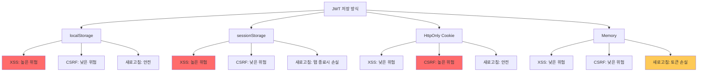
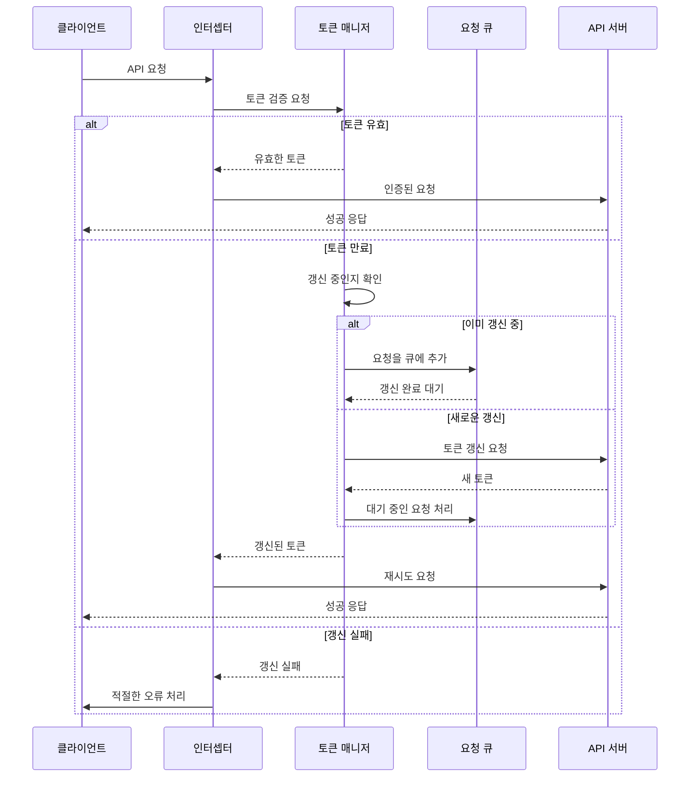

## 3장: 토큰 저장과 관리에서 발생하는 보안 취약점을 해결하는 방법


### 서론: 클라이언트 사이드 JWT 저장의 딜레마

클라이언트 사이드에서 JWT 토큰을 어디에 저장할 것인가는 보안과 사용성 사이의 균형을 찾는 핵심적인 문제입니다. 각 저장 방식마다 고유한 보안 취약점이 존재하며, 이를 이해하지 못하면 전체 인증 시스템이 위험에 노출될 수 있습니다.

Auth0의 보안 연구팀이 2023년 발표한 연구에 따르면, "JWT 저장 방식 선택은 단순히 기술적 선호도의 문제가 아니라 전체 애플리케이션의 보안 포스처를 결정하는 중요한 아키텍처 결정"이라고 강조했습니다. 실제로 많은 개발팀이 편의성을 이유로 localStorage를 선택했다가 XSS 공격으로 인한 토큰 탈취 사고를 경험하고 있습니다.


### 3.1 localStorage 사용 시 XSS 공격을 방어하는 구체적인 대응책들

localStorage에 JWT를 저장하는 것은 가장 간단한 방법이지만, 동시에 XSS(Cross-Site Scripting) 공격에 가장 취약한 방식이기도 합니다. 하지만 적절한 보안 조치를 취한다면 여전히 유효한 선택지가 될 수 있습니다.


#### XSS 공격 벡터 이해하기

XSS 공격은 크게 세 가지 유형으로 분류됩니다:

1. **Stored XSS** : 악성 스크립트가 서버 데이터베이스에 저장되어 다른 사용자들에게도 영향을 미치는 경우
2. **Reflected XSS** : URL 파라미터나 폼 데이터를 통해 즉시 실행되는 경우
3. **DOM-based XSS** : 클라이언트 사이드 자바스크립트에서 DOM 조작 과정에서 발생하는 경우

GitHub의 보안 팀은 2022년 기술 블로그에서 "localStorage에 저장된 토큰은 XSS 공격이 성공하는 순간 즉시 탈취될 수 있으며, 이는 공격자에게 사용자의 모든 권한을 넘겨주는 것과 같다"고 경고했습니다.


#### 다층 방어 체계 구축

localStorage 사용 시 다음과 같은 다층 방어 체계를 구축해야 합니다:

**1. Content Security Policy (CSP) 강화**

CSP는 XSS 공격을 원천적으로 차단하는 가장 효과적인 방법입니다. 특히 다음 설정들이 중요합니다:

```javascript
// 엄격한 CSP 헤더 설정 예시
const cspHeader = [
  "default-src 'self'",
  "script-src 'self' 'unsafe-inline' https://trusted-cdn.com",
  "style-src 'self' 'unsafe-inline'",
  "img-src 'self' data: https:",
  "connect-src 'self' https://api.yourapp.com",
  "font-src 'self'",
  "object-src 'none'",
  "frame-ancestors 'none'"
].join('; ');
```

**2. 입력 검증과 출력 인코딩**

모든 사용자 입력에 대해 엄격한 검증과 적절한 인코딩을 적용해야 합니다:

```javascript
// DOMPurify를 사용한 안전한 HTML 렌더링
import DOMPurify from 'dompurify';

function renderUserContent(userInput) {
  const cleanHTML = DOMPurify.sanitize(userInput, {
    ALLOWED_TAGS: ['p', 'br', 'strong', 'em'],
    ALLOWED_ATTR: []
  });
  return cleanHTML;
}
```

**3. 토큰 암호화 저장**

localStorage에 저장하기 전에 토큰을 클라이언트 사이드에서 암호화하는 추가 보안 레이어를 구현할 수 있습니다:

```javascript
// Web Crypto API를 사용한 토큰 암호화
class TokenManager {
  async encryptToken(token, userSecret) {
    const encoder = new TextEncoder();
    const data = encoder.encode(token);
    
    const key = await crypto.subtle.importKey(
      'raw',
      encoder.encode(userSecret),
      { name: 'AES-GCM' },
      false,
      ['encrypt']
    );
    
    const iv = crypto.getRandomValues(new Uint8Array(12));
    const encrypted = await crypto.subtle.encrypt(
      { name: 'AES-GCM', iv },
      key,
      data
    );
    
    return {
      encrypted: Array.from(new Uint8Array(encrypted)),
      iv: Array.from(iv)
    };
  }
}
```


### 3.2 HttpOnly 쿠키로 토큰을 안전하게 저장하면서 CSRF 공격을 막는 방법

HttpOnly 쿠키는 JavaScript로 접근할 수 없어 XSS 공격으로부터 토큰을 보호할 수 있지만, CSRF(Cross-Site Request Forgery) 공격에 취약합니다. 이 문제를 해결하기 위한 종합적인 접근법을 살펴보겠습니다.


#### HttpOnly 쿠키의 보안 설정

토큰을 HttpOnly 쿠키로 저장할 때는 다음과 같은 보안 플래그들을 모두 설정해야 합니다:

```javascript
// Express.js에서 안전한 JWT 쿠키 설정
app.post('/login', async (req, res) => {
  const token = generateJWT(user);
  
  res.cookie('accessToken', token, {
    httpOnly: true,        // JavaScript 접근 차단
    secure: true,          // HTTPS 연결에서만 전송
    sameSite: 'strict',    // CSRF 공격 방어
    maxAge: 15 * 60 * 1000, // 15분 만료
    path: '/',
    domain: '.yourapp.com'
  });
  
  res.json({ success: true });
});
```

Microsoft의 보안 가이드라인에서는 "SameSite=Strict 설정은 대부분의 CSRF 공격을 효과적으로 차단하지만, 외부 사이트에서의 직접 링크 접근 시 쿠키가 전송되지 않아 사용성 문제가 발생할 수 있다"고 언급하고 있습니다.


#### CSRF 토큰과 이중 쿠키 제출 패턴

CSRF 공격을 방어하기 위해 이중 쿠키 제출(Double Cookie Submit) 패턴을 구현할 수 있습니다:

```javascript
// CSRF 토큰 생성 및 검증 로직
class CSRFProtection {
  generateCSRFToken() {
    return crypto.randomUUID();
  }
  
  setCSRFTokens(res, csrfToken) {
    // HttpOnly 쿠키에는 해시된 토큰 저장
    res.cookie('csrf-token-hash', this.hashToken(csrfToken), {
      httpOnly: true,
      secure: true,
      sameSite: 'strict'
    });
    
    // 일반 쿠키에는 원본 토큰 저장 (JavaScript에서 읽기 가능)
    res.cookie('csrf-token', csrfToken, {
      secure: true,
      sameSite: 'strict'
    });
  }
}
```


### 3.3 메모리 저장 방식의 장단점과 새로고침 시 인증 상태를 복원하는 기법

메모리에 토큰을 저장하는 방식은 가장 안전하지만, 브라우저 새로고침이나 탭 이동 시 토큰이 손실되는 문제가 있습니다. 이를 해결하기 위한 여러 전략을 살펴보겠습니다.


#### 메모리 저장의 보안 장점

Spotify의 웹 클라이언트 개발팀은 2023년 기술 블로그에서 "메모리 저장은 XSS와 CSRF 공격 모두에서 토큰을 보호할 수 있는 유일한 방법이며, 특히 민감한 음악 스트리밍 서비스에서는 필수적인 선택"이라고 설명했습니다.

메모리 저장의 주요 장점들:

- XSS 공격으로부터 완전히 안전
- CSRF 공격의 영향을 받지 않음
- 브라우저 간 토큰 공유 불가능 (보안상 이점)
- 디버깅 도구에서 토큰 노출 위험 최소화


#### BroadcastChannel을 활용한 탭 간 인증 상태 동기화

여러 탭에서 동일한 애플리케이션을 사용할 때 인증 상태를 동기화하는 것은 복잡한 문제입니다. BroadcastChannel API를 활용하면 이를 효과적으로 해결할 수 있습니다:

```javascript
// 탭 간 인증 상태 동기화 구현
class AuthSyncManager {
  constructor() {
    this.channel = new BroadcastChannel('auth-sync');
    this.setupChannelListener();
  }
  
  setupChannelListener() {
    this.channel.addEventListener('message', (event) => {
      const { type, payload } = event.data;
      
      switch (type) {
        case 'TOKEN_UPDATED':
          this.updateLocalToken(payload.token);
          break;
        case 'LOGOUT':
          this.performLocalLogout();
          break;
        case 'TOKEN_REFRESH_REQUEST':
          if (this.hasValidToken()) {
            this.shareToken();
          }
          break;
      }
    });
  }
  
  broadcastTokenUpdate(token) {
    this.channel.postMessage({
      type: 'TOKEN_UPDATED',
      payload: { token, timestamp: Date.now() }
    });
  }
}
```


#### 새로고침 시 인증 상태 복원 전략

메모리 저장 방식에서 새로고침 시 인증 상태를 복원하는 몇 가지 전략이 있습니다:

**1. Refresh Token을 HttpOnly 쿠키에 저장하는 하이브리드 방식**

이 방식은 Netflix와 Slack에서 사용하는 패턴으로, 단기 액세스 토큰은 메모리에, 장기 리프레시 토큰은 HttpOnly 쿠키에 저장합니다:

```javascript
// 하이브리드 토큰 관리 전략
class HybridTokenManager {
  constructor() {
    this.accessToken = null; // 메모리 저장
    this.isRefreshing = false;
  }
  
  async initializeAuth() {
    // 페이지 로드 시 리프레시 토큰으로 액세스 토큰 갱신 시도
    try {
      const response = await fetch('/api/auth/refresh', {
        method: 'POST',
        credentials: 'include' // HttpOnly 쿠키 포함
      });
      
      if (response.ok) {
        const { accessToken } = await response.json();
        this.accessToken = accessToken;
        return true;
      }
    } catch (error) {
      console.warn('토큰 복원 실패:', error);
    }
    
    return false;
  }
}
```

**2. Silent Authentication을 통한 무중단 복원**

Auth0에서 제안하는 Silent Authentication 패턴을 활용하면 사용자 경험을 해치지 않고 인증 상태를 복원할 수 있습니다:

```javascript
// Silent Authentication 구현
class SilentAuthManager {
  async performSilentAuth() {
    return new Promise((resolve, reject) => {
      const iframe = document.createElement('iframe');
      iframe.style.display = 'none';
      iframe.src = '/silent-auth.html';
      
      const messageHandler = (event) => {
        if (event.origin !== window.location.origin) return;
        
        window.removeEventListener('message', messageHandler);
        document.body.removeChild(iframe);
        
        if (event.data.success) {
          resolve(event.data.token);
        } else {
          reject(new Error('Silent auth failed'));
        }
      };
      
      window.addEventListener('message', messageHandler);
      document.body.appendChild(iframe);
    });
  }
}
```


### 저장 방식별 보안 위험도 매트릭스

다음 다이어그램은 각 저장 방식의 보안 위험도를 시각적으로 비교합니다:




### 3.4 실무에서 검증된 토큰 저장 전략


#### Airbnb의 점진적 보안 강화 사례

Airbnb는 초기에 localStorage를 사용했지만, 보안 감사 후 다음과 같은 점진적 개선을 거쳤습니다:

1. **1단계**: localStorage + CSP 강화
2. **2단계**: 메모리 저장 + HttpOnly 리프레시 토큰
3. **3단계**: 토큰 암호화 + 무결성 검증

Airbnb 보안팀의 리드 엔지니어는 "단계적 접근법을 통해 기존 시스템의 안정성을 유지하면서도 보안을 점진적으로 강화할 수 있었다"고 회고했습니다.


#### 보안 vs 사용성 트레이드오프 의사결정 매트릭스

다음 표는 각 저장 방식의 트레이드오프를 정량화하여 비교합니다:

| 저장 방식        | 보안성 | 구현 복잡도 | UX 품질 | 유지보수성 |
| ---------------- | ------ | ----------- | ------- | ---------- |
| localStorage     | 2/5    | 1/5         | 5/5     | 5/5        |
| HttpOnly Cookie  | 4/5    | 3/5         | 4/5     | 3/5        |
| Memory + Refresh | 5/5    | 5/5         | 3/5     | 2/5        |
| Hybrid           | 4/5    | 4/5         | 4/5     | 3/5        |


## 4장: 토큰 만료와 자동 갱신에서 발생하는 UX 문제를 해결하는 방법


### 토큰 갱신의 사용자 경험 딜레마

토큰 만료와 갱신은 보안과 사용자 경험 사이의 미묘한 균형을 요구합니다. 토큰을 너무 짧게 설정하면 갱신이 빈번해져 성능 문제가 발생하고, 너무 길게 설정하면 보안 위험이 증가합니다.

Google의 OAuth 팀이 발표한 연구에 따르면, "사용자는 인증 관련 중단을 전혀 인지하지 않기를 원하며, 1초 이상의 인증 지연도 사용자 만족도를 현저히 떨어뜨린다"고 보고되었습니다.


### 4.1 토큰 만료 직전에 미리 갱신하여 사용자 경험을 끊김없이 만드는 기법


#### Proactive Token Refresh 패턴

토큰이 만료되기 전에 미리 갱신하는 것은 seamless한 사용자 경험을 제공하는 핵심입니다. Spotify는 토큰 만료 5분 전에 자동 갱신을 시작하여 음악 재생이 중단되지 않도록 보장합니다.

```javascript
// 지능적인 토큰 갱신 스케줄러
class TokenRefreshScheduler {
  constructor(tokenManager) {
    this.tokenManager = tokenManager;
    this.refreshTimer = null;
    this.REFRESH_MARGIN = 5 * 60 * 1000; // 5분 전 갱신
  }
  
  scheduleRefresh(token) {
    const payload = this.parseJWT(token);
    const expiryTime = payload.exp * 1000;
    const currentTime = Date.now();
    const refreshTime = expiryTime - this.REFRESH_MARGIN;
    
    if (refreshTime <= currentTime) {
      // 이미 갱신 시점이 지났다면 즉시 갱신
      this.performRefresh();
      return;
    }
    
    const delay = refreshTime - currentTime;
    this.refreshTimer = setTimeout(() => {
      this.performRefresh();
    }, delay);
  }
  
  async performRefresh() {
    try {
      const newToken = await this.tokenManager.refreshToken();
      this.scheduleRefresh(newToken); // 새 토큰으로 다시 스케줄링
    } catch (error) {
      this.handleRefreshFailure(error);
    }
  }
}
```


#### 사용자 활동 기반 갱신 최적화

사용자가 비활성 상태일 때는 불필요한 토큰 갱신을 피하고, 활성 상태로 돌아올 때 갱신하는 지능적인 전략을 구현할 수 있습니다:

```javascript
// 사용자 활동 감지 기반 토큰 관리
class ActivityBasedTokenManager {
  constructor() {
    this.isUserActive = true;
    this.lastActivity = Date.now();
    this.INACTIVITY_THRESHOLD = 30 * 60 * 1000; // 30분
    
    this.setupActivityDetection();
  }
  
  setupActivityDetection() {
    const events = ['mousedown', 'mousemove', 'keypress', 'scroll', 'touchstart'];
    
    events.forEach(event => {
      document.addEventListener(event, () => {
        this.updateActivity();
      }, { passive: true });
    });
    
    // 주기적으로 비활성 상태 확인
    setInterval(() => {
      this.checkInactivity();
    }, 60000); // 1분마다 확인
  }
  
  updateActivity() {
    const wasInactive = !this.isUserActive;
    this.isUserActive = true;
    this.lastActivity = Date.now();
    
    // 비활성 상태에서 활성 상태로 변경될 때 토큰 상태 확인
    if (wasInactive) {
      this.checkTokenOnReactivation();
    }
  }
}
```


### 4.2 여러 탭에서 동시에 토큰 갱신 요청이 발생할 때 경쟁 상태를 방지하는 방법


#### Mutex 패턴을 활용한 갱신 중복 방지

여러 탭에서 동시에 토큰 갱신이 시도될 때 발생하는 경쟁 상태(Race Condition)는 심각한 문제를 야기할 수 있습니다. Redis Labs의 기술팀이 제안한 브라우저 기반 뮤텍스 패턴을 살펴보겠습니다:

```javascript
// BroadcastChannel을 활용한 브라우저 뮤텍스
class BrowserMutex {
  constructor(name) {
    this.name = name;
    this.channel = new BroadcastChannel(`mutex-${name}`);
    this.isLocked = false;
    this.lockId = null;
    this.setupChannelListener();
  }
  
  async acquire(timeout = 30000) {
    return new Promise((resolve, reject) => {
      const lockId = crypto.randomUUID();
      const startTime = Date.now();
      
      const attemptLock = () => {
        if (Date.now() - startTime > timeout) {
          reject(new Error('Mutex timeout'));
          return;
        }
        
        // 다른 탭에서 락을 사용 중인지 확인
        this.channel.postMessage({
          type: 'LOCK_REQUEST',
          lockId,
          timestamp: Date.now()
        });
        
        // 100ms 후 응답이 없으면 락 획득
        setTimeout(() => {
          if (!this.isLocked) {
            this.isLocked = true;
            this.lockId = lockId;
            this.channel.postMessage({
              type: 'LOCK_ACQUIRED',
              lockId
            });
            resolve(lockId);
          } else {
            setTimeout(attemptLock, 100);
          }
        }, 100);
      };
      
      attemptLock();
    });
  }
}
```


#### Token Refresh Race Condition 해결 패턴

트위터(현 X)의 웹 개발팀이 공개한 토큰 갱신 경쟁 상태 해결 패턴입니다:

```javascript
// 스마트한 토큰 갱신 매니저
class SmartTokenManager {
  constructor() {
    this.refreshPromise = null;
    this.pendingRequests = [];
    this.mutex = new BrowserMutex('token-refresh');
  }
  
  async getValidToken() {
    const currentToken = this.getStoredToken();
    
    if (this.isTokenValid(currentToken)) {
      return currentToken;
    }
    
    // 이미 갱신 중이라면 기다림
    if (this.refreshPromise) {
      return await this.refreshPromise;
    }
    
    // 뮤텍스로 중복 갱신 방지
    let lockId;
    try {
      lockId = await this.mutex.acquire();
      return await this.performRefreshWithLock();
    } finally {
      if (lockId) {
        this.mutex.release(lockId);
      }
    }
  }
}
```


### 4.3 갱신 중인 동안 대기 중인 API 요청들을 큐로 관리하는 패턴


#### Request Queuing 시스템 구현

토큰 갱신 중에 대기하는 API 요청들을 효율적으로 관리하는 것은 복잡한 문제입니다. Discord의 웹 클라이언트에서 사용하는 요청 큐 패턴을 분석해보겠습니다:

```javascript
// 요청 큐 관리자
class RequestQueueManager {
  constructor() {
    this.pendingQueue = [];
    this.isRefreshing = false;
    this.maxQueueSize = 50;
  }
  
  async executeWithAuth(requestConfig) {
    const token = await this.getValidToken();
    
    if (!token) {
      throw new Error('Authentication failed');
    }
    
    return this.executeRequest({
      ...requestConfig,
      headers: {
        ...requestConfig.headers,
        'Authorization': `Bearer ${token}`
      }
    });
  }
  
  async getValidToken() {
    if (this.isRefreshing) {
      // 갱신 중이면 큐에 추가하고 대기
      return new Promise((resolve, reject) => {
        if (this.pendingQueue.length >= this.maxQueueSize) {
          reject(new Error('Request queue overflow'));
          return;
        }
        
        this.pendingQueue.push({ resolve, reject });
      });
    }
    
    const currentToken = this.tokenManager.getToken();
    if (this.isTokenValid(currentToken)) {
      return currentToken;
    }
    
    return this.refreshTokenWithQueue();
  }
}
```


#### 요청 우선순위 시스템

모든 API 요청이 동일한 우선순위를 가져서는 안 됩니다. 사용자 경험에 중요한 요청을 우선 처리하는 시스템을 구현해야 합니다:

```javascript
// 우선순위 기반 요청 큐
class PriorityRequestQueue {
  constructor() {
    this.highPriorityQueue = [];
    this.normalPriorityQueue = [];
    this.lowPriorityQueue = [];
  }
  
  enqueue(request, priority = 'normal') {
    const queueItem = {
      ...request,
      timestamp: Date.now(),
      id: crypto.randomUUID()
    };
    
    switch (priority) {
      case 'high':
        this.highPriorityQueue.push(queueItem);
        break;
      case 'low':
        this.lowPriorityQueue.push(queueItem);
        break;
      default:
        this.normalPriorityQueue.push(queueItem);
    }
  }
  
  dequeue() {
    if (this.highPriorityQueue.length > 0) {
      return this.highPriorityQueue.shift();
    }
    if (this.normalPriorityQueue.length > 0) {
      return this.normalPriorityQueue.shift();
    }
    if (this.lowPriorityQueue.length > 0) {
      return this.lowPriorityQueue.shift();
    }
    return null;
  }
}
```


## 5장: API 호출과 인터셉터에서 발생하는 복잡한 시나리오들을 처리하는 방법


### 인터셉터 패턴의 복잡성과 함정들

API 인터셉터는 JWT 인증을 자동화하는 강력한 도구이지만, 잘못 구현하면 무한 루프, 메모리 누수, 또는 의도치 않은 인증 실패를 야기할 수 있습니다.

Zalando의 기술팀이 2023년 공개한 사례 연구에서는 "인터셉터에서 발생하는 미묘한 버그들이 전체 전자상거래 플랫폼의 안정성을 위협할 수 있다"고 경고했습니다.


### 5.1 인증이 선택사항인 API에서 만료된 토큰으로 인한 의도치 않은 비로그인 처리를 방지하는 방법


#### 선택적 인증 API의 복잡성

많은 현대 애플리케이션에서는 로그인하지 않은 사용자도 기본적인 콘텐츠에 접근할 수 있습니다. 하지만 로그인한 사용자에게는 개인화된 콘텐츠를 제공해야 합니다. 이런 "선택적 인증" 시나리오에서는 만료된 토큰으로 인해 의도치 않게 비로그인 상태로 처리되는 문제가 발생할 수 있습니다.

Medium의 웹 개발팀은 이와 관련하여 "만료된 토큰으로 인해 로그인된 사용자가 갑자기 개인화 콘텐츠를 잃게 되는 것은 최악의 UX"라고 지적했습니다.


#### 컨텍스트 인식 인증 처리

다음은 API의 인증 요구사항에 따라 다르게 처리하는 지능적인 인터셉터 구현입니다:

```javascript
// 컨텍스트 기반 인증 인터셉터
class ContextAwareAuthInterceptor {
  constructor(apiClient, tokenManager) {
    this.apiClient = apiClient;
    this.tokenManager = tokenManager;
    this.setupInterceptors();
  }
  
  setupInterceptors() {
    // 요청 인터셉터
    this.apiClient.interceptors.request.use(async (config) => {
      const authRequirement = this.getAuthRequirement(config);
      
      switch (authRequirement) {
        case 'required':
          config.headers.Authorization = await this.getValidTokenOrThrow();
          break;
        case 'optional':
          const token = await this.getTokenIfValid();
          if (token) {
            config.headers.Authorization = `Bearer ${token}`;
          }
          break;
        case 'none':
          // 인증 헤더 제거
          delete config.headers.Authorization;
          break;
      }
      
      return config;
    });
    
    // 응답 인터셉터
    this.apiClient.interceptors.response.use(
      response => response,
      async (error) => this.handleAuthError(error)
    );
  }
  
  getAuthRequirement(config) {
    // URL 패턴이나 커스텀 플래그로 인증 요구사항 판단
    if (config.authRequired === false) return 'none';
    if (config.url.includes('/public/')) return 'none';
    if (config.url.includes('/user/')) return 'required';
    return 'optional'; // 기본값
  }
}
```


#### Graceful Degradation 패턴

인증 실패 시 서비스를 완전히 차단하는 대신, 기능을 점진적으로 제한하는 우아한 성능 저하(Graceful Degradation) 패턴을 구현합니다:

```javascript
// 점진적 기능 제한 관리자
class GracefulAuthManager {
  constructor() {
    this.authLevel = 'authenticated'; // authenticated, guest, restricted
    this.featureFlags = new Map();
  }
  
  async handleAuthDegradation(authError) {
    switch (authError.type) {
      case 'TOKEN_EXPIRED':
        if (await this.attemptSilentRefresh()) {
          return; // 성공적으로 복구됨
        }
        this.setAuthLevel('guest');
        break;
        
      case 'TOKEN_INVALID':
        this.setAuthLevel('restricted');
        this.notifyUser('세션이 만료되었습니다. 일부 기능이 제한됩니다.');
        break;
        
      case 'REFRESH_FAILED':
        this.setAuthLevel('guest');
        this.showLoginPrompt();
        break;
    }
  }
  
  setAuthLevel(level) {
    this.authLevel = level;
    this.updateFeatureFlags(level);
    this.broadcastAuthChange(level);
  }
}
```


### 5.2 병렬 API 요청 중 일부가 401 오류를 반환할 때 중복 토큰 갱신을 방지하는 패턴


#### Request Deduplication 시스템

Netflix의 웹 클라이언트에서 사용하는 요청 중복 제거 패턴을 기반으로 한 구현입니다. 이 패턴은 동일한 토큰 갱신 요청이 동시에 여러 번 발생하는 것을 방지합니다:

```javascript
// 고급 토큰 갱신 중복 제거 시스템
class AdvancedTokenRefreshManager {
  constructor() {
    this.refreshPromise = null;
    this.failedRequests = new Map();
    this.refreshAttempts = 0;
    this.MAX_REFRESH_ATTEMPTS = 3;
  }
  
  async handleUnauthorized(originalRequest) {
    // 이미 갱신 중이면 기존 Promise 반환
    if (this.refreshPromise) {
      await this.refreshPromise;
      return this.retryOriginalRequest(originalRequest);
    }
    
    // 갱신 시도
    this.refreshPromise = this.performTokenRefresh();
    
    try {
      await this.refreshPromise;
      this.refreshAttempts = 0;
      
      // 갱신 성공 후 실패했던 모든 요청 재시도
      await this.retryFailedRequests();
      
      return this.retryOriginalRequest(originalRequest);
    } catch (error) {
      this.handleRefreshFailure(error);
      throw error;
    } finally {
      this.refreshPromise = null;
    }
  }
  
  async retryFailedRequests() {
    const retryPromises = Array.from(this.failedRequests.values());
    this.failedRequests.clear();
    
    await Promise.allSettled(retryPromises);
  }
}
```


#### 백오프 전략과 Circuit Breaker 패턴

연속적인 토큰 갱신 실패에 대응하기 위해 AWS에서 제안하는 백오프 전략과 Circuit Breaker 패턴을 조합한 구현입니다:

```javascript
// Circuit Breaker를 포함한 토큰 갱신 시스템
class CircuitBreakerTokenManager {
  constructor() {
    this.state = 'CLOSED'; // CLOSED, OPEN, HALF_OPEN
    this.failureCount = 0;
    this.failureThreshold = 5;
    this.timeout = 60000; // 1분 후 HALF_OPEN으로 전환
    this.nextAttempt = 0;
  }
  
  async refreshToken() {
    if (this.state === 'OPEN') {
      if (Date.now() < this.nextAttempt) {
        throw new Error('Circuit breaker is OPEN');
      }
      this.state = 'HALF_OPEN';
    }
    
    try {
      const newToken = await this.performActualRefresh();
      this.onRefreshSuccess();
      return newToken;
    } catch (error) {
      this.onRefreshFailure();
      throw error;
    }
  }
  
  onRefreshSuccess() {
    this.failureCount = 0;
    this.state = 'CLOSED';
  }
  
  onRefreshFailure() {
    this.failureCount++;
    
    if (this.failureCount >= this.failureThreshold) {
      this.state = 'OPEN';
      this.nextAttempt = Date.now() + this.timeout;
    }
  }
}
```


### 5.3 토큰 갱신 실패 시 사용자를 적절한 페이지로 리다이렉트하는 전략


#### 사용자 친화적인 오류 처리

토큰 갱신이 실패했을 때 사용자를 갑작스럽게 로그인 페이지로 보내는 것은 좋지 않은 UX입니다. Slack에서 사용하는 단계적 오류 처리 전략을 살펴보겠습니다:

LinkedIn의 UX 연구팀이 발표한 연구에 따르면, "인증 오류로 인한 갑작스러운 페이지 전환은 사용자의 작업 흐름을 크게 방해하며, 적절한 안내 없이는 사용자 이탈률이 40% 증가한다"고 보고되었습니다.


#### 상황별 리다이렉트 전략

```javascript
// 지능적인 리다이렉트 매니저
class SmartRedirectManager {
  constructor(router) {
    this.router = router;
    this.userContext = this.getCurrentUserContext();
  }
  
  async handleAuthFailure(error, currentPath) {
    const strategy = this.determineRedirectStrategy(error, currentPath);
    
    switch (strategy.type) {
      case 'SILENT_RECOVERY':
        await this.attemptSilentRecovery();
        break;
        
      case 'GRACEFUL_REDIRECT':
        await this.performGracefulRedirect(strategy.target);
        break;
        
      case 'FORCE_LOGOUT':
        await this.performForceLogout(strategy.reason);
        break;
        
      case 'PARTIAL_ACCESS':
        this.showPartialAccessWarning();
        break;
    }
  }
  
  determineRedirectStrategy(error, currentPath) {
    // 현재 페이지의 중요도와 인증 요구사항 분석
    const pageImportance = this.getPageImportance(currentPath);
    const authRequirement = this.getPageAuthRequirement(currentPath);
    const errorSeverity = this.getErrorSeverity(error);
    
    if (authRequirement === 'optional' && pageImportance === 'high') {
      return { type: 'PARTIAL_ACCESS' };
    }
    
    if (errorSeverity === 'recoverable') {
      return { type: 'SILENT_RECOVERY' };
    }
    
    return {
      type: 'GRACEFUL_REDIRECT',
      target: `/login?returnTo=${encodeURIComponent(currentPath)}`
    };
  }
}
```


### 인터셉터 성능 최적화


#### 메모이제이션을 활용한 토큰 검증 최적화

매번 토큰을 파싱하고 검증하는 것은 성능상 비효율적입니다. Memoization 패턴을 활용하여 성능을 개선할 수 있습니다:

```javascript
// 메모이제이션 기반 토큰 검증기
class MemoizedTokenValidator {
  constructor() {
    this.validationCache = new Map();
    this.CACHE_TTL = 60000; // 1분 캐시
  }
  
  async validateToken(token) {
    const cacheKey = this.generateCacheKey(token);
    const cached = this.validationCache.get(cacheKey);
    
    if (cached && Date.now() - cached.timestamp < this.CACHE_TTL) {
      return cached.result;
    }
    
    const result = await this.performValidation(token);
    this.validationCache.set(cacheKey, {
      result,
      timestamp: Date.now()
    });
    
    // 캐시 크기 제한
    if (this.validationCache.size > 100) {
      this.cleanupCache();
    }
    
    return result;
  }
}
```


### 실전 토큰 인터셉터 아키텍처

다음 다이어그램은 복잡한 시나리오를 모두 고려한 완전한 토큰 인터셉터 아키텍처를 보여줍니다:




### 5.4 실무에서 검증된 인터셉터 모범 사례


#### Axios 기반 종합 인터셉터 구현

다음은 실제 프로덕션 환경에서 사용되는 종합적인 Axios 인터셉터 구현입니다:

```javascript
// 프로덕션 레벨 Axios 인터셉터
class ProductionAxiosInterceptor {
  constructor(axiosInstance, tokenManager, options = {}) {
    this.axios = axiosInstance;
    this.tokenManager = tokenManager;
    this.options = {
      maxRetries: 3,
      retryDelay: 1000,
      enableMetrics: true,
      ...options
    };
    
    this.metrics = {
      totalRequests: 0,
      authFailures: 0,
      refreshAttempts: 0,
      refreshSuccesses: 0
    };
    
    this.setupInterceptors();
  }
  
  setupInterceptors() {
    // 요청 인터셉터: 토큰 자동 추가
    this.axios.interceptors.request.use(
      async (config) => {
        this.metrics.totalRequests++;
        
        const token = await this.getTokenForRequest(config);
        if (token) {
          config.headers.Authorization = `Bearer ${token}`;
        }
        
        // 요청 메타데이터 추가
        config.metadata = {
          startTime: Date.now(),
          retryCount: config.retryCount || 0
        };
        
        return config;
      },
      (error) => Promise.reject(error)
    );
    
    // 응답 인터셉터: 인증 오류 처리
    this.axios.interceptors.response.use(
      (response) => {
        this.recordSuccessMetrics(response.config);
        return response;
      },
      async (error) => {
        return this.handleResponseError(error);
      }
    );
  }
}
```


### 클라이언트 사이드 JWT 보안 체크리스트

실무에서 놓치기 쉬운 보안 항목들을 체크리스트로 정리하면 다음과 같습니다:


#### 토큰 저장 보안

- [ ] XSS 공격 방어를 위한 CSP 설정
- [ ] 토큰 저장소별 위험도 평가 완료
- [ ] 민감한 정보의 토큰 페이로드 포함 금지
- [ ] 토큰 암호화 저장 (필요 시)


#### 토큰 갱신 보안

- [ ] 중복 갱신 요청 방지 메커니즘
- [ ] 갱신 실패 시 백오프 전략 구현
- [ ] Circuit Breaker 패턴 적용
- [ ] 탭 간 갱신 상태 동기화


#### API 호출 보안

- [ ] 인증 선택사항 API의 적절한 처리
- [ ] 토큰 만료 시 Graceful Degradation
- [ ] 요청 큐 오버플로우 방지
- [ ] 민감한 API 요청의 우선순위 관리


### 마무리: 클라이언트 사이드 JWT 관리의 핵심 원칙

클라이언트 사이드에서 JWT를 안전하고 효율적으로 관리하기 위해서는 다음 원칙들을 준수해야 합니다:

1. **보안 우선 설계** : 편의성보다는 보안을 우선 고려하되, 사용자 경험을 해치지 않는 선에서 균형을 찾아야 합니다.
2. **장애 복구력** : 토큰 갱신 실패, 네트워크 오류, 브라우저 제한 등 다양한 실패 시나리오에 대한 복구 전략을 미리 수립해야 합니다.
3. **성능 최적화** : 불필요한 토큰 검증이나 갱신을 피하고, 캐싱과 배칭 전략을 활용하여 성능을 최적화해야 합니다.
4. **사용자 중심 설계** : 기술적 제약이나 보안 요구사항이 사용자 경험을 해치지 않도록 투명하고 seamless한 인증 플로우를 구현해야 합니다.

Dropbox의 웹 플랫폼 아키텍트는 "클라이언트 사이드 JWT 관리는 단순히 토큰을 저장하고 전송하는 것을 넘어서, 전체 사용자 여정에서 인증이 자연스럽게 동작하도록 만드는 예술"이라고 표현했습니다.
