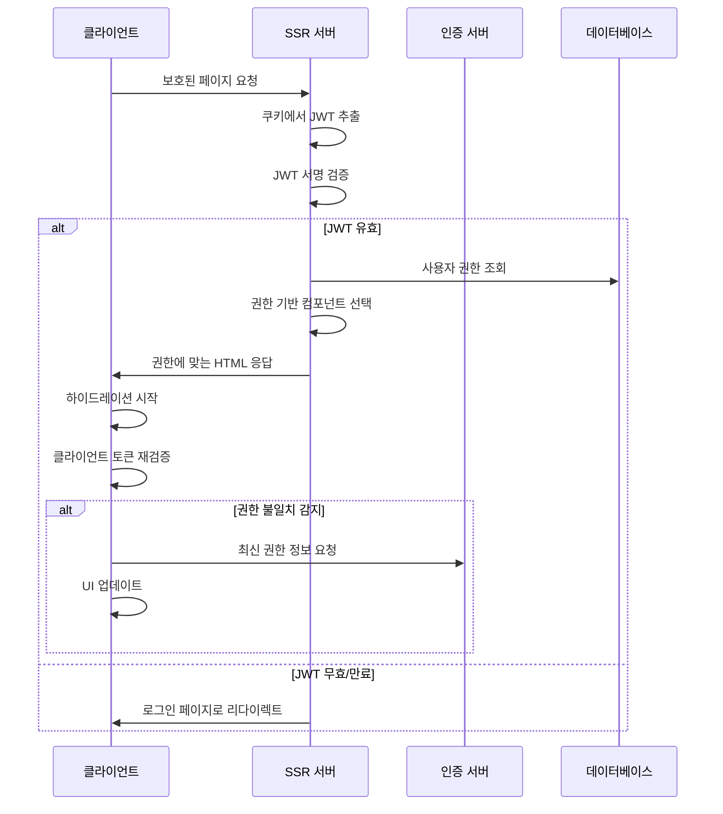
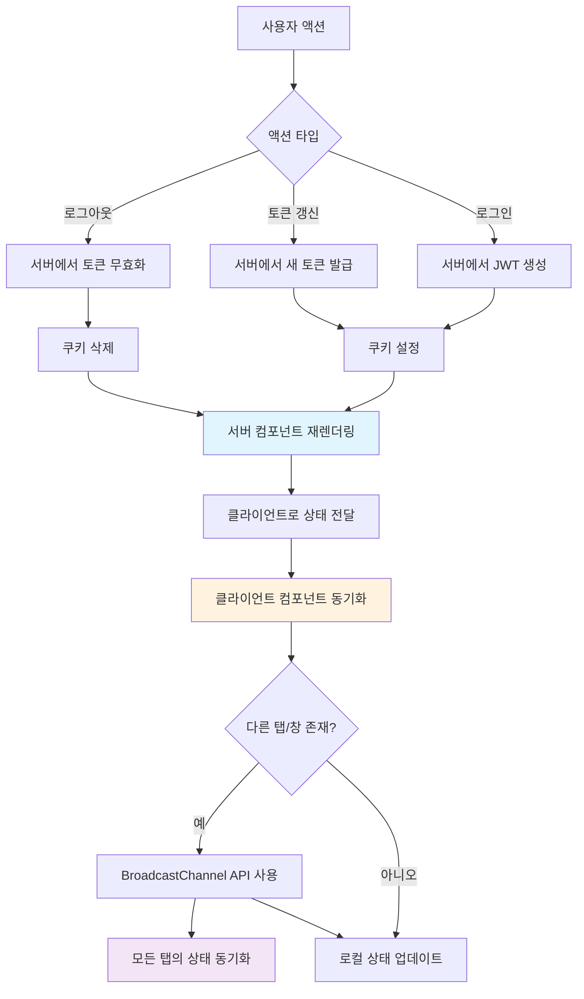

## 6장: SSR 환경에서 JWT 인증 상태를 일관성 있게 처리하는 방법

서버 사이드 렌더링 환경에서 JWT 인증을 처리하는 것은 단순한 클라이언트 사이드 애플리케이션과는 완전히 다른 차원의 복잡성을 가집니다. 서버에서 페이지를 미리 렌더링할 때 사용자의 인증 상태를 정확히 파악하고, 이를 클라이언트로 일관성 있게 전달하는 것은 현대 웹 개발에서 가장 까다로운 과제 중 하나입니다.

Meta의 React 팀이 2023년 발표한 서버 컴포넌트 아키텍처에서도 언급했듯이, "서버와 클라이언트 간의 상태 동기화는 사용자 경험의 핵심"입니다. 특히 JWT 인증의 경우, 토큰의 유효성 검증이 서버와 클라이언트에서 각각 다른 시점에 이루어지기 때문에 더욱 신중한 접근이 필요합니다.


### 6.1 서버에서 쿠키의 JWT를 검증하고 초기 렌더링에 반영하는 안전한 방법

SSR 환경에서 JWT 인증을 처리할 때 가장 먼저 해결해야 할 문제는 서버가 어떻게 사용자의 인증 상태를 파악할 것인가입니다. localStorage에 저장된 토큰은 서버에서 접근할 수 없기 때문에, SSR을 위해서는 반드시 쿠키를 통한 토큰 전달이 필요합니다.

그러나 단순히 쿠키에 JWT를 저장하는 것만으로는 충분하지 않습니다. GitHub의 엔지니어링 블로그에서 언급한 바와 같이, "서버에서의 토큰 검증은 클라이언트에서의 검증보다 훨씬 더 엄격해야 합니다". 서버는 네트워크 요청을 통해 들어오는 모든 쿠키를 신뢰할 수 없기 때문입니다.

안전한 서버 사이드 JWT 검증을 위해서는 다음과 같은 단계적 접근이 필요합니다. 먼저 쿠키에서 토큰을 추출할 때 XSS와 CSRF 공격을 모두 방어할 수 있는 설정을 사용해야 합니다. HttpOnly, Secure, SameSite 속성을 모두 적절히 설정하고, 토큰의 서명을 검증한 후에야 페이로드의 내용을 신뢰할 수 있습니다.

```javascript
// Next.js 서버 사이드에서의 안전한 JWT 검증
export async function getServerSideProps(context) {
  const { req } = context;
  const token = req.cookies.accessToken;
  
  if (!token) {
    return {
      props: { user: null, isAuthenticated: false }
    };
  }
  
  try {
    // 토큰 서명 검증 및 만료 시간 확인
    const decoded = jwt.verify(token, process.env.JWT_SECRET);
    const currentTime = Math.floor(Date.now() / 1000);
    
    if (decoded.exp < currentTime) {
      // 만료된 토큰은 즉시 삭제
      context.res.setHeader('Set-Cookie', [
        'accessToken=; Path=/; Expires=Thu, 01 Jan 1970 00:00:00 GMT; HttpOnly; Secure'
      ]);
      return { props: { user: null, isAuthenticated: false } };
    }
    
    return {
      props: { 
        user: { id: decoded.userId, email: decoded.email },
        isAuthenticated: true 
      }
    };
  } catch (error) {
    // 유효하지 않은 토큰 처리
    return { props: { user: null, isAuthenticated: false } };
  }
}
```

이러한 검증 과정에서 중요한 것은 서버에서 검증된 결과를 클라이언트로 전달할 때의 보안입니다. Shopify의 기술팀이 공유한 사례처럼, "서버에서 검증된 사용자 정보라 하더라도 클라이언트에서는 다시 한번 검증이 필요"합니다. 이는 중간자 공격이나 응답 변조 공격을 방어하기 위한 것입니다.


### 6.2 클라이언트 하이드레이션 시 서버와 클라이언트 인증 상태 불일치를 해결하는 기법

SSR 환경에서 가장 자주 발생하는 문제 중 하나는 하이드레이션 과정에서 서버와 클라이언트의 인증 상태가 일치하지 않는 현상입니다. 이는 사용자에게 깜빡임이나 잘못된 UI 상태를 보여주는 원인이 되며, 심각한 경우 보안 취약점으로 이어질 수 있습니다.

Vercel의 엔지니어링 팀이 Next.js 13에서 해결한 사례를 보면, 이 문제의 핵심은 "시간차"에 있습니다. 서버에서 페이지를 렌더링하는 시점과 클라이언트에서 하이드레이션이 완료되는 시점 사이에 토큰이 만료되거나, 사용자가 다른 탭에서 로그아웃을 수행하는 경우가 대표적인 예입니다.

이러한 문제를 해결하기 위해서는 "인증 상태 동기화 패턴"을 구현해야 합니다. 가장 효과적인 방법은 서버에서 전달받은 인증 정보를 클라이언트에서 즉시 재검증하되, 사용자에게는 깜빡임 없는 부드러운 전환을 제공하는 것입니다.

```javascript
// 하이드레이션 불일치 방지를 위한 인증 상태 관리
function useAuthSync(initialAuthState) {
  const [authState, setAuthState] = useState(initialAuthState);
  const [isHydrated, setIsHydrated] = useState(false);
  
  useEffect(() => {
    // 클라이언트에서 토큰 재검증
    const validateClientToken = async () => {
      const token = localStorage.getItem('accessToken');
      
      if (!token && initialAuthState.isAuthenticated) {
        // 서버는 인증된 상태였지만 클라이언트에는 토큰이 없음
        setAuthState({ user: null, isAuthenticated: false });
      } else if (token && !initialAuthState.isAuthenticated) {
        // 클라이언트에는 토큰이 있지만 서버는 인증되지 않은 상태
        try {
          const response = await fetch('/api/verify-token');
          if (response.ok) {
            const userData = await response.json();
            setAuthState({ user: userData, isAuthenticated: true });
          }
        } catch (error) {
          localStorage.removeItem('accessToken');
        }
      }
      
      setIsHydrated(true);
    };
    
    validateClientToken();
  }, [initialAuthState]);
  
  return { ...authState, isHydrated };
}
```

Netflix의 기술 블로그에서 소개한 "점진적 하이드레이션" 개념을 JWT 인증에 적용하면, 사용자에게는 즉시 콘텐츠를 보여주면서 백그라운드에서 인증 상태를 검증하는 방식을 구현할 수 있습니다. 이는 사용자 경험과 보안을 모두 만족시키는 균형점을 제공합니다.


### 6.3 Next.js, Remix, SvelteKit 등 프레임워크별 JWT 처리 모범 사례들

각 SSR 프레임워크는 고유한 라이프사이클과 아키텍처를 가지고 있어, JWT 인증을 구현할 때도 프레임워크별 특성을 고려한 접근이 필요합니다.

**Next.js에서의 JWT 처리**

Next.js는 App Router와 Pages Router라는 두 가지 다른 아키텍처를 제공하며, 각각에서 JWT 처리 방식이 다릅니다. App Router의 서버 컴포넌트 환경에서는 쿠키를 통한 JWT 검증이 필수적이며, 이를 위해 미들웨어를 활용한 중앙화된 인증 검증이 매우 효과적입니다.

```javascript
// Next.js 미들웨어를 통한 JWT 검증
export function middleware(request) {
  const token = request.cookies.get('accessToken')?.value;
  const { pathname } = request.nextUrl;
  
  // 보호된 경로 확인
  const protectedPaths = ['/dashboard', '/profile', '/admin'];
  const isProtectedPath = protectedPaths.some(path => 
    pathname.startsWith(path)
  );
  
  if (isProtectedPath && !token) {
    return NextResponse.redirect(new URL('/login', request.url));
  }
  
  if (token) {
    try {
      const decoded = jwt.verify(token, process.env.JWT_SECRET);
      // 사용자 정보를 헤더에 추가하여 서버 컴포넌트에서 사용
      const response = NextResponse.next();
      response.headers.set('x-user-id', decoded.userId);
      return response;
    } catch (error) {
      // 유효하지 않은 토큰 제거
      const response = NextResponse.redirect(new URL('/login', request.url));
      response.cookies.delete('accessToken');
      return response;
    }
  }
  
  return NextResponse.next();
}
```

**Remix에서의 JWT 처리**

Remix는 "웹 표준"을 강조하는 프레임워크로, Request와 Response 객체를 직접 다루는 방식을 선호합니다. Kent C. Dodds가 Remix 공식 블로그에서 강조했듯이, "Remix에서는 서버와 클라이언트 간의 경계가 명확하게 정의되어야 합니다". 이는 JWT 인증에서도 마찬가지로 적용됩니다.

```javascript
// Remix loader에서의 JWT 검증
export async function loader({ request }) {
  const cookieHeader = request.headers.get("Cookie");
  const cookies = parseCookies(cookieHeader);
  const token = cookies.accessToken;
  
  if (!token) {
    return json({ user: null, isAuthenticated: false });
  }
  
  try {
    const user = await verifyJWT(token);
    return json({ user, isAuthenticated: true });
  } catch (error) {
    // 만료되거나 유효하지 않은 토큰
    throw redirect("/login", {
      headers: {
        "Set-Cookie": "accessToken=; Max-Age=0; Path=/; HttpOnly"
      }
    });
  }
}
```

**SvelteKit에서의 JWT 처리**

SvelteKit은 "universal" 접근 방식을 취하여 서버와 클라이언트에서 동일한 코드를 실행할 수 있도록 설계되었습니다. Rich Harris가 Svelte Summit에서 발표한 내용에 따르면, "SvelteKit의 hooks 시스템은 인증과 같은 횡단 관심사를 처리하기에 이상적"입니다.

```javascript
// SvelteKit hooks.server.js에서의 JWT 처리
export async function handle({ event, resolve }) {
  const token = event.cookies.get('accessToken');
  
  if (token) {
    try {
      const payload = jwt.verify(token, JWT_SECRET);
      event.locals.user = {
        id: payload.userId,
        email: payload.email
      };
    } catch (error) {
      // 유효하지 않은 토큰은 제거
      event.cookies.delete('accessToken', { path: '/' });
      event.locals.user = null;
    }
  } else {
    event.locals.user = null;
  }
  
  const response = await resolve(event);
  return response;
}
```

이러한 프레임워크별 접근 방식의 공통점은 모두 서버에서 토큰을 검증하고, 그 결과를 클라이언트로 안전하게 전달하는 메커니즘을 제공한다는 것입니다. 하지만 각 프레임워크의 철학과 아키텍처에 따라 구현 방식에는 차이가 있으므로, 팀의 기술 스택과 요구사항에 맞는 방식을 선택하는 것이 중요합니다.


### 6.4 SSR 환경에서의 토큰 갱신 처리 전략

SSR 환경에서 토큰 갱신은 특히 까다로운 문제입니다. 서버에서 페이지를 렌더링하는 동안 액세스 토큰이 만료되었다면, 리프레시 토큰을 사용하여 새로운 토큰을 발급받아야 합니다. 그런데 이 과정에서 서버는 외부 API에 요청을 보내야 하므로, 페이지 렌더링 시간이 증가할 수 있습니다.

Airbnb의 기술팀이 Medium에 공유한 사례에 따르면, "토큰 갱신은 사용자가 인지할 수 없을 정도로 빨라야 하며, 실패 시에도 적절한 fallback이 준비되어야 합니다". 이를 위해 다음과 같은 전략을 사용할 수 있습니다.

먼저, 토큰 만료 시점을 미리 예측하여 서버에서 선제적으로 갱신을 시도하는 방법입니다. 액세스 토큰의 만료 시간이 5분 이내로 남았다면, 서버에서 즉시 리프레시 토큰을 사용하여 새로운 토큰을 발급받습니다. 이때 중요한 것은 갱신 과정에서 발생할 수 있는 네트워크 지연을 최소화하는 것입니다.

```javascript
// 서버에서의 선제적 토큰 갱신
async function refreshTokenIfNeeded(accessToken, refreshToken) {
  try {
    const decoded = jwt.decode(accessToken);
    const currentTime = Math.floor(Date.now() / 1000);
    const timeUntilExpiry = decoded.exp - currentTime;
    
    // 5분 이내 만료 예정이면 갱신
    if (timeUntilExpiry < 300) {
      const response = await fetch(`${AUTH_SERVER}/refresh`, {
        method: 'POST',
        headers: { 'Content-Type': 'application/json' },
        body: JSON.stringify({ refreshToken }),
        timeout: 3000 // 3초 타임아웃
      });
      
      if (response.ok) {
        const { accessToken: newToken } = await response.json();
        return { token: newToken, refreshed: true };
      }
    }
    
    return { token: accessToken, refreshed: false };
  } catch (error) {
    return { token: null, refreshed: false };
  }
}
```


### 6.5 서버 사이드 렌더링에서의 권한 기반 라우팅 구현

SSR 환경에서 사용자의 권한에 따라 다른 페이지나 컴포넌트를 렌더링하는 것은 매우 중요한 기능입니다. 단순히 클라이언트에서 권한을 확인하는 것과 달리, 서버에서는 SEO와 초기 로딩 성능을 고려하여 권한에 따른 적절한 콘텐츠를 미리 렌더링해야 합니다.

Stripe의 개발팀이 공개한 아키텍처 문서에서 언급했듯이, "권한 검증은 가능한 한 서버에서 수행하되, 클라이언트에서의 추가 검증을 통해 이중 보안을 구축하는 것이 이상적"입니다. 이를 위해서는 JWT 페이로드에 포함된 역할 정보를 서버에서 신뢰성 있게 검증하고, 이를 바탕으로 적절한 콘텐츠를 렌더링해야 합니다.

다음 다이어그램은 SSR 환경에서의 권한 기반 라우팅 플로우를 보여줍니다:



실제 구현에서는 권한 정보를 JWT 페이로드에 직접 포함하는 것보다는, 사용자 ID만을 포함하고 서버에서 데이터베이스를 통해 최신 권한 정보를 조회하는 방식을 권장합니다. Auth0의 아키텍처 가이드에서 지적했듯이, "JWT에 권한 정보를 포함하면 권한 변경 시 즉시 반영되지 않는 문제가 발생"하기 때문입니다.


### 6.6 SSR 성능 최적화를 위한 JWT 캐싱 전략

서버에서 JWT를 검증하고 사용자 정보를 조회하는 과정은 매 요청마다 반복되므로, 성능 최적화가 매우 중요합니다. 특히 트래픽이 많은 서비스에서는 데이터베이스 조회와 JWT 검증 로직이 병목점이 될 수 있습니다.

Discord의 엔지니어링 팀이 공유한 사례에 따르면, "JWT 검증 결과를 적절히 캐싱하면 서버 응답 시간을 70% 이상 단축할 수 있습니다". 하지만 보안과 데이터 일관성을 고려하여 캐싱 전략을 신중하게 설계해야 합니다.

효과적인 캐싱 전략은 다음과 같은 계층으로 구성됩니다. 첫 번째 계층은 JWT 서명 검증 결과를 메모리에 캐싱하는 것입니다. 동일한 토큰에 대한 서명 검증을 반복하지 않음으로써 CPU 사용량을 크게 줄일 수 있습니다. 두 번째 계층은 사용자 정보를 Redis와 같은 인메모리 데이터베이스에 캐싱하는 것입니다.

```javascript
// Redis를 활용한 JWT 검증 결과 캐싱
const jwt = require('jsonwebtoken');
const redis = require('redis');
const client = redis.createClient();

async function verifyJWTWithCache(token) {
  // 토큰 해시를 캐시 키로 사용
  const tokenHash = crypto
    .createHash('sha256')
    .update(token)
    .digest('hex');
  
  const cacheKey = `jwt:${tokenHash}`;
  
  // 캐시된 검증 결과 확인
  const cached = await client.get(cacheKey);
  if (cached) {
    const result = JSON.parse(cached);
    // 만료 시간 재확인
    if (result.exp > Math.floor(Date.now() / 1000)) {
      return result;
    } else {
      await client.del(cacheKey);
    }
  }
  
  // 캐시 미스 시 JWT 검증 수행
  try {
    const decoded = jwt.verify(token, process.env.JWT_SECRET);
    
    // 검증 결과를 캐시에 저장 (만료 시간까지)
    const ttl = decoded.exp - Math.floor(Date.now() / 1000);
    await client.setex(cacheKey, ttl, JSON.stringify(decoded));
    
    return decoded;
  } catch (error) {
    throw new Error('Invalid token');
  }
}
```

Amazon의 프라임 비디오 팀이 공개한 마이크로서비스 아키텍처에서는 "인증 서비스를 별도로 분리하여 모든 SSR 서버가 공통으로 사용하는 패턴"을 사용합니다. 이를 통해 JWT 검증 로직의 일관성을 보장하면서도 각 서비스의 독립성을 유지할 수 있습니다.


## 7장: 서버 컴포넌트와 클라이언트 컴포넌트 간 JWT 데이터를 안전하게 공유하는 방법

React 서버 컴포넌트와 클라이언트 컴포넌트 간의 데이터 공유는 JWT 인증 시스템에서 새로운 차원의 복잡성을 만들어냅니다. 서버에서 검증된 인증 정보를 클라이언트로 전달하면서도 보안을 유지하고, 두 환경 간의 상태 불일치를 방지하는 것은 현대 웹 개발의 핵심 과제입니다.

Facebook(현 Meta)의 React 팀이 2022년 발표한 서버 컴포넌트 RFC에서 강조했듯이, "서버와 클라이언트 간의 경계는 보안의 경계이기도 합니다". 따라서 JWT 데이터를 공유할 때는 단순히 기능적 측면만이 아니라 보안적 측면도 깊이 고려해야 합니다.


### 7.1 서버에서 검증된 사용자 정보를 클라이언트로 안전하게 전달하는 패턴들

서버 컴포넌트에서 검증된 사용자 정보를 클라이언트 컴포넌트로 전달하는 것은 생각보다 복잡한 과정입니다. 가장 일반적인 실수는 민감한 정보를 포함한 전체 JWT 페이로드를 클라이언트로 전달하는 것입니다. 이는 클라이언트 사이드에서 소스 코드를 통해 정보가 노출될 수 있는 심각한 보안 위험을 만듭니다.

Shopify의 보안팀이 개발자 문서에서 권장하는 방법은 "최소 권한 원칙"을 적용하는 것입니다. 서버에서는 전체 JWT를 검증하지만, 클라이언트로는 해당 페이지에서 실제로 필요한 정보만을 선별하여 전달합니다. 예를 들어, 사용자 프로필 페이지에서는 사용자 이름과 이메일만 필요하다면, 역할이나 권한 정보는 클라이언트로 전달하지 않습니다.

```javascript
// 서버 컴포넌트에서의 안전한 사용자 정보 추출
async function getUserSafeData(jwt) {
  try {
    const fullPayload = jwt.verify(token, process.env.JWT_SECRET);
    
    // 클라이언트에 전달할 안전한 정보만 선별
    return {
      id: fullPayload.userId,
      email: fullPayload.email,
      displayName: fullPayload.displayName,
      // 역할, 권한, 내부 ID 등은 제외
      lastLoginAt: fullPayload.lastLogin
    };
  } catch (error) {
    return null;
  }
}

// 서버 컴포넌트
export default async function DashboardPage() {
  const userSafeData = await getUserSafeData(cookies().get('accessToken'));
  
  if (!userSafeData) {
    redirect('/login');
  }
  
  return (
    <div>
      <UserProfile userData={userSafeData} />
      <ClientSideFeatures userId={userSafeData.id} />
    </div>
  );
}
```

또 다른 중요한 패턴은 "데이터 serialization" 검증입니다. 서버에서 클라이언트로 전달되는 모든 데이터는 JSON으로 직렬화되는 과정을 거치므로, 이 과정에서 의도치 않은 정보 누출이 발생할 수 있습니다. TypeScript를 사용한다면, 클라이언트로 전달할 데이터 타입을 명시적으로 정의하여 이러한 실수를 방지할 수 있습니다.


### 7.2 API 라우트에서 JWT 검증 로직을 재사용 가능하게 모듈화하는 방법

대규모 애플리케이션에서는 수십 개의 API 엔드포인트가 JWT 검증을 필요로 합니다. 각 엔드포인트마다 검증 로직을 중복 구현하는 것은 유지보수성과 보안성 모두에 문제가 됩니다. LinkedIn의 백엔드 아키텍처 문서에서 설명한 "인증 미들웨어 패턴"은 이러한 문제를 해결하는 효과적인 방법입니다.

재사용 가능한 JWT 검증 미들웨어를 설계할 때는 다음과 같은 요소들을 고려해야 합니다. 첫째, 다양한 권한 수준에 대응할 수 있는 유연성이 필요합니다. 일부 API는 로그인만 확인하면 되지만, 다른 API는 특정 역할이나 권한이 필요할 수 있습니다. 둘째, 에러 처리가 일관성 있게 이루어져야 합니다. 모든 API 엔드포인트에서 인증 실패 시 동일한 형태의 응답을 반환해야 합니다.

```javascript
// 재사용 가능한 JWT 미들웨어
function createJWTMiddleware(options = {}) {
  const {
    requiredRoles = [],
    allowExpiredToken = false,
    extractUserData = true
  } = options;
  
  return async (req, res, next) => {
    try {
      const token = extractTokenFromRequest(req);
      
      if (!token) {
        return res.status(401).json({ 
          error: 'MISSING_TOKEN',
          message: 'Authentication token is required'
        });
      }
      
      const decoded = jwt.verify(token, process.env.JWT_SECRET);
      
      // 권한 확인
      if (requiredRoles.length > 0) {
        const userRoles = decoded.roles || [];
        const hasRequiredRole = requiredRoles.some(role => 
          userRoles.includes(role)
        );
        
        if (!hasRequiredRole) {
          return res.status(403).json({
            error: 'INSUFFICIENT_PERMISSIONS',
            message: 'Required role not found'
          });
        }
      }
      
      // 사용자 정보를 request 객체에 추가
      if (extractUserData) {
        req.user = {
          id: decoded.userId,
          email: decoded.email,
          roles: decoded.roles
        };
      }
      
      next();
    } catch (error) {
      if (error.name === 'TokenExpiredError') {
        return res.status(401).json({
          error: 'TOKEN_EXPIRED',
          message: 'Token has expired'
        });
      } else if (error.name === 'JsonWebTokenError') {
        return res.status(401).json({
          error: 'INVALID_TOKEN',
          message: 'Token is invalid'
        });
      }
      
      return res.status(500).json({
        error: 'AUTH_ERROR',
        message: 'Authentication verification failed'
      });
    }
  };
}

// 사용 예시
app.get('/api/profile', 
  createJWTMiddleware(), 
  profileController
);

app.get('/api/admin/users', 
  createJWTMiddleware({ requiredRoles: ['admin'] }),
  adminController
);
```

이러한 미들웨어 패턴의 장점은 일관성과 재사용성뿐만 아니라 테스트 용이성에도 있습니다. Uber의 테스팅 가이드라인에서 강조하듯이, "인증 로직이 중앙화되어 있으면 단위 테스트와 통합 테스트 모두 작성하기가 훨씬 쉬워집니다".


### 7.3 서버 액션에서 JWT 기반 권한 검증을 효율적으로 처리하는 방법

Next.js 13 이후 도입된 서버 액션은 폼 제출과 데이터 변경 작업을 서버에서 직접 처리할 수 있게 해주는 혁신적인 기능입니다. 그러나 서버 액션에서 JWT 인증을 처리할 때는 기존의 API 라우트와는 다른 접근이 필요합니다.

Vercel의 개발팀이 Next.js 문서에서 설명한 바와 같이, "서버 액션은 POST 요청을 통해 실행되며, 이때 CSRF 토큰과 JWT 인증을 모두 고려해야 합니다". 서버 액션은 일반적인 fetch 요청과 달리 폼 데이터로 전송되므로, JWT 토큰도 다른 방식으로 처리해야 합니다.

서버 액션에서의 JWT 검증은 다음과 같은 패턴을 따르는 것이 좋습니다. 먼저, 액션 함수 내부에서 쿠키로부터 JWT를 추출하고 검증합니다. 그 다음, 검증된 사용자 정보를 바탕으로 해당 액션을 수행할 권한이 있는지 확인합니다. 마지막으로, 권한이 확인되면 실제 데이터 변경 작업을 수행합니다.

```javascript
// 서버 액션에서의 JWT 검증 패턴
async function updateProfileAction(formData) {
  'use server';
  
  const token = cookies().get('accessToken')?.value;
  
  if (!token) {
    return {
      error: 'AUTHENTICATION_REQUIRED',
      message: '로그인이 필요합니다.'
    };
  }
  
  try {
    const decoded = jwt.verify(token, process.env.JWT_SECRET);
    const requestedUserId = formData.get('userId');
    
    // 자기 자신의 프로필만 수정 가능하도록 검증
    if (decoded.userId !== requestedUserId) {
      return {
        error: 'PERMISSION_DENIED',
        message: '다른 사용자의 프로필을 수정할 권한이 없습니다.'
      };
    }
    
    // 실제 프로필 업데이트 로직
    const updatedProfile = await updateUserProfile(decoded.userId, {
      displayName: formData.get('displayName'),
      bio: formData.get('bio')
    });
    
    revalidatePath('/profile');
    
    return {
      success: true,
      data: updatedProfile
    };
    
  } catch (error) {
    if (error.name === 'TokenExpiredError') {
      return {
        error: 'TOKEN_EXPIRED',
        message: '세션이 만료되었습니다. 다시 로그인해주세요.'
      };
    }
    
    return {
      error: 'AUTH_ERROR',
      message: '인증 확인 중 오류가 발생했습니다.'
    };
  }
}
```

Pinterest의 엔지니어링 블로그에서 공유한 사례처럼, 서버 액션에서의 인증 검증은 "사용자 친화적인 오류 메시지"와 함께 제공되어야 합니다. 특히 토큰 만료 상황에서는 사용자가 현재 작업을 잃지 않도록 적절한 안내와 복구 방안을 제시해야 합니다.


### 7.4 서버와 클라이언트 간 인증 상태 동기화 전략

서버 컴포넌트와 클라이언트 컴포넌트가 혼재하는 현대적인 React 애플리케이션에서는 인증 상태의 동기화가 매우 중요합니다. 서버에서 인증된 사용자라 하더라도, 클라이언트에서 추가적인 인증이 필요한 작업을 수행할 때는 일관된 인증 상태를 유지해야 합니다.

Cloudflare의 개발팀이 공개한 아키텍처 문서에서 제시한 "하이브리드 인증 패턴"은 이러한 문제를 해결하는 효과적인 방법입니다. 이 패턴의 핵심은 서버에서 검증된 인증 정보를 "인증 증명서"의 형태로 클라이언트에 전달하고, 클라이언트에서는 이 증명서를 바탕으로 추가적인 인증 작업을 수행하는 것입니다.

```javascript
// 서버에서 클라이언트로 안전한 인증 정보 전달
// 서버 컴포넌트
async function DashboardServerComponent() {
  const token = cookies().get('accessToken')?.value;
  const userAuth = await verifyServerToken(token);
  
  if (!userAuth) {
    redirect('/login');
  }
  
  // 클라이언트에서 사용할 제한된 인증 정보 생성
  const clientAuthData = {
    userId: userAuth.userId,
    sessionId: userAuth.sessionId,
    // 클라이언트 인증용 임시 토큰 (짧은 만료 시간)
    clientToken: generateClientToken(userAuth.userId, '15m')
  };
  
  return (
    <div>
      <h1>대시보드</h1>
      <ClientInteractiveComponent authData={clientAuthData} />
    </div>
  );
}

// 클라이언트 컴포넌트
'use client';
function ClientInteractiveComponent({ authData }) {
  const [user, setUser] = useState(null);
  
  useEffect(() => {
    // 서버에서 받은 인증 정보로 클라이언트 인증 설정
    if (authData.clientToken) {
      localStorage.setItem('clientToken', authData.clientToken);
      fetchUserProfile(authData.userId);
    }
  }, [authData]);
  
  const handleSensitiveAction = async () => {
    // 민감한 작업 수행 시 서버 토큰 재검증
    const serverToken = getCookie('accessToken');
    const clientToken = localStorage.getItem('clientToken');
    
    const response = await fetch('/api/sensitive-action', {
      headers: {
        'Authorization': `Bearer ${serverToken}`,
        'X-Client-Token': clientToken
      }
    });
    
    // 응답 처리...
  };
  
  return (
    <div>
      {/* 클라이언트 인터랙션 UI */}
    </div>
  );
}
```

이 패턴의 핵심은 서버와 클라이언트에서 각각 다른 용도의 토큰을 사용하면서도, 두 토큰이 같은 세션을 참조하도록 하는 것입니다. Spotify의 웹 클라이언트 팀이 공개한 사례처럼, "이중 토큰 검증을 통해 서버와 클라이언트 모두에서 안전성을 보장"할 수 있습니다.


### 7.5 서버 컴포넌트와 클라이언트 컴포넌트 간 실시간 인증 상태 동기화

현대적인 웹 애플리케이션에서는 사용자가 여러 탭을 열어두고 작업하는 경우가 일반적입니다. 이때 한 탭에서 로그아웃하거나 토큰이 갱신되면, 다른 탭의 서버 컴포넌트와 클라이언트 컴포넌트 모두에서 이러한 변화를 감지하고 적절히 대응해야 합니다.

Slack의 실시간 동기화 아키텍처에서 영감을 얻은 방법은 "인증 상태 브로드캐스팅 패턴"을 사용하는 것입니다. 이 패턴에서는 인증 상태 변경 시 서버 컴포넌트와 클라이언트 컴포넌트가 모두 동기화될 수 있도록 중앙화된 상태 관리 시스템을 구축합니다.

다음 다이어그램은 서버와 클라이언트 간 실시간 인증 상태 동기화 플로우를 보여줍니다:



실제 구현에서는 BroadcastChannel API를 사용하여 같은 origin의 다른 탭들과 인증 상태를 동기화할 수 있습니다. Discord의 웹 클라이언트가 사용하는 방식처럼, 토큰 변경이나 로그아웃 이벤트를 모든 탭에 브로드캐스트하여 일관된 사용자 경험을 제공할 수 있습니다.

```javascript
// 다중 탭 인증 상태 동기화
class AuthStateBroadcast {
  constructor() {
    this.channel = new BroadcastChannel('auth-state');
    this.setupListeners();
  }
  
  setupListeners() {
    this.channel.addEventListener('message', (event) => {
      const { type, payload } = event.data;
      
      switch (type) {
        case 'TOKEN_UPDATED':
          this.handleTokenUpdate(payload.token);
          break;
        case 'LOGOUT':
          this.handleLogout();
          break;
        case 'USER_ROLE_CHANGED':
          this.handleRoleChange(payload.roles);
          break;
      }
    });
  }
  
  broadcastTokenUpdate(newToken) {
    this.channel.postMessage({
      type: 'TOKEN_UPDATED',
      payload: { token: newToken }
    });
  }
  
  broadcastLogout() {
    this.channel.postMessage({
      type: 'LOGOUT',
      payload: {}
    });
  }
  
  handleTokenUpdate(newToken) {
    localStorage.setItem('accessToken', newToken);
    // 현재 페이지의 인증 상태 업데이트
    window.location.reload();
  }
  
  handleLogout() {
    localStorage.removeItem('accessToken');
    localStorage.removeItem('refreshToken');
    window.location.href = '/login';
  }
}
```


### 7.6 마이크로 프론트엔드 환경에서의 JWT 상태 관리

대규모 조직에서는 마이크로 프론트엔드 아키텍처를 사용하여 여러 팀이 독립적으로 개발한 애플리케이션을 통합하는 경우가 많습니다. 이런 환경에서 JWT 인증 상태를 일관성 있게 관리하는 것은 매우 복잡한 과제입니다.

Microsoft의 Office 365 팀이 공개한 아키텍처 문서에서 제시한 "인증 오케스트레이션 패턴"은 이러한 환경에서 효과적인 해결책을 제공합니다. 중앙 인증 서비스가 모든 마이크로 프론트엔드에 인증 정보를 배포하고, 각 애플리케이션은 자신의 도메인에서만 유효한 제한된 토큰을 사용하는 방식입니다.

```javascript
// 마이크로 프론트엔드 인증 오케스트레이터
class MicroFrontendAuthManager {
  constructor(config) {
    this.authDomain = config.authDomain;
    this.currentDomain = config.currentDomain;
    this.eventBus = new EventTarget();
  }
  
  async initializeAuth() {
    // 중앙 인증 서비스에서 현재 도메인용 토큰 요청
    try {
      const response = await fetch(`${this.authDomain}/api/delegate-token`, {
        credentials: 'include',
        headers: {
          'X-Target-Domain': this.currentDomain
        }
      });
      
      if (response.ok) {
        const { delegatedToken } = await response.json();
        this.setLocalToken(delegatedToken);
        this.broadcastAuthState('AUTHENTICATED');
      } else {
        this.broadcastAuthState('UNAUTHENTICATED');
      }
    } catch (error) {
      console.error('Auth initialization failed:', error);
      this.broadcastAuthState('ERROR');
    }
  }
  
  setLocalToken(token) {
    // 도메인별 토큰을 안전하게 저장
    const tokenData = {
      token,
      domain: this.currentDomain,
      timestamp: Date.now()
    };
    
    localStorage.setItem('domain-token', JSON.stringify(tokenData));
  }
  
  broadcastAuthState(state) {
    this.eventBus.dispatchEvent(new CustomEvent('auth-state-change', {
      detail: { state, timestamp: Date.now() }
    }));
  }
}
```

이러한 아키텍처의 장점은 각 마이크로 프론트엔드가 독립적으로 동작하면서도 중앙화된 인증 상태를 공유할 수 있다는 것입니다. Zalando의 기술팀이 공개한 사례처럼, "도메인별 토큰 위임을 통해 보안성과 독립성을 모두 확보"할 수 있습니다.


### 7.7 SSR 환경에서의 인증 오류 처리와 사용자 경험 개선

SSR 환경에서 JWT 인증 오류가 발생했을 때 사용자에게 어떤 경험을 제공할 것인가는 애플리케이션의 품질을 결정하는 중요한 요소입니다. 서버에서 렌더링 중 인증 오류가 발생하면, 클라이언트로 전달할 정보와 처리 방식을 신중하게 결정해야 합니다.

Twitch의 개발팀이 공유한 사례에 따르면, "인증 오류 시에도 사용자가 현재 페이지의 컨텍스트를 잃지 않도록 하는 것이 중요"합니다. 예를 들어, 사용자가 특정 콘텐츠를 보려고 했을 때 토큰이 만료되었다면, 로그인 후 원래 페이지로 돌아올 수 있도록 해야 합니다.

```javascript
// 인증 오류 시 사용자 경험을 고려한 처리
export default async function ProtectedPage({ params }) {
  try {
    const userAuth = await verifyServerAuth();
    
    if (!userAuth) {
      // 현재 URL을 저장하여 로그인 후 리다이렉트
      const currentUrl = headers().get('x-pathname') || '/';
      const encodedUrl = encodeURIComponent(currentUrl);
      
      redirect(`/login?returnTo=${encodedUrl}`);
    }
    
    const pageData = await fetchProtectedData(userAuth.userId);
    
    return (
      <div>
        <ProtectedContent data={pageData} user={userAuth} />
      </div>
    );
    
  } catch (error) {
    if (error.type === 'TOKEN_EXPIRED') {
      // 토큰 만료 시 갱신 시도
      return (
        <AuthRefreshBoundary 
          fallbackUrl="/login"
          currentPath={params.path}
        />
      );
    }
    
    // 기타 인증 오류
    return (
      <AuthErrorFallback 
        error={error}
        loginUrl="/login"
      />
    );
  }
}
```

Reddit의 웹 개발팀이 도입한 "점진적 인증 복구" 패턴은 사용자 경험을 더욱 개선할 수 있는 방법을 제시합니다. 이 패턴에서는 인증 오류가 발생해도 즉시 로그인 페이지로 리다이렉트하지 않고, 먼저 토큰 갱신을 시도한 후 실패할 경우에만 로그인을 요구합니다.

SSR 환경에서의 JWT 인증은 단순한 토큰 검증을 넘어서, 사용자 경험, 성능, 보안을 모두 고려한 종합적인 접근이 필요합니다. 각 프레임워크의 특성을 이해하고 적절한 패턴을 선택하는 것이 성공적인 인증 시스템 구축의 열쇠입니다.
