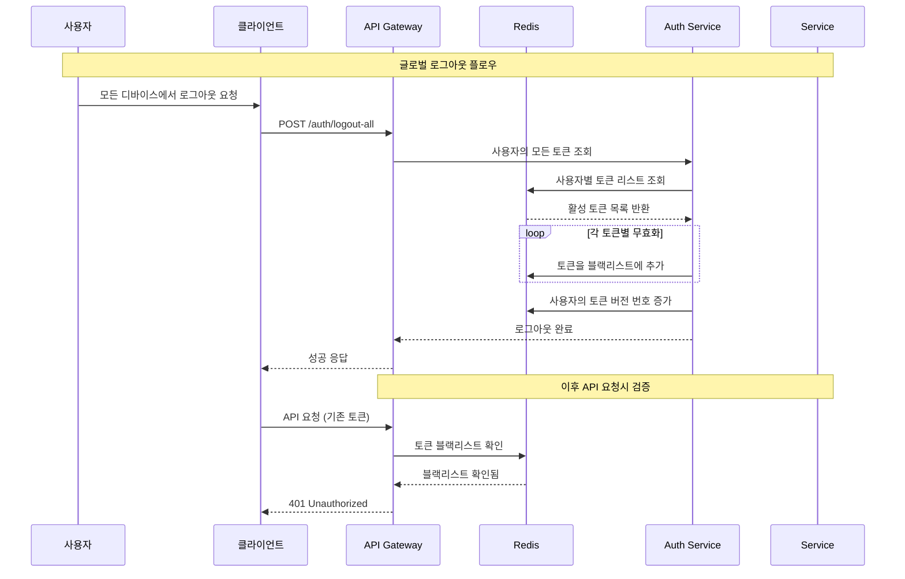
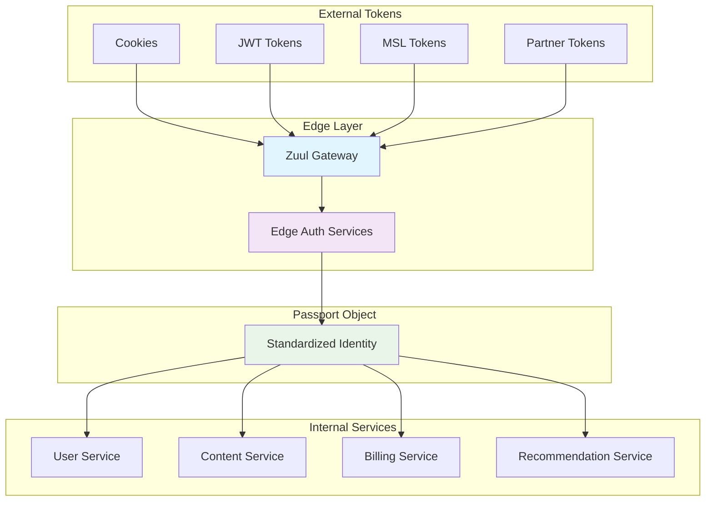
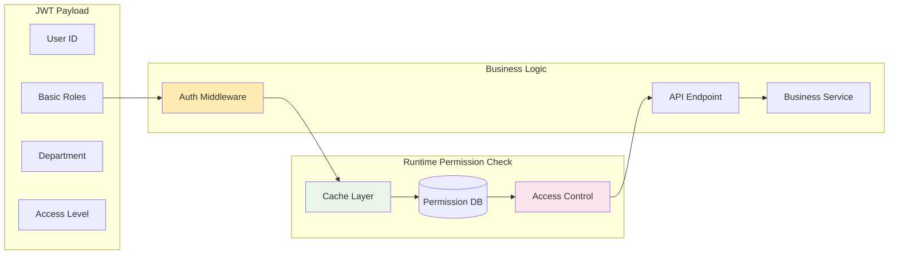
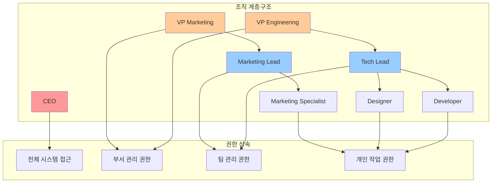
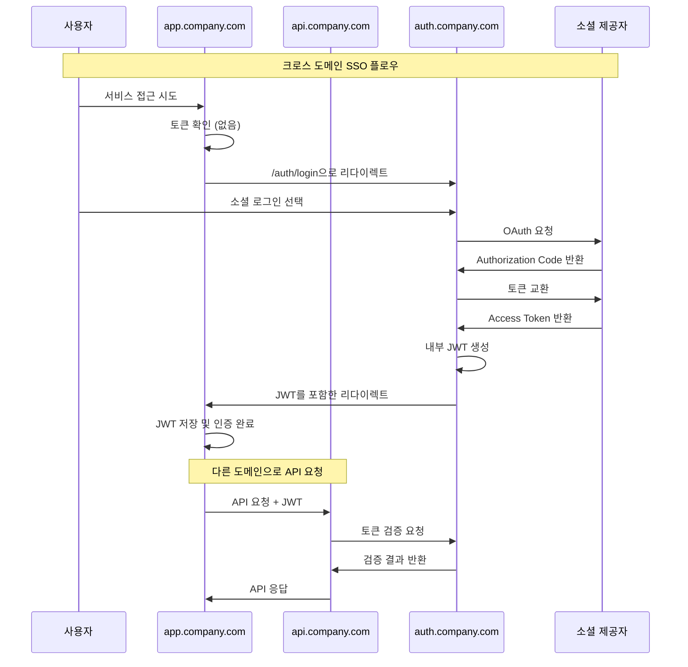

실무 환경에서 JWT 인증 시스템을 운영하다 보면 단순한 로그인/로그아웃을 넘어선 복잡한 요구사항들을 마주하게 됩니다. 사용자가 여러 기기에서 동시에 로그인하는 상황, 세밀한 권한 제어가 필요한 비즈니스 로직, 그리고 외부 인증 서비스와의 연동 등은 모두 JWT 시스템에 새로운 도전을 제시합니다. 이 4부에서는 이러한 고급 시나리오들을 깊이 있게 다루면서, 실제 운영 환경에서 마주칠 수 있는 문제들과 그 해결책을 제시합니다.


## 8장: 다중 디바이스와 세션 관리에서 발생하는 복잡한 문제들을 해결하는 방법


### 8.1 다중 디바이스 환경에서의 JWT 토큰 충돌 문제와 해결 전략

현대의 사용자들은 더 이상 하나의 디바이스만으로 서비스를 이용하지 않습니다. 스마트폰으로 출퇴근길에 콘텐츠를 소비하고, 사무실에서는 데스크톱으로 업무를 처리하며, 집에서는 태블릿으로 쇼핑을 하는 것이 일상이 되었습니다. 이러한 멀티 디바이스 환경에서 JWT 인증 시스템을 구축할 때 가장 큰 도전은 각 디바이스에서 발생하는 토큰 갱신 과정에서의 충돌 문제입니다.

가장 흔한 문제는 **토큰 동기화 실패** 입니다. 사용자가 모바일과 웹에서 동시에 로그인한 상태에서, 모바일 앱이 토큰을 갱신하면 웹에서 사용 중인 토큰이 무효화되는 상황이 발생할 수 있습니다. 이는 전통적인 세션 기반 인증에서는 겪지 않았던 JWT 특유의 문제로, stateless한 특성 때문에 발생하는 트레이드오프입니다.

이 문제를 해결하기 위한 가장 효과적인 접근법은 **디바이스별 토큰 분리 전략** 입니다. 각 디바이스마다 독립적인 refresh token을 발급하고, access token 역시 디바이스 식별자를 포함하여 생성하는 방식입니다. 이렇게 하면 한 디바이스에서의 토큰 갱신이 다른 디바이스에 영향을 주지 않으면서도, 필요시 특정 디바이스만 선택적으로 로그아웃시킬 수 있는 유연성을 확보할 수 있습니다.

```javascript
// 디바이스별 토큰 생성 예시
const generateDeviceSpecificTokens = (userId, deviceInfo) => {
  const deviceIdentifier = generateDeviceId(deviceInfo);
  
  const accessToken = jwt.sign({
    sub: userId,
    device: deviceIdentifier,
    type: 'access',
    exp: Math.floor(Date.now() / 1000) + (15 * 60), // 15분
  }, process.env.JWT_SECRET);
  
  const refreshToken = jwt.sign({
    sub: userId,
    device: deviceIdentifier,
    type: 'refresh',
    exp: Math.floor(Date.now() / 1000) + (7 * 24 * 60 * 60), // 7일
  }, process.env.JWT_REFRESH_SECRET);
  
  // Redis에 디바이스별로 refresh token 저장
  redis.setex(`refresh:${userId}:${deviceIdentifier}`, 
    7 * 24 * 60 * 60, refreshToken);
  
  return { accessToken, refreshToken, deviceIdentifier };
};
```


### 8.2 디바이스 핑거프린팅과 보안 강화 메커니즘

단순히 사용자가 제공하는 디바이스 정보에만 의존하면 보안상 취약점이 될 수 있습니다. 악의적인 사용자가 다른 사용자의 디바이스 정보를 위조하여 토큰을 탈취하려 시도할 수 있기 때문입니다. 이를 방지하기 위해서는 **브라우저 핑거프린팅 기술** 을 활용한 고도화된 디바이스 식별 메커니즘이 필요합니다.

브라우저 핑거프린팅은 사용자의 브라우저 환경, 운영체제, 하드웨어 정보 등을 조합하여 고유한 디바이스 지문을 생성하는 기술입니다. 이 기술을 JWT 토큰 발급 과정에 결합하면, 토큰이 발급된 디바이스와 실제 사용하는 디바이스가 일치하는지 검증할 수 있습니다.

Netflix의 사례를 살펴보면, 그들은 **MSL(Message Security Layer)** 이라는 독자적인 프로토콜을 개발하여 디바이스 인증을 수행합니다. 하지만 모든 기업이 Netflix와 같은 규모의 리소스를 투입할 수는 없으므로, 보다 현실적인 접근법이 필요합니다.

```javascript
// 브라우저 핑거프린팅을 활용한 디바이스 식별
const generateDeviceFingerprint = (request) => {
  const components = [
    request.headers['user-agent'],
    request.headers['accept-language'],
    request.headers['accept-encoding'],
    request.connection.remoteAddress,
    request.headers['sec-ch-ua'],
    request.headers['sec-ch-ua-platform'],
    request.headers['sec-ch-ua-mobile']
  ];
  
  return crypto
    .createHash('sha256')
    .update(components.join('|'))
    .digest('hex');
};

// 토큰 검증 시 디바이스 일치 확인
const verifyDeviceConsistency = (token, request) => {
  const currentFingerprint = generateDeviceFingerprint(request);
  const tokenFingerprint = token.deviceFingerprint;
  
  if (currentFingerprint !== tokenFingerprint) {
    throw new Error('Device fingerprint mismatch');
  }
};
```


### 8.3 세션 무효화와 글로벌 로그아웃 정책 설계

JWT의 stateless 특성으로 인해 발생하는 가장 큰 문제 중 하나는 **강제 로그아웃의 어려움** 입니다. 전통적인 세션 기반 인증에서는 서버에서 세션을 삭제하면 즉시 로그아웃이 가능했지만, JWT는 토큰이 만료되기 전까지는 계속 유효하기 때문입니다. 이는 보안 사고 발생 시 즉시 대응이 어렵다는 치명적인 단점으로 이어집니다.

이를 해결하기 위한 방법으로 **토큰 블랙리스트** 방식이 널리 사용됩니다. Redis와 같은 고속 캐시 시스템을 활용하여 무효화된 토큰들의 목록을 관리하고, 모든 API 요청에서 해당 토큰이 블랙리스트에 있는지 확인하는 방식입니다.



하지만 토큰 블랙리스트 방식은 JWT의 stateless한 장점을 포기하는 것과 같습니다. 모든 요청마다 Redis 조회가 발생하므로 성능상 오버헤드가 발생하고, Redis 장애 시 전체 인증 시스템이 마비될 위험성도 있습니다.

보다 균형잡힌 접근법은 **하이브리드 무효화 전략** 입니다. 일반적인 상황에서는 토큰의 자연 만료를 기다리되, 보안 사고나 의심스러운 활동이 감지되었을 때만 블랙리스트를 활용하는 방식입니다. 이를 위해 토큰에 **버전 정보** 를 포함시키고, 사용자별로 토큰 버전을 관리하여 특정 버전 이하의 모든 토큰을 무효화할 수 있도록 구성합니다.


### 8.4 동시 접속 제한과 디바이스 등록 관리

기업용 소프트웨어나 라이센스 기반 서비스에서는 사용자당 동시 접속 디바이스 수를 제한해야 하는 경우가 많습니다. Netflix는 구독 플랜별로 동시 스트리밍 가능한 디바이스 수를 제한하고, Adobe Creative Suite는 활성화된 디바이스 수를 관리합니다. 이러한 비즈니스 요구사항을 JWT 시스템에서 구현하는 것은 생각보다 복잡한 문제입니다.

핵심은 **디바이스 등록 테이블** 을 별도로 관리하면서, 새로운 로그인 요청이 들어올 때마다 현재 등록된 디바이스 수를 확인하는 것입니다. 제한을 초과하는 경우, 가장 오래된 디바이스를 자동으로 로그아웃시키거나 사용자에게 선택권을 주는 방식으로 처리할 수 있습니다.

```javascript
const handleDeviceLimitExceeded = async (userId, newDevice, maxDevices) => {
  const registeredDevices = await getRegisteredDevices(userId);
  
  if (registeredDevices.length >= maxDevices) {
    // 전략 1: 가장 오래된 디바이스 자동 해제
    const oldestDevice = registeredDevices
      .sort((a, b) => a.lastActive - b.lastActive)[0];
    
    await invalidateDeviceTokens(userId, oldestDevice.id);
    await removeDeviceRegistration(userId, oldestDevice.id);
    
    // 전략 2: 사용자에게 선택권 제공 (추천)
    return {
      requireDeviceSelection: true,
      registeredDevices: registeredDevices.map(device => ({
        id: device.id,
        name: device.name,
        lastActive: device.lastActive,
        location: device.lastKnownLocation
      }))
    };
  }
  
  // 새 디바이스 등록
  await registerNewDevice(userId, newDevice);
  return { success: true };
};
```


### 8.5 Netflix의 Edge Authentication 사례 분석과 적용 방법

Netflix의 Edge Authentication 시스템은 대규모 분산 환경에서 JWT 인증을 어떻게 효율적으로 처리할 수 있는지 보여주는 대표적인 사례입니다. Netflix는 **Passport**라는 내부 신원 객체를 도입하여 다양한 토큰 타입(Cookie, MSL, JWT, Partner Token)을 단일화된 방식으로 처리합니다.

Netflix의 접근법에서 주목할 점은 **토큰 처리의 중앙화** 입니다. 모든 인증 관련 복잡성을 API Gateway(Zuul)에서 처리하고, 후단의 마이크로서비스들은 표준화된 Passport 객체만 받아서 처리하도록 구성했습니다. 이를 통해 각 서비스 팀이 복잡한 토큰 처리 로직을 구현할 필요가 없어졌고, 보안 정책의 일관성도 확보할 수 있었습니다.



Netflix의 Passport 시스템을 참고하여 우리도 유사한 구조를 구현할 수 있습니다. 핵심은 **인증 복잡성의 격리** 입니다. API Gateway에서 모든 토큰 타입을 처리하고, 내부 서비스들은 표준화된 사용자 정보만 받아서 처리하도록 구성하는 것입니다.

```javascript
// 표준화된 Internal Identity Object
class InternalIdentity {
  constructor(userInfo, deviceInfo, authLevel) {
    this.userId = userInfo.id;
    this.email = userInfo.email;
    this.roles = userInfo.roles;
    this.deviceId = deviceInfo.id;
    this.deviceType = deviceInfo.type;
    this.authenticationLevel = authLevel;
    this.issuedAt = Date.now();
    this.expiresAt = Date.now() + (15 * 60 * 1000);
  }
  
  // HMAC을 사용한 무결성 보장
  sign(secretKey) {
    const payload = JSON.stringify({
      userId: this.userId,
      deviceId: this.deviceId,
      authLevel: this.authenticationLevel,
      exp: this.expiresAt
    });
    
    this.signature = crypto
      .createHmac('sha256', secretKey)
      .update(payload)
      .digest('hex');
    
    return this;
  }
  
  verify(secretKey) {
    // 서명 검증 로직
    const expectedSignature = crypto
      .createHmac('sha256', secretKey)
      .update(/* payload */)
      .digest('hex');
      
    return this.signature === expectedSignature;
  }
}
```


### 8.6 다중 탭 환경에서의 토큰 동기화 문제 해결

웹 애플리케이션에서 사용자가 여러 탭을 동시에 열어 놓는 것은 매우 일반적입니다. 하지만 JWT 토큰 갱신이 발생했을 때 다른 탭들이 이를 인지하지 못해 API 요청이 실패하는 문제가 발생할 수 있습니다. 이는 사용자 경험을 크게 해치는 요소로, 반드시 해결해야 할 문제입니다.

**BroadcastChannel API**를 활용하면 같은 도메인의 다른 탭들과 실시간으로 토큰 정보를 동기화할 수 있습니다. 한 탭에서 토큰이 갱신되면 모든 다른 탭들도 즉시 새로운 토큰을 사용하도록 업데이트하는 방식입니다.

```javascript
class TokenSyncManager {
  constructor() {
    this.channel = new BroadcastChannel('auth-sync');
    this.channel.addEventListener('message', this.handleTokenSync.bind(this));
  }
  
  // 토큰 갱신 시 다른 탭들에게 알림
  broadcastTokenUpdate(newTokens) {
    this.channel.postMessage({
      type: 'TOKEN_UPDATED',
      accessToken: newTokens.accessToken,
      refreshToken: newTokens.refreshToken,
      timestamp: Date.now()
    });
  }
  
  // 다른 탭으로부터 토큰 업데이트 알림 수신
  handleTokenSync(event) {
    if (event.data.type === 'TOKEN_UPDATED') {
      // 메모리의 토큰 정보 업데이트
      tokenStore.updateTokens({
        accessToken: event.data.accessToken,
        refreshToken: event.data.refreshToken
      });
      
      // 대기 중인 API 요청들에 새 토큰 적용
      pendingRequestQueue.retryWithNewToken(event.data.accessToken);
    }
  }
  
  // 로그아웃 시 모든 탭에서 동시 로그아웃
  broadcastLogout() {
    this.channel.postMessage({
      type: 'LOGOUT',
      timestamp: Date.now()
    });
  }
}
```


### 8.7 디바이스 트러스트 레벨과 적응형 인증

모든 디바이스를 동일하게 신뢰할 수는 없습니다. 사용자의 개인 스마트폰과 공용 PC는 서로 다른 보안 위험도를 가지고 있으며, 이를 JWT 시스템에 반영하여 적응형 인증을 구현할 수 있습니다. **디바이스 트러스트 레벨**이라는 개념을 도입하여, 신뢰도가 낮은 디바이스에서는 더 짧은 토큰 만료 시간을 적용하고, 민감한 작업 수행 시 추가 인증을 요구하는 방식입니다.

Google이 사용하는 **위험 기반 인증(Risk-Based Authentication)**도 비슷한 개념입니다. 사용자의 일반적인 로그인 패턴과 다른 위치나 디바이스에서 접속 시도가 있을 때 추가 인증 단계를 요구하는 것입니다.

```javascript
const calculateDeviceTrustLevel = (deviceInfo, userHistory) => {
  let trustScore = 50; // 기본 점수
  
  // 등록된 디바이스인가?
  if (userHistory.registeredDevices.includes(deviceInfo.fingerprint)) {
    trustScore += 30;
  }
  
  // 일반적인 접속 위치인가?
  if (isCommonLocation(deviceInfo.location, userHistory.locations)) {
    trustScore += 10;
  }
  
  // 일반적인 접속 시간인가?
  if (isCommonTimeFrame(deviceInfo.timestamp, userHistory.accessPatterns)) {
    trustScore += 5;
  }
  
  // VPN이나 Tor 사용 여부
  if (deviceInfo.isVPNOrTor) {
    trustScore -= 20;
  }
  
  // 신뢰도 레벨 결정
  if (trustScore >= 80) return 'HIGH';
  if (trustScore >= 60) return 'MEDIUM';
  return 'LOW';
};

const generateAdaptiveTokens = (userId, deviceInfo, userHistory) => {
  const trustLevel = calculateDeviceTrustLevel(deviceInfo, userHistory);
  
  // 신뢰도에 따른 토큰 만료 시간 조정
  const expirationTimes = {
    'HIGH': 60 * 60, // 1시간
    'MEDIUM': 30 * 60, // 30분
    'LOW': 15 * 60 // 15분
  };
  
  return jwt.sign({
    sub: userId,
    trustLevel,
    deviceId: deviceInfo.id,
    exp: Math.floor(Date.now() / 1000) + expirationTimes[trustLevel]
  }, process.env.JWT_SECRET);
};
```


## 9장: 권한 기반 접근 제어를 JWT와 함께 구현할 때 발생하는 문제들을 해결하는 방법


### 9.1 RBAC 모델과 JWT 페이로드 설계의 딜레마

JWT를 권한 기반 접근 제어(RBAC)와 함께 사용할 때 가장 큰 고민은 **토큰 페이로드에 권한 정보를 어디까지 포함할 것인가**입니다. 권한 정보를 토큰에 많이 포함할수록 매번 데이터베이스를 조회할 필요가 없어져 성능상 이점이 있지만, 토큰 크기가 커지고 권한이 변경되었을 때 즉시 반영되지 않는 문제가 발생합니다.

Kubernetes의 RBAC 시스템에서는 이 문제를 **계층적 권한 구조**로 해결합니다. 기본적인 역할 정보만 토큰에 포함하고, 세부적인 권한은 실시간으로 조회하는 하이브리드 방식을 사용합니다. 이는 토큰 크기와 실시간성 사이의 적절한 균형점을 찾은 사례로 볼 수 있습니다.



실제 구현에서는 **권한 캐싱 전략**이 매우 중요합니다. 사용자의 기본 권한 정보를 Redis에 캐싱하되, TTL을 적절히 설정하여 권한 변경이 있을 때 일정 시간 내에 반영되도록 하는 것입니다. Cloudflare의 경우, 역할 변경 후 최대 5분 이내에 모든 엣지 서버에 권한 정보가 전파되도록 시스템을 구성했다고 알려져 있습니다.


### 9.2 동적 권한 변경과 토큰 일관성 보장

기업 환경에서는 직원의 부서 이동, 승진, 프로젝트 참여 등으로 인해 권한이 실시간으로 변경되는 경우가 빈번합니다. 하지만 JWT 토큰은 한번 발급되면 만료되기 전까지 내용을 수정할 수 없기 때문에, 권한 변경이 즉시 반영되지 않는 문제가 발생합니다.

Microsoft Azure의 **조건부 액세스(Conditional Access)** 정책은 이 문제에 대한 흥미로운 해결책을 제시합니다. 토큰에는 기본적인 사용자 식별 정보만 포함하고, 모든 권한 확인은 실시간으로 Azure AD에서 수행하는 방식입니다. 이를 통해 권한 변경이 즉시 반영되면서도 토큰의 무결성은 유지할 수 있습니다.

```javascript
// 실시간 권한 검증을 위한 미들웨어
const dynamicPermissionCheck = async (req, res, next) => {
  try {
    const token = extractTokenFromHeader(req.headers.authorization);
    const decoded = jwt.verify(token, process.env.JWT_SECRET);
    
    // 토큰의 기본 정보만 사용
    const userId = decoded.sub;
    const tokenIssuedAt = decoded.iat;
    
    // 실시간 권한 조회 (캐싱 활용)
    const currentPermissions = await getUserPermissions(userId);
    
    // 권한이 토큰 발급 이후 변경되었는지 확인
    const permissionLastModified = await getPermissionLastModified(userId);
    if (permissionLastModified > tokenIssuedAt) {
      // 권한이 변경된 경우 새 토큰 발급 권고
      res.setHeader('X-Token-Refresh-Required', 'true');
    }
    
    // 요청된 리소스에 대한 권한 확인
    const requiredPermission = req.route.permission;
    if (!currentPermissions.includes(requiredPermission)) {
      return res.status(403).json({ error: 'Insufficient permissions' });
    }
    
    req.user = { id: userId, permissions: currentPermissions };
    next();
  } catch (error) {
    res.status(401).json({ error: 'Invalid token' });
  }
};
```


### 9.3 세밀한 권한 제어와 리소스 기반 접근 제어

RBAC만으로는 해결하기 어려운 상황들이 있습니다. 예를 들어, "자신이 작성한 게시물만 수정 가능" 또는 "같은 팀 멤버들의 파일만 열람 가능"과 같은 리소스 기반 접근 제어(Resource-Based Access Control)가 필요한 경우입니다. 이런 상황에서는 JWT 토큰의 정보만으로는 충분하지 않으며, 실시간 권한 검증이 반드시 필요합니다.

AWS IAM의 **정책 기반 접근 제어**는 이런 복잡한 권한 체계를 다루는 좋은 참고 사례입니다. IAM 정책에서는 사용자의 역할뿐만 아니라 리소스의 속성, 요청 컨텍스트(시간, 위치, MFA 여부 등)를 종합적으로 고려하여 접근을 허용할지 결정합니다.

```javascript
// 복잡한 권한 검증 엔진
class AdvancedPermissionEngine {
  async checkAccess(user, resource, action, context) {
    // 1. 기본 역할 권한 확인
    const rolePermissions = await this.getRolePermissions(user.roles);
    if (!this.hasBasicPermission(rolePermissions, action)) {
      return { allowed: false, reason: 'Insufficient role permissions' };
    }
    
    // 2. 리소스 소유권 확인
    if (resource.ownerId && resource.ownerId !== user.id) {
      const sharedWith = await this.getResourceSharing(resource.id);
      if (!sharedWith.includes(user.id)) {
        return { allowed: false, reason: 'Resource not accessible' };
      }
    }
    
    // 3. 시간 기반 제한 확인
    if (this.hasTimeRestriction(user.roles)) {
      if (!this.isWithinAllowedTime(context.timestamp, user.workingHours)) {
        return { allowed: false, reason: 'Outside allowed time' };
      }
    }
    
    // 4. 위치 기반 제한 확인
    if (this.hasLocationRestriction(user.roles)) {
      if (!this.isAllowedLocation(context.ipAddress, user.allowedLocations)) {
        return { allowed: false, reason: 'Unauthorized location' };
      }
    }
    
    return { allowed: true };
  }
}
```


### 9.4 조직별 권한 분리와 멀티 테넌트 환경에서의 JWT 활용

SaaS 서비스에서는 여러 조직의 사용자들이 동일한 시스템을 사용하면서도 각각의 데이터와 권한이 철저히 분리되어야 합니다. **멀티 테넌트 아키텍처**에서 JWT를 사용할 때는 토큰에 조직 정보를 포함시켜야 하며, 모든 API 요청에서 조직 격리를 보장해야 합니다.

Logto의 **조직별 토큰 발급 시스템**은 이런 요구사항을 만족하는 좋은 사례입니다. 사용자가 여러 조직에 속할 수 있는 상황에서, 각 조직별로 별도의 토큰을 발급하고 조직 컨텍스트에 맞는 권한만 포함시키는 방식을 사용합니다.

```javascript
// 조직별 토큰 생성
const generateOrgSpecificToken = (userId, organizationId, userRoles) => {
  // 해당 조직에서의 역할만 필터링
  const orgRoles = userRoles.filter(role => 
    role.organizationId === organizationId
  );
  
  return jwt.sign({
    sub: userId,
    org: organizationId,
    roles: orgRoles.map(role => role.name),
    permissions: derivePermissionsFromRoles(orgRoles),
    exp: Math.floor(Date.now() / 1000) + (60 * 60)
  }, process.env.JWT_SECRET);
};

// API 요청 시 조직 격리 확인
const enforceOrganizationIsolation = (req, res, next) => {
  const token = jwt.verify(req.headers.authorization.split(' ')[1], 
    process.env.JWT_SECRET);
  const requestedOrg = req.params.organizationId;
  
  if (token.org !== requestedOrg) {
    return res.status(403).json({ 
      error: 'Organization access denied' 
    });
  }
  
  next();
};
```


### 9.5 권한 업데이트의 지연 시간 최소화 전략

JWT 기반 시스템에서 권한 변경의 지연 시간을 최소화하는 것은 지속적인 도전입니다. 완전한 실시간 반영을 원한다면 세션 기반 인증을 사용하는 것이 맞지만, JWT의 장점을 포기하고 싶지 않다면 **하이브리드 접근법**을 고려해야 합니다.

한 가지 효과적인 전략은 **권한 변경 이벤트 기반 토큰 무효화**입니다. 관리자가 사용자의 권한을 변경하면, 해당 사용자의 모든 토큰에 무효화 플래그를 설정하고, 다음 API 요청 시 새로운 토큰을 발급하도록 하는 방식입니다.

```javascript
// 권한 변경 이벤트 처리
const handlePermissionChange = async (userId, newPermissions) => {
  // 1. 데이터베이스의 권한 정보 업데이트
  await updateUserPermissions(userId, newPermissions);
  
  // 2. 권한 캐시 무효화
  await redis.del(`permissions:${userId}`);
  
  // 3. 토큰 무효화 플래그 설정
  const currentTokenVersion = await redis.get(`token_version:${userId}`) || 0;
  await redis.set(`token_version:${userId}`, parseInt(currentTokenVersion) + 1);
  
  // 4. 실시간 알림 (WebSocket 등)
  notificationService.send(userId, {
    type: 'PERMISSION_CHANGED',
    message: 'Your permissions have been updated. Please refresh your session.'
  });
};

// 토큰 검증 시 버전 확인
const verifyTokenVersion = async (token) => {
  const decoded = jwt.verify(token, process.env.JWT_SECRET);
  const tokenVersion = decoded.version || 0;
  const currentVersion = await redis.get(`token_version:${decoded.sub}`) || 0;
  
  if (tokenVersion < currentVersion) {
    throw new Error('Token version outdated, refresh required');
  }
  
  return decoded;
};
```


### 9.6 API 리소스별 스코프 관리와 세분화된 권한 제어

대규모 마이크로서비스 환경에서는 각 API마다 서로 다른 권한 체계를 가질 수 있습니다. 사용자 관리 API, 결제 API, 콘텐츠 API 각각에 대해 독립적인 권한을 설정하고 관리해야 하는데, 이를 JWT 토큰 하나로 모두 처리하려면 복잡성이 기하급수적으로 증가합니다.

OAuth 2.0의 **스코프(Scope) 개념**을 JWT와 결합하여 사용하는 것이 효과적인 해결책입니다. 토큰 발급 시 사용자가 실제로 사용할 API들에 대한 스코프만 포함시켜 토큰 크기를 최적화하고, 동시에 보안도 강화할 수 있습니다.

```javascript
// API별 스코프 기반 토큰 생성
const generateScopeBasedToken = (userId, requestedScopes, userRoles) => {
  // 사용자의 역할로부터 허용된 스코프 도출
  const allowedScopes = deriveAllowedScopes(userRoles);
  
  // 요청된 스코프 중 허용된 것들만 필터링
  const grantedScopes = requestedScopes.filter(scope => 
    allowedScopes.includes(scope)
  );
  
  return jwt.sign({
    sub: userId,
    scopes: grantedScopes,
    aud: 'api.company.com', // Audience claim for API identification
    exp: Math.floor(Date.now() / 1000) + (30 * 60)
  }, process.env.JWT_SECRET);
};

// 스코프 기반 API 보호
const requireScope = (requiredScope) => {
  return (req, res, next) => {
    const token = req.user; // 이미 검증된 토큰 정보
    
    if (!token.scopes || !token.scopes.includes(requiredScope)) {
      return res.status(403).json({
        error: 'Insufficient scope',
        required: requiredScope,
        granted: token.scopes || []
      });
    }
    
    next();
  };
};

// 라우터에 스코프 적용
app.get('/api/users', requireScope('users:read'), getUserList);
app.post('/api/users', requireScope('users:write'), createUser);
app.delete('/api/users/:id', requireScope('users:delete'), deleteUser);
```


### 9.7 팀 기반 권한과 프로젝트별 접근 제어

현대의 협업 도구들은 대부분 팀이나 프로젝트 단위로 권한을 관리합니다. Slack의 워크스페이스, GitHub의 조직, Jira의 프로젝트 등이 모두 이런 방식입니다. 이러한 **컨텍스트 기반 권한 제어**를 JWT와 함께 구현할 때는 토큰에 현재 컨텍스트 정보를 포함시키는 것이 핵심입니다.

하지만 사용자가 여러 팀에 동시에 속해 있는 경우, 하나의 토큰으로 모든 컨텍스트를 표현하기 어렵습니다. 이때는 **컨텍스트 전환(Context Switching)** 메커니즘을 도입하여, 사용자가 현재 작업 중인 팀이나 프로젝트에 맞는 토큰을 동적으로 발급받도록 하는 것이 좋습니다.

```javascript
// 컨텍스트 전환 API
app.post('/api/auth/switch-context', async (req, res) => {
  const { targetTeamId } = req.body;
  const currentUser = req.user;
  
  // 사용자가 해당 팀의 멤버인지 확인
  const teamMembership = await checkTeamMembership(
    currentUser.id, 
    targetTeamId
  );
  
  if (!teamMembership.isMember) {
    return res.status(403).json({ error: 'Not a team member' });
  }
  
  // 팀별 권한을 포함한 새 토큰 생성
  const contextualToken = jwt.sign({
    sub: currentUser.id,
    team: targetTeamId,
    teamRole: teamMembership.role,
    teamPermissions: teamMembership.permissions,
    context: 'team',
    exp: Math.floor(Date.now() / 1000) + (30 * 60)
  }, process.env.JWT_SECRET);
  
  res.json({ 
    token: contextualToken,
    context: {
      teamId: targetTeamId,
      teamName: teamMembership.teamName,
      role: teamMembership.role
    }
  });
});
```


### 9.8 권한 상속과 위임 메커니즘 구현

복잡한 조직 구조에서는 권한의 상속과 위임이 필요합니다. 예를 들어, 팀 리더가 팀원들에게 특정 권한을 위임하거나, 상위 조직의 권한이 하위 조직으로 상속되는 경우입니다. 이러한 **계층적 권한 구조**를 JWT와 함께 구현하려면 권한 체크 로직이 상당히 복잡해집니다.

Google Workspace의 **역할 상속 시스템**처럼, 조직 계층 구조를 토큰에 포함시키고 권한 검증 시 상위 권한을 함께 고려하는 방식을 사용할 수 있습니다. 하지만 이는 토큰 크기를 증가시키므로, 핵심 정보만 토큰에 포함하고 나머지는 런타임에 조회하는 전략이 더 실용적입니다.




## 10장: 소셜 로그인과 제3자 인증 서비스를 JWT 시스템과 연동할 때의 복잡성 해결하기


### 10.1 OAuth 2.0 Flow와 자체 JWT 시스템 간의 토큰 변환

소셜 로그인을 구현할 때 가장 복잡한 부분은 **외부 인증 제공자의 토큰을 자체 JWT 시스템으로 변환하는 과정**입니다. Google, Facebook, GitHub 등의 OAuth 제공자들은 각각 다른 토큰 형식과 페이로드 구조를 사용하므로, 이를 표준화된 내부 토큰으로 변환하는 중간 계층이 필요합니다.

카카오톡 로그인을 예로 들면, 카카오 서버에서 발급받은 access token을 사용해 사용자 정보를 조회한 후, 이 정보를 기반으로 자체 JWT 토큰을 생성해야 합니다. 이 과정에서 **사용자 매핑**, **권한 할당**, **계정 연결** 등의 복잡한 로직이 필요합니다.

```javascript
// 소셜 로그인 토큰 변환 과정
const handleSocialLogin = async (provider, socialAccessToken) => {
  try {
    // 1. 소셜 제공자로부터 사용자 정보 조회
    const socialUserInfo = await fetchSocialUserInfo(provider, socialAccessToken);
    
    // 2. 기존 계정과 매핑 또는 새 계정 생성
    let user = await findUserBySocialId(provider, socialUserInfo.id);
    
    if (!user) {
      // 이메일로 기존 계정 찾기 시도
      user = await findUserByEmail(socialUserInfo.email);
      
      if (user) {
        // 기존 계정에 소셜 로그인 연결
        await linkSocialAccount(user.id, provider, socialUserInfo);
      } else {
        // 새 계정 생성
        user = await createUserFromSocialInfo(provider, socialUserInfo);
      }
    }
    
    // 3. 자체 JWT 토큰 생성
    const internalToken = generateInternalJWT({
      userId: user.id,
      email: user.email,
      roles: user.roles,
      socialProvider: provider,
      socialId: socialUserInfo.id,
      verified: socialUserInfo.verified_email || false
    });
    
    return {
      accessToken: internalToken.accessToken,
      refreshToken: internalToken.refreshToken,
      user: sanitizeUserInfo(user)
    };
    
  } catch (error) {
    throw new Error(`Social login failed: ${error.message}`);
  }
};
```


### 10.2 PKCE 확장과 모바일 앱에서의 보안 강화

OAuth 2.1에서 필수가 된 **PKCE(Proof Key for Code Exchange)**는 모바일 앱과 SPA에서 Authorization Code Flow의 보안을 획기적으로 향상시킵니다. 하지만 PKCE를 올바르게 구현하지 않으면 오히려 더 복잡한 보안 취약점이 생길 수 있습니다.

특히 React Native나 Flutter 같은 크로스 플랫폼 모바일 앱에서는 **딥 링크(Deep Link) 처리**와 **커스텀 URL 스키마** 관리가 추가적인 복잡성을 만듭니다. 악의적인 앱이 동일한 URL 스키마를 등록하여 Authorization Code를 가로채려 시도할 수 있기 때문입니다.

```javascript
// React Native에서의 안전한 PKCE 구현
import { AuthSession } from 'expo-auth-session';
import * as Crypto from 'expo-crypto';

class SecurePKCEAuth {
  async initiateSocialLogin(provider) {
    // 1. PKCE 파라미터 생성
    const codeVerifier = await this.generateCodeVerifier();
    const codeChallenge = await this.generateCodeChallenge(codeVerifier);
    
    // 2. State 파라미터로 CSRF 방어
    const state = await Crypto.randomUUID();
    await this.storeState(state);
    
    // 3. Authorization URL 구성
    const authUrl = `${provider.authEndpoint}?` +
      `client_id=${provider.clientId}&` +
      `redirect_uri=${provider.redirectUri}&` +
      `response_type=code&` +
      `scope=${provider.scopes.join(' ')}&` +
      `code_challenge=${codeChallenge}&` +
      `code_challenge_method=S256&` +
      `state=${state}`;
    
    // 4. 브라우저 세션 시작 (앱 컨텍스트 보존)
    const result = await AuthSession.startAsync({
      authUrl,
      returnUrl: provider.redirectUri
    });
    
    if (result.type === 'success') {
      return this.exchangeCodeForToken(
        result.params.code, 
        codeVerifier, 
        state
      );
    }
    
    throw new Error('Authorization failed');
  }
  
  async generateCodeVerifier() {
    const array = new Uint8Array(32);
    await Crypto.getRandomValues(array);
    return this.base64URLEncode(array);
  }
  
  async generateCodeChallenge(verifier) {
    const hash = await Crypto.digestStringAsync(
      Crypto.CryptoDigestAlgorithm.SHA256,
      verifier,
      { encoding: Crypto.CryptoEncoding.BASE64URL }
    );
    return hash;
  }
}
```


### 10.3 계정 연결과 소셜 로그인 탈취 방어

소셜 로그인의 편의성 뒤에는 **계정 탈취(Account Takeover)** 위험이 숨어있습니다. 공격자가 사용자의 소셜 계정을 탈취하면 연결된 모든 서비스에 접근할 수 있게 되기 때문입니다. 이를 방어하기 위해서는 소셜 로그인 시에도 추가적인 검증 단계를 거치는 것이 필요합니다.

**디바이스 일관성 검증**이 그 핵심입니다. 사용자가 평소 사용하던 디바이스와 다른 디바이스에서 소셜 로그인을 시도할 때는 이메일 인증이나 SMS 인증 등의 추가 단계를 요구하는 것입니다. 이는 소셜 계정이 탈취되더라도 2차 방어선 역할을 합니다.

```javascript
// 소셜 로그인 보안 강화
const secureSocialLogin = async (provider, code, deviceInfo) => {
  // 1. 표준 OAuth flow 수행
  const socialTokens = await exchangeCodeForTokens(provider, code);
  const socialUser = await fetchSocialUserProfile(provider, socialTokens.access_token);
  
  // 2. 기존 계정 조회
  const existingUser = await findUserBySocialId(provider, socialUser.id);
  
  if (existingUser) {
    // 3. 디바이스 검증
    const knownDevices = await getUserDevices(existingUser.id);
    const isKnownDevice = knownDevices.some(device => 
      device.fingerprint === deviceInfo.fingerprint
    );
    
    if (!isKnownDevice) {
      // 4. 의심스러운 디바이스에서의 접근 - 추가 검증 필요
      const verificationToken = await generateVerificationToken();
      await sendSecurityAlert(existingUser.email, {
        deviceInfo,
        verificationToken,
        timestamp: new Date()
      });
      
      return {
        requiresVerification: true,
        verificationMethod: 'email',
        partialToken: await generatePartialToken(existingUser.id, deviceInfo)
      };
    }
  }
  
  // 5. 정상적인 로그인 처리
  return await completeLoginProcess(existingUser || socialUser, deviceInfo);
};

// 2차 검증 완료 후 토큰 발급
app.post('/api/auth/verify-device', async (req, res) => {
  const { partialToken, verificationCode } = req.body;
  
  try {
    const partial = jwt.verify(partialToken, process.env.PARTIAL_SECRET);
    const storedCode = await redis.get(`verification:${partial.sub}`);
    
    if (storedCode !== verificationCode) {
      return res.status(401).json({ error: 'Invalid verification code' });
    }
    
    // 디바이스 등록 및 완전한 토큰 발급
    await registerTrustedDevice(partial.sub, partial.deviceInfo);
    const fullTokens = await generateFullTokens(partial.sub, partial.deviceInfo);
    
    res.json(fullTokens);
  } catch (error) {
    res.status(401).json({ error: 'Invalid partial token' });
  }
});
```


### 10.4 소셜 제공자별 특수 처리와 에러 핸들링

각 소셜 로그인 제공자마다 고유한 특성과 제한사항이 있습니다. Google은 refresh token을 6개월마다 갱신하도록 요구하고, Facebook은 앱 검수 과정에서 특정 권한들을 제한하며, Apple은 Sign in with Apple 사용 시 이메일 숨김 기능을 제공합니다. 이러한 **제공자별 특수성**을 고려한 통합 인증 시스템을 구축해야 합니다.

```javascript
// 제공자별 특수 처리를 위한 팩토리 패턴
class SocialAuthProviderFactory {
  static createProvider(providerName) {
    switch (providerName) {
      case 'google':
        return new GoogleAuthProvider();
      case 'facebook':
        return new FacebookAuthProvider();
      case 'apple':
        return new AppleAuthProvider();
      case 'github':
        return new GitHubAuthProvider();
      default:
        throw new Error(`Unsupported provider: ${providerName}`);
    }
  }
}

class GoogleAuthProvider extends BaseSocialProvider {
  async handleTokenRefresh(refreshToken) {
    // Google의 refresh token 제한 처리
    try {
      const newTokens = await this.refreshAccessToken(refreshToken);
      return newTokens;
    } catch (error) {
      if (error.message.includes('refresh_token_expired')) {
        // 6개월 후 만료 - 재인증 필요
        throw new Error('REAUTH_REQUIRED');
      }
      throw error;
    }
  }
  
  async normalizeUserInfo(rawUserInfo) {
    return {
      id: rawUserInfo.sub,
      email: rawUserInfo.email,
      name: rawUserInfo.name,
      avatar: rawUserInfo.picture,
      emailVerified: rawUserInfo.email_verified,
      provider: 'google'
    };
  }
}

class AppleAuthProvider extends BaseSocialProvider {
  async handlePrivateEmail(idToken) {
    // Apple의 이메일 숨김 처리
    const decoded = jwt.decode(idToken);
    
    if (decoded.email && decoded.email.endsWith('@privaterelay.appleid.com')) {
      // 프라이빗 릴레이 이메일 처리
      return {
        email: decoded.email,
        emailType: 'private_relay',
        realEmailAvailable: false
      };
    }
    
    return {
      email: decoded.email,
      emailType: 'normal',
      realEmailAvailable: true
    };
  }
}
```


### 10.5 제3자 인증 서비스와의 통합 아키텍처

Auth0, AWS Cognito, Firebase Auth와 같은 관리형 인증 서비스를 사용하면서도 자체 비즈니스 로직을 위한 추가 정보를 JWT에 포함해야 하는 경우가 많습니다. 이때는 **하이브리드 토큰 전략**을 사용하여 외부 서비스의 토큰과 자체 토큰을 함께 관리해야 합니다.

Firebase Auth의 **커스텀 클레임** 기능을 활용하면 Firebase ID 토큰에 자체 권한 정보를 포함시킬 수 있지만, 이는 Firebase Admin SDK를 통해서만 수정 가능하므로 실시간 권한 변경에는 한계가 있습니다. 따라서 Firebase 토큰으로 기본 인증을 수행하고, 추가적인 비즈니스 권한은 별도의 내부 토큰으로 관리하는 것이 일반적입니다.

```javascript
// Firebase Auth + 내부 JWT 하이브리드 시스템
const handleFirebaseAuth = async (firebaseIdToken) => {
  try {
    // 1. Firebase ID 토큰 검증
    const decodedToken = await admin.auth().verifyIdToken(firebaseIdToken);
    const uid = decodedToken.uid;
    
    // 2. 내부 사용자 정보 조회/생성
    let internalUser = await findUserByFirebaseUid(uid);
    
    if (!internalUser) {
      internalUser = await createInternalUser({
        firebaseUid: uid,
        email: decodedToken.email,
        name: decodedToken.name,
        emailVerified: decodedToken.email_verified
      });
    }
    
    // 3. 내부 권한 정보를 포함한 JWT 생성
    const internalJWT = jwt.sign({
      sub: internalUser.id,
      firebase_uid: uid,
      email: decodedToken.email,
      roles: internalUser.roles,
      permissions: await getUserPermissions(internalUser.id),
      exp: Math.floor(Date.now() / 1000) + (60 * 60)
    }, process.env.INTERNAL_JWT_SECRET);
    
    return {
      firebaseToken: firebaseIdToken,
      internalToken: internalJWT,
      user: internalUser
    };
    
  } catch (error) {
    throw new Error(`Firebase auth failed: ${error.message}`);
  }
};
```


### 10.6 소셜 로그인 보안 위협과 대응 방안

소셜 로그인을 구현할 때 고려해야 할 보안 위협들은 일반적인 JWT 인증보다 훨씬 다양합니다. **Redirect URI 조작**, **State 파라미터 누락**, **코드 인터셉션** 등이 대표적인 공격 벡터입니다. 2024년 상반기에 발생한 여러 보안 사고들을 분석해보면, 대부분이 OAuth 구현의 미흡함에서 비롯되었습니다.

GitHub의 **OAuth App 보안 가이드라인**에 따르면, redirect_uri는 정확히 일치하는 값만 허용해야 하며, 와일드카드나 부분 일치는 절대 사용하지 말아야 합니다. 또한 state 파라미터는 예측 불가능한 값으로 생성하고 서버 세션에 저장하여 검증해야 합니다.

```javascript
// 안전한 OAuth 구현을 위한 보안 체크포인트
const validateOAuthCallback = async (req, res) => {
  const { code, state, error } = req.query;
  
  // 1. 에러 파라미터 확인
  if (error) {
    logger.warn('OAuth error received', { error, req: req.ip });
    return res.redirect('/login?error=oauth_denied');
  }
  
  // 2. State 파라미터 검증 (CSRF 방어)
  const storedState = await redis.get(`oauth_state:${req.session.id}`);
  if (!storedState || storedState !== state) {
    logger.error('State parameter mismatch', { 
      received: state, 
      expected: storedState,
      ip: req.ip 
    });
    return res.status(401).json({ error: 'Invalid state parameter' });
  }
  
  // 3. Authorization code 검증 및 교환
  const codeVerifier = await redis.get(`pkce_verifier:${req.session.id}`);
  if (!codeVerifier) {
    return res.status(401).json({ error: 'Code verifier not found' });
  }
  
  try {
    const tokens = await exchangeCodeForTokens(code, codeVerifier);
    
    // 4. 토큰 검증 및 사용자 정보 조회
    const userInfo = await fetchUserProfile(tokens.access_token);
    
    // 5. 보안 로깅
    logger.info('Successful OAuth login', {
      provider: 'google',
      userId: userInfo.id,
      ip: req.ip,
      userAgent: req.headers['user-agent'],
      timestamp: new Date().toISOString()
    });
    
    return await processSuccessfulLogin(userInfo, req);
    
  } catch (error) {
    logger.error('OAuth token exchange failed', { 
      error: error.message, 
      ip: req.ip 
    });
    return res.status(401).json({ error: 'Authentication failed' });
  }
};
```


### 10.7 크로스 도메인 인증과 SSO(Single Sign-On) 구현

대기업의 경우 여러 도메인에 걸쳐 다양한 서비스를 운영하면서도 사용자가 한 번만 로그인하면 모든 서비스에 접근할 수 있는 SSO를 구현해야 합니다. JWT의 **도메인 간 토큰 공유**는 브라우저의 Same-Origin Policy로 인해 복잡한 문제가 됩니다.

한 가지 효과적인 해결책은 **Central Authentication Domain**을 사용하는 것입니다. `auth.company.com`과 같은 전용 인증 도메인에서 모든 로그인을 처리하고, 다른 서비스들은 이 도메인으로 리다이렉트하여 인증을 수행한 후 토큰을 받아오는 방식입니다.




### 10.8 토큰 라이프사이클 관리와 자동 갱신 메커니즘

소셜 로그인에서 가장 복잡한 부분 중 하나는 **다계층 토큰 관리**입니다. 소셜 제공자의 access token과 refresh token, 그리고 자체 시스템의 access token과 refresh token까지 총 4개의 토큰을 동시에 관리해야 하는 상황이 발생합니다.

Spotify의 API 문서에 따르면, 그들의 access token은 1시간 후 만료되며 refresh token으로 갱신해야 합니다. 하지만 refresh token도 사용하지 않으면 자동으로 만료되므로, 장기간 비활성 사용자의 경우 재인증이 필요할 수 있습니다. 이러한 **복잡한 만료 정책**을 고려한 토큰 관리 시스템이 필요합니다.

```javascript
// 복합 토큰 갱신 시스템
class CompoundTokenManager {
  async refreshTokensIfNeeded(userTokens) {
    const now = Date.now() / 1000;
    const refreshResults = {};
    
    // 1. 내부 토큰 갱신 확인
    if (userTokens.internal.exp - now < 300) { // 5분 전 갱신
      refreshResults.internal = await this.refreshInternalToken(
        userTokens.internal.refreshToken
      );
    }
    
    // 2. 소셜 토큰 갱신 확인  
    if (userTokens.social.exp - now < 600) { // 10분 전 갱신
      try {
        refreshResults.social = await this.refreshSocialToken(
          userTokens.social.provider,
          userTokens.social.refreshToken
        );
      } catch (error) {
        if (error.message === 'REFRESH_TOKEN_EXPIRED') {
          // 소셜 재인증 필요
          refreshResults.requiresReauth = true;
          refreshResults.provider = userTokens.social.provider;
        }
      }
    }
    
    return refreshResults;
  }
  
  async refreshSocialToken(provider, refreshToken) {
    const providerHandler = SocialAuthProviderFactory.createProvider(provider);
    
    try {
      const newTokens = await providerHandler.refreshToken(refreshToken);
      
      // 새 토큰으로 사용자 정보 업데이트
      const updatedUserInfo = await providerHandler.fetchUserProfile(
        newTokens.access_token
      );
      
      // 내부 데이터베이스 동기화
      await this.syncUserInfo(provider, updatedUserInfo);
      
      return newTokens;
    } catch (error) {
      // 소셜 제공자별 에러 처리
      throw this.handleProviderSpecificError(provider, error);
    }
  }
}
```


### 10.9 보안 사고 대응과 소셜 연동 해제

소셜 계정이 침해당했을 때의 대응 절차도 미리 설계해야 합니다. 2024년에 발생한 여러 크리덴셜 스터핑 공격 사례를 보면, 공격자들이 유출된 소셜 계정 정보를 이용해 연결된 다른 서비스들에 무차별 로그인을 시도하는 것을 볼 수 있습니다.

**이상 행동 탐지(Anomaly Detection)** 시스템을 도입하여 평소와 다른 접속 패턴을 자동으로 감지하고, 의심스러운 활동이 감지되면 해당 소셜 계정과의 연동을 일시적으로 차단하는 메커니즘이 필요합니다.

```javascript
// 이상 행동 탐지 및 자동 대응
class SecurityAnomalyDetector {
  async analyzeLoginAttempt(userId, loginInfo) {
    const userProfile = await this.getUserProfile(userId);
    const riskScore = await this.calculateRiskScore(loginInfo, userProfile);
    
    if (riskScore > 80) {
      // 고위험 - 즉시 차단
      await this.blockUserAccount(userId, 'HIGH_RISK_LOGIN');
      await this.notifySecurityTeam(userId, loginInfo, riskScore);
      throw new Error('ACCOUNT_TEMPORARILY_LOCKED');
    }
    
    if (riskScore > 60) {
      // 중위험 - 추가 인증 요구
      return {
        requiresAdditionalAuth: true,
        methods: ['SMS', 'EMAIL', 'AUTHENTICATOR_APP'],
        riskScore
      };
    }
    
    return { riskScore, allowed: true };
  }
  
  async calculateRiskScore(loginInfo, userProfile) {
    let riskScore = 0;
    
    // 지역 기반 위험도
    const locationRisk = await this.analyzeLocationRisk(
      loginInfo.ipAddress, 
      userProfile.commonLocations
    );
    riskScore += locationRisk * 0.4;
    
    // 시간 패턴 위험도
    const timeRisk = this.analyzeTimePattern(
      loginInfo.timestamp, 
      userProfile.accessPatterns
    );
    riskScore += timeRisk * 0.2;
    
    // 디바이스 위험도
    const deviceRisk = this.analyzeDeviceRisk(
      loginInfo.deviceFingerprint,
      userProfile.knownDevices
    );
    riskScore += deviceRisk * 0.3;
    
    // 빈도 기반 위험도
    const velocityRisk = await this.analyzeLoginVelocity(
      userId, 
      loginInfo.timestamp
    );
    riskScore += velocityRisk * 0.1;
    
    return Math.min(riskScore, 100);
  }
}
```


### 10.10 마이크로서비스 환경에서의 토큰 전파와 서비스 간 인증

마이크로서비스 아키텍처에서 소셜 로그인을 구현할 때는 **토큰 전파(Token Propagation)** 문제가 추가됩니다. 사용자의 요청이 여러 마이크로서비스를 거치면서 각 서비스마다 인증과 권한을 확인해야 하는데, 이때 소셜 토큰과 내부 토큰을 어떻게 전달하고 검증할지 정해야 합니다.

Netflix의 사례에서 보았듯이, **서비스 경계에서의 토큰 변환**이 핵심입니다. 외부에서 들어온 다양한 토큰들을 API Gateway에서 표준화된 내부 토큰으로 변환하고, 내부 서비스들은 이 표준화된 토큰만 처리하도록 구성하는 것입니다.

```javascript
// 마이크로서비스 간 토큰 전파
const serviceToServiceAuth = async (internalToken, targetService) => {
  // 1. 내부 토큰에서 필요한 정보 추출
  const decoded = jwt.verify(internalToken, process.env.INTERNAL_JWT_SECRET);
  
  // 2. 타겟 서비스별 전용 토큰 생성 (Scoped Token)
  const serviceToken = jwt.sign({
    sub: decoded.sub,
    iss: 'gateway.company.com',
    aud: targetService,
    roles: decoded.roles,
    // 타겟 서비스에 필요한 스코프만 포함
    scopes: getRequiredScopes(decoded.roles, targetService),
    exp: Math.floor(Date.now() / 1000) + (5 * 60) // 5분 단기 토큰
  }, getServiceSecret(targetService));
  
  return serviceToken;
};

// API Gateway에서의 토큰 변환 미들웨어
const tokenTransformationMiddleware = async (req, res, next) => {
  try {
    const originalToken = extractToken(req.headers.authorization);
    const targetService = identifyTargetService(req.path);
    
    // 외부 토큰을 내부 토큰으로 변환
    const internalToken = await convertToInternalToken(originalToken);
    
    // 타겟 서비스용 스코프 토큰 생성
    const serviceToken = await serviceToServiceAuth(internalToken, targetService);
    
    // 헤더 교체
    req.headers['x-internal-auth'] = serviceToken;
    
    next();
  } catch (error) {
    res.status(401).json({ error: 'Token transformation failed' });
  }
};
```

이러한 고급 인증 시나리오들을 다루면서 가장 중요한 것은 **보안과 사용자 경험 사이의 균형**입니다. 과도한 보안 조치는 사용자 경험을 해치고, 느슨한 보안은 비즈니스 리스크로 이어집니다. 각 조직의 보안 요구사항과 비즈니스 특성을 고려하여 적절한 수준의 보안 정책을 수립하는 것이 성공적인 JWT 인증 시스템 구축의 열쇠입니다.

또한 지속적인 모니터링과 개선이 필요합니다. 2025년 현재도 새로운 보안 위협들이 계속 등장하고 있으며, JWT 관련 라이브러리들도 꾸준히 업데이트되고 있습니다. 정기적인 보안 감사와 취약점 점검을 통해 시스템의 보안성을 유지하고, 새로운 위협에 선제적으로 대응할 수 있는 체계를 구축하는 것이 중요합니다.

이 4부에서 다룬 고급 시나리오들은 모두 실제 운영 환경에서 마주칠 수 있는 현실적인 문제들입니다. 각각의 해결책들을 그대로 적용하기보다는, 자신의 서비스 특성에 맞게 조합하고 응용하여 사용하시기 바랍니다. 특히 Netflix, Google, Microsoft 등 대기업들의 사례에서 배운 아키텍처 패턴들을 참고하되, 조직의 규모와 리소스를 고려한 현실적인 구현을 하는 것이 성공의 열쇠입니다.
