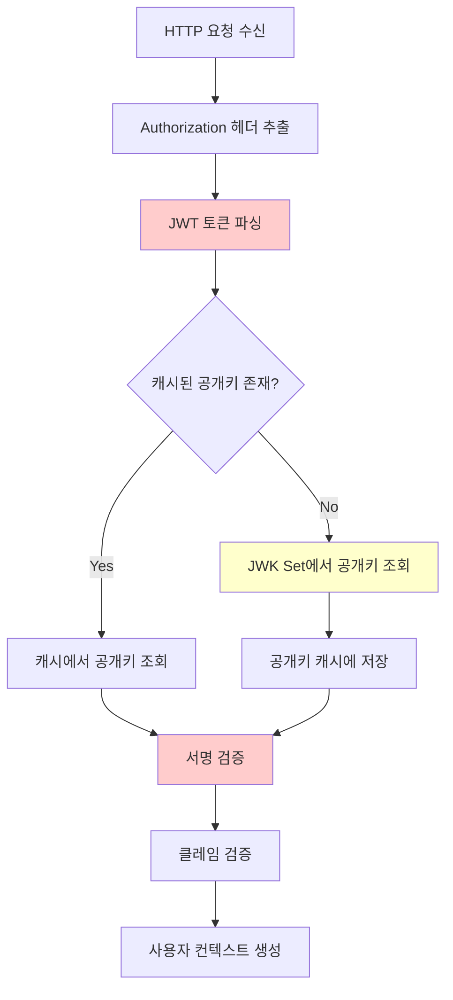
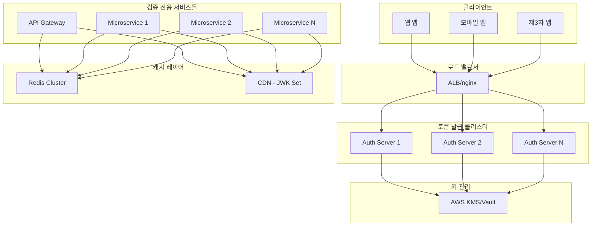

## 11장: JWT 검증 성능을 최적화하고 서버 부하를 줄이는 방법


### JWT 성능 병목점의 이해와 진단

JWT 인증 시스템이 대규모 트래픽을 처리하기 시작하면, 개발 단계에서는 보이지 않았던 성능 문제들이 급격히 드러나게 됩니다. Netflix의 엔지니어링 블로그에서 언급했듯이, "인증 시스템의 성능 병목점은 전체 시스템의 가용성을 좌우하는 핵심 요소"입니다.

JWT 검증 과정에서 발생하는 주요 성능 병목점을 이해하는 것이 최적화의 첫걸음입니다. 일반적인 JWT 검증 프로세스는 다음과 같은 단계를 거치며, 각 단계마다 고유한 성능 이슈가 존재합니다:

**토큰 파싱 단계**: Base64 디코딩과 JSON 파싱이 이루어지는데, 이 과정은 CPU 집약적입니다. 특히 페이로드가 큰 JWT의 경우 파싱 비용이 급격히 증가합니다.

**서명 검증 단계**: 암호화 알고리즘을 사용한 서명 검증이 가장 큰 성능 영향을 미치는 구간입니다. RSA256의 경우 HMAC256 대비 10배 이상의 연산 비용이 발생할 수 있습니다.

**클레임 검증 단계**: exp, iat, nbf 등의 표준 클레임 검증과 커스텀 클레임 검증이 이루어지는데, 이 과정에서 시간 동기화 문제나 복잡한 비즈니스 로직이 성능에 영향을 줄 수 있습니다.



Auth0의 성능 연구 자료에 따르면, 초당 10,000개의 요청을 처리하는 시스템에서 JWT 검증이 차지하는 CPU 사용률은 전체의 15-25%에 달할 수 있습니다. 이는 상당한 비용이며, 적절한 최적화 없이는 시스템의 확장성을 크게 제한하는 요소가 됩니다.


### 공개키 캐싱과 JWK Set 갱신 주기 최적화 전략

JWT 성능 최적화에서 가장 효과적인 방법 중 하나는 공개키 캐싱입니다. Google Cloud의 Identity Platform 팀이 공유한 사례에 따르면, 적절한 공개키 캐싱 전략을 통해 JWT 검증 성능을 70% 이상 개선할 수 있습니다.

공개키 캐싱의 핵심은 **캐시 미스를 최소화하면서도 보안성을 유지하는 균형점**을 찾는 것입니다. 너무 긴 캐시 기간은 키 로테이션 시 보안 위험을 증가시키고, 너무 짧은 캐시 기간은 성능 이점을 상쇄시킵니다.

실무에서 검증된 공개키 캐싱 전략을 살펴보겠습니다. Amazon의 Cognito 팀은 다음과 같은 다층 캐싱 구조를 제안합니다:

**메모리 캐시 (L1)**: 애플리케이션 레벨에서 가장 빈번히 사용되는 키들을 메모리에 보관합니다. TTL은 5-15분으로 설정하여 빠른 응답 속도를 보장합니다.

**로컬 디스크 캐시 (L2)**: 메모리 캐시에서 누락된 키들을 로컬 파일시스템에서 조회합니다. 네트워크 호출 없이 상대적으로 빠른 액세스가 가능합니다.

**분산 캐시 (L3)**: Redis나 Memcached를 통한 전역 캐시로, 여러 인스턴스 간 공개키를 공유할 수 있습니다.

다음은 이러한 다층 캐싱을 구현한 Node.js 예제입니다:

```javascript
class JWKCacheManager {
  constructor() {
    this.memoryCache = new Map();
    this.redis = new Redis(process.env.REDIS_URL);
    this.cacheTTL = {
      memory: 900, // 15분
      redis: 3600, // 1시간
      disk: 7200   // 2시간
    };
  }

  async getPublicKey(kid) {
    // L1: 메모리 캐시 확인
    const memoryCached = this.memoryCache.get(kid);
    if (memoryCached && !this.isExpired(memoryCached)) {
      return memoryCached.key;
    }

    // L2: Redis 분산 캐시 확인
    const redisCached = await this.redis.get(`jwk:${kid}`);
    if (redisCached) {
      const parsed = JSON.parse(redisCached);
      this.memoryCache.set(kid, {
        key: parsed.key,
        timestamp: Date.now()
      });
      return parsed.key;
    }

    // L3: JWK Set에서 조회 및 캐싱
    const publicKey = await this.fetchFromJWKSet(kid);
    await this.cacheKey(kid, publicKey);
    return publicKey;
  }
}
```

JWK Set 갱신 주기의 최적화는 특히 중요한데, Microsoft의 Azure AD 팀이 발표한 연구에서는 **적응적 갱신 전략(Adaptive Refresh Strategy)**을 제안합니다. 이 방식은 토큰 검증 실패율을 모니터링하여 동적으로 갱신 주기를 조정합니다:

**정상 상황**: 6시간마다 갱신하여 네트워크 비용을 최소화 **키 로테이션 감지 시**: 1분마다 갱신하여 빠른 대응 **오류율 증가 시**: 30초마다 갱신하여 문제 해결


### Redis를 활용한 토큰 블랙리스트 구현과 성능 튜닝

JWT의 stateless 특성상 토큰을 무효화하는 것은 본질적으로 어려운 문제입니다. 하지만 보안상 즉시 토큰을 무효화해야 하는 상황들이 반드시 발생하므로, 성능 영향을 최소화하면서 블랙리스트를 구현하는 것이 중요합니다.

Reddit의 인증 시스템 아키텍처에서 영감을 받은 **하이브리드 블랙리스트 전략**을 살펴보겠습니다. 이 방식은 전체 토큰을 블랙리스트에 저장하는 대신, 토큰 지문(fingerprint)과 만료 시간만을 저장하여 메모리 사용량을 80% 이상 줄일 수 있습니다.

토큰 블랙리스트의 핵심은 **검증 속도와 메모리 효율성의 균형**을 맞추는 것입니다. 나이브한 구현에서는 모든 JWT 검증 시마다 Redis에 질의하게 되어 네트워크 레이턴시가 병목이 됩니다. 효과적인 해결책은 **로컬 캐싱과 배치 업데이트**를 조합하는 것입니다.

로컬 애플리케이션에서는 최근 확인된 유효한 토큰들의 해시를 메모리에 캐싱하고, 주기적으로 Redis의 블랙리스트와 동기화합니다. 이를 통해 대부분의 검증은 메모리에서 이루어지고, 네트워크 호출은 최소화됩니다:

```javascript
class OptimizedBlacklistManager {
  constructor() {
    this.localValidCache = new Set();
    this.localBlacklistCache = new Set();
    this.redis = new Redis();
    this.lastSyncTime = 0;
    this.syncInterval = 30000; // 30초
  }

  async isTokenBlacklisted(tokenHash) {
    // 로컬 캐시 우선 확인
    if (this.localBlacklistCache.has(tokenHash)) {
      return true;
    }
    
    if (this.localValidCache.has(tokenHash)) {
      return false;
    }

    // 주기적 동기화 확인
    await this.syncIfNeeded();
    
    // Redis 확인 (캐시 미스 시에만)
    const isBlacklisted = await this.redis.sismember('jwt_blacklist', tokenHash);
    
    if (isBlacklisted) {
      this.localBlacklistCache.add(tokenHash);
    } else {
      this.localValidCache.add(tokenHash);
    }
    
    return isBlacklisted;
  }
}
```

Spotify의 엔지니어링 팀이 공개한 사례에서는 **시간 기반 파티셔닝**을 통해 블랙리스트 성능을 개선했습니다. 만료된 토큰들은 자동으로 정리되므로, 날짜별로 키를 분리하여 만료된 파티션을 일괄 삭제함으로써 메모리 사용량을 지속적으로 최적화할 수 있습니다.


### JWT 서명 알고리즘별 성능 특성과 선택 기준

JWT 서명 알고리즘의 선택은 보안성과 성능 사이의 중요한 트레이드오프입니다. 각 알고리즘의 성능 특성을 정확히 이해하고 비즈니스 요구사항에 맞는 선택을 하는 것이 핵심입니다.

**HMAC 기반 알고리즘 (HS256, HS384, HS512)**: 대칭키 암호화를 사용하여 가장 빠른 성능을 제공합니다. 하지만 마이크로서비스 환경에서는 모든 서비스가 같은 비밀키를 공유해야 하므로 보안 위험이 증가합니다.

**RSA 기반 알고리즘 (RS256, RS384, RS512)**: 비대칭키 암호화로 뛰어난 보안성을 제공하지만, 서명 검증 시 상당한 CPU 연산이 필요합니다. 특히 RSA 키 크기가 클수록 성능 영향이 기하급수적으로 증가합니다.

**ECDSA 기반 알고리즘 (ES256, ES384, ES512)**: RSA보다 작은 키 크기로 동일한 보안 수준을 제공하며, 성능 면에서도 RSA와 HMAC의 중간 지점에 위치합니다.

GitHub의 인증 인프라 팀이 발표한 벤치마크 결과를 참고하면, 초당 10,000개 토큰 검증 시나리오에서:

- HS256: 평균 0.05ms, CPU 사용률 12%
- ES256: 평균 0.15ms, CPU 사용률 28%
- RS256: 평균 0.45ms, CPU 사용률 65%

이러한 성능 차이를 고려할 때, **마이크로서비스 환경에서는 ES256을, 모노리틱 환경에서는 HS256을 권장**하는 것이 일반적입니다.

알고리즘 선택의 실무적 기준은 다음과 같습니다:

**보안 요구사항이 최우선인 경우**: RS256 또는 ES256을 선택하되, 공개키 캐싱과 하드웨어 가속을 통해 성능을 보완합니다.

**성능이 중요하고 신뢰할 수 있는 내부 네트워크인 경우**: HS256을 선택하되, 키 로테이션 전략을 철저히 수립합니다.

**균형이 필요한 경우**: ES256을 선택하여 보안성과 성능을 모두 확보합니다.

```javascript
class PerformanceOptimizedJWTVerifier {
  constructor(algorithm = 'ES256') {
    this.algorithm = algorithm;
    this.keyCache = new Map();
    this.verificationCache = new LRUCache(1000);
  }

  async verify(token) {
    // 토큰 해시 기반 결과 캐싱
    const tokenHash = crypto.createHash('sha256').update(token).digest('hex');
    const cached = this.verificationCache.get(tokenHash);
    
    if (cached && cached.exp > Date.now()) {
      return cached.payload;
    }

    // 실제 검증 수행
    const [header, payload, signature] = token.split('.');
    const decodedHeader = JSON.parse(Buffer.from(header, 'base64'));
    
    const publicKey = await this.getCachedPublicKey(decodedHeader.kid);
    const isValid = this.verifySignature(token, publicKey, this.algorithm);
    
    if (isValid) {
      const decodedPayload = JSON.parse(Buffer.from(payload, 'base64'));
      // 성공한 검증 결과 캐싱
      this.verificationCache.set(tokenHash, {
        payload: decodedPayload,
        exp: decodedPayload.exp * 1000 // ms로 변환
      });
      return decodedPayload;
    }
    
    throw new Error('Invalid token signature');
  }
}
```


### 대용량 트래픽 처리를 위한 JWT 검증 최적화 기법

Uber의 인증 플랫폼 팀이 공개한 **연결 풀링과 배치 처리** 기법은 대용량 트래픽 환경에서 특히 효과적입니다. 개별 토큰 검증마다 Redis 연결을 생성하는 대신, 연결 풀을 활용하고 여러 검증 요청을 배치로 처리함으로써 네트워크 오버헤드를 크게 줄일 수 있습니다.

**JWT 서명 검증 워커 풀 패턴**도 CPU 집약적인 서명 검증 작업을 효율적으로 처리하는 방법입니다. 메인 스레드에서 서명 검증을 수행하면 다른 요청 처리가 블록되므로, 별도의 워커 스레드나 프로세스에서 검증 작업을 처리합니다:

```javascript
// 워커 풀을 활용한 JWT 검증
class JWTWorkerPool {
  constructor(workerCount = os.cpus().length) {
    this.workers = [];
    this.taskQueue = [];
    this.activeWorkers = 0;
    
    for (let i = 0; i < workerCount; i++) {
      const worker = new Worker('./jwt-worker.js');
      worker.on('message', this.handleWorkerMessage.bind(this));
      this.workers.push(worker);
    }
  }

  async verifyToken(token) {
    return new Promise((resolve, reject) => {
      const task = { token, resolve, reject, id: crypto.randomUUID() };
      
      if (this.activeWorkers < this.workers.length) {
        this.assignTask(task);
      } else {
        this.taskQueue.push(task);
      }
    });
  }
}
```


## 12장: 대규모 트래픽 환경에서 JWT 인증 시스템을 안정적으로 운영하는 방법


### 토큰 발급 서버와 검증 로직의 분산 처리 아키텍처

대규모 서비스에서 JWT 인증 시스템의 가용성은 전체 플랫폼의 안정성을 좌우합니다. Facebook(현 Meta)의 엔지니어링 팀이 공개한 "Scale or Die" 아키텍처 원칙에 따르면, 인증 시스템은 단일 장애점(SPOF)이 없도록 설계되어야 하며, 수평적 확장이 가능해야 합니다.

현대적인 JWT 아키텍처에서는 **토큰 발급과 검증을 명확히 분리**하는 것이 핵심입니다. 토큰 발급은 상대적으로 빈도가 낮고 사용자 인증 정보에 의존하므로 상태를 가질 수 있지만, 토큰 검증은 매 API 호출마다 발생하므로 완전히 stateless해야 합니다.

**분산 토큰 발급 아키텍처**에서는 여러 대의 인증 서버가 동일한 개인키로 토큰을 발급할 수 있어야 합니다. 하지만 개인키의 복제는 보안 위험을 증가시키므로, AWS KMS나 HashiCorp Vault와 같은 키 관리 서비스를 활용하는 것이 바람직합니다.



Twitter(현 X)의 인증 플랫폼에서 사용하는 **지리적 분산 토큰 검증** 전략은 글로벌 서비스에서 특히 중요합니다. 각 지역의 엣지 서버에서 토큰 검증이 가능하도록 공개키를 전 세계적으로 배포하되, 키 로테이션 시에는 즉시 전파되도록 보장해야 합니다.

실제 구현에서는 **회로 차단기(Circuit Breaker) 패턴**을 적용하여 인증 서비스의 장애가 전체 시스템을 마비시키지 않도록 방어합니다:

```javascript
class AuthCircuitBreaker {
  constructor() {
    this.failureThreshold = 5;
    this.recoveryTimeout = 30000;
    this.state = 'CLOSED'; // CLOSED, OPEN, HALF_OPEN
    this.failureCount = 0;
    this.lastFailureTime = 0;
  }

  async executeWithBreaker(authFunction) {
    if (this.state === 'OPEN') {
      if (Date.now() - this.lastFailureTime > this.recoveryTimeout) {
        this.state = 'HALF_OPEN';
      } else {
        // 인증 우회 또는 캐시된 결과 반환
        return this.handleOpenState();
      }
    }

    try {
      const result = await authFunction();
      this.onSuccess();
      return result;
    } catch (error) {
      this.onFailure();
      throw error;
    }
  }

  handleOpenState() {
    // 그레이스풀 디그레데이션: 제한된 기능으로 동작
    return { user: null, permissions: ['readonly'] };
  }
}
```


### 토큰 갱신 요청 폭주 시 서버 과부하 방지 전략

모바일 앱이나 SPA에서 동시에 대량의 토큰 갱신 요청이 발생하는 **토큰 갱신 스톰(Token Refresh Storm)** 현상은 실무에서 자주 마주치는 문제입니다. 특히 아침 출근 시간이나 점심시간과 같이 사용자들이 일제히 앱을 실행하는 시간대에 발생하기 쉽습니다.

Instagram의 모바일 팀이 도입한 **지터(Jitter) 기반 갱신 전략**은 이 문제를 효과적으로 해결합니다. 토큰 만료 시간에 랜덤한 오프셋을 추가하여 갱신 요청이 시간적으로 분산되도록 합니다:

```javascript
class JitterBasedRefreshManager {
  calculateRefreshTime(expiryTime) {
    const bufferTime = 300; // 5분 버퍼
    const jitterRange = 120; // ±2분 지터
    const jitter = (Math.random() - 0.5) * jitterRange;
    
    return (expiryTime - bufferTime + jitter) * 1000;
  }

  scheduleRefresh(token) {
    const decoded = jwt.decode(token);
    const refreshTime = this.calculateRefreshTime(decoded.exp);
    
    setTimeout(() => {
      this.refreshToken();
    }, Math.max(0, refreshTime - Date.now()));
  }
}
```

**토큰 갱신 레이트 리미팅**은 개별 사용자나 디바이스가 과도하게 갱신 요청을 보내는 것을 방지합니다. Redis의 sliding window 알고리즘을 활용하여 구현할 수 있습니다:

```javascript
class RefreshRateLimiter {
  async checkRateLimit(userId, deviceId) {
    const key = `refresh_limit:${userId}:${deviceId}`;
    const now = Date.now();
    const windowSize = 300000; // 5분 윈도우
    const maxRequests = 5; // 5분에 5회까지

    // 만료된 요청 기록 정리
    await this.redis.zremrangebyscore(key, 0, now - windowSize);
    
    // 현재 요청 수 확인
    const currentRequests = await this.redis.zcard(key);
    
    if (currentRequests >= maxRequests) {
      throw new Error('Refresh rate limit exceeded');
    }
    
    // 현재 요청 기록
    await this.redis.zadd(key, now, `${now}-${crypto.randomUUID()}`);
    await this.redis.expire(key, Math.ceil(windowSize / 1000));
    
    return true;
  }
}
```


### CDN을 활용한 공개키 배포와 전 세계 JWT 검증 최적화

글로벌 서비스에서 JWT 검증 성능을 극대화하려면 공개키를 전 세계적으로 효율적으로 배포하는 것이 필수입니다. Cloudflare의 Workers 플랫폼에서 사용하는 **Edge-First JWT 검증** 패턴은 이를 위한 훌륭한 참조 사례입니다.

CDN을 통한 JWK Set 배포의 핵심은 **일관성과 가용성의 균형**을 맞추는 것입니다. 키 로테이션 시에는 모든 엣지 서버가 동시에 새로운 키를 받아야 하지만, 네트워크 지연이나 장애로 인해 일부 지역에서 업데이트가 지연될 수 있습니다.

**그레이스풀 키 로테이션 전략**에서는 새로운 키를 배포한 후에도 일정 기간 동안 이전 키를 유지하여 지역별 전파 지연을 수용합니다:

```javascript
class GlobalJWKManager {
  constructor() {
    this.primaryCDN = 'https://auth.example.com/.well-known/jwks.json';
    this.fallbackCDNs = [
      'https://auth-eu.example.com/.well-known/jwks.json',
      'https://auth-ap.example.com/.well-known/jwks.json'
    ];
    this.keyCache = new Map();
    this.keyGracePeriod = 300000; // 5분 그레이스 기간
  }

  async getPublicKey(kid) {
    // 로컬 캐시 확인
    const cached = this.keyCache.get(kid);
    if (cached && Date.now() < cached.expiry) {
      return cached.key;
    }

    // Primary CDN에서 시도
    try {
      const keys = await this.fetchFromCDN(this.primaryCDN);
      return this.extractKey(keys, kid);
    } catch (primaryError) {
      // Fallback CDN들 순차 시도
      for (const fallbackURL of this.fallbackCDNs) {
        try {
          const keys = await this.fetchFromCDN(fallbackURL);
          return this.extractKey(keys, kid);
        } catch (fallbackError) {
          continue;
        }
      }
      
      // 모든 CDN 실패 시 그레이스 기간 내 캐시된 키 사용
      if (cached && Date.now() < cached.expiry + this.keyGracePeriod) {
        console.warn(`Using expired key ${kid} due to CDN failure`);
        return cached.key;
      }
      
      throw new Error(`Failed to fetch public key ${kid} from all CDNs`);
    }
  }
}
```

**엣지 컴퓨팅을 활용한 JWT 검증**은 최근 주목받는 패턴입니다. Fastly의 Compute@Edge나 Cloudflare Workers를 활용하면, 사용자와 가장 가까운 엣지 서버에서 JWT 검증을 수행하여 레이턴시를 최소화할 수 있습니다.


### 메트릭 기반 성능 모니터링과 자동 스케일링

LinkedIn의 인증 플랫폼에서 사용하는 **적응형 성능 모니터링** 시스템은 JWT 검증 성능을 실시간으로 추적하고 자동으로 대응하는 방법을 제시합니다.

핵심 성능 지표들을 지속적으로 모니터링하여 문제를 조기에 감지해야 합니다:

**처리량 지표**: 초당 JWT 검증 요청 수, 성공률, 실패율 **레이턴시 지표**: P50, P95, P99 검증 시간 **리소스 사용률**: CPU, 메모리, 네트워크 사용량 **캐시 효율성**: 캐시 히트율, 미스율

```javascript
class JWTPerformanceMonitor {
  constructor() {
    this.metrics = {
      verificationCount: 0,
      verificationErrors: 0,
      verificationTimes: [],
      cacheHitRate: 0
    };
    
    this.alertThresholds = {
      errorRate: 0.05, // 5% 오류율
      latencyP95: 100,  // 95퍼센타일 100ms
      cacheHitRate: 0.8 // 80% 캐시 히트율
    };
  }

  recordVerification(duration, success, cacheHit) {
    this.metrics.verificationCount++;
    this.metrics.verificationTimes.push(duration);
    
    if (!success) {
      this.metrics.verificationErrors++;
    }
    
    this.updateCacheHitRate(cacheHit);
    this.checkAlerts();
  }

  checkAlerts() {
    const errorRate = this.metrics.verificationErrors / this.metrics.verificationCount;
    const p95Latency = this.calculatePercentile(this.metrics.verificationTimes, 95);
    
    if (errorRate > this.alertThresholds.errorRate) {
      this.triggerAlert('HIGH_ERROR_RATE', { errorRate });
    }
    
    if (p95Latency > this.alertThresholds.latencyP95) {
      this.triggerAlert('HIGH_LATENCY', { p95Latency });
    }
  }
}
```

**자동 스케일링 전략**에서는 JWT 검증 부하를 예측하고 선제적으로 리소스를 확장하는 것이 중요합니다. Kubernetes의 HPA(Horizontal Pod Autoscaler)를 JWT 검증 지표와 연동하여 구성할 수 있습니다.


### 글로벌 분산 환경에서의 JWT 일관성 보장

Netflix의 글로벌 CDN 아키텍처에서 사용하는 **최종 일관성(Eventual Consistency) 모델**은 JWT 키 배포에서 참고할 만한 패턴입니다. 키 로테이션 시 모든 지역에 즉시 전파되지 않을 수 있으므로, 일시적 불일치를 허용하면서도 보안을 유지하는 전략이 필요합니다.

**다중 키 기간(Multiple Key Period)** 설계에서는 새로운 키로 토큰을 발급하기 시작하더라도 이전 키들을 일정 기간 유지하여 지역별 전파 지연을 수용합니다. 일반적으로 키 로테이션 후 24-48시간 동안은 이전 키도 유효하게 유지합니다.

**지역별 폴백 검증** 메커니즘도 중요합니다. 특정 지역에서 최신 키를 받지 못한 경우, 중앙 인증 서버에 직접 검증을 요청할 수 있는 폴백 경로를 제공해야 합니다:

```javascript
class GlobalJWTValidator {
  constructor() {
    this.regionalEndpoints = {
      'us-east': 'https://auth-us-east.example.com',
      'eu-west': 'https://auth-eu-west.example.com',
      'ap-southeast': 'https://auth-ap.example.com'
    };
    this.centralAuthority = 'https://auth-global.example.com';
  }

  async validateWithFallback(token, region) {
    try {
      // 지역 엔드포인트에서 먼저 시도
      return await this.validateAtRegion(token, region);
    } catch (regionalError) {
      console.warn(`Regional validation failed: ${regionalError.message}`);
      
      try {
        // 중앙 인증 서버로 폴백
        return await this.validateAtCentral(token);
      } catch (centralError) {
        // 최후의 수단: 로컬 캐시의 만료된 키 사용
        return await this.validateWithExpiredKeys(token);
      }
    }
  }
}
```


### 대규모 동시 접속 상황에서의 토큰 갱신 최적화

YouTube의 라이브 스트리밍 플랫폼에서 경험한 **동시 토큰 갱신 문제**는 많은 개발자들이 간과하기 쉬운 시나리오입니다. 인기 있는 라이브 방송이 시작되거나 끝날 때, 수십만 명의 사용자가 동시에 앱에 접속하면서 토큰 갱신 요청이 폭증할 수 있습니다.

이런 상황에서는 **적응형 배치 처리(Adaptive Batch Processing)**가 효과적입니다. 토큰 갱신 요청들을 개별적으로 처리하는 대신, 동일한 사용자 그룹의 요청들을 묶어서 배치로 처리함으로써 데이터베이스 부하를 크게 줄일 수 있습니다.

**토큰 갱신 큐 관리**에서는 우선순위 기반 처리가 중요합니다. 프리미엄 사용자나 중요한 서비스의 토큰 갱신을 우선 처리하되, 일반 사용자의 요청도 적절한 시간 내에 처리되도록 보장해야 합니다:

```javascript
class PrioritizedRefreshQueue {
  constructor() {
    this.queues = {
      high: new PriorityQueue(),
      normal: new Queue(),
      low: new Queue()
    };
    this.processing = false;
    this.batchSize = 50;
  }

  async addRefreshRequest(userId, token, priority = 'normal') {
    const request = { userId, token, timestamp: Date.now() };
    
    this.queues[priority].enqueue(request);
    
    if (!this.processing) {
      this.processQueue();
    }
  }

  async processQueue() {
    this.processing = true;
    
    while (this.hasRequests()) {
      const batch = this.createBatch();
      
      try {
        await this.processBatch(batch);
      } catch (error) {
        await this.handleBatchError(batch, error);
      }
      
      // 시스템 부하 체크 후 잠시 대기
      await this.adaptiveDelay();
    }
    
    this.processing = false;
  }
}
```


### 메모리 사용량 최적화를 위한 JWT 캐싱 전략

대용량 트래픽 환경에서는 메모리 사용량 관리가 성능만큼 중요합니다. WhatsApp의 인증 시스템에서 사용하는 **계층적 메모리 관리** 방식은 참고할 만합니다.

**적응형 캐시 크기 조정**은 시스템 부하에 따라 캐시 크기를 동적으로 조정하는 기법입니다. 메모리 사용률이 높을 때는 캐시 크기를 줄이고, 여유가 있을 때는 확장하여 최적의 성능을 유지합니다.

**시간 기반 캐시 분할**도 효과적인 전략입니다. 최근 검증된 토큰들은 빠른 메모리에, 오래된 토큰들은 상대적으로 느린 저장소에 보관하여 메모리 효율성을 높입니다:

```javascript
class HierarchicalJWTCache {
  constructor() {
    this.hotCache = new LRUCache({ max: 1000, ttl: 300000 }); // 5분
    this.warmCache = new LRUCache({ max: 5000, ttl: 1800000 }); // 30분
    this.coldStorage = new Map(); // Redis 백엔드
  }

  async get(tokenHash) {
    // Hot cache 확인 (메모리)
    let result = this.hotCache.get(tokenHash);
    if (result) return result;

    // Warm cache 확인 (메모리)
    result = this.warmCache.get(tokenHash);
    if (result) {
      // Hot cache로 승격
      this.hotCache.set(tokenHash, result);
      return result;
    }

    // Cold storage 확인 (Redis)
    result = await this.redis.get(`jwt:${tokenHash}`);
    if (result) {
      const parsed = JSON.parse(result);
      this.warmCache.set(tokenHash, parsed);
      return parsed;
    }

    return null;
  }
}
```

이러한 성능 최적화 전략들을 통해 JWT 인증 시스템은 수백만 사용자의 동시 접속을 안정적으로 처리할 수 있습니다. 다음 장에서는 이러한 시스템을 모니터링하고 문제가 발생했을 때 신속히 대응하는 방법들을 자세히 살펴보겠습니다.
