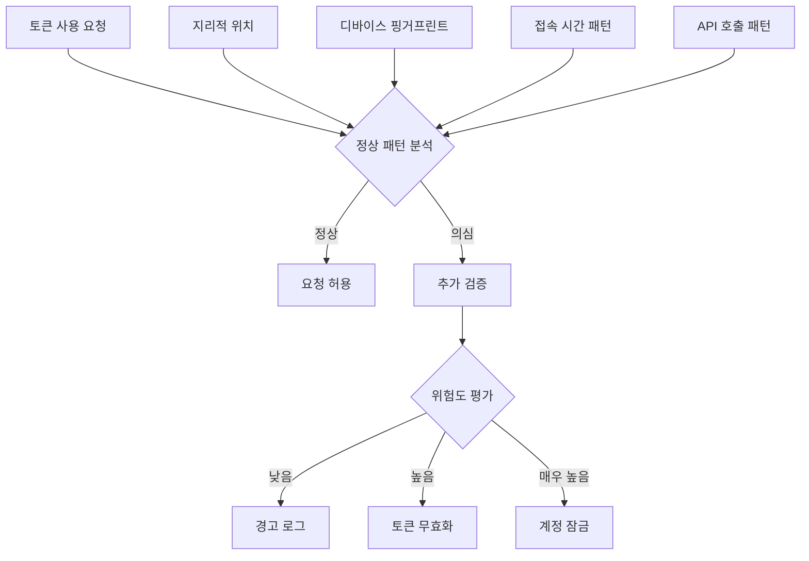
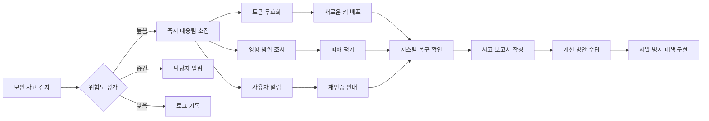

## 13장: JWT 관련 버그를 빠르게 찾아내고 해결하는 디버깅 기법들


### 토큰 파싱 오류와 서명 검증 실패를 체계적으로 진단하는 방법

JWT 디버깅에서 가장 빈번하게 마주치는 문제는 토큰 파싱 오류와 서명 검증 실패입니다. 이러한 문제들은 표면적으로는 단순해 보이지만, 실제로는 여러 계층에서 발생할 수 있는 복합적인 이슈들입니다. 성공적인 디버깅을 위해서는 체계적인 접근법이 필요합니다.

먼저 토큰 구조 자체의 유효성을 검증하는 것부터 시작해야 합니다. JWT는 헤더, 페이로드, 서명 이렇게 세 부분이 점(.)으로 구분된 구조를 가지고 있습니다. 각 부분이 올바르게 Base64URL 인코딩되어 있는지, 그리고 전체적인 형식이 RFC 7519 표준을 준수하는지 확인해야 합니다. JWT는 "헤더, 페이로드, 서명 이렇게 세 부분으로 구성되며 점으로 구분된다"고 명시되어 있습니다.

실무에서 자주 발생하는 파싱 오류 중 하나는 클라이언트에서 보내는 Authorization 헤더의 형식 문제입니다. 올바른 형식은 'Bearer ' 접두사 다음에 토큰이 와야 하는데, 개발자들이 공백을 빼먹거나 대소문자를 잘못 쓰는 경우가 많습니다. 또한 일부 HTTP 클라이언트 라이브러리들은 헤더 값을 자동으로 트림하거나 변형하기도 합니다.

```javascript
// 올바른 토큰 추출 로직
function extractTokenFromHeader(authHeader) {
  if (!authHeader || !authHeader.startsWith('Bearer ')) {
    throw new Error('Invalid authorization header format');
  }
  
  const token = authHeader.substring(7); // 'Bearer ' 제거
  
  // 토큰 구조 기본 검증
  const parts = token.split('.');
  if (parts.length !== 3) {
    throw new Error('Invalid JWT structure');
  }
  
  return token;
}
```

서명 검증 실패의 경우, 대부분 알고리즘 불일치나 시크릿 키 문제에서 비롯됩니다. JWT는 여러 서명 알고리즘을 지원하지만, "none" 알고리즘 같은 위험한 옵션들도 포함되어 있어 서버 설정이 중요하다는 점을 기억해야 합니다. 헤더의 alg 필드와 서버에서 설정한 알고리즘이 일치하는지, 그리고 해당 알고리즘에 맞는 올바른 키를 사용하고 있는지 확인하는 것이 핵심입니다.

서명 검증 과정에서 발생하는 미묘한 오류들을 잡아내기 위해서는 단계별 로깅을 구현하는 것이 효과적입니다. 토큰 수신, 헤더 파싱, 페이로드 디코딩, 서명 계산, 서명 비교 등 각 단계에서 상세한 로그를 남겨 어느 지점에서 실패하는지 정확히 파악할 수 있어야 합니다.


### 클라이언트와 서버 간 시간 동기화 문제로 인한 토큰 만료 이슈 해결하기

시간 동기화 문제는 JWT 인증에서 놓치기 쉬우면서도 심각한 영향을 미칠 수 있는 이슈입니다. JWT의 exp(만료 시간)과 iat(발급 시간), nbf(유효 시작 시간) 클레임들은 모두 UTC 기준의 Unix 타임스탬프를 사용하는데, 클라이언트와 서버의 시계가 동기화되지 않으면 예상치 못한 토큰 만료나 유효성 검증 실패가 발생할 수 있습니다.

특히 분산 시스템 환경에서는 이 문제가 더욱 복잡해집니다. 마이크로서비스 아키텍처에서 각 서비스가 다른 서버에서 실행되고, 각 서버의 시계가 미묘하게 다를 수 있습니다. 몇 초의 차이라도 토큰의 만료 시점 근처에서는 일관성 없는 동작을 야기할 수 있습니다.

이러한 문제를 해결하기 위해서는 먼저 클록 스큐(clock skew) 허용 범위를 설정해야 합니다. 대부분의 JWT 라이브러리들은 이를 위한 옵션을 제공합니다. 일반적으로 30초에서 5분 정도의 여유를 두는 것이 권장되지만, 보안 요구사항과 시스템 특성에 따라 조정해야 합니다.

```javascript
// 클록 스큐를 고려한 토큰 검증
const jwt = require('jsonwebtoken');

function verifyTokenWithClockSkew(token, secret) {
  try {
    return jwt.verify(token, secret, {
      clockTolerance: 60, // 60초 클록 스큐 허용
      algorithms: ['HS256'] // 허용 알고리즘 명시
    });
  } catch (error) {
    if (error.name === 'TokenExpiredError') {
      // 만료 시간과 현재 시간 비교 로깅
      const decoded = jwt.decode(token);
      const now = Math.floor(Date.now() / 1000);
      console.log(`Token expired: exp=${decoded.exp}, now=${now}, diff=${now - decoded.exp}s`);
    }
    throw error;
  }
}
```

시간 동기화 문제를 근본적으로 해결하려면 NTP(Network Time Protocol) 서버와의 동기화를 자동화하고, 시스템 간 시간 차이를 모니터링하는 것이 중요합니다. Docker 컨테이너 환경에서는 호스트 시간을 마운트하거나, 컨테이너 내에서 NTP 동기화를 설정하는 것이 필요합니다.


### 브라우저 개발자 도구를 활용한 JWT 플로우 추적과 문제점 파악 방법

브라우저 개발자 도구는 JWT 관련 문제를 진단하는 데 매우 강력한 도구입니다. 특히 클라이언트 사이드에서 발생하는 문제들을 실시간으로 추적하고 분석할 수 있어 디버깅 효율을 크게 향상시킬 수 있습니다.

JWT Inspector 같은 Chrome 확장 프로그램을 사용하면 "HTTP 요청의 Authorization 헤더에 포함된 JWT 토큰을 자동으로 감지하고 Chrome 개발자 도구에서 편리하게 내용을 확인할 수 있다"고 설명되어 있습니다. 이러한 도구들을 활용하면 매번 jwt.io에 토큰을 복사-붙여넣기할 필요 없이 실시간으로 토큰 내용을 확인할 수 있습니다.

Network 탭에서는 인증 관련 요청들의 전체 흐름을 시각적으로 추적할 수 있습니다. 로그인 요청, 토큰 발급, API 호출, 토큰 갱신 등의 순서와 타이밍을 정확히 파악할 수 있어, 토큰 갱신이 실패하는 시점이나 중복 요청이 발생하는 패턴을 쉽게 발견할 수 있습니다.

Console 탭에서는 JavaScript 오류들을 실시간으로 모니터링할 수 있습니다. 특히 토큰 만료로 인한 API 호출 실패나 localStorage/sessionStorage 접근 오류 등을 즉시 확인할 수 있습니다. 이때 중요한 것은 민감한 토큰 정보가 콘솔에 노출되지 않도록 주의하는 것입니다.

```javascript
// 안전한 토큰 디버깅 로깅
function debugTokenSafely(token) {
  try {
    const decoded = jwt.decode(token, { complete: true });
    
    // 민감한 정보는 마스킹하여 로깅
    const safePayload = {
      ...decoded.payload,
      sub: decoded.payload.sub ? '***' + decoded.payload.sub.slice(-4) : undefined,
      email: decoded.payload.email ? decoded.payload.email.replace(/(.{2})[^@]*/, '$1***') : undefined
    };
    
    console.log('Token Debug Info:', {
      header: decoded.header,
      payload: safePayload,
      isExpired: decoded.payload.exp < Date.now() / 1000
    });
  } catch (error) {
    console.error('Token debugging failed:', error.message);
  }
}
```

Application 탭에서는 토큰이 저장되는 위치(localStorage, sessionStorage, 쿠키)를 직접 확인하고 수정할 수 있습니다. 이를 통해 토큰 저장 로직의 문제점을 파악하거나 테스트 시나리오를 구성할 수 있습니다. 또한 쿠키의 경우 HttpOnly, Secure, SameSite 등의 플래그가 올바르게 설정되어 있는지도 확인할 수 있습니다.


## 14장: JWT 인증 시스템을 효과적으로 모니터링하고 알람을 설정하는 방법


### 토큰 갱신 실패율과 만료 패턴을 모니터링하여 시스템 건강도를 파악하는 지표들

JWT 인증 시스템의 건강도를 측정하는 핵심 지표들은 사용자 경험과 보안 모두에 직접적인 영향을 미칩니다. 가장 중요한 지표 중 하나는 토큰 갱신 성공률입니다. 이 지표가 급격히 떨어진다면 인증 서비스의 장애나 네트워크 문제, 혹은 클라이언트 로직의 버그를 의미할 수 있습니다.

Datadog의 모범 사례에 따르면, "모든 인증 활동에 대한 가시성을 확보하기 위해서는 애플리케이션 레벨에서 모든 로그인 플로우에 대한 이벤트를 로그해야 하며, 이를 통해 모니터링 커버리지의 공백을 제거할 수 있다"고 설명되어 있습니다.

토큰 만료 패턴 분석은 시스템 사용량과 사용자 행동 패턴을 이해하는 데 중요한 정보를 제공합니다. 정상적인 경우라면 토큰 만료는 설정된 TTL에 따라 예측 가능한 패턴을 보여야 합니다. 하지만 비정상적으로 많은 토큰이 만료 전에 무효화되거나, 갱신 요청이 폭증하는 패턴이 관찰된다면 보안 위협이나 시스템 오류의 신호일 수 있습니다.

```javascript
// 토큰 메트릭 수집을 위한 미들웨어
class JWTMetricsCollector {
  constructor(metricsClient) {
    this.metrics = metricsClient;
    this.tokenStats = {
      issued: 0,
      renewed: 0,
      expired: 0,
      invalid: 0,
      revoked: 0
    };
  }

  recordTokenIssued(tokenInfo) {
    this.tokenStats.issued++;
    this.metrics.increment('jwt.tokens.issued', {
      algorithm: tokenInfo.alg,
      issuer: tokenInfo.iss,
      client_type: tokenInfo.client_type
    });
  }

  recordTokenValidation(result, tokenInfo) {
    if (result.valid) {
      this.metrics.increment('jwt.validation.success');
    } else {
      this.tokenStats.invalid++;
      this.metrics.increment('jwt.validation.failure', {
        reason: result.error.name,
        algorithm: tokenInfo.alg
      });
    }
  }

  recordTokenRenewal(success, timeSinceExpiry) {
    if (success) {
      this.tokenStats.renewed++;
      this.metrics.timing('jwt.renewal.time_to_renew', timeSinceExpiry);
    }
  }
}
```

토큰 만료 시점 근처에서의 사용자 행동 패턴도 중요한 분석 대상입니다. 사용자가 토큰 만료 직전에 어떤 액션을 취하는지, 갱신 실패 후 재시도 패턴은 어떤지 등을 분석하면 UX 개선점을 찾을 수 있습니다. 특히 모바일 앱에서는 네트워크 연결 상태나 앱 백그라운드 상태가 토큰 갱신에 영향을 미칠 수 있으므로 이런 컨텍스트 정보도 함께 수집해야 합니다.


### 비정상적인 토큰 사용 패턴을 탐지하여 보안 위협을 조기에 발견하는 방법

보안 위협 탐지를 위해서는 정상적인 토큰 사용 패턴을 먼저 이해하고, 이를 기준으로 이상 징후를 탐지하는 기준을 수립해야 합니다. 일반적인 사용자들은 예측 가능한 시간대에 특정 지역에서 접속하며, 일관된 디바이스와 브라우저를 사용합니다.

Datadog의 가이드에 따르면, "credential stuffing 공격을 탐지하기 위해서는 동일한 IP 주소에서 여러 다른 사용자 ID로 로그인 시도하는 패턴을 찾아야 한다"고 설명되어 있습니다. 이는 JWT 환경에서도 동일하게 적용되는 중요한 보안 모니터링 기법입니다.

토큰 탈취를 의심할 수 있는 몇 가지 주요 패턴들이 있습니다. 첫째, 동일한 토큰이 지리적으로 불가능한 여러 위치에서 동시에 사용되는 경우입니다. 예를 들어, 서울에서 발급된 토큰이 5분 후 뉴욕에서 사용된다면 물리적으로 불가능한 상황입니다. 둘째, 사용자의 일반적인 행동 패턴과 크게 다른 API 호출 패턴이 관찰되는 경우입니다. 평상시 모바일 앱만 사용하던 사용자가 갑자기 웹 브라우저에서 접속하거나, 일반 사용자가 관리자 API를 호출하려 시도하는 경우가 여기에 해당합니다.



실시간 이상 탐지를 위해서는 기계학습 기반의 접근법도 고려할 수 있습니다. 사용자별 행동 패턴을 학습하여 평상시와 다른 패턴을 자동으로 탐지하는 시스템을 구축할 수 있습니다. 하지만 이런 시스템은 복잡도가 높으므로, 규모가 큰 서비스가 아니라면 규칙 기반의 단순한 접근법이 더 실용적일 수 있습니다.


### 로그 분석을 통한 JWT 관련 성능 병목점 식별과 개선 방향 도출

JWT 인증 시스템의 성능 병목점은 주로 토큰 검증 과정에서 발생합니다. 특히 비대칭 암호화 알고리즘(RS256, ES256 등)을 사용하는 경우 서명 검증에 상당한 연산 리소스가 필요합니다. 로그 분석을 통해 이런 병목점들을 정확히 식별하고 최적화 방향을 수립할 수 있습니다.

첫 번째로 주목해야 할 지표는 토큰 검증 응답 시간입니다. 평균 응답 시간뿐만 아니라 95th, 99th 백분위수 값을 모니터링하여 극단적인 지연이 발생하는 케이스들을 파악해야 합니다. 이런 지연은 보통 공개키 검색이나 데이터베이스 접근과 관련된 경우가 많습니다.

```javascript
// 성능 메트릭을 포함한 JWT 검증 래퍼
class PerformanceAwareJWTVerifier {
  constructor(keyProvider, metricsClient) {
    this.keyProvider = keyProvider;
    this.metrics = metricsClient;
  }

  async verifyToken(token, options = {}) {
    const startTime = Date.now();
    let keyFetchTime = 0;
    let verificationTime = 0;
    
    try {
      // 키 조회 시간 측정
      const keyStart = Date.now();
      const key = await this.keyProvider.getKey(token);
      keyFetchTime = Date.now() - keyStart;
      
      // 서명 검증 시간 측정
      const verifyStart = Date.now();
      const result = jwt.verify(token, key, options);
      verificationTime = Date.now() - verifyStart;
      
      // 성공 메트릭 기록
      this.recordMetrics('success', startTime, keyFetchTime, verificationTime);
      return result;
      
    } catch (error) {
      this.recordMetrics('failure', startTime, keyFetchTime, verificationTime, error);
      throw error;
    }
  }

  recordMetrics(status, startTime, keyFetchTime, verificationTime, error = null) {
    const totalTime = Date.now() - startTime;
    
    this.metrics.timing('jwt.verification.total_time', totalTime);
    this.metrics.timing('jwt.verification.key_fetch_time', keyFetchTime);
    this.metrics.timing('jwt.verification.signature_verification_time', verificationTime);
    
    if (error) {
      this.metrics.increment('jwt.verification.errors', {
        error_type: error.name,
        algorithm: this.extractAlgorithm(token)
      });
    }
  }
}
```

또 다른 중요한 성능 지표는 토큰 캐싱 효율성입니다. 동일한 토큰에 대한 중복 검증을 방지하기 위해 캐싱을 구현하는 경우가 많은데, 캐시 히트율과 미스율을 모니터링하여 캐시 설정을 최적화할 수 있습니다. 캐시 TTL이 너무 길면 토큰 무효화가 지연될 수 있고, 너무 짧으면 캐싱 효과가 미미해집니다.

서버 리소스 사용량 분석도 중요합니다. JWT 검증 과정에서 CPU 사용량이 급증하거나 메모리 사용량이 지속적으로 증가한다면 메모리 누수나 비효율적인 알고리즘 사용을 의심해볼 수 있습니다. 특히 JWKS(JSON Web Key Set) 엔드포인트에서 키를 자주 조회하는 패턴이 관찰된다면 키 캐싱 로직을 개선해야 할 수 있습니다.


## 15장: JWT 보안 사고가 발생했을 때 신속하게 대응하는 위기 관리 방법


### 토큰 탈취가 의심될 때 피해를 최소화하는 즉시 대응 절차들

토큰 탈취는 JWT 기반 인증 시스템에서 가장 심각한 보안 사고 중 하나입니다. "JWT가 도난당하면 공격자는 클라이언트를 가장하여 클라이언트의 동의 없이 서비스에 접근할 수 있으며, 이는 마치 사용자명과 비밀번호가 도난당한 것과 같은 수준의 피해를 의미한다"는 점을 인식하고 즉각적인 대응이 필요합니다.

토큰 탈취가 의심되는 상황은 여러 지표를 통해 감지할 수 있습니다. 동일한 토큰이 물리적으로 불가능한 여러 위치에서 동시에 사용되거나, 사용자의 평소 행동 패턴과 완전히 다른 API 호출이 발생하는 경우가 대표적입니다. 또한 사용자가 자신이 하지 않은 활동에 대해 문의하는 경우도 토큰 탈취를 의심해볼 수 있는 신호입니다.

즉시 대응 절차의 첫 번째 단계는 의심되는 토큰을 즉시 무효화하는 것입니다. JWT의 특성상 서버에서 토큰을 무효화하기 위해서는 블랙리스트를 운영하거나 토큰의 만료 시간까지 기다려야 한다는 제약이 있지만, 보안 사고 상황에서는 즉시 무효화가 우선되어야 합니다.

```javascript
// 긴급 토큰 무효화 시스템
class EmergencyTokenRevocation {
  constructor(redis, logger) {
    this.redis = redis;
    this.logger = logger;
  }

  async revokeToken(tokenId, reason, adminId) {
    const revocationKey = `revoked:token:${tokenId}`;
    const revocationInfo = {
      revokedAt: new Date().toISOString(),
      reason: reason,
      revokedBy: adminId,
      originalToken: tokenId.substring(0, 8) + '...' // 부분적으로만 로깅
    };

    // Redis에 무효화 정보 저장
    await this.redis.setex(revocationKey, 86400 * 7, JSON.stringify(revocationInfo)); // 7일간 보관

    // 긴급 알림 발송
    await this.sendEmergencyAlert(revocationInfo);
    
    this.logger.warn('Emergency token revocation', {
      tokenId: tokenId.substring(0, 8) + '...',
      reason,
      revokedBy: adminId
    });
  }

  async isTokenRevoked(tokenId) {
    const revocationKey = `revoked:token:${tokenId}`;
    return await this.redis.exists(revocationKey);
  }
}
```

두 번째 단계는 영향 범위를 빠르게 파악하는 것입니다. 탈취된 토큰으로 어떤 API가 호출되었는지, 어떤 데이터에 접근했는지, 다른 사용자에게 피해가 있었는지 등을 신속하게 조사해야 합니다. 이를 위해서는 평소에 상세한 액세스 로그를 수집하고 있어야 하며, 토큰 ID를 기준으로 빠르게 검색할 수 있는 시스템이 구축되어 있어야 합니다.

세 번째는 사용자 계정 보안 강화입니다. Okta의 권장사항에 따르면 "토큰이 도난당한 경우 즉시 사용자에게 비밀번호 변경을 강제하고, 가능하면 다단계 인증을 통한 과정을 거치도록 해야 한다"고 설명되어 있습니다. 단순히 토큰만 무효화하는 것으로는 충분하지 않으며, 계정 자체의 보안을 강화해야 합니다.


### 서명 키가 유출되었을 때 모든 토큰을 안전하게 무효화하는 방법

서명 키 유출은 JWT 시스템에서 발생할 수 있는 가장 치명적인 보안 사고입니다. 이 경우 공격자는 임의의 유효한 토큰을 생성할 수 있게 되므로, 시스템 전체의 인증 메커니즘이 완전히 무력화됩니다. "서명 키가 유출된 경우, 반드시 새로운 시크릿 키를 생성하고 모든 활성 세션을 무효화하여 모든 사용자가 재인증하도록 강제해야 한다"는 원칙을 따라야 합니다.

서명 키 유출 대응의 핵심은 속도입니다. 유출 사실을 인지한 순간부터 새로운 키로 완전히 전환하기까지의 시간을 최소화해야 공격자가 악용할 수 있는 시간 창구를 줄일 수 있습니다. 이를 위해서는 평소에 키 로테이션 프로세스를 자동화하고 연습해두는 것이 중요합니다.

키 교체 과정에서 가장 주의해야 할 점은 서비스 중단을 최소화하면서도 보안을 확보하는 것입니다. 이를 위해 롤링 업데이트 방식을 활용할 수 있습니다. 새로운 키를 배포하기 전에 일정 기간 동안 이전 키와 새로운 키를 모두 검증할 수 있도록 설정하고, 점진적으로 새로운 키로 전환하는 방식입니다.

```javascript
// 긴급 키 로테이션 시스템
class EmergencyKeyRotation {
  constructor(keyStore, tokenBlacklist, notificationService) {
    this.keyStore = keyStore;
    this.blacklist = tokenBlacklist;
    this.notifications = notificationService;
  }

  async executeEmergencyRotation(compromisedKeyId, reason) {
    const startTime = Date.now();
    
    try {
      // 1. 새로운 키 쌍 생성
      const newKey = await this.generateNewKeyPair();
      
      // 2. 모든 인스턴스에 새로운 키 배포
      await this.deployNewKey(newKey);
      
      // 3. 이전 키로 발급된 모든 토큰을 블랙리스트에 추가
      await this.blacklistAllTokensFromKey(compromisedKeyId);
      
      // 4. 이전 키 비활성화
      await this.deactivateKey(compromisedKeyId);
      
      // 5. 모든 사용자에게 재로그인 알림
      await this.forceUserReauthentication();
      
      // 6. 사고 보고서 생성
      await this.generateIncidentReport(compromisedKeyId, reason, startTime);
      
    } catch (error) {
      await this.notifications.sendCriticalAlert('Key rotation failed', error);
      throw error;
    }
  }

  async blacklistAllTokensFromKey(keyId) {
    // 해당 키로 발급된 모든 토큰을 만료 시간까지 블랙리스트에 추가
    const maxTokenLifetime = 24 * 60 * 60; // 24시간
    await this.blacklist.addKeyToBlacklist(keyId, maxTokenLifetime);
  }
}
```

대규모 시스템에서는 키 유출 대응을 더욱 정교하게 계획해야 합니다. 예를 들어, Netflix와 같은 글로벌 서비스는 "레거시 디바이스들이 아직도 오래된 토큰을 사용하고 있어서 호환성을 위해 다양한 형태의 토큰을 지원해야 한다"는 복잡성을 가지고 있습니다. 이런 환경에서는 단계적 마이그레이션 전략이 필요합니다.


### 사고 후 보안 강화를 위한 JWT 시스템 개선 체크리스트

보안 사고 발생 후에는 단순히 문제를 해결하는 것을 넘어서 근본적인 시스템 개선이 필요합니다. Auth0에서 발생한 alg:none 재발 버그 사례는 "반복적인 취약점 발생이 회사의 보안 문화에 근본적인 문제가 있음을 시사한다"는 교훈을 남겼습니다.

**즉시 실행해야 할 기술적 개선사항들:**

첫째, JWT 라이브러리와 의존성 패키지들의 최신 버전 업데이트입니다. 보안 패치가 포함된 버전들이 정기적으로 릴리스되므로, 자동화된 업데이트 시스템을 구축하거나 최소한 월별 점검 절차를 수립해야 합니다.

둘째, 알고리즘 화이트리스트 강화입니다. "서버는 예상치 못한 알고리즘으로 서명된 JWT에 대해서도 견고한 서명 검증을 수행해야 하며, jku 헤더에 대해서는 엄격한 허용 호스트 화이트리스트를 적용해야 한다"는 권장사항을 따라 더욱 엄격한 검증 로직을 구현해야 합니다.

```javascript
// 보안 강화된 JWT 검증 설정
const secureJWTConfig = {
  algorithms: ['RS256'], // 안전한 알고리즘만 허용
  ignoreExpiration: false,
  ignoreNotBefore: false,
  clockTolerance: 30, // 클록 스큐 허용 범위 축소
  issuer: process.env.TRUSTED_ISSUER, // 신뢰할 수 있는 발급자만 허용
  audience: process.env.SERVICE_AUDIENCE, // 대상 서비스 명시
  maxAge: '15m', // 최대 토큰 수명 제한
};

// 화이트리스트 기반 JKU 검증
const allowedJKUHosts = [
  'auth.company.com',
  'identity.company.com'
];

function validateJKUHeader(jku) {
  if (!jku) return true; // JKU가 없으면 통과
  
  try {
    const url = new URL(jku);
    if (!allowedJKUHosts.includes(url.hostname)) {
      throw new Error(`Unauthorized JKU host: ${url.hostname}`);
    }
    return true;
  } catch (error) {
    throw new Error(`Invalid JKU format: ${error.message}`);
  }
}
```

**프로세스 및 조직적 개선사항들:**

보안 사고 대응 팀의 구성과 역할을 명확히 정의해야 합니다. JWT 관련 사고는 기술적 복잡성이 높으므로, 보안 전문가뿐만 아니라 인증 시스템 개발자, 인프라 엔지니어, 그리고 비즈니스 이해관계자들이 포함된 크로스 펑셔널 팀이 필요합니다.

정기적인 보안 훈련과 모의 침투 테스트도 중요합니다. 최근 보안 연구에 따르면 "67%의 애플리케이션이 약하거나 예측 가능한 JWT 시크릿을 사용하고 있다"는 통계가 나왔습니다. 이는 실제 환경에서 체계적인 보안 점검이 부족함을 시사합니다.

**지속적 보안 모니터링 체계 구축:**

사고 예방을 위한 지속적 모니터링 시스템을 구축해야 합니다. 이는 단순히 기술적 모니터링을 넘어서 위협 인텔리전스와 연동된 종합적 보안 모니터링을 의미합니다.



**사고 학습과 개선:**

Netflix의 경우 "인증 관련 이슈들이 많이 발생하고 복잡한 아키텍처로 인한 문제점들이 누적되면서, 경영진도 이 문제의 심각성을 인식하고 수년에 걸친 마이그레이션 프로젝트를 승인했다"는 사례를 보여줍니다. 이처럼 보안 사고는 단순한 문제 해결을 넘어서 시스템 전체의 아키텍처 개선으로 이어져야 합니다.

사고 후 반드시 실시해야 할 것은 포스트모텀(Post-mortem) 회의입니다. 사고의 근본 원인을 분석하고, 유사한 사고를 예방하기 위한 시스템적 개선사항을 도출해야 합니다. 이때 중요한 것은 개인의 실수보다는 프로세스와 시스템의 문제점에 초점을 맞추는 것입니다.

최종적으로, 사고 대응 경험을 조직의 자산으로 전환하는 것이 중요합니다. 대응 플레이북을 업데이트하고, 유사한 상황에서 더 빠르게 대응할 수 있도록 자동화 도구들을 개선하며, 팀원들의 보안 역량을 강화하는 교육 프로그램을 실시해야 합니다.

보안은 일회성 활동이 아니라 지속적인 개선 과정이라는 점을 명심하고, JWT 시스템의 보안 수준을 지속적으로 향상시켜 나가야 합니다. 특히 2025년 현재 "JWT 보안이 그 어느 때보다 중요해졌으며, 빠르게 진화하는 사이버 위협과 강화되는 규제 요구사항으로 인해 견고한 JWT 보안 구현이 단순한 모범 사례를 넘어서 비즈니스 필수 요소가 되었다"는 현실을 인식하고 대응해야 합니다.

------

이 6부에서는 JWT 인증 시스템의 운영 단계에서 발생할 수 있는 실무적 문제들과 해결방안을 다뤘습니다. 디버깅부터 모니터링, 그리고 보안 사고 대응까지 전체적인 운영 관리 역량을 구축하는 것이 안정적인 JWT 시스템 운영의 핵심입니다.
