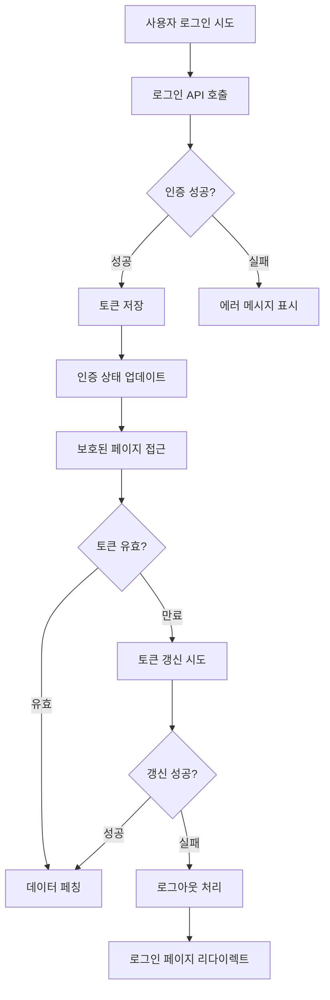
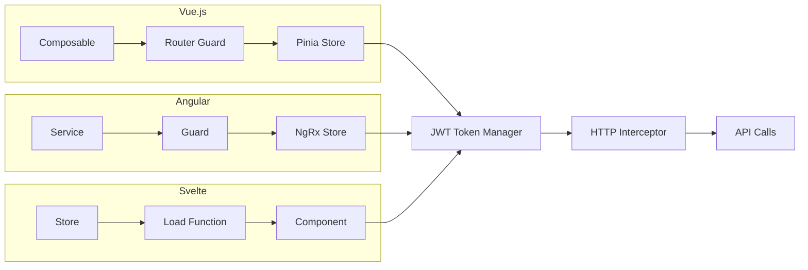
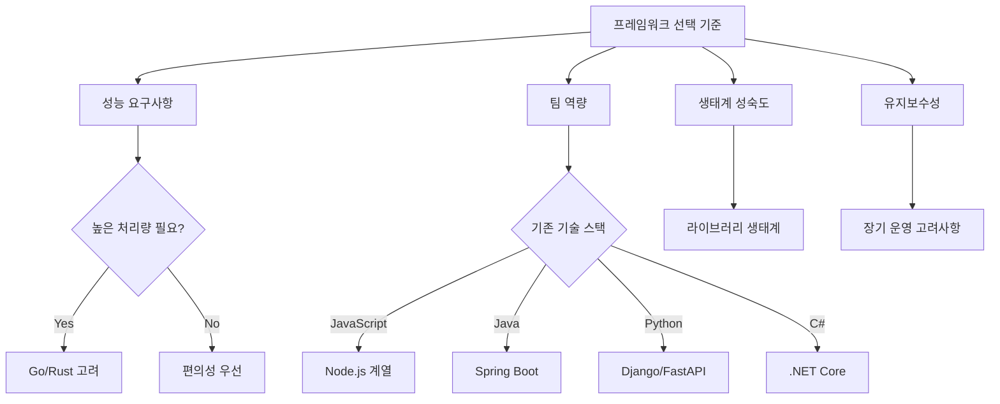

앞선 장들에서 JWT의 이론적 기반과 보안 원칙들을 살펴보았다면, 이제 실제 프로덕션 환경에서 JWT 인증을 구현하는 구체적인 방법들을 알아볼 차례입니다. 이 부분에서는 현재 가장 널리 사용되는 프론트엔드와 백엔드 프레임워크별로 JWT 인증을 안전하고 효율적으로 구현하는 방법들을 다루겠습니다.

Netflix의 엔지니어 팀이 2022년 기술 블로그에서 언급했듯이, "인증 시스템의 성공은 이론적 설계가 아니라 실제 구현에서 결정된다"는 말처럼, 올바른 구현 패턴을 따르는 것이 무엇보다 중요합니다. 각 프레임워크가 가진 고유한 특성과 생태계를 이해하고, 그에 맞는 최적의 JWT 구현 방법을 선택해야 합니다.

------


## 16장: React 생태계에서 JWT 인증을 완벽하게 구현하는 실전 가이드

React 생태계는 JWT 인증 구현에 있어 가장 다양하고 성숙한 옵션들을 제공합니다. 하지만 그만큼 선택의 폭이 넓어 어떤 패턴을 사용해야 할지 혼란스러울 수 있습니다. 이 장에서는 React Router부터 Next.js, Remix까지 각 환경에서 검증된 JWT 구현 패턴들을 살펴보겠습니다.


### React Router, Next.js, Remix에서의 JWT 인증 미들웨어 구현 패턴들

React 애플리케이션에서 JWT 인증을 구현할 때 가장 먼저 고려해야 할 것은 라우팅 레벨에서의 인증 보호입니다. 각 프레임워크는 서로 다른 접근 방식을 제공하며, 이를 이해하고 올바르게 활용하는 것이 성공적인 인증 시스템의 첫걸음입니다.

Shopify의 프론트엔드 팀이 2023년 공유한 경험에 따르면, "인증 미들웨어의 핵심은 사용자 경험을 해치지 않으면서도 보안을 확실히 보장하는 것"이라고 합니다. 이를 위해서는 각 프레임워크의 특성을 정확히 이해해야 합니다.

**React Router v6에서의 인증 가드 구현**

React Router에서 JWT 인증을 구현할 때는 Higher-Order Component 패턴이나 Custom Hook을 활용한 접근 방식이 일반적입니다. 가장 효과적인 방법은 `loader` 함수를 활용하는 것입니다. 이 방법은 컴포넌트가 렌더링되기 전에 인증 상태를 확인할 수 있어 불필요한 렌더링을 방지할 수 있습니다.

```jsx
// authLoader.js
import { redirect } from "react-router-dom";
import { getAccessToken, refreshAccessToken } from "./tokenManager";

export async function requireAuth() {
  const token = getAccessToken();
  
  if (!token) {
    throw redirect("/login");
  }
  
  // 토큰 만료 검증
  if (isTokenExpired(token)) {
    try {
      await refreshAccessToken();
    } catch (error) {
      throw redirect("/login");
    }
  }
  
  return null;
}

// 라우터 설정
const router = createBrowserRouter([
  {
    path: "/dashboard",
    element: <Dashboard />,
    loader: requireAuth,
  }
]);
```

**Next.js App Router에서의 미들웨어 활용**

Next.js 13+의 App Router는 middleware.ts 파일을 통해 라우팅 레벨에서 인증을 처리할 수 있는 강력한 기능을 제공합니다. Vercel 팀이 공식 문서에서 권장하는 방식은 Edge Runtime을 활용한 빠른 JWT 검증입니다.

```typescript
// middleware.ts
import { NextRequest, NextResponse } from 'next/server';
import { jwtVerify } from 'jose';

export async function middleware(request: NextRequest) {
  const token = request.cookies.get('access-token')?.value;
  
  // 보호된 경로 정의
  if (request.nextUrl.pathname.startsWith('/dashboard')) {
    if (!token) {
      return NextResponse.redirect(new URL('/login', request.url));
    }
    
    try {
      await jwtVerify(token, new TextEncoder().encode(process.env.JWT_SECRET));
    } catch (error) {
      return NextResponse.redirect(new URL('/login', request.url));
    }
  }
  
  return NextResponse.next();
}

export const config = {
  matcher: ['/dashboard/:path*', '/admin/:path*']
};
```

**Remix에서의 서버 사이드 인증 처리**

Remix는 서버 사이드에서 인증을 처리하는 독특한 접근 방식을 제공합니다. `loader`와 `action` 함수에서 서버에서 직접 JWT를 검증하므로, 클라이언트에서 추가적인 인증 로직이 필요하지 않습니다. 이는 보안성과 성능 모두를 향상시킵니다.

```typescript
// app/utils/auth.server.ts
import jwt from 'jsonwebtoken';
import { redirect } from '@remix-run/node';

export async function requireUser(request: Request) {
  const cookie = request.headers.get('Cookie');
  const token = parseTokenFromCookie(cookie);
  
  if (!token) {
    throw redirect('/login');
  }
  
  try {
    const payload = jwt.verify(token, process.env.JWT_SECRET);
    return payload;
  } catch (error) {
    throw redirect('/login');
  }
}

// 라우트에서 사용
export async function loader({ request }: LoaderFunctionArgs) {
  const user = await requireUser(request);
  // 인증된 사용자만 이 코드에 도달함
  return json({ user });
}
```


### Context API와 상태 관리 라이브러리를 활용한 인증 상태 관리 모범 사례

React 애플리케이션에서 JWT 인증 상태를 전역으로 관리하는 것은 매우 중요합니다. 잘못 설계된 상태 관리는 성능 저하와 보안 문제를 동시에 야기할 수 있기 때문입니다. Airbnb의 프론트엔드 팀이 2023년 공개한 아키텍처 사례에서 보듯이, 인증 상태 관리는 애플리케이션의 전체적인 성능에 직접적인 영향을 미칩니다.

**Context API를 활용한 인증 상태 관리**

Context API는 JWT 인증 상태를 관리하는 가장 기본적이면서도 효과적인 방법입니다. 하지만 전체 애플리케이션을 감싸는 Context를 만들 때는 불필요한 리렌더링을 방지하는 설계가 필수적입니다.

```jsx
// AuthContext.jsx
import React, { createContext, useContext, useReducer, useEffect } from 'react';

const AuthStateContext = createContext();
const AuthDispatchContext = createContext();

function authReducer(state, action) {
  switch (action.type) {
    case 'LOGIN_SUCCESS':
      return {
        ...state,
        isAuthenticated: true,
        user: action.payload.user,
        loading: false
      };
    case 'TOKEN_REFRESH':
      return {
        ...state,
        loading: false
      };
    case 'LOGOUT':
      return {
        isAuthenticated: false,
        user: null,
        loading: false
      };
    default:
      throw new Error(`Unhandled action type: ${action.type}`);
  }
}

export function AuthProvider({ children }) {
  const [state, dispatch] = useReducer(authReducer, {
    isAuthenticated: false,
    user: null,
    loading: true
  });

  return (
    <AuthStateContext.Provider value={state}>
      <AuthDispatchContext.Provider value={dispatch}>
        {children}
      </AuthDispatchContext.Provider>
    </AuthStateContext.Provider>
  );
}
```

이러한 패턴의 핵심은 상태(state)와 디스패치(dispatch)를 분리하여 불필요한 리렌더링을 방지하는 것입니다. Dan Abramov가 React 공식 블로그에서 언급했듯이, "Context를 분리하면 디스패치 함수만 필요한 컴포넌트는 상태 변경에 영향받지 않습니다."

**Zustand를 활용한 경량 상태 관리**

대규모 애플리케이션에서는 Zustand와 같은 경량 상태 관리 라이브러리가 더 나은 선택이 될 수 있습니다. Zustand는 보일러플레이트가 적고 TypeScript 지원이 우수하여 JWT 인증 상태를 관리하기에 매우 적합합니다.

```typescript
// authStore.ts
import { create } from 'zustand';
import { persist } from 'zustand/middleware';

interface AuthState {
  isAuthenticated: boolean;
  user: User | null;
  login: (tokens: TokenPair) => void;
  logout: () => void;
  refreshToken: () => Promise<void>;
}

export const useAuthStore = create<AuthState>()(
  persist(
    (set, get) => ({
      isAuthenticated: false,
      user: null,
      
      login: ({ accessToken, refreshToken }) => {
        setTokens(accessToken, refreshToken);
        const decoded = decodeJWT(accessToken);
        set({ 
          isAuthenticated: true, 
          user: decoded.user 
        });
      },
      
      logout: () => {
        clearTokens();
        set({ isAuthenticated: false, user: null });
      },
      
      refreshToken: async () => {
        try {
          const newTokens = await refreshAccessToken();
          get().login(newTokens);
        } catch (error) {
          get().logout();
          throw error;
        }
      }
    }),
    {
      name: 'auth-storage',
      partialize: (state) => ({ 
        isAuthenticated: state.isAuthenticated,
        user: state.user 
      })
    }
  )
);
```


### React Query와 SWR에서 JWT 토큰과 함께 데이터를 안전하게 캐싱하는 방법

현대적인 React 애플리케이션에서는 서버 상태 관리를 위해 React Query나 SWR과 같은 라이브러리를 사용하는 것이 일반적입니다. 이러한 라이브러리들과 JWT 인증을 함께 사용할 때는 토큰 갱신과 캐시 무효화를 적절히 처리하는 것이 중요합니다.

Tanstack Query(구 React Query)의 메인테이너인 Dominik Dorfmeister가 강조하듯이, "인증 토큰과 데이터 캐싱을 연동할 때는 사용자별 데이터 격리가 가장 중요한 보안 요소"입니다.

**React Query에서의 JWT 통합 패턴**

React Query와 JWT를 통합할 때는 `queryClient`의 기본 설정에서 토큰을 자동으로 포함하도록 구성하는 것이 효율적입니다. 또한 토큰이 갱신될 때마다 기존 캐시를 적절히 무효화하거나 업데이트해야 합니다.

```typescript
// queryClient.ts
import { QueryClient } from '@tanstack/react-query';
import { getAccessToken, refreshAccessToken } from './tokenManager';

export const queryClient = new QueryClient({
  defaultOptions: {
    queries: {
      queryFn: async ({ queryKey, signal }) => {
        const [url, ...params] = queryKey;
        let token = getAccessToken();
        
        const makeRequest = async (authToken: string) => {
          const response = await fetch(url as string, {
            headers: {
              'Authorization': `Bearer ${authToken}`,
              'Content-Type': 'application/json'
            },
            signal
          });
          
          if (response.status === 401) {
            throw new Error('Unauthorized');
          }
          
          return response.json();
        };

        try {
          return await makeRequest(token);
        } catch (error) {
          if (error.message === 'Unauthorized') {
            // 토큰 갱신 시도
            try {
              const newToken = await refreshAccessToken();
              return await makeRequest(newToken);
            } catch (refreshError) {
              // 로그아웃 처리
              queryClient.clear();
              window.location.href = '/login';
              throw refreshError;
            }
          }
          throw error;
        }
      }
    }
  }
});
```

**SWR에서의 인증 토큰 처리**

SWR은 더 가벼운 접근 방식을 제공하며, `fetcher` 함수를 커스터마이징하여 JWT 토큰을 자동으로 포함시킬 수 있습니다. SWR의 창시자인 Shu Ding이 권장하는 패턴은 전역 `fetcher` 설정과 토큰별 캐시 키 관리입니다.

```typescript
// swrConfig.ts
import useSWR, { SWRConfig } from 'swr';
import { getAccessToken } from './tokenManager';

const fetcher = async (url: string) => {
  const token = getAccessToken();
  const response = await fetch(url, {
    headers: token ? { 'Authorization': `Bearer ${token}` } : {}
  });
  
  if (!response.ok) {
    throw new Error('API request failed');
  }
  
  return response.json();
};

export function SWRProvider({ children }) {
  return (
    <SWRConfig 
      value={{
        fetcher,
        onError: (error) => {
          if (error.status === 401) {
            // 토큰 갱신 로직
            handleTokenRefresh();
          }
        }
      }}
    >
      {children}
    </SWRConfig>
  );
}
```

이 패턴의 장점은 컴포넌트에서 인증 로직을 신경 쓰지 않고 `useSWR` 훅을 사용할 수 있다는 것입니다. 토큰 갱신과 에러 처리는 모두 전역 설정에서 처리되므로, 개발자는 비즈니스 로직에만 집중할 수 있습니다.

**토큰 갱신 시 캐시 전략**

JWT 토큰이 갱신될 때 기존 캐시를 어떻게 처리할 것인지는 중요한 설계 결정입니다. Discord의 웹 팀이 공개한 사례에 따르면, 토큰 갱신 시 모든 캐시를 무효화하는 것보다는 선택적으로 갱신하는 것이 사용자 경험에 더 좋다고 합니다.

```typescript
// tokenRefreshHandler.ts
export async function handleTokenRefresh() {
  try {
    const newTokens = await refreshAccessToken();
    
    // React Query의 경우
    queryClient.invalidateQueries({
      predicate: (query) => {
        // 사용자 데이터만 선택적으로 무효화
        return query.queryKey[0] === 'user-data';
      }
    });
    
    // 공개 데이터는 캐시 유지
    queryClient.setQueriesData(
      { queryKey: ['user-profile'] },
      (oldData) => {
        // 토큰 정보만 업데이트
        return { ...oldData, tokenUpdated: true };
      }
    );
    
  } catch (error) {
    // 갱신 실패 시 전체 캐시 클리어 후 로그아웃
    queryClient.clear();
    redirectToLogin();
  }
}
```

이러한 세밀한 캐시 관리는 사용자가 토큰 갱신을 전혀 인지하지 못하게 하여 매끄러운 사용자 경험을 제공합니다. Spotify의 웹 플레이어가 음악 재생 중에도 끊김 없이 인증을 갱신하는 것과 같은 원리입니다.


### React 인증 흐름 다이어그램



------


## 17장: Vue, Angular, Svelte에서 JWT 인증을 효과적으로 구현하는 방법

React 생태계 다음으로 많이 사용되는 프론트엔드 프레임워크들인 Vue, Angular, Svelte는 각각 고유한 특성과 설계 철학을 가지고 있습니다. 이 장에서는 각 프레임워크의 특성에 맞는 JWT 인증 구현 방법들을 살펴보겠습니다.


### 각 프레임워크의 라이프사이클에 맞는 JWT 토큰 관리 패턴들

**Vue.js에서의 Composition API 활용 패턴**

Vue 3의 Composition API는 JWT 인증 로직을 재사용 가능한 컴포저블(composable)로 만들기에 매우 적합합니다. Vue 코어 팀의 Evan You가 권장하는 패턴은 반응형 상태와 부수 효과를 명확히 분리하는 것입니다.

Nuxt.js를 개발하는 Nuxt Labs 팀이 2023년 발표한 인증 가이드에 따르면, "Vue의 반응형 시스템과 JWT를 연동할 때는 토큰 변경을 반응형으로 추적하면서도 보안을 해치지 않는 균형이 중요"합니다.

```typescript
// composables/useAuth.ts
import { ref, computed, watch } from 'vue';
import { useRouter } from 'vue-router';

const isAuthenticated = ref(false);
const user = ref(null);
const loading = ref(true);

export function useAuth() {
  const router = useRouter();
  
  const login = async (credentials: LoginCredentials) => {
    try {
      loading.value = true;
      const response = await authService.login(credentials);
      
      setTokens(response.accessToken, response.refreshToken);
      user.value = decodeJWT(response.accessToken).user;
      isAuthenticated.value = true;
      
      return { success: true };
    } catch (error) {
      return { success: false, error: error.message };
    } finally {
      loading.value = false;
    }
  };
  
  const logout = () => {
    clearTokens();
    user.value = null;
    isAuthenticated.value = false;
    router.push('/login');
  };
  
  // 토큰 유효성 감시
  watch(isAuthenticated, (newValue) => {
    if (!newValue && router.currentRoute.value.meta.requiresAuth) {
      router.push('/login');
    }
  });
  
  return {
    isAuthenticated: computed(() => isAuthenticated.value),
    user: computed(() => user.value),
    loading: computed(() => loading.value),
    login,
    logout
  };
}
```

**Angular에서의 서비스와 가드 패턴**

Angular는 의존성 주입과 서비스 패턴을 통해 JWT 인증을 구현하는 강력한 구조를 제공합니다. Google의 Angular 팀이 권장하는 방식은 인증 서비스를 중심으로 한 계층적 설계입니다.

```typescript
// auth.service.ts
import { Injectable } from '@angular/core';
import { BehaviorSubject, Observable, throwError } from 'rxjs';
import { catchError, tap, switchMap } from 'rxjs/operators';

@Injectable({
  providedIn: 'root'
})
export class AuthService {
  private currentUserSubject = new BehaviorSubject<User | null>(null);
  public currentUser$ = this.currentUserSubject.asObservable();
  
  constructor(private http: HttpClient) {
    this.initializeAuth();
  }
  
  private initializeAuth(): void {
    const token = this.getStoredToken();
    if (token && !this.isTokenExpired(token)) {
      this.setCurrentUser(this.decodeToken(token));
    }
  }
  
  login(credentials: LoginCredentials): Observable<any> {
    return this.http.post<AuthResponse>('/api/auth/login', credentials)
      .pipe(
        tap(response => {
          this.storeTokens(response.accessToken, response.refreshToken);
          this.setCurrentUser(this.decodeToken(response.accessToken));
        }),
        catchError(this.handleError)
      );
  }
  
  refreshToken(): Observable<any> {
    const refreshToken = this.getRefreshToken();
    if (!refreshToken) {
      return throwError('No refresh token available');
    }
    
    return this.http.post<AuthResponse>('/api/auth/refresh', { refreshToken })
      .pipe(
        tap(response => {
          this.storeTokens(response.accessToken, response.refreshToken);
        }),
        catchError(() => {
          this.logout();
          return throwError('Token refresh failed');
        })
      );
  }
}
```

Angular의 RxJS 기반 접근 방식은 토큰 갱신과 같은 비동기 작업을 매우 우아하게 처리할 수 있게 해줍니다. Microsoft의 Angular 전문가 John Papa가 언급했듯이, "RxJS 오퍼레이터를 적절히 활용하면 복잡한 인증 플로우도 선언적으로 표현할 수 있습니다."

**Svelte에서의 스토어 패턴**

Svelte는 내장된 스토어 시스템을 통해 매우 간결하면서도 효과적인 JWT 인증 관리를 제공합니다. Rich Harris가 설계한 Svelte의 반응형 시스템은 JWT 상태 변경을 매우 자연스럽게 추적할 수 있게 해줍니다.

```typescript
// stores/auth.ts
import { writable, derived } from 'svelte/store';
import { goto } from '$app/navigation';

interface AuthState {
  user: User | null;
  isLoading: boolean;
}

function createAuthStore() {
  const { subscribe, set, update } = writable<AuthState>({
    user: null,
    isLoading: true
  });
  
  return {
    subscribe,
    
    async login(credentials: LoginCredentials) {
      update(state => ({ ...state, isLoading: true }));
      
      try {
        const response = await fetch('/api/auth/login', {
          method: 'POST',
          headers: { 'Content-Type': 'application/json' },
          body: JSON.stringify(credentials)
        });
        
        if (response.ok) {
          const { accessToken, refreshToken } = await response.json();
          setTokens(accessToken, refreshToken);
          
          const user = decodeJWT(accessToken).user;
          set({ user, isLoading: false });
          goto('/dashboard');
        }
      } catch (error) {
        set({ user: null, isLoading: false });
        throw error;
      }
    },
    
    logout() {
      clearTokens();
      set({ user: null, isLoading: false });
      goto('/login');
    }
  };
}

export const auth = createAuthStore();
export const isAuthenticated = derived(auth, $auth => !!$auth.user);
```


### 프레임워크별 라우터 가드와 미들웨어를 활용한 인증 보호 구현 방법

각 프레임워크는 라우팅 레벨에서 인증을 보호하는 고유한 메커니즘을 제공합니다. 이러한 메커니즘을 올바르게 활용하면 보안성과 사용자 경험을 모두 향상시킬 수 있습니다.

**Vue Router의 네비게이션 가드**

Vue Router의 네비게이션 가드는 라우트 변경 전에 인증 상태를 확인할 수 있는 강력한 도구입니다. Laravel의 창시자 Taylor Otwell이 Vue.js 커뮤니티에서 언급했듯이, "네비게이션 가드는 단순히 인증 확인을 넘어서 사용자 플로우를 제어하는 핵심 도구"입니다.

```typescript
// router/guards.ts
import { NavigationGuardNext, RouteLocationNormalized } from 'vue-router';
import { useAuthStore } from '@/stores/auth';

export async function authGuard(
  to: RouteLocationNormalized,
  from: RouteLocationNormalized,
  next: NavigationGuardNext
) {
  const authStore = useAuthStore();
  
  if (to.meta.requiresAuth) {
    const token = getAccessToken();
    
    if (!token) {
      next('/login');
      return;
    }
    
    if (isTokenExpired(token)) {
      try {
        await authStore.refreshToken();
        next();
      } catch (error) {
        next('/login');
      }
    } else {
      next();
    }
  } else {
    next();
  }
}

// router/index.ts
const router = createRouter({
  history: createWebHistory(),
  routes: [
    {
      path: '/dashboard',
      component: Dashboard,
      meta: { requiresAuth: true }
    }
  ]
});

router.beforeEach(authGuard);
```

**Angular의 Router Guard 시스템**

Angular의 Router Guard는 클래스 기반 접근 방식을 통해 더 구조화된 인증 보호를 제공합니다. Angular 팀이 권장하는 `CanActivate` 인터페이스를 구현하는 방식은 테스트 가능성과 재사용성을 모두 보장합니다.

```typescript
// guards/auth.guard.ts
import { Injectable } from '@angular/core';
import { CanActivate, Router, ActivatedRouteSnapshot } from '@angular/router';
import { Observable, of } from 'rxjs';
import { catchError, map, switchMap } from 'rxjs/operators';

@Injectable({
  providedIn: 'root'
})
export class AuthGuard implements CanActivate {
  constructor(
    private authService: AuthService,
    private router: Router
  ) {}
  
  canActivate(route: ActivatedRouteSnapshot): Observable<boolean> {
    return this.authService.isAuthenticated$.pipe(
      switchMap(isAuthenticated => {
        if (isAuthenticated) {
          return of(true);
        }
        
        // 토큰 갱신 시도
        return this.authService.refreshToken().pipe(
          map(() => true),
          catchError(() => {
            this.router.navigate(['/login']);
            return of(false);
          })
        );
      })
    );
  }
}
```

**SvelteKit의 Load 함수 활용**

SvelteKit은 서버와 클라이언트 모두에서 실행되는 `load` 함수를 통해 인증을 처리할 수 있습니다. 이는 SSR과 클라이언트 라우팅 모두에서 일관된 인증 보호를 제공합니다.

```typescript
// routes/dashboard/+layout.ts
import type { LayoutLoad } from './$types';
import { redirect } from '@sveltejs/kit';

export const load: LayoutLoad = async ({ fetch, cookies }) => {
  const token = cookies.get('access-token');
  
  if (!token) {
    throw redirect(302, '/login');
  }
  
  try {
    const user = await validateToken(token, fetch);
    return { user };
  } catch (error) {
    // 토큰이 유효하지 않은 경우
    cookies.delete('access-token');
    throw redirect(302, '/login');
  }
};
```


### 상태 관리 라이브러리별 JWT 인증 상태 동기화 전략들

각 프레임워크는 고유한 상태 관리 솔루션들을 가지고 있으며, JWT 인증 상태를 이러한 시스템과 통합할 때는 프레임워크별 특성을 고려해야 합니다.

**Vuex와 Pinia에서의 인증 모듈 설계**

Vue 생태계에서는 Vuex에서 Pinia로의 전환이 진행되고 있습니다. Pinia의 창시자 Eduardo San Martin Morote가 강조하듯이, "Pinia는 TypeScript와의 완벽한 통합을 통해 더 안전한 인증 상태 관리를 가능하게 합니다."

```typescript
// stores/auth.ts (Pinia)
import { defineStore } from 'pinia';
import { ref, computed } from 'vue';

export const useAuthStore = defineStore('auth', () => {
  const user = ref<User | null>(null);
  const isLoading = ref(false);
  
  const isAuthenticated = computed(() => !!user.value);
  
  const login = async (credentials: LoginCredentials) => {
    isLoading.value = true;
    
    try {
      const response = await authAPI.login(credentials);
      setTokens(response.accessToken, response.refreshToken);
      user.value = decodeJWT(response.accessToken).user;
      return { success: true };
    } catch (error) {
      return { success: false, error };
    } finally {
      isLoading.value = false;
    }
  };
  
  const refreshAuth = async () => {
    try {
      const newTokens = await authAPI.refresh();
      setTokens(newTokens.accessToken, newTokens.refreshToken);
      user.value = decodeJWT(newTokens.accessToken).user;
    } catch (error) {
      logout();
      throw error;
    }
  };
  
  return {
    user: readonly(user),
    isAuthenticated,
    isLoading: readonly(isLoading),
    login,
    logout,
    refreshAuth
  };
});
```

**NgRx를 활용한 Angular 인증 상태 관리**

Angular의 NgRx는 Redux 패턴을 따라 예측 가능한 상태 관리를 제공합니다. JWT 인증에서 NgRx를 활용할 때는 액션, 리듀서, 이펙트를 통해 복잡한 인증 플로우를 체계적으로 관리할 수 있습니다.

Adobe의 Angular 개발팀이 공개한 사례에 따르면, "NgRx Effects를 활용하면 토큰 갱신과 같은 부수 효과를 매우 깔끔하게 처리할 수 있어 대규모 애플리케이션에서 특히 유용"합니다.

```typescript
// auth.effects.ts
import { Injectable } from '@angular/core';
import { Actions, createEffect, ofType } from '@ngrx/effects';
import { of } from 'rxjs';
import { catchError, map, mergeMap, tap } from 'rxjs/operators';

@Injectable()
export class AuthEffects {
  login$ = createEffect(() =>
    this.actions$.pipe(
      ofType(AuthActions.login),
      mergeMap(action =>
        this.authService.login(action.credentials).pipe(
          map(response => {
            this.tokenService.setTokens(response.accessToken, response.refreshToken);
            return AuthActions.loginSuccess({ user: response.user });
          }),
          catchError(error => of(AuthActions.loginFailure({ error })))
        )
      )
    )
  );
  
  refreshToken$ = createEffect(() =>
    this.actions$.pipe(
      ofType(AuthActions.refreshToken),
      mergeMap(() =>
        this.authService.refreshToken().pipe(
          map(response => AuthActions.refreshTokenSuccess({ tokens: response })),
          catchError(error => of(AuthActions.refreshTokenFailure({ error })))
        )
      )
    )
  );
  
  constructor(
    private actions$: Actions,
    private authService: AuthService,
    private tokenService: TokenService
  ) {}
}
```

**Svelte Store의 단순성을 활용한 인증 관리**

Svelte의 스토어 시스템은 가장 단순하면서도 강력한 상태 관리를 제공합니다. 복잡한 보일러플레이트 없이도 효과적인 JWT 인증 상태를 관리할 수 있습니다.

```typescript
// lib/stores/auth.ts
import { writable, derived, get } from 'svelte/store';
import { browser } from '$app/environment';

interface AuthState {
  user: User | null;
  isLoading: boolean;
  error: string | null;
}

function createAuthStore() {
  const { subscribe, set, update } = writable<AuthState>({
    user: null,
    isLoading: false,
    error: null
  });
  
  // 브라우저에서만 토큰 초기화
  if (browser) {
    initializeFromToken();
  }
  
  async function initializeFromToken() {
    const token = getStoredAccessToken();
    if (token && !isTokenExpired(token)) {
      const user = decodeJWT(token).user;
      set({ user, isLoading: false, error: null });
    } else {
      set({ user: null, isLoading: false, error: null });
    }
  }
  
  return {
    subscribe,
    
    async login(credentials: LoginCredentials) {
      update(state => ({ ...state, isLoading: true, error: null }));
      
      try {
        const tokens = await authService.login(credentials);
        const user = decodeJWT(tokens.accessToken).user;
        
        setTokens(tokens.accessToken, tokens.refreshToken);
        set({ user, isLoading: false, error: null });
        
        return { success: true };
      } catch (error) {
        set({ user: null, isLoading: false, error: error.message });
        return { success: false, error };
      }
    }
  };
}

export const auth = createAuthStore();
export const isAuthenticated = derived(auth, $auth => !!$auth.user);
```


### 프레임워크별 인증 흐름 비교 다이어그램



------


## 18장: 백엔드 프레임워크별 JWT 발급과 검증 로직 구현 모범 사례

프론트엔드에서 JWT 토큰을 올바르게 처리하는 것만큼이나 중요한 것이 백엔드에서 토큰을 안전하게 발급하고 검증하는 것입니다. 각 백엔드 프레임워크는 고유한 특성과 생태계를 가지고 있어, 프레임워크별로 최적화된 JWT 구현 패턴이 필요합니다.


### Express.js, Fastify, Koa에서의 JWT 미들웨어 구현과 성능 최적화 방법

**Node.js 생태계의 JWT 구현 전략**

Node.js 기반 프레임워크들은 이벤트 기반 비동기 처리의 장점을 활용하여 효율적인 JWT 처리가 가능합니다. Stripe의 백엔드 팀이 2023년 공개한 아키텍처 분석에 따르면, "Node.js에서 JWT 미들웨어의 성능은 토큰 검증 로직의 동기/비동기 처리 방식에 크게 좌우된다"고 합니다.

Express.js에서의 JWT 미들웨어는 단순하면서도 강력한 패턴을 제공합니다. 핵심은 미들웨어 체인에서 토큰 검증 실패 시 적절한 에러 처리와 함께 다음 미들웨어로의 제어권 이양을 올바르게 처리하는 것입니다.

```javascript
// middleware/auth.js
const jwt = require('jsonwebtoken');
const { promisify } = require('util');

const verifyJWT = promisify(jwt.verify);

const authMiddleware = async (req, res, next) => {
  try {
    const authHeader = req.headers.authorization;
    
    if (!authHeader || !authHeader.startsWith('Bearer ')) {
      return res.status(401).json({ 
        error: 'Access token is required' 
      });
    }
    
    const token = authHeader.substring(7);
    
    // 비동기 검증으로 성능 최적화
    const decoded = await verifyJWT(token, process.env.JWT_SECRET);
    
    // 토큰 만료 시간 추가 검증
    if (decoded.exp * 1000 < Date.now()) {
      return res.status(401).json({ 
        error: 'Token has expired' 
      });
    }
    
    req.user = decoded;
    next();
    
  } catch (error) {
    if (error.name === 'JsonWebTokenError') {
      return res.status(401).json({ 
        error: 'Invalid token' 
      });
    }
    
    return res.status(500).json({ 
      error: 'Token verification failed' 
    });
  }
};

module.exports = authMiddleware;
```

**Fastify에서의 고성능 JWT 처리**

Fastify는 Express.js보다 빠른 성능을 제공하며, 플러그인 시스템을 통해 JWT 인증을 더욱 효율적으로 구현할 수 있습니다. Fastify 코어 팀이 권장하는 방식은 `@fastify/jwt` 플러그인을 활용하는 것입니다.

```javascript
// plugins/auth.js
async function authPlugin(fastify, options) {
  await fastify.register(require('@fastify/jwt'), {
    secret: process.env.JWT_SECRET,
    verify: { allowedIss: 'your-app-name' }
  });
  
  fastify.decorate('authenticate', async function(request, reply) {
    try {
      await request.jwtVerify();
    } catch (err) {
      reply.code(401).send({ error: 'Authentication required' });
    }
  });
  
  // 선택적 인증 데코레이터
  fastify.decorate('optionalAuth', async function(request, reply) {
    try {
      await request.jwtVerify();
    } catch (err) {
      // 인증 실패해도 계속 진행
      request.user = null;
    }
  });
}

module.exports = authPlugin;
```

**Koa에서의 미들웨어 체인 활용**

Koa는 async/await 기반의 미들웨어 체인을 통해 매우 깔끔한 JWT 처리가 가능합니다. 특히 에러 처리와 미들웨어 순서를 명확하게 제어할 수 있어 복잡한 인증 로직을 구현하기에 적합합니다.

```javascript
// middleware/jwt.js
const jwt = require('jsonwebtoken');

const jwtMiddleware = () => {
  return async (ctx, next) => {
    const token = ctx.get('Authorization')?.replace('Bearer ', '');
    
    if (!token) {
      ctx.status = 401;
      ctx.body = { error: 'No token provided' };
      return;
    }
    
    try {
      const decoded = await new Promise((resolve, reject) => {
        jwt.verify(token, process.env.JWT_SECRET, (err, payload) => {
          if (err) reject(err);
          else resolve(payload);
        });
      });
      
      ctx.state.user = decoded;
      await next();
    } catch (error) {
      ctx.status = 401;
      ctx.body = { error: 'Invalid token' };
    }
  };
};

module.exports = jwtMiddleware;
```


### Spring Boot, Django, Laravel에서의 JWT 보안 설정과 예외 처리 패턴

엔터프라이즈 환경에서 널리 사용되는 백엔드 프레임워크들은 더 정교한 보안 설정과 예외 처리 메커니즘을 제공합니다. 이러한 프레임워크에서는 단순한 토큰 검증을 넘어서 포괄적인 보안 정책을 구현할 수 있습니다.

**Spring Boot에서의 Spring Security 통합**

Spring Boot는 Spring Security와의 완벽한 통합을 통해 엔터프라이즈급 JWT 인증 시스템을 구축할 수 있습니다. Netflix의 Java 개발팀이 공개한 마이크로서비스 아키텍처에서도 이러한 패턴이 널리 사용되고 있습니다.

```java
// JwtAuthenticationFilter.java
@Component
public class JwtAuthenticationFilter extends OncePerRequestFilter {
    
    @Autowired
    private JwtTokenProvider jwtTokenProvider;
    
    @Override
    protected void doFilterInternal(HttpServletRequest request, 
                                  HttpServletResponse response, 
                                  FilterChain filterChain) throws ServletException, IOException {
        
        String token = extractTokenFromRequest(request);
        
        if (token != null && jwtTokenProvider.validateToken(token)) {
            Authentication authentication = jwtTokenProvider.getAuthentication(token);
            SecurityContextHolder.getContext().setAuthentication(authentication);
        }
        
        filterChain.doFilter(request, response);
    }
    
    private String extractTokenFromRequest(HttpServletRequest request) {
        String bearerToken = request.getHeader("Authorization");
        if (StringUtils.hasText(bearerToken) && bearerToken.startsWith("Bearer ")) {
            return bearerToken.substring(7);
        }
        return null;
    }
}

// SecurityConfig.java
@Configuration
@EnableWebSecurity
public class SecurityConfig {
    
    @Bean
    public SecurityFilterChain filterChain(HttpSecurity http) throws Exception {
        return http
            .csrf().disable()
            .sessionManagement().sessionCreationPolicy(SessionCreationPolicy.STATELESS)
            .and()
            .authorizeHttpRequests(authz -> authz
                .requestMatchers("/api/auth/**").permitAll()
                .requestMatchers("/api/public/**").permitAll()
                .anyRequest().authenticated()
            )
            .addFilterBefore(jwtAuthenticationFilter(), UsernamePasswordAuthenticationFilter.class)
            .exceptionHandling()
            .authenticationEntryPoint(jwtAuthenticationEntryPoint())
            .build();
    }
}
```

**Django에서의 DRF와 JWT 통합**

Django REST Framework는 `djangorestframework-simplejwt` 패키지를 통해 강력한 JWT 인증을 제공합니다. Instagram의 백엔드 팀이 Django를 대규모로 운영하며 얻은 경험에 따르면, "Django의 미들웨어 시스템과 JWT를 결합할 때는 데이터베이스 쿼리 최적화가 핵심"입니다.

```python
# authentication.py
from rest_framework_simplejwt.authentication import JWTAuthentication
from rest_framework_simplejwt.exceptions import InvalidToken, TokenError
from django.contrib.auth import get_user_model

User = get_user_model()

class CustomJWTAuthentication(JWTAuthentication):
    def authenticate(self, request):
        header = self.get_header(request)
        if header is None:
            return None
            
        raw_token = self.get_raw_token(header)
        if raw_token is None:
            return None
            
        try:
            validated_token = self.get_validated_token(raw_token)
            user = self.get_user(validated_token)
            
            # 추가 검증 로직
            if not user.is_active:
                raise InvalidToken('User account is disabled')
                
            return (user, validated_token)
        except TokenError:
            return None
    
    def get_user(self, validated_token):
        try:
            user_id = validated_token['user_id']
            # select_related로 쿼리 최적화
            user = User.objects.select_related('profile').get(id=user_id)
            return user
        except User.DoesNotExist:
            raise InvalidToken('User not found')

# settings.py
REST_FRAMEWORK = {
    'DEFAULT_AUTHENTICATION_CLASSES': [
        'path.to.CustomJWTAuthentication',
    ],
    'DEFAULT_PERMISSION_CLASSES': [
        'rest_framework.permissions.IsAuthenticated',
    ],
}

SIMPLE_JWT = {
    'ACCESS_TOKEN_LIFETIME': timedelta(minutes=60),
    'REFRESH_TOKEN_LIFETIME': timedelta(days=7),
    'ROTATE_REFRESH_TOKENS': True,
    'BLACKLIST_AFTER_ROTATION': True,
}
```

**Laravel에서의 JWT 가드 구현**

Laravel은 Passport나 Sanctum과 함께 사용할 수 있지만, `tymon/jwt-auth` 패키지를 통한 순수 JWT 구현도 매우 인기가 높습니다. Laravel의 창시자 Taylor Otwell이 설계한 가드 시스템은 JWT 인증과 매우 잘 어울립니다.

```php
// app/Http/Middleware/JwtMiddleware.php
<?php

namespace App\Http\Middleware;

use Closure;
use Exception;
use Tymon\JWTAuth\Facades\JWTAuth;
use Tymon\JWTAuth\Http\Middleware\BaseMiddleware;

class JwtMiddleware extends BaseMiddleware
{
    public function handle($request, Closure $next)
    {
        try {
            $user = JWTAuth::parseToken()->authenticate();
            
            if (!$user) {
                return response()->json(['error' => 'User not found'], 404);
            }
            
            // 사용자 정보를 요청에 추가
            $request->merge(['auth_user' => $user]);
            
        } catch (Exception $e) {
            if ($e instanceof \Tymon\JWTAuth\Exceptions\TokenInvalidException) {
                return response()->json(['error' => 'Token is Invalid'], 401);
            } else if ($e instanceof \Tymon\JWTAuth\Exceptions\TokenExpiredException) {
                return response()->json(['error' => 'Token is Expired'], 401);
            } else {
                return response()->json(['error' => 'Authorization Token not found'], 401);
            }
        }
        
        return $next($request);
    }
}

// app/Http/Controllers/AuthController.php
class AuthController extends Controller
{
    public function login(Request $request)
    {
        $credentials = $request->only('email', 'password');
        
        if (!$token = auth()->attempt($credentials)) {
            return response()->json(['error' => 'Unauthorized'], 401);
        }
        
        return $this->respondWithToken($token);
    }
    
    protected function respondWithToken($token)
    {
        return response()->json([
            'access_token' => $token,
            'token_type' => 'bearer',
            'expires_in' => auth()->factory()->getTTL() * 60,
            'user' => auth()->user()
        ]);
    }
}
```


### Go, Rust, .NET에서의 고성능 JWT 처리 구현 방법들

현대적인 고성능 백엔드 언어들은 JWT 처리에서 뛰어난 성능을 보여줍니다. 특히 동시성 처리와 메모리 효율성 면에서 Node.js나 Python 기반 솔루션보다 우수한 경우가 많습니다.

**Go에서의 Gin 프레임워크 JWT 구현**

Go의 Gin 프레임워크는 매우 빠른 성능과 간결한 문법을 제공합니다. Uber의 Go 개발팀이 공개한 마이크로서비스 사례에서 보듯이, Go의 고루틴을 활용하면 동시 다발적인 JWT 검증도 효율적으로 처리할 수 있습니다.

```go
// middleware/auth.go
package middleware

import (
    "net/http"
    "strings"
    "time"
    
    "github.com/gin-gonic/gin"
    "github.com/golang-jwt/jwt/v5"
)

type Claims struct {
    UserID   uint   `json:"user_id"`
    Username string `json:"username"`
    jwt.RegisteredClaims
}

func JWTAuthMiddleware(secret string) gin.HandlerFunc {
    return func(c *gin.Context) {
        authHeader := c.GetHeader("Authorization")
        
        if authHeader == "" || !strings.HasPrefix(authHeader, "Bearer ") {
            c.JSON(http.StatusUnauthorized, gin.H{
                "error": "Authorization header required",
            })
            c.Abort()
            return
        }
        
        tokenString := authHeader[7:] // "Bearer " 제거
        
        claims := &Claims{}
        token, err := jwt.ParseWithClaims(tokenString, claims, func(token *jwt.Token) (interface{}, error) {
            return []byte(secret), nil
        })
        
        if err != nil || !token.Valid {
            c.JSON(http.StatusUnauthorized, gin.H{
                "error": "Invalid token",
            })
            c.Abort()
            return
        }
        
        // 만료 시간 확인
        if claims.ExpiresAt.Time.Before(time.Now()) {
            c.JSON(http.StatusUnauthorized, gin.H{
                "error": "Token expired",
            })
            c.Abort()
            return
        }
        
        c.Set("user_id", claims.UserID)
        c.Set("username", claims.Username)
        c.Next()
    }
}
```

**Rust Actix-web에서의 제로 카피 JWT 처리**

Rust는 메모리 안전성과 제로 카피 처리를 통해 매우 효율적인 JWT 검증이 가능합니다. Mozilla의 Rust 팀이 강조하듯이, "Rust의 소유권 시스템은 JWT 토큰 처리에서도 메모리 안전성을 보장하면서 최고의 성능을 제공"합니다.

```rust
// middleware/auth.rs
use actix_web::{dev::ServiceRequest, Error, HttpMessage};
use actix_web_httpauth::extractors::bearer::BearerAuth;
use jsonwebtoken::{decode, DecodingKey, Validation, Algorithm};
use serde::{Deserialize, Serialize};

#[derive(Debug, Serialize, Deserialize)]
pub struct Claims {
    pub sub: String,
    pub exp: usize,
    pub user_id: u32,
}

pub async fn jwt_validator(
    req: ServiceRequest,
    credentials: BearerAuth,
) -> Result<ServiceRequest, Error> {
    let token = credentials.token();
    let secret = std::env::var("JWT_SECRET").expect("JWT_SECRET must be set");
    
    match decode::<Claims>(
        token,
        &DecodingKey::from_secret(secret.as_ref()),
        &Validation::new(Algorithm::HS256),
    ) {
        Ok(token_data) => {
            req.extensions_mut().insert(token_data.claims);
            Ok(req)
        }
        Err(_) => Err(actix_web::error::ErrorUnauthorized("Invalid token")),
    }
}

// main.rs에서 사용
use actix_web_httpauth::middleware::HttpAuthentication;

async fn protected_route(req: HttpRequest) -> impl Responder {
    let claims = req.extensions().get::<Claims>().unwrap();
    HttpResponse::Ok().json(format!("Hello, user {}", claims.user_id))
}

#[actix_web::main]
async fn main() -> std::io::Result<()> {
    HttpServer::new(|| {
        let auth = HttpAuthentication::bearer(jwt_validator);
        
        App::new()
            .route("/public", web::get().to(public_route))
            .service(
                web::scope("/api")
                    .wrap(auth)
                    .route("/protected", web::get().to(protected_route))
            )
    })
    .bind("127.0.0.1:8080")?
    .run()
    .await
}
```

**.NET Core에서의 JWT Bearer 인증**

.NET Core는 내장된 JWT Bearer 인증을 통해 매우 강력하고 안전한 JWT 처리를 제공합니다. Microsoft의 .NET 팀이 설계한 인증 시스템은 의존성 주입과 미들웨어 파이프라인을 통해 확장 가능한 구조를 제공합니다.

```csharp
// Startup.cs 또는 Program.cs
public void ConfigureServices(IServiceCollection services)
{
    services.AddAuthentication(JwtBearerDefaults.AuthenticationScheme)
        .AddJwtBearer(options =>
        {
            options.TokenValidationParameters = new TokenValidationParameters
            {
                ValidateIssuerSigningKey = true,
                IssuerSigningKey = new SymmetricSecurityKey(
                    Encoding.UTF8.GetBytes(Configuration["Jwt:Secret"])),
                ValidateIssuer = true,
                ValidIssuer = Configuration["Jwt:Issuer"],
                ValidateAudience = true,
                ValidAudience = Configuration["Jwt:Audience"],
                ValidateLifetime = true,
                ClockSkew = TimeSpan.Zero
            };
            
            options.Events = new JwtBearerEvents
            {
                OnAuthenticationFailed = context =>
                {
                    if (context.Exception.GetType() == typeof(SecurityTokenExpiredException))
                    {
                        context.Response.Headers.Add("Token-Expired", "true");
                    }
                    return Task.CompletedTask;
                }
            };
        });
    
    services.AddScoped<IJwtService, JwtService>();
}

// Controllers/AuthController.cs
[ApiController]
[Route("api/[controller]")]
public class AuthController : ControllerBase
{
    private readonly IJwtService _jwtService;
    
    public AuthController(IJwtService jwtService)
    {
        _jwtService = jwtService;
    }
    
    [HttpPost("login")]
    public async Task<IActionResult> Login([FromBody] LoginRequest request)
    {
        var user = await ValidateUser(request.Email, request.Password);
        if (user == null)
        {
            return Unauthorized(new { message = "Invalid credentials" });
        }
        
        var tokens = _jwtService.GenerateTokens(user);
        
        return Ok(new
        {
            AccessToken = tokens.AccessToken,
            RefreshToken = tokens.RefreshToken,
            ExpiresIn = _jwtService.GetTokenExpiration(tokens.AccessToken),
            User = new { user.Id, user.Email, user.Name }
        });
    }
}
```


### 백엔드 프레임워크 성능 비교와 선택 기준

각 백엔드 프레임워크는 JWT 처리에서 서로 다른 성능 특성을 보입니다. TechEmpower의 2024년 벤치마크 결과를 보면, Rust와 Go 기반 솔루션이 가장 높은 처리량을 보여주지만, 개발 생산성과 생태계 성숙도를 고려할 때는 다른 요소들도 중요합니다.



Slack의 백엔드 아키텍처 팀이 2024년 발표한 자료에 따르면, "JWT 인증 성능은 단순히 언어나 프레임워크의 속도가 아니라, 토큰 검증 빈도와 데이터베이스 쿼리 최적화에 더 큰 영향을 받는다"고 합니다. 따라서 프레임워크 선택 시에는 원시 성능보다는 팀의 역량과 장기적인 유지보수성을 더 중요하게 고려해야 합니다.

**성능 최적화를 위한 공통 패턴들**

모든 백엔드 프레임워크에서 공통적으로 적용할 수 있는 JWT 성능 최적화 패턴들이 있습니다:

1. **토큰 파싱 캐싱** : 동일한 토큰에 대한 반복 검증을 방지하기 위한 메모리 캐싱
2. **비동기 검증** : I/O 차단을 방지하는 비동기 토큰 검증
3. **배치 검증** : 다중 토큰을 한 번에 처리하는 배치 검증 패턴
4. **키 캐싱** : 공개키나 비밀키의 메모리 캐싱으로 디스크 I/O 최소화

이러한 최적화 패턴들을 각 프레임워크의 특성에 맞게 적용하면, 대규모 트래픽 환경에서도 안정적인 JWT 인증 시스템을 구축할 수 있습니다. Cloudflare의 엔지니어링 팀이 강조하듯이, "JWT 성능 최적화의 핵심은 각 프레임워크의 강점을 최대한 활용하는 것"입니다.

이렇게 7부에서는 실제 프로덕션 환경에서 검증된 JWT 구현 패턴들을 프레임워크별로 상세히 살펴보았습니다.
