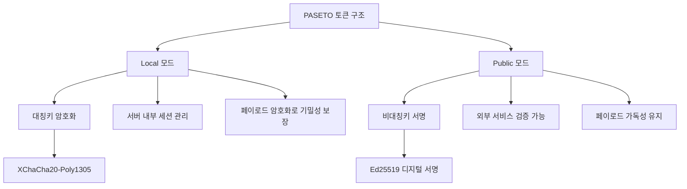
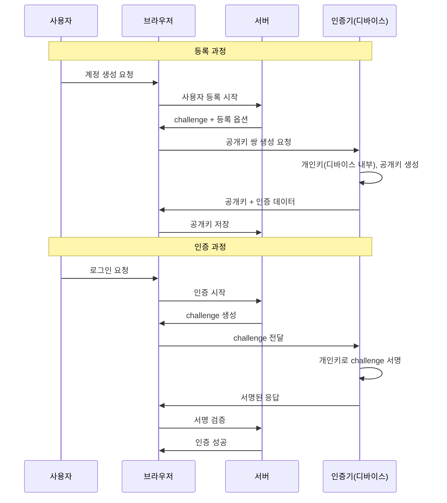

## 19장: JWT의 한계를 극복하는 차세대 인증 기술들과 마이그레이션 전략


### 19.1 PASETO: JWT의 보안 취약점을 해결하는 차세대 토큰 시스템

JSON Web Token이 인증 영역에서 널리 사용되고 있지만, 보안 연구자들과 실무진들이 지속적으로 지적해온 근본적인 문제점들이 존재합니다. 이러한 문제점들을 해결하기 위해 2018년 Scott Arciszewski가 개발한 **PASETO(Platform-Agnostic Security Tokens)** 는 JWT의 본질적인 취약점들을 직접적으로 해결하고 보안 기본값과 구현 용이성을 강조하는 혁신적인 대안으로 주목받고 있습니다.

JWT와 PASETO의 가장 근본적인 차이점은 암호화 알고리즘 선택에 대한 접근 방식입니다. JWT는 개발자가 다양한 알고리즘 중에서 선택할 수 있는 유연성을 제공하지만, 이는 동시에 보안 위험을 증가시키는 요인이 되기도 합니다. 예를 들어, 알고리즘 혼동 공격(Algorithm Confusion Attack)에서 공격자는 JWT 헤더의 `alg` 필드를 조작하여 서버가 다른 알고리즘으로 토큰을 검증하도록 유도할 수 있습니다.

반면 PASETO는 각 버전과 목적에 대해 어떤 암호화 알고리즘을 사용해야 하는지 명시적으로 지정하여 알고리즘 혼동의 위험을 완전히 제거합니다. 현재 활성화된 PASETO 버전은 v1과 v2이며, 각각은 엄격하게 정의된 암호화 스위트를 사용합니다:

**PASETO v1 (레거시 시스템용)**

- Local 모드: AES256-CTR + HMAC-SHA384
- Public 모드: RSA-PSS + SHA384

**PASETO v2 (현대적 시스템용)**

- Local 모드: XChaCha20-Poly1305 (AEAD)
- Public 모드: Ed25519 (EdDSA)

PASETO의 또 다른 핵심 장점은 토큰 구조의 단순성입니다. JWT가 헤더, 페이로드, 서명의 세 부분으로 구성되는 반면, PASETO는 목적에 따라 두 가지 모드를 제공합니다:



**Local 토큰의 보안 우위**

PASETO Local 토큰은 JWT와 달리 AEAD(Authenticated Encryption with Associated Data) 알고리즘을 사용하여 토큰의 모든 데이터를 비밀키로 암호화하고 인증합니다. 이는 JWT가 단순히 base64 인코딩만 하는 것과 대조적입니다:

```javascript
// PASETO Local 토큰 생성 예시
const { V2 } = require('paseto');

async function createLocalToken(payload, secretKey) {
  // 페이로드가 완전히 암호화됨 (기밀성 보장)
  const token = await V2.encrypt(payload, secretKey);
  return token; // v2.local.xxx 형태
}

// JWT는 페이로드가 단순 base64 인코딩됨 (기밀성 없음)
const jwt = require('jsonwebtoken');
const jwtToken = jwt.sign(payload, secret); // 페이로드 누구나 디코딩 가능
```

**Public 토큰의 검증 투명성**

PASETO Public 토큰은 JWT와 유사하게 디지털 서명을 사용하지만, 더 강력한 Ed25519 알고리즘을 사용합니다:

```javascript
const { V2 } = require('paseto');

async function createPublicToken(payload, privateKey) {
  // Ed25519 서명 사용 (RSA보다 안전하고 빠름)
  const token = await V2.sign(payload, privateKey);
  return token; // v2.public.xxx 형태
}

async function verifyPublicToken(token, publicKey) {
  try {
    const payload = await V2.verify(token, publicKey);
    return payload;
  } catch (error) {
    throw new Error('토큰 검증 실패');
  }
}
```


### 19.2 WebAuthn과 생체 인증: 무암호 시대로의 전환 전략

2025년 현재 인증 기술의 가장 혁신적인 발전은 **WebAuthn(Web Authentication API)** 을 기반으로 한 무암호 인증의 대중화입니다. WebAuthn이 2025년 이후 현대 인증의 표준이 되어가고 있으며, 개발자들이 무암호 플로우를 도입함으로써 사용자에게 더 안전하고 매끄러우며 신뢰할 수 있는 경험을 제공하고 있습니다.

WebAuthn의 핵심은 공개키 암호화를 기반으로 한 완전히 다른 보안 모델입니다. 전통적인 패스워드나 JWT 기반 인증이 "알고 있는 것(knowledge)"에 의존한다면, WebAuthn은 "가지고 있는 것(possession)"과 "자신이 누구인지(inherence)"를 조합합니다:



**WebAuthn의 기술적 우위와 실무 적용**

Microsoft의 연구에 따르면 무암호 인증은 패스워드 전용 시스템 대비 계정 탈취 위험을 99.9%까지 감소시킬 수 있습니다. 이는 WebAuthn이 본질적으로 피싱 저항성을 가지고 있기 때문입니다. 공격자가 가짜 웹사이트를 만들어도, WebAuthn 인증기는 올바른 도메인에서만 동작하도록 설계되어 있습니다.

**Fintech 분야의 WebAuthn 도입 사례**

금융 서비스 분야에서 WebAuthn을 주요 인증 수단으로 채택하는 것은 기술적 강점 때문이지 단순한 트렌드 때문이 아닙니다. FIDO2 키가 작동하는 이유는 개인키가 절대 디바이스를 떠나지 않고, 합법적인 원본 도메인에만 응답하기 때문입니다.

실제 WebAuthn 구현에서는 두 가지 핵심 표준이 사용됩니다:

```javascript
// WebAuthn 등록 구현 예시
async function registerWebAuthn(username) {
  const publicKeyCredentialCreationOptions = {
    challenge: new Uint8Array(32), // 서버에서 생성된 랜덤 challenge
    rp: {
      name: "MyApp",
      id: "myapp.com",
    },
    user: {
      id: new TextEncoder().encode(username),
      name: username,
      displayName: username,
    },
    pubKeyCredParams: [{alg: -7, type: "public-key"}], // ES256
    authenticatorSelection: {
      authenticatorAttachment: "platform", // 플랫폼 인증기 (Face ID, Touch ID)
      userVerification: "required"
    },
    timeout: 60000,
    attestation: "direct"
  };

  try {
    const credential = await navigator.credentials.create({
      publicKey: publicKeyCredentialCreationOptions
    });
    
    // 서버로 공개키 전송하여 저장
    await fetch('/api/register-webauthn', {
      method: 'POST',
      headers: { 'Content-Type': 'application/json' },
      body: JSON.stringify({
        id: credential.id,
        rawId: Array.from(new Uint8Array(credential.rawId)),
        response: {
          attestationObject: Array.from(new Uint8Array(credential.response.attestationObject)),
          clientDataJSON: Array.from(new Uint8Array(credential.response.clientDataJSON))
        }
      })
    });
  } catch (error) {
    console.error('WebAuthn 등록 실패:', error);
  }
}
```


### 19.3 JWT에서 세션 기반 인증으로의 회귀 전략

흥미롭게도, JWT의 복잡성과 보안 이슈들 때문에 일부 대규모 서비스들이 세션 기반 인증으로 회귀하는 현상이 나타나고 있습니다. Auth.js가 JWT 세션과 데이터베이스 세션 두 가지 주요 세션 전략을 지원하는 것도 이러한 트렌드를 반영합니다.

**세션 기반 인증으로의 전환을 고려해야 하는 상황들:**

1. **즉시 토큰 무효화가 필수적인 경우** : 금융 서비스나 의료 시스템처럼 사용자의 권한 변경이 즉시 반영되어야 하는 환경
2. **세밀한 세션 관리가 필요한 경우** : 사용자의 행동 패턴 분석이나 이상 행동 탐지가 중요한 보안 시스템
3. **규정 준수 요구사항** : GDPR의 "잊혀질 권리"와 같이 사용자 데이터의 즉시 삭제가 필요한 경우

**하이브리드 접근법: JWT와 세션의 장점 결합**

많은 현대적 애플리케이션들이 JWT와 세션을 함께 사용하는 하이브리드 접근법을 채택하고 있습니다:

```javascript
// 하이브리드 인증 전략 구현
class HybridAuthService {
  constructor(redisClient, jwtService) {
    this.redis = redisClient;
    this.jwt = jwtService;
  }

  async createSession(user) {
    // 1. 세션 ID 생성 및 Redis 저장
    const sessionId = this.generateSecureId();
    const sessionData = {
      userId: user.id,
      roles: user.roles,
      createdAt: new Date(),
      lastActivity: new Date()
    };
    
    await this.redis.setex(`session:${sessionId}`, 3600, JSON.stringify(sessionData));
    
    // 2. 최소한의 정보만 포함한 JWT 생성
    const jwt = this.jwt.sign({
      sid: sessionId, // 세션 ID만 포함
      iat: Math.floor(Date.now() / 1000),
      exp: Math.floor(Date.now() / 1000) + 3600
    });
    
    return { sessionId, jwt };
  }

  async validateRequest(token) {
    try {
      // JWT 검증
      const payload = this.jwt.verify(token);
      
      // 세션 데이터 조회
      const sessionData = await this.redis.get(`session:${payload.sid}`);
      if (!sessionData) {
        throw new Error('세션이 만료되었거나 존재하지 않음');
      }
      
      const session = JSON.parse(sessionData);
      
      // 세션 활동 시간 업데이트
      session.lastActivity = new Date();
      await this.redis.setex(`session:${payload.sid}`, 3600, JSON.stringify(session));
      
      return session;
    } catch (error) {
      throw new Error('인증 실패: ' + error.message);
    }
  }

  async revokeSession(sessionId) {
    // 즉시 세션 무효화 가능
    await this.redis.del(`session:${sessionId}`);
  }
}
```


### 19.4 Macaroons: 분산 시스템을 위한 고급 권한 제어 토큰

구글에서 개발한 **Macaroons**는 분산 시스템에서의 세밀한 권한 제어를 위한 또 다른 혁신적인 접근법입니다. Macaroons는 JWT나 PASETO와 달리 "감쇠(attenuation)" 개념을 도입하여, 토큰 소유자가 자신의 권한을 제한하여 하위 토큰을 생성할 수 있습니다.

이는 마이크로서비스 환경에서 특히 유용합니다. 예를 들어, 사용자가 파일 업로드 권한을 가진 토큰을 받았다면, 이를 "읽기 전용" 권한으로 제한하여 다른 서비스에 전달할 수 있습니다:

```javascript
// Macaroons를 이용한 권한 감쇠 예시
const macaroon = require('macaroons.js');

// 원본 토큰 생성
const rootMacaroon = macaroon.newMacaroon({
  location: 'https://fileservice.example.com',
  key: 'secret-key',
  identifier: 'user:alice'
});

// 권한 제한 조건 추가
const restrictedMacaroon = macaroon.addFirstPartyCaveat(rootMacaroon, 'action = read');
const timeRestrictedMacaroon = macaroon.addFirstPartyCaveat(restrictedMacaroon, 'time < 2025-12-31T23:59:59');

// 이제 이 토큰은 읽기 권한만 가지며 시간 제한이 있음
```


### 19.5 OAuth 2.1과 차세대 인증 표준의 진화

OAuth 2.0의 보안 취약점들을 해결하기 위해 개발 중인 **OAuth 2.1** 은 더 엄격한 보안 요구사항을 도입합니다. 특히 암시적 플로우(Implicit Flow)가 보안 위험 때문에 현대 지침에서 폐기되고 있으며, PKCE(Proof Key for Code Exchange)가 모든 OAuth 플로우에서 필수가 되고 있습니다.

**OAuth 2.1의 주요 보안 강화 사항:**

1. **PKCE 의무화** : 모든 인증 플로우에서 PKCE 사용 필수
2. **Implicit Flow 제거** : 보안상 위험한 암시적 플로우 완전 삭제
3. **더 엄격한 리다이렉트 URI 검증** : 와일드카드 사용 제한
4. **보안 헤더 의무화** : HTTPS, secure cookies 등 필수 적용

```javascript
// OAuth 2.1 호환 PKCE 구현
class OAuth21Client {
  generatePKCE() {
    const codeVerifier = this.generateRandomString(128);
    const codeChallenge = this.sha256Base64Url(codeVerifier);
    
    return {
      codeVerifier,
      codeChallenge,
      codeChallengeMethod: 'S256'
    };
  }

  async initiateAuth(clientId, redirectUri, scope) {
    const { codeVerifier, codeChallenge } = this.generatePKCE();
    
    // 세션에 code_verifier 저장 (서버 측)
    await this.storeCodeVerifier(codeVerifier);
    
    const authUrl = new URL('https://auth.example.com/oauth/authorize');
    authUrl.searchParams.append('response_type', 'code');
    authUrl.searchParams.append('client_id', clientId);
    authUrl.searchParams.append('redirect_uri', redirectUri);
    authUrl.searchParams.append('scope', scope);
    authUrl.searchParams.append('code_challenge', codeChallenge);
    authUrl.searchParams.append('code_challenge_method', 'S256');
    authUrl.searchParams.append('state', this.generateRandomString(32));
    
    return authUrl.toString();
  }
}
```


### 19.6 마이그레이션 전략: 단계적 전환을 통한 위험 최소화

**1단계: 현재 시스템 감사 및 위험 평가**

JWT에서 다른 인증 시스템으로의 마이그레이션은 신중한 계획이 필요합니다. 먼저 현재 시스템의 JWT 사용 패턴을 철저히 분석해야 합니다:

```javascript
// JWT 사용 패턴 감사 도구
class JWTAuditTool {
  constructor() {
    this.usagePatterns = new Map();
    this.securityIssues = [];
  }

  auditJWTImplementation(codebase) {
    const patterns = {
      // 위험한 패턴들 탐지
      weakSecrets: /jwt\.sign\([^,]+,\s*['"](.{1,15})['"]/g,
      noneAlgorithm: /alg['"]\s*:\s*['"]none['"]/g,
      localStorageUsage: /localStorage\.setItem.*[jJ][wW][tT]/g,
      missingExpiration: /jwt\.sign\([^}]*\}[^,]*\)(?![^}]*exp)/g
    };

    for (const [pattern, regex] of Object.entries(patterns)) {
      const matches = codebase.match(regex);
      if (matches) {
        this.securityIssues.push({
          type: pattern,
          occurrences: matches.length,
          severity: this.getSeverity(pattern)
        });
      }
    }

    return {
      patterns: this.usagePatterns,
      issues: this.securityIssues,
      riskScore: this.calculateRiskScore()
    };
  }

  getSeverity(pattern) {
    const severityMap = {
      weakSecrets: 'CRITICAL',
      noneAlgorithm: 'CRITICAL',
      localStorageUsage: 'HIGH',
      missingExpiration: 'MEDIUM'
    };
    return severityMap[pattern] || 'LOW';
  }
}
```

**2단계: 병렬 인증 시스템 구축**

마이그레이션 중에는 두 가지 인증 시스템을 동시에 지원하는 것이 중요합니다. .AddJwtBearer를 여러 번 호출하여 각각 다른 인증 스키마 이름을 사용함으로써 여러 인증 방식을 동시에 지원할 수 있습니다:

```csharp
// ASP.NET Core에서 다중 인증 스키마 지원
public void ConfigureServices(IServiceCollection services)
{
    services.AddAuthentication()
        .AddJwtBearer("legacy-jwt", options => {
            options.TokenValidationParameters = new TokenValidationParameters
            {
                ValidateIssuerSigningKey = true,
                IssuerSigningKey = new SymmetricSecurityKey(legacyKey),
                ValidateIssuer = false,
                ValidateAudience = false
            };
        })
        .AddJwtBearer("new-paseto", options => {
            // PASETO 검증 로직
        })
        .AddWebAuthn("webauthn", options => {
            // WebAuthn 설정
        });
}

// 컨트롤러에서 다중 스키마 지원
[Authorize(AuthenticationSchemes = "legacy-jwt,new-paseto,webauthn")]
public async Task<IActionResult> GetUserData()
{
    // 어떤 인증 방식으로든 접근 가능
    return Ok();
}
```


## 20장: JWT 보안 동향과 지속적인 시스템 개선을 위한 로드맵 수립하기


### 20.1 2025년 JWT 보안 위협 동향 분석과 대응 전략

2025년 현재 JWT를 대상으로 한 사이버 공격은 더욱 정교해지고 있습니다. 2025년 JWT 취약점들이 다양한 공격 벡터를 보여주지만, 모두 공통적인 테마를 공유하고 있으며 B2B SaaS 회사들에게 직접적인 영향을 미치고 있습니다. 특히 주목할 만한 최신 위협들을 살펴보겠습니다.

**Critical CVE 분석: 2025년 주요 JWT 취약점들**

**CVE-2025-27144 (Go JOSE 라이브러리)** 이 취약점은 악성 형태의 JWT가 메모리 고갈을 일으킬 수 있음을 보여줍니다. 공격자들이 과도한 수의 마침표(.) 문자가 포함된 토큰을 전송하여 파싱 로직이 시스템이 크래시될 때까지 기하급수적으로 메모리를 소비하게 만들 수 있습니다.

**CVE-2025-2079 및 CVE-2025-20188 (하드코딩된 JWT 시크릿)** 두 CVE 모두 하드코딩된 JWT 시크릿과 관련되어 있습니다. 이러한 취약점들은 서명 키가 소프트웨어 자체에 내장되어 있어 공격자들이 유효한 토큰을 생성할 수 있게 합니다.

이러한 위협들에 대응하기 위한 포괄적인 보안 모니터링 시스템을 구축해야 합니다:

```javascript
// JWT 보안 모니터링 시스템
class JWTSecurityMonitor {
  constructor(config) {
    this.alertThresholds = config.alertThresholds;
    this.metrics = new Map();
    this.suspiciousPatterns = new Set();
  }

  async monitorTokenValidation(request, token, result) {
    const timestamp = Date.now();
    const clientIP = request.ip;
    const userAgent = request.headers['user-agent'];
    
    // 토큰 검증 결과 기록
    const event = {
      timestamp,
      clientIP,
      userAgent,
      tokenHash: this.hashToken(token),
      result: result.success ? 'success' : 'failure',
      errorType: result.error?.type,
      processingTime: result.processingTime
    };

    await this.logEvent(event);
    
    // 이상 패턴 탐지
    await this.detectAnomalies(event);
  }

  async detectAnomalies(event) {
    const recentEvents = await this.getRecentEvents(event.clientIP, 300000); // 5분
    
    // 단기간 대량 실패 탐지
    const failureCount = recentEvents.filter(e => e.result === 'failure').length;
    if (failureCount > this.alertThresholds.maxFailuresPerWindow) {
      await this.triggerAlert('BRUTE_FORCE_SUSPECTED', {
        clientIP: event.clientIP,
        failureCount,
        timeWindow: '5분'
      });
    }

    // 알고리즘 조작 시도 탐지
    if (event.errorType === 'ALGORITHM_MISMATCH') {
      await this.triggerAlert('ALGORITHM_MANIPULATION', event);
    }

    // 비정상적인 토큰 패턴 탐지
    if (this.isTokenPatternSuspicious(event.tokenHash)) {
      await this.triggerAlert('SUSPICIOUS_TOKEN_PATTERN', event);
    }
  }

  async triggerAlert(alertType, details) {
    const alert = {
      type: alertType,
      severity: this.getAlertSeverity(alertType),
      timestamp: new Date(),
      details,
      responseActions: this.getResponseActions(alertType)
    };

    // 실시간 알림 발송
    await this.sendAlert(alert);
    
    // 자동 대응 조치 실행
    await this.executeAutoResponse(alert);
  }

  getResponseActions(alertType) {
    const actions = {
      'BRUTE_FORCE_SUSPECTED': [
        'IP 일시 차단',
        '추가 인증 요구',
        '보안팀 즉시 알림'
      ],
      'ALGORITHM_MANIPULATION': [
        '해당 요청 차단',
        '보안 로그 상세 기록',
        '긴급 보안 검토 스케줄링'
      ],
      'SUSPICIOUS_TOKEN_PATTERN': [
        '토큰 패턴 분석',
        '유사 패턴 모니터링 강화',
        '사용자 계정 보안 검토'
      ]
    };
    
    return actions[alertType] || ['기본 모니터링 강화'];
  }
}
```


### 20.2 포스트 퀀텀 암호화 시대를 대비한 JWT 시스템 강화

양자 컴퓨팅의 발전은 현재 사용되는 모든 공개키 암호화 시스템에 근본적인 위협이 되고 있습니다. Microsoft는 확장 가능한 양자 컴퓨팅이 현재 사용 중인 공개키 암호화 방법을 무너뜨리고 디지털 서명을 약화시켜 인증 시스템과 신원 확인을 손상시킬 수 있다고 경고하고 있습니다.

**NIST 포스트 퀀텀 암호화 표준과 JWT의 미래**

NIST가 2024년 8월 13일에 첫 번째 포스트 퀀텀 암호화 표준들을 최종 발표했으며, 이는 JWT 시스템에도 중대한 영향을 미칠 것입니다. 주요 표준화된 알고리즘들은:

- **FIPS 203 (ML-KEM)** : 키 캡슐화 메커니즘
- **FIPS 204 (ML-DSA)** : 디지털 서명 알고리즘
- **FIPS 205 (SLH-DSA)** : 해시 기반 서명

JWT 시스템을 포스트 퀀텀 시대에 대비시키기 위한 단계적 접근법:

```javascript
// 포스트 퀀텀 호환 JWT 라이브러리 설계
class QuantumResistantJWT {
  constructor(config) {
    this.classicalAlgorithms = ['RS256', 'ES256'];
    this.postQuantumAlgorithms = ['ML-DSA-65', 'SLH-DSA-SHAKE-128s'];
    this.hybridMode = config.enableHybridMode || false;
  }

  async signToken(payload, keys) {
    if (this.hybridMode) {
      // 하이브리드 서명: 기존 + 포스트 퀀텀 알고리즘 조합
      const classicalSignature = await this.signWithClassical(payload, keys.classical);
      const pqSignature = await this.signWithPostQuantum(payload, keys.postQuantum);
      
      return {
        header: {
          alg: 'HYBRID-RS256-ML-DSA-65',
          typ: 'JWT'
        },
        payload,
        signatures: {
          classical: classicalSignature,
          postQuantum: pqSignature
        }
      };
    }
    
    // 순수 포스트 퀀텀 서명
    return await this.signWithPostQuantum(payload, keys.postQuantum);
  }

  async verifyToken(token, keys) {
    if (token.signatures) {
      // 하이브리드 검증: 두 서명 모두 유효해야 함
      const classicalValid = await this.verifyClassical(token, keys.classical);
      const pqValid = await this.verifyPostQuantum(token, keys.postQuantum);
      
      return classicalValid && pqValid;
    }
    
    // 단일 알고리즘 검증
    return await this.verifyPostQuantum(token, keys.postQuantum);
  }
}
```

**Microsoft의 SymCrypt와 포스트 퀀텀 준비**

Microsoft가 ML-KEM과 XMSS 알고리즘을 포함한 SymCrypt 업데이트를 발표했으며, 이는 양자 시대를 준비하고 고객을 미래의 양자 위협으로부터 보호하기 위한 중요한 이정표입니다. 이러한 변화는 JWT 라이브러리들도 포스트 퀀텀 알고리즘을 지원해야 함을 의미합니다.


### 20.3 AI 기반 위협 탐지와 적응형 인증 시스템

현대의 보안 위협은 기존의 정적 규칙 기반 탐지로는 대응하기 어려울 정도로 정교해지고 있습니다. 인증의 다음 단계는 WebAuthn과 AI 기반 위험 평가를 결합하여 무암호 경험을 유지하면서 상황적 요인에 기반한 적응형 인증을 가능하게 하는 것입니다.

**AI 기반 JWT 보안 분석 시스템**

```javascript
// AI 기반 JWT 위협 탐지 시스템
class AIJWTSecurityAnalyzer {
  constructor(mlModel) {
    this.model = mlModel;
    this.featureExtractor = new JWTFeatureExtractor();
    this.riskThreshold = 0.7;
  }

  async analyzeToken(request, token, userContext) {
    // 특성 추출
    const features = await this.featureExtractor.extract({
      token,
      timestamp: Date.now(),
      clientIP: request.ip,
      userAgent: request.headers['user-agent'],
      geolocation: await this.getGeolocation(request.ip),
      deviceFingerprint: request.headers['x-device-id'],
      behaviorPattern: userContext.recentActivity
    });

    // AI 모델을 통한 위험도 예측
    const riskScore = await this.model.predict(features);
    
    const assessment = {
      riskScore,
      riskLevel: this.categorizeRisk(riskScore),
      recommendedAction: this.getRecommendedAction(riskScore),
      factors: this.identifyRiskFactors(features, riskScore)
    };

    // 고위험으로 판단되면 추가 인증 요구
    if (riskScore > this.riskThreshold) {
      await this.triggerAdaptiveAuth(request, assessment);
    }

    return assessment;
  }

  async triggerAdaptiveAuth(request, assessment) {
    const adaptiveOptions = [
      'biometric_verification',
      'sms_otp',
      'hardware_key',
      'security_questions'
    ];

    // 사용자 상황에 맞는 최적 인증 방법 선택
    const recommendedMethod = await this.selectOptimalAuthMethod(
      request.userProfile,
      request.deviceCapabilities,
      assessment.riskLevel
    );

    return {
      requireAdditionalAuth: true,
      method: recommendedMethod,
      reason: assessment.factors,
      timeout: 300 // 5분
    };
  }
}
```


### 20.4 Zero Trust 아키텍처와 JWT의 새로운 역할

**전통적 경계 기반 보안의 한계**

기존의 네트워크 경계 기반 보안 모델은 "내부는 신뢰할 수 있다"는 가정에 기반했습니다. 하지만 클라우드 네이티브 환경과 원격 근무의 확산으로 이러한 가정은 더 이상 유효하지 않습니다. Zero Trust 아키텍처에서는 모든 요청을 지속적으로 검증하며 기본적으로 아무것도 신뢰하지 않습니다.

**JWT를 Zero Trust 환경에서 효과적으로 활용하는 방법**

Zero Trust 환경에서 JWT는 단순한 인증 토큰을 넘어서 "연속적 검증(Continuous Verification)"의 수단이 됩니다:

```javascript
// Zero Trust JWT 검증 미들웨어
class ZeroTrustJWTMiddleware {
  constructor(config) {
    this.riskEngine = new RiskAssessmentEngine();
    this.contextAnalyzer = new ContextAnalyzer();
    this.policyEngine = new PolicyEngine(config.policies);
  }

  async validateRequest(req, res, next) {
    try {
      // 1. 기본 JWT 검증
      const token = this.extractToken(req);
      const payload = await this.verifyJWT(token);
      
      // 2. 컨텍스트 기반 위험 평가
      const context = await this.contextAnalyzer.analyze({
        userAgent: req.headers['user-agent'],
        ip: req.ip,
        timestamp: Date.now(),
        endpoint: req.path,
        method: req.method,
        payload: req.body
      });

      // 3. 실시간 위험 점수 계산
      const riskAssessment = await this.riskEngine.assess({
        user: payload,
        context,
        historicalBehavior: await this.getUserBehaviorHistory(payload.sub)
      });

      // 4. 정책 기반 접근 제어
      const decision = await this.policyEngine.evaluate({
        user: payload,
        resource: req.path,
        action: req.method,
        context,
        riskScore: riskAssessment.score
      });

      if (decision.action === 'DENY') {
        return res.status(403).json({
          error: 'Access denied',
          reason: decision.reason,
          requiresReauth: decision.requiresReauth
        });
      }

      if (decision.action === 'CHALLENGE') {
        return res.status(401).json({
          error: 'Additional authentication required',
          challengeType: decision.challengeType,
          challengeData: await this.generateChallenge(decision.challengeType)
        });
      }

      // 5. 성공한 요청도 지속적으로 모니터링
      req.zeroTrustContext = {
        riskScore: riskAssessment.score,
        trustLevel: decision.trustLevel,
        monitoringRequired: riskAssessment.score > 0.3
      };

      next();
    } catch (error) {
      await this.logSecurityEvent('JWT_VALIDATION_ERROR', {
        error: error.message,
        ip: req.ip,
        timestamp: Date.now()
      });
      
      return res.status(401).json({ error: 'Authentication failed' });
    }
  }
}
```


### 20.5 자동화된 보안 감사와 지속적 개선 프로세스

**DevSecOps 파이프라인에서의 JWT 보안 자동화**

현대적인 소프트웨어 개발에서는 보안이 개발 생명주기의 모든 단계에 통합되어야 합니다. JWT 보안도 예외가 아닙니다:

```yaml
# GitHub Actions를 이용한 JWT 보안 자동 검사
name: JWT Security Audit

on:
  push:
    branches: [ main, develop ]
  pull_request:
    branches: [ main ]

jobs:
  jwt-security-audit:
    runs-on: ubuntu-latest
    
    steps:
    - uses: actions/checkout@v3
    
    - name: JWT Secret Strength Check
      run: |
        # 하드코딩된 약한 시크릿 탐지
        grep -r "jwt.sign.*['\"][a-zA-Z0-9]{1,15}['\"]" src/ && exit 1 || echo "No weak secrets found"
        
    - name: Algorithm Whitelist Verification
      run: |
        # 알고리즘 화이트리스트 설정 확인
        python scripts/verify_jwt_algorithms.py
        
    - name: Token Storage Security Check
      run: |
        # localStorage 사용 탐지
        grep -r "localStorage.*[jJ][wW][tT]" src/ && echo "WARNING: JWT in localStorage detected" || echo "Safe storage patterns found"
        
    - name: Dependency Vulnerability Scan
      run: |
        npm audit --audit-level moderate
        
    - name: Custom JWT Security Rules
      uses: github/super-linter@v4
      env:
        VALIDATE_JAVASCRIPT_ES: true
        JAVASCRIPT_ES_CONFIG_FILE: .eslintrc-jwt-security.json
```

**정기적 보안 감사 체크리스트**

JWT 표준이 새로운 보안 기능과 모범 사례와 함께 계속 발전하고 있어 IETF의 최신 JWT 명세와 보안 권장사항을 지속적으로 업데이트해야 합니다. 다음은 월간 보안 감사에서 확인해야 할 핵심 항목들입니다:

```javascript
// 자동화된 보안 감사 시스템
class JWTSecurityAuditor {
  constructor() {
    this.auditChecks = [
      this.checkSecretStrength,
      this.verifyAlgorithmWhitelist,
      this.validateTokenExpiration,
      this.checkStorageSecurity,
      this.auditKeyRotation,
      this.validateAudienceClaims,
      this.checkLibraryVersions
    ];
  }

  async performComprehensiveAudit() {
    const auditResults = {
      timestamp: new Date(),
      overallScore: 0,
      findings: [],
      recommendations: [],
      complianceStatus: {}
    };

    for (const check of this.auditChecks) {
      try {
        const result = await check.call(this);
        auditResults.findings.push(result);
        auditResults.overallScore += result.score;
      } catch (error) {
        auditResults.findings.push({
          check: check.name,
          status: 'ERROR',
          error: error.message,
          score: 0
        });
      }
    }

    auditResults.overallScore = auditResults.overallScore / this.auditChecks.length;
    auditResults.recommendations = this.generateRecommendations(auditResults.findings);
    auditResults.complianceStatus = this.assessCompliance(auditResults.findings);

    return auditResults;
  }

  async checkSecretStrength() {
    const secrets = await this.getAllJWTSecrets();
    let score = 100;
    const issues = [];

    for (const secret of secrets) {
      if (secret.length < 32) {
        issues.push(`약한 시크릿 감지: ${secret.id} (길이: ${secret.length}바이트)`);
        score -= 20;
      }
      
      if (!this.isEntropyStrong(secret.value)) {
        issues.push(`낮은 엔트로피: ${secret.id}`);
        score -= 15;
      }
      
      const age = this.calculateSecretAge(secret.createdAt);
      if (age > 90) {
        issues.push(`오래된 시크릿: ${secret.id} (${age}일)`);
        score -= 10;
      }
    }

    return {
      check: 'Secret Strength',
      status: score > 80 ? 'PASS' : score > 60 ? 'WARNING' : 'FAIL',
      score: Math.max(0, score),
      issues,
      details: {
        totalSecrets: secrets.length,
        averageAge: this.calculateAverageAge(secrets)
      }
    };
  }

  async verifyAlgorithmWhitelist() {
    const configs = await this.getJWTConfigurations();
    let score = 100;
    const issues = [];

    for (const config of configs) {
      if (!config.algorithmWhitelist || config.algorithmWhitelist.length === 0) {
        issues.push(`알고리즘 화이트리스트 미설정: ${config.service}`);
        score -= 30;
      }
      
      if (config.algorithmWhitelist?.includes('none')) {
        issues.push(`위험한 'none' 알고리즘 허용: ${config.service}`);
        score -= 40;
      }
      
      const weakAlgorithms = ['HS256'].filter(alg => 
        config.algorithmWhitelist?.includes(alg) && config.secretLength < 32
      );
      
      if (weakAlgorithms.length > 0) {
        issues.push(`약한 시크릿과 HMAC 조합: ${config.service}`);
        score -= 25;
      }
    }

    return {
      check: 'Algorithm Whitelist',
      status: score > 80 ? 'PASS' : score > 60 ? 'WARNING' : 'FAIL',
      score: Math.max(0, score),
      issues
    };
  }
}
```


### 20.6 법적 규정 준수와 JWT 데이터 보호 정책

**GDPR과 JWT: 개인정보 보호 규정 준수**

유럽의 GDPR(General Data Protection Regulation)은 JWT에 개인정보를 포함할 때 중요한 법적 의무사항들을 부과합니다. Keycloak의 무암호 기능들이 GDPR과 PSD2를 포함한 업계 표준과 규정에 맞춰져 있어 조직의 규정 준수 노력을 지원하고 있습니다.

JWT에서 GDPR 준수를 위한 핵심 고려사항들:

1. **데이터 최소화 원칙** : JWT 페이로드에는 반드시 필요한 최소한의 정보만 포함
2. **잊혀질 권리** : 사용자가 계정 삭제를 요청할 때 모든 JWT를 즉시 무효화할 수 있는 메커니즘 필요
3. **데이터 이동권** : 사용자가 자신의 인증 데이터를 다른 서비스로 이전할 수 있는 기능 제공

```javascript
// GDPR 준수 JWT 관리 시스템
class GDPRCompliantJWTManager {
  constructor(config) {
    this.auditLogger = new GDPRAuditLogger();
    this.dataMinimizer = new DataMinimizer();
    this.consentManager = new ConsentManager();
  }

  async createGDPRCompliantToken(user, purpose, consent) {
    // 동의 확인
    if (!await this.consentManager.hasValidConsent(user.id, purpose)) {
      throw new Error('유효한 동의가 없습니다');
    }

    // 데이터 최소화 적용
    const minimizedPayload = this.dataMinimizer.minimize(user, purpose);
    
    // GDPR 메타데이터 추가
    const gdprCompliantPayload = {
      ...minimizedPayload,
      purpose, // 처리 목적 명시
      legalBasis: 'consent', // 법적 근거
      dataController: 'MyApp Inc.', // 데이터 컨트롤러
      retentionPeriod: this.getRetentionPeriod(purpose),
      iat: Math.floor(Date.now() / 1000),
      exp: Math.floor(Date.now() / 1000) + this.getExpirationTime(purpose)
    };

    // 감사 로그 기록
    await this.auditLogger.log('TOKEN_CREATED', {
      userId: user.id,
      purpose,
      dataFields: Object.keys(minimizedPayload),
      legalBasis: 'consent',
      timestamp: new Date()
    });

    return await this.signToken(gdprCompliantPayload);
  }

  async handleDataSubjectRequest(userId, requestType) {
    switch (requestType) {
      case 'DELETE': // 잊혀질 권리
        await this.revokeAllUserTokens(userId);
        await this.auditLogger.log('DATA_DELETION', { userId, timestamp: new Date() });
        break;
        
      case 'EXPORT': // 데이터 이동권
        const tokenHistory = await this.getTokenHistory(userId);
        return this.formatDataExport(tokenHistory);
        
      case 'RECTIFICATION': // 정정권
        await this.invalidateOutdatedTokens(userId);
        break;
    }
  }

  async revokeAllUserTokens(userId) {
    // Redis 기반 토큰 블랙리스트
    const userTokens = await this.redis.smembers(`user_tokens:${userId}`);
    const pipeline = this.redis.pipeline();
    
    for (const tokenId of userTokens) {
      pipeline.sadd('blacklisted_tokens', tokenId);
      pipeline.expire(`blacklisted_tokens:${tokenId}`, 86400); // 24시간 후 자동 삭제
    }
    
    await pipeline.exec();
    await this.redis.del(`user_tokens:${userId}`);
  }
}
```


### 20.7 마이크로서비스 환경에서의 차세대 인증 아키텍처

**서비스 메시와 인증: Istio와 JWT의 통합**

마이크로서비스 환경에서는 서비스 간 통신의 보안이 매우 중요합니다. 마이크로서비스 아키텍처에서 JWT 처리는 특히 어려운데, 각 서비스가 독립적으로 토큰을 검증할 수 있어야 하므로 복잡한 키 관리와 검증 로직이 필요합니다.

Istio 서비스 메시에서 JWT를 안전하게 처리하는 방법:

```yaml
# Istio JWT 정책 설정
apiVersion: security.istio.io/v1beta1
kind: RequestAuthentication
metadata:
  name: jwt-validation
  namespace: production
spec:
  jwtRules:
  - issuer: "https://auth.myapp.com"
    jwksUri: "https://auth.myapp.com/.well-known/jwks.json"
    audiences:
    - "api.myapp.com"
    forwardOriginalToken: true
  - issuer: "https://paseto.myapp.com"
    # PASETO 지원을 위한 커스텀 validator
    customValidator:
      name: "paseto-validator"
      config:
        public_key: "ed25519-public-key-here"

---
apiVersion: security.istio.io/v1beta1
kind: AuthorizationPolicy
metadata:
  name: require-jwt
  namespace: production
spec:
  rules:
  - from:
    - source:
        requestPrincipals: ["https://auth.myapp.com/*"]
  - to:
    - operation:
        methods: ["GET", "POST", "PUT", "DELETE"]
  when:
  - key: request.auth.claims[role]
    values: ["user", "admin"]
  - key: request.auth.claims[exp]
    values: ["> now()"]
```

**중앙화된 키 관리와 분산 검증**

키 관리를 중앙화하고 마이크로서비스들에게 배포하는 중앙화된 서비스를 사용하면 모든 서비스가 올바른 키를 사용하고 키 불일치 위험을 줄일 수 있습니다:

```javascript
// 중앙화된 키 관리 서비스
class CentralizedKeyManager {
  constructor(config) {
    this.keyStore = new SecureKeyStore(config);
    this.distributionService = new KeyDistributionService();
    this.rotationScheduler = new KeyRotationScheduler();
  }

  async distributeKeys() {
    const activeKeys = await this.keyStore.getActiveKeys();
    const services = await this.getRegisteredServices();

    for (const service of services) {
      try {
        await this.distributionService.updateServiceKeys(service, {
          current: activeKeys.current,
          next: activeKeys.next, // 로테이션 대비
          previous: activeKeys.previous, // 이전 키로 발급된 토큰 검증용
          validUntil: activeKeys.rotationTime
        });
        
        await this.auditLogger.log('KEY_DISTRIBUTION_SUCCESS', {
          service: service.name,
          keyVersion: activeKeys.current.version,
          timestamp: new Date()
        });
      } catch (error) {
        await this.handleKeyDistributionFailure(service, error);
      }
    }
  }

  async rotateKeys() {
    const newKeyPair = await this.generateSecureKeyPair();
    
    // 단계적 키 로테이션
    await this.keyStore.promoteKeys({
      previous: await this.keyStore.getCurrent(),
      current: await this.keyStore.getNext(),
      next: newKeyPair
    });

    // 모든 서비스에 새 키 배포
    await this.distributeKeys();
    
    // 90일 후 이전 키 자동 제거 스케줄링
    await this.rotationScheduler.scheduleKeyCleanup(
      newKeyPair.id, 
      Date.now() + (90 * 24 * 60 * 60 * 1000)
    );
  }
}
```


### 20.8 향후 5년간의 인증 기술 로드맵과 전략적 대비

**2025-2030 인증 기술 예측과 준비사항**

무암호 인증의 글로벌 수요가 2025년에 200억 달러를 넘어 사상 최고치에 도달할 것으로 예상되며, 미국 시장만으로도 향후 10년 내에 230억 달러를 넘을 것으로 예상됩니다. 이러한 성장은 다음과 같은 기술적 변화를 의미합니다:

**1. 생체 인증의 고도화 (2025-2027)**

- 다중 생체 정보 융합 인증
- 행동 생체 정보(타이핑 패턴, 걸음걸이) 도입
- 연속적 생체 정보 모니터링

**2. 양자 저항 암호화 표준화 (2026-2028)**

- 모든 주요 인증 시스템에 포스트 퀀텀 알고리즘 필수 적용
- 하이브리드 암호화 시스템의 일반화
- 양자 키 분배(QKD) 네트워크의 상용화

**3. AI 기반 적응형 보안 (2027-2030)**

- 실시간 위험 평가와 동적 인증 정책
- 예측적 보안 모델링
- 자가 학습 보안 시스템

```javascript
// 미래 지향적 인증 시스템 아키텍처
class FutureAuthSystem {
  constructor() {
    this.authMethods = new Map([
      ['password', new PasswordAuth()],
      ['jwt', new JWTAuth()],
      ['paseto', new PasetoAuth()],
      ['webauthn', new WebAuthnAuth()],
      ['biometric', new BiometricAuth()],
      ['quantum-resistant', new QuantumResistantAuth()],
      ['ai-adaptive', new AIAdaptiveAuth()]
    ]);
    
    this.riskEngine = new AIRiskEngine();
    this.contextAnalyzer = new ContextAnalyzer();
  }

  async authenticate(request, userPreferences) {
    // 1. 컨텍스트 분석
    const context = await this.contextAnalyzer.analyze(request);
    
    // 2. 위험 평가
    const riskAssessment = await this.riskEngine.assess(context);
    
    // 3. 최적 인증 방법 선택
    const authMethod = await this.selectOptimalAuthMethod({
      riskLevel: riskAssessment.level,
      userPreferences,
      deviceCapabilities: request.deviceCapabilities,
      contextFactors: context
    });

    // 4. 적응형 인증 실행
    return await this.executeAdaptiveAuth(authMethod, riskAssessment);
  }

  async selectOptimalAuthMethod(factors) {
    const { riskLevel, userPreferences, deviceCapabilities } = factors;
    
    // 위험도에 따른 인증 방법 선택
    switch (riskLevel) {
      case 'LOW':
        if (deviceCapabilities.webauthn) return 'webauthn';
        if (deviceCapabilities.biometric) return 'biometric';
        return 'paseto';
        
      case 'MEDIUM':
        // 다중 인증 조합
        return ['webauthn', 'ai-adaptive'];
        
      case 'HIGH':
        // 최고 보안 조합
        return ['quantum-resistant', 'biometric', 'ai-adaptive'];
        
      default:
        return 'password'; // 폴백
    }
  }
}
```


### 20.9 보안 문화 구축과 팀 역량 강화 전략

**개발팀의 JWT 보안 역량 향상 프로그램**

기술적 해결책만으로는 완전한 보안을 달성할 수 없습니다. 팀 전체의 보안 인식과 역량 향상이 필수적입니다:

```javascript
// 보안 교육 진행도 추적 시스템
class SecurityTrainingTracker {
  constructor() {
    this.modules = [
      'JWT 기본 보안 원칙',
      'PASETO 마이그레이션 가이드',
      'WebAuthn 구현 실습',
      '양자 저항 암호화 기초',
      '보안 감사 및 모니터링',
      '인시던트 대응 절차'
    ];
  }

  async trackProgress(developerId, moduleId, score) {
    const progress = {
      developerId,
      moduleId,
      score,
      completedAt: new Date(),
      requiresRefresh: this.calculateRefreshDate(moduleId)
    };

    await this.saveProgress(progress);
    
    // 팀 전체 보안 점수 업데이트
    await this.updateTeamSecurityScore();
    
    // 개인별 추천 학습 경로 생성
    const recommendations = await this.generateLearningPath(developerId);
    
    return { progress, recommendations };
  }

  async generateSecurityReport() {
    const teamMetrics = await this.getTeamMetrics();
    
    return {
      overview: {
        averageScore: teamMetrics.averageScore,
        completionRate: teamMetrics.completionRate,
        highRiskAreas: teamMetrics.weakAreas
      },
      recommendations: [
        teamMetrics.averageScore < 80 ? 'JWT 보안 집중 교육 필요' : null,
        teamMetrics.webauthnScore < 70 ? 'WebAuthn 실습 워크숍 진행' : null,
        teamMetrics.incidentResponseScore < 75 ? '보안 인시던트 대응 훈련 필요' : null
      ].filter(Boolean),
      nextActions: this.generateActionPlan(teamMetrics)
    };
  }
}
```


### 20.10 결론: 미래 지향적 인증 시스템 구축을 위한 최종 권장사항

JWT 기반 인증 시스템의 미래는 단순히 하나의 기술을 선택하는 것이 아니라, 보안 위협의 진화에 맞춰 적응할 수 있는 유연하고 확장 가능한 아키텍처를 구축하는 것입니다. 무암호 인증의 미래는 단순히 패스워드를 제거하는 것이 아니라 두려움 없는(fearless) 인증이어야 하며, 보안이나 사용자 배제 없이 최상의 시나리오와 최악의 시나리오를 모두 처리할 수 있어야 합니다.

**통합적 보안 전략의 핵심 원칙들:**

1. **방어 심층화(Defense in Depth)** : 단일 인증 방법에 의존하지 않고 여러 보안 계층 구성
2. **적응형 보안(Adaptive Security)** : 위험도에 따른 동적 인증 정책 적용
3. **포용적 설계(Inclusive Design)** : 모든 사용자가 접근 가능한 인증 시스템 구축
4. **지속적 개선(Continuous Improvement)** : 정기적 보안 감사와 위협 모델링 수행

미래의 인증 시스템은 JWT의 유연성, PASETO의 보안성, WebAuthn의 사용성, 그리고 AI의 적응성을 모두 결합한 하이브리드 접근법이 될 것입니다. 개발자와 보안 전문가들은 이러한 변화에 능동적으로 대비하여, 사용자에게는 편리하면서도 공격자에게는 견고한 인증 시스템을 구축해야 합니다.

**최종 실행 체크리스트:**

```markdown
## 즉시 실행 사항 (1개월 내)
- [ ] 현재 JWT 구현의 보안 감사 수행
- [ ] 약한 시크릿과 알고리즘 설정 점검
- [ ] 토큰 저장 방식의 보안성 검토
- [ ] 최신 JWT 라이브러리로 업데이트

## 단기 목표 (3-6개월)
- [ ] PASETO 또는 WebAuthn 파일럿 프로젝트 시작
- [ ] 자동화된 보안 모니터링 시스템 구축
- [ ] 팀 보안 교육 프로그램 시작
- [ ] 인시던트 대응 절차 정립

## 중기 목표 (6-12개월)
- [ ] 차세대 인증 기술로의 단계적 마이그레이션
- [ ] Zero Trust 아키텍처 도입
- [ ] AI 기반 위험 평가 시스템 구축
- [ ] 포스트 퀀텀 암호화 준비 계획 수립

## 장기 비전 (1-3년)
- [ ] 완전 무암호 인증 시스템 구축
- [ ] 양자 저항 암호화 전면 적용
- [ ] 자가 진화하는 적응형 보안 시스템 구현
- [ ] 업계 최고 수준의 보안 문화 정착
```

인증 기술의 미래는 이미 시작되었습니다. 변화에 능동적으로 대응하는 조직만이 다가오는 보안 도전들을 성공적으로 극복할 수 있을 것입니다.
