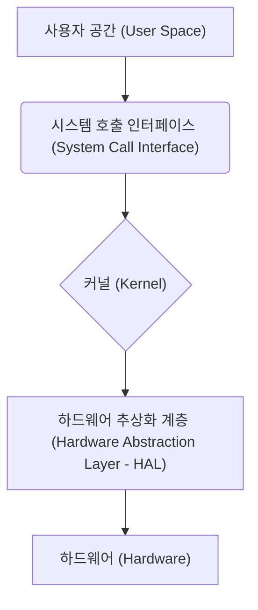

리눅스를 효과적으로 사용하고 이해하기 위해서는 기본적인 시스템 구조와 핵심 개념을 파악하는 것이 중요합니다. 이 장에서는 리눅스 운영체제의 내부 동작 방식과 관련된 주요 개념들을 설명합니다.


## 2.1. 리눅스 시스템 구조 (Linux System Architecture)

리눅스 운영체제는 여러 계층으로 구성되어 있으며, 각 계층은 특정 역할을 수행합니다. 기본적인 리눅스 시스템 구조는 크게 하드웨어, 커널, 셸, 그리고 응용 프로그램으로 나눌 수 있습니다.




### 2.1.1. 커널(Kernel)과 셸(Shell)의 역할

**커널 (Kernel):**

커널은 리눅스 운영체제의 핵심이자 가장 낮은 수준의 소프트웨어입니다. 하드웨어와 직접적으로 상호작용하며, 시스템의 모든 중요한 기능을 관리합니다. 주요 역할은 다음과 같습니다.

* **프로세스 관리:** CPU 시간을 할당하고, 프로세스의 생성, 소멸, 스케줄링 등 프로세스 실행 전반을 관리합니다.
* **메모리 관리:** 시스템의 물리적 메모리를 관리하고, 각 프로세스에 필요한 메모리 공간을 할당 및 회수합니다. 가상 메모리 기능을 제공하여 실제 물리적 메모리보다 더 많은 메모리를 사용하는 것처럼 보이게 합니다.
* **파일 시스템 관리:** 디스크 등의 저장 장치에 데이터를 저장하고 접근하는 방식을 관리합니다. 파일과 디렉토리 구조를 유지하고, 파일 접근 권한을 제어합니다.
* **장치 드라이버:** 하드웨어 장치(키보드, 마우스, 디스크, 네트워크 카드 등)와 통신하기 위한 인터페이스를 제공합니다. 각 장치에 맞는 드라이버를 통해 응용 프로그램이 하드웨어를 사용할 수 있도록 합니다.
* **네트워킹:** 네트워크 프로토콜을 처리하고, 네트워크 통신을 관리합니다.

커널은 시스템 부팅 시 메모리에 로드되어 상주하며, 시스템의 모든 동작의 중심 역할을 수행합니다.

**셸 (Shell):**

셸은 사용자와 커널 사이의 인터페이스 역할을 하는 프로그램입니다. 사용자가 입력한 명령어를 해석하여 커널에게 전달하고, 커널의 실행 결과를 사용자에게 출력합니다. 셸은 명령행 인터페이스(CLI)를 제공하며, 사용자는 텍스트 기반의 명령어를 통해 시스템과 상호작용할 수 있습니다.

주요 셸 종류:

* **Bash (Bourne-Again SHell):** 대부분의 리눅스 배포판에서 기본 셸로 사용됩니다. 강력한 기능과 편리한 사용성을 제공합니다.
* **Zsh (Z Shell):** Bash를 확장한 셸로, 더 많은 기능과 사용자 정의 옵션을 제공합니다.
* **Fish (Friendly Interactive SHell):** 사용자 친화적인 인터페이스와 자동 완성, 문법 강조 등의 기능을 제공합니다.

사용자가 터미널에 명령어를 입력하면, 현재 실행 중인 셸이 해당 명령어를 해석하고, 필요한 경우 커널의 기능을 호출하여 작업을 수행합니다. 예를 들어, `ls -l` 명령어를 입력하면 셸은 `ls`라는 프로그램을 실행하고 `-l` 옵션을 해석하여 커널에게 현재 디렉토리의 상세 파일 목록을 요청합니다. 커널은 이 요청을 처리하고 결과를 셸에게 전달하며, 셸은 그 결과를 터미널 화면에 출력합니다.

요약하자면, **커널은 시스템의 심장부로서 하드웨어 자원을 관리하고 핵심 기능을 제공하며, 셸은 사용자가 커널과 소통할 수 있도록 하는 통역관 역할을 수행합니다.**


### 2.1.2. 리눅스 부팅 과정 개요

리눅스 시스템이 시작되는 부팅 과정은 여러 단계를 거쳐 운영체제가 메모리에 로드되고 실행될 수 있도록 준비하는 과정입니다. 기본적인 부팅 과정은 다음과 같습니다.

1. **BIOS/UEFI (Basic Input/Output System / Unified Extensible Firmware Interface):** 컴퓨터 전원을 켜면 가장 먼저 BIOS 또는 UEFI 펌웨어가 실행됩니다. 이 펌웨어는 하드웨어 초기화 (CPU, 메모리, 주변 장치 점검 등)를 수행하고, 부팅 가능한 저장 장치(하드 디스크, USB 등)를 찾습니다.
2. **부트 로더 (Boot Loader):** BIOS/UEFI는 부팅 가능한 장치를 찾으면 해당 장치의 특정 영역에 위치한 부트 로더 프로그램을 메모리에 로드하고 실행합니다. 대표적인 리눅스 부트 로더로는 GRUB (GRand Unified Bootloader)과 LILO (Linux Loader) 등이 있습니다. 부트 로더는 어떤 운영체제를 부팅할지 선택하는 메뉴를 제공하거나, 미리 설정된 운영체제를 부팅하는 역할을 합니다.
3. **커널 로드 (Kernel Loading):** 부트 로더는 사용자가 선택한 (또는 기본 설정된) 리눅스 커널 이미지와 초기 램디스크 (initramfs 또는 initrd) 이미지를 메모리에 로드합니다. 커널 이미지는 압축된 형태이며, 메모리에 로드된 후 압축이 해제됩니다. 초기 램디스크는 최소한의 파일 시스템과 필요한 드라이버를 포함하고 있어, 실제 루트 파일 시스템에 접근하기 전에 필요한 환경을 제공합니다.
4. **init 프로세스 실행:** 커널이 메모리에 로드되면 가장 먼저 `init`이라는 특별한 프로세스를 실행합니다. `init` 프로세스는 모든 다른 프로세스의 부모 프로세스 (PID 1)가 되며, 시스템의 초기화 작업을 담당합니다. 시스템 서비스 시작, 사용자 로그인 처리 등 다양한 작업을 수행합니다. 시스템 관리자 (systemd, SysVinit 등)에 따라 `init` 프로세스의 역할과 동작 방식이 다를 수 있습니다.
5. **시스템 서비스 시작:** `init` 프로세스는 설정 파일(`/etc/inittab`, `/etc/systemd/`)을 읽어 시스템에 필요한 다양한 서비스 (네트워크, 로그인 관리, 디스크 관리 등)를 시작합니다.
6. **로그인 프롬프트:** 모든 초기화 과정이 완료되면 사용자에게 로그인 프롬프트가 표시됩니다. GUI 환경이 설정되어 있다면 그래픽 로그인 화면이 나타나고, CLI 환경이라면 텍스트 기반의 로그인 프롬프트가 나타납니다. 사용자는 자신의 계정 정보 (사용자 이름과 비밀번호)를 입력하여 시스템에 로그인할 수 있습니다.

이러한 부팅 과정을 통해 리눅스 운영체제가 정상적으로 실행되고 사용자가 시스템을 사용할 수 있게 됩니다. 부팅 과정에서 오류가 발생하면 시스템이 정상적으로 시작되지 않을 수 있으며, 이 경우 부팅 로그를 확인하여 문제점을 파악해야 합니다.


## 2.2. 파일 시스템 (File System)

리눅스에서 파일 시스템은 데이터를 저장하고 관리하는 체계적인 방식을 제공합니다. 파일과 디렉토리라는 계층적인 구조를 통해 데이터를 조직화하고, 각 파일 및 디렉토리에 대한 접근 권한을 관리하여 데이터의 보안과 무결성을 유지합니다.


### 2.2.1. 파일과 디렉토리 개념

**파일 (File):**

파일은 컴퓨터에 저장되는 데이터의 기본 단위입니다. 텍스트 문서, 이미지, 실행 프로그램, 설정 파일 등 모든 종류의 데이터는 파일 형태로 저장됩니다. 각 파일은 고유한 이름을 가지며, 파일의 종류와 내용에 따라 다양한 속성 (크기, 생성/수정 시간, 접근 권한 등)을 가집니다.

**디렉토리 (Directory):**

디렉토리는 파일을 논리적으로 그룹화하고 관리하기 위한 컨테이너 역할을 합니다. 윈도우의 "폴더"와 유사한 개념입니다. 디렉토리 안에는 다른 파일이나 디렉토리를 포함할 수 있어, 계층적인 파일 시스템 구조를 형성합니다. 최상위 디렉토리를 "루트 디렉토리"라고 하며, `/` 기호로 표시합니다.

**경로 (Path):**

파일이나 디렉토리의 위치를 나타내는 방법을 경로라고 합니다. 경로는 절대 경로와 상대 경로 두 가지 방식이 있습니다.

* **절대 경로 (Absolute Path):** 루트 디렉토리(`/`)부터 시작하여 특정 파일이나 디렉토리까지의 모든 경로를 명시하는 방식입니다. 항상 유일한 위치를 나타냅니다.
  * 예시: `/home/user/documents/report.txt`
* **상대 경로 (Relative Path):** 현재 작업 디렉토리를 기준으로 특정 파일이나 디렉토리까지의 경로를 나타내는 방식입니다. 현재 위치에 따라 의미가 달라질 수 있습니다.
  * `.` (현재 디렉토리)
  * `..` (상위 디렉토리)
  * 예시 (현재 디렉토리가 `/home/user`인 경우):
    * `documents/report.txt`: `/home/user/documents/report.txt`와 동일
    * `./documents/report.txt`: `/home/user/documents/report.txt`와 동일
    * `../`: `/home` 디렉토리
    * `../another_user/`: `/home/another_user` 디렉토리


### 2.2.2. 리눅스 파일 시스템 계층 구조 표준 (FHS: Filesystem Hierarchy Standard)

리눅스 파일 시스템은 FHS (Filesystem Hierarchy Standard)라는 표준에 따라 특정 목적을 가진 디렉토리들을 일관된 구조로 조직화합니다. FHS는 다양한 리눅스 배포판 간의 호환성을 높이고, 시스템 관리 및 유지보수를 용이하게 합니다.


### 2.2.3. 주요 디렉토리 설명

다음은 FHS에서 정의하고 있는 주요 디렉토리와 그 역할에 대한 설명입니다.

* **`/` (Root):** 파일 시스템의 최상위 디렉토리입니다. 모든 파일과 디렉토리는 루트 디렉토리 아래에 위치합니다.
* **`/home`:** 각 사용자의 개인 홈 디렉토리가 위치합니다. 일반 사용자는 자신의 홈 디렉토리 내에서 파일을 생성하고 관리하는 권한을 가집니다. 예를 들어, 사용자 이름이 `user`라면 홈 디렉토리는 일반적으로 `/home/user`가 됩니다.
* **`/etc`:** 시스템 전반에 걸친 설정 파일들이 저장되는 디렉토리입니다. 네트워크 설정, 사용자 계정 정보, 시스템 서비스 설정 등 중요한 설정 파일들이 위치합니다.
* **`/var` (Variable):** 시스템 운영 중에 생성되고 변경될 수 있는 파일들이 저장되는 디렉토리입니다. 로그 파일 (`/var/log`), 스풀 파일 (`/var/spool`), 임시 파일 (`/var/tmp`), 데이터베이스 파일 등이 위치합니다.
* **`/usr` (Unix System Resources):** 시스템에서 사용되는 대부분의 사용자 명령어, 라이브러리, 문서 파일 등이 저장되는 디렉토리입니다. 읽기 전용으로 마운트되는 경우가 많습니다.
  * `/usr/bin`: 일반 사용자들이 실행하는 명령어들이 위치합니다 (예: `ls`, `cp`, `mkdir`).
  * `/usr/sbin`: 시스템 관리자가 실행하는 명령어들이 위치합니다 (예: `useradd`, `ifconfig`).
  * `/usr/lib`: 프로그램 실행에 필요한 라이브러리 파일들이 위치합니다.
  * `/usr/share`: 아키텍처에 독립적인 데이터 파일 (문서, 아이콘, 폰트 등)들이 위치합니다.
  * `/usr/local`: 시스템 관리자가 직접 컴파일하여 설치한 프로그램들이 위치하는 디렉토리입니다. `/usr`과 유사한 하위 구조를 가집니다 (`/usr/local/bin`, `/usr/local/sbin`, `/usr/local/lib` 등).
* **`/tmp` (Temporary):** 임시 파일들을 저장하는 디렉토리입니다. 시스템 부팅 시 내용이 삭제될 수 있으며, 모든 사용자가 읽고 쓸 수 있는 권한을 가집니다. 중요한 데이터를 저장하는 것은 권장되지 않습니다.
* **`/boot`:** 부팅에 필요한 파일들 (커널 이미지, 부트 로더 설정 파일 등)이 저장되는 디렉토리입니다.
* **`/dev` (Devices):** 시스템에 연결된 하드웨어 장치 파일들이 위치하는 디렉토리입니다. 각 장치는 파일 형태로 표현되어, 파일 입출력 방식을 통해 접근할 수 있습니다.
* **`/proc` (Processes):** 현재 실행 중인 프로세스에 대한 정보를 제공하는 가상 파일 시스템입니다. 실제 파일로 존재하는 것이 아니라, 커널이 메모리 상에서 생성하는 정보입니다. 각 프로세스별 디렉토리를 포함하며, CPU, 메모리 사용량 등 다양한 시스템 정보를 확인할 수 있습니다.
* **`/sys`:** 커널에서 관리하는 시스템의 다양한 속성 및 설정을 제공하는 가상 파일 시스템입니다. `/proc`과 유사하게 실제 파일로 존재하지 않으며, 하드웨어 및 커널 파라미터에 대한 정보를 제공하고 제어할 수 있도록 합니다.
* **`/lib` 및 `/lib64`:** 커널 모듈 및 시스템 라이브러리 파일들이 저장되는 디렉토리입니다. `/usr/lib`와 유사하지만, 시스템 부팅 및 기본적인 명령어 실행에 필요한 핵심 라이브러리들이 위치합니다. 64비트 시스템에서는 `/lib64`에 64비트 라이브러리가 저장됩니다.
* **`/media`:** 이동식 미디어 (USB 드라이브, CD-ROM 등)가 자동으로 마운트되는 디렉토리입니다.
* **`/mnt`:** 임시로 다른 파일 시스템을 마운트하기 위해 사용되는 빈 디렉토리입니다.

이러한 디렉토리 구조를 이해하는 것은 리눅스 시스템을 관리하고 문제를 해결하는 데 기본적인 지식이 됩니다.


## 2.3. 사용자와 그룹 (Users and Groups)

리눅스는 다중 사용자(multi-user) 운영체제로서, 여러 명의 사용자가 동시에 시스템에 접속하여 작업을 수행할 수 있도록 설계되었습니다. 사용자 계정은 각 사용자를 식별하고, 파일 및 프로세스에 대한 접근 권한을 관리하는 데 중요한 역할을 합니다. 그룹은 여러 사용자를 묶어 관리하고, 공통된 권한을 부여하는 데 사용됩니다.


### 2.3.1. 사용자 계정 개념 (root 사용자 포함)

**사용자 계정 (User Account):**

각 사용자는 고유한 사용자 이름(username)과 사용자 ID (UID, User ID)를 가지는 계정을 통해 리눅스 시스템에 접근합니다. 사용자 계정은 다음과 같은 정보를 포함합니다.

* **사용자 이름 (Username):** 사람이 읽고 식별할 수 있는 계정의 이름입니다 (예: `user1`, `admin`).
* **사용자 ID (UID):** 시스템 내부적으로 사용자를 식별하는 고유한 숫자입니다.
* **그룹 ID (GID, Group ID):** 사용자가 속한 기본 그룹의 고유한 숫자입니다.
* **홈 디렉토리:** 해당 사용자의 개인 파일 및 설정 파일이 저장되는 디렉토리입니다 (일반적으로 `/home/<사용자 이름>`).
* **로그인 셸:** 사용자가 로그인했을 때 실행되는 셸 프로그램입니다 (일반적으로 `/bin/bash`).
* **기타 정보:** 사용자의 전체 이름, 전화번호 등 추가적인 정보를 포함할 수 있습니다.

사용자 계정 정보는 `/etc/passwd` 파일에 저장됩니다. 각 줄은 하나의 사용자 계정 정보를 나타내며, 콜론(`:`)으로 구분된 여러 필드로 구성됩니다.

```
username:password:UID:GID:GECOS:home_directory:login_shell
```

* `username`: 사용자 이름
* `password`: 암호화된 비밀번호 (최근에는 보안상의 이유로 `/etc/shadow` 파일에 저장되는 경우가 많음)
* `UID`: 사용자 ID (0은 root 사용자)
* `GID`: 기본 그룹 ID
* `GECOS`: 사용자의 전체 이름 및 기타 정보 (선택 사항)
* `home_directory`: 홈 디렉토리 경로
* `login_shell`: 로그인 셸 경로

**root 사용자:**

`root` 사용자는 UID가 0인 특별한 사용자 계정입니다. 시스템의 모든 파일 및 명령어에 대한 무제한적인 접근 권한을 가지며, 시스템 관리 작업을 수행하는 데 사용됩니다. "슈퍼유저(superuser)"라고도 불립니다.

`root` 권한은 시스템의 핵심 설정을 변경하거나 중요한 파일을 수정하는 데 필요하지만, 실수로 시스템을 손상시킬 수 있는 위험도 내포하고 있습니다. 따라서 일반적인 작업은 일반 사용자 계정으로 수행하고, 관리자 권한이 필요한 작업에만 `root` 권한을 획득하는 것이 보안상 권장됩니다 (예: `sudo` 명령어 사용).


### 2.3.2. 그룹 개념 및 활용

**그룹 (Group):**

그룹은 여러 사용자 계정을 논리적으로 묶어 관리하는 메커니즘입니다. 그룹을 사용하면 여러 사용자에게 동일한 파일 및 디렉토리 접근 권한을 쉽게 부여할 수 있어, 시스템 관리의 효율성을 높일 수 있습니다.

각 그룹은 고유한 그룹 이름(group name)과 그룹 ID (GID, Group ID)를 가집니다.

그룹 정보는 `/etc/group` 파일에 저장됩니다. 각 줄은 하나의 그룹 정보를 나타내며, 콜론(`:`)으로 구분된 여러 필드로 구성됩니다.

```
group_name:password:GID:member_list
```

* `group_name`: 그룹 이름
* `password`: 그룹 비밀번호 (거의 사용되지 않음)
* `GID`: 그룹 ID
* `member_list`: 해당 그룹에 속한 사용자 목록 (쉼표로 구분)

**그룹 활용:**

* **파일 접근 권한 관리:** 특정 파일이나 디렉토리에 대한 접근 권한을 특정 그룹에게 부여하여, 해당 그룹에 속한 모든 사용자가 해당 파일에 접근할 수 있도록 할 수 있습니다.
* **협업 환경 구축:** 여러 사용자가 공동으로 작업하는 디렉토리를 만들고, 해당 디렉토리에 대한 그룹 권한을 설정하여 팀원들이 쉽게 파일을 공유하고 수정할 수 있도록 할 수 있습니다.
* **시스템 자원 관리:** 특정 그룹에게만 특정 시스템 자원 (예: 특정 장치 사용 권한)을 할당할 수 있습니다.

**사용자와 그룹의 관계:**

* 각 사용자는 최소한 하나의 기본 그룹에 속합니다. 사용자를 생성할 때 기본 그룹이 지정되며, `/etc/passwd` 파일의 GID 필드에 해당 그룹의 GID가 기록됩니다.
* 사용자는 여러 개의 보조 그룹에 속할 수도 있습니다. 사용자가 속한 모든 그룹 정보는 `id` 명령어를 통해 확인할 수 있습니다. 보조 그룹 정보는 `/etc/group` 파일의 `member_list` 필드 또는 `/etc/gshadow` 파일에 기록될 수 있습니다.

**`id` 명령어:**

`id` 명령어는 현재 사용자의 UID, GID, 그리고 속한 그룹 목록을 출력하는 데 사용됩니다.

```bash
id
```

출력 예시:

```
uid=1000(user1) gid=1000(user1) groups=1000(user1),4(adm),24(cdrom),27(sudo),30(dip),46(plugdev)
```

* `uid=1000(user1)`: 사용자 ID는 1000이고, 사용자 이름은 `user1`입니다.
* `gid=1000(user1)`: 기본 그룹 ID는 1000이고, 그룹 이름은 `user1`입니다.
* `groups=1000(user1),4(adm),24(cdrom),27(sudo),30(dip),46(plugdev)`: 사용자가 속한 그룹 목록입니다 (기본 그룹 포함). 각 그룹의 GID와 그룹 이름을 함께 보여줍니다.

사용자와 그룹은 리눅스 시스템의 보안 및 자원 관리에 있어 기본적인 개념이며, 파일 권한 관리, 프로세스 실행 등 다양한 측면에서 중요한 역할을 합니다.


## 2.4. 권한 (Permissions)

리눅스 시스템에서 파일 및 디렉토리에 대한 접근 권한은 시스템의 보안을 유지하는 데 매우 중요한 요소입니다. 각 파일과 디렉토리는 소유자(user), 그룹(group), 그리고 그 외의 사용자(others)에 대해 읽기(read), 쓰기(write), 실행(execute) 권한을 가집니다.


### 2.4.1. 파일/디렉토리 권한의 이해 (읽기, 쓰기, 실행)

리눅스의 각 파일 및 디렉토리는 다음과 같은 세 가지 유형의 권한을 가집니다.

* **읽기 (Read, r):**
  * **파일:** 파일의 내용을 볼 수 있는 권한입니다. `cat`, `less`, `more` 등의 명령어를 사용하여 파일 내용을 확인할 수 있습니다.
  * **디렉토리:** 디렉토리 내의 파일 및 하위 디렉토리 목록을 볼 수 있는 권한입니다. `ls` 명령어를 사용하여 디렉토리 내용을 확인할 수 있습니다.
* **쓰기 (Write, w):**
  * **파일:** 파일의 내용을 수정하거나 삭제할 수 있는 권한입니다. 텍스트 편집기로 파일을 편집하거나, `rm` 명령어로 파일을 삭제할 수 있습니다.
  * **디렉토리:** 디렉토리 내에 새로운 파일이나 하위 디렉토리를 생성하거나 삭제할 수 있는 권한입니다. `touch`, `mkdir`, `rm` 등의 명령어를 사용할 수 있습니다. 또한, 디렉토리 내의 파일 이름을 변경하거나 이동할 수 있는 권한도 포함합니다.
* **실행 (Execute, x):**
  * **파일:** 파일을 실행 가능한 프로그램으로 실행할 수 있는 권한입니다. 스크립트 파일이나 컴파일된 실행 파일을 실행할 수 있습니다.
  * **디렉토리:** 해당 디렉토리를 탐색하여 내부의 파일이나 하위 디렉토리에 접근할 수 있는 권한입니다. `cd` 명령어를 사용하여 해당 디렉토리로 이동할 수 있습니다.

**권한 표시:**

`ls -l` 명령어를 실행하면 파일 및 디렉토리의 상세 정보와 함께 권한 정보가 표시됩니다. 권한 정보는 다음과 같은 형식으로 나타납니다.

```
drwxr-xr-- 2 user group 4096 Apr  6 07:04 directory
-rw-r--r-- 1 user group  123 Apr  6 07:04 file.txt
```

첫 번째 문자는 파일의 유형을 나타냅니다. `d`는 디렉토리(directory), `-`는 일반 파일(regular file), `l`은 심볼릭 링크(symbolic link) 등을 의미합니다.

그 뒤의 9개의 문자는 권한 정보를 나타내며, 처음 3개는 소유자(user)의 권한, 다음 3개는 그룹(group)의 권한, 마지막 3개는 그 외 사용자(others)의 권한을 순서대로 나타냅니다. 각 3개의 문자는 읽기(r), 쓰기(w), 실행(x) 권한이 있으면 해당 문자가 표시되고, 권한이 없으면 `-`로 표시됩니다.

예시:

* `drwxr-xr--`: 디렉토리이며, 소유자는 읽기, 쓰기, 실행 권한을 가지고 있고, 그룹은 읽기, 실행 권한을 가지고 있으며, 그 외 사용자는 읽기 권한만 가지고 있습니다.
* `-rw-r--r--`: 일반 파일이며, 소유자는 읽기, 쓰기 권한을 가지고 있고, 그룹은 읽기 권한을 가지고 있으며, 그 외 사용자도 읽기 권한만 가지고 있습니다.


### 2.4.2. chmod, chown, chgrp 명령어 기초

리눅스에서는 `chmod`, `chown`, `chgrp` 명령어를 사용하여 파일 및 디렉토리의 권한, 소유자, 그룹을 변경할 수 있습니다.

**`chmod` (Change Mode): 권한 변경**

`chmod` 명령어는 파일 또는 디렉토리의 접근 권한을 변경하는 데 사용됩니다. 권한을 지정하는 방법은 크게 두 가지가 있습니다.

* **기호 모드 (Symbolic Mode):** 사용자 유형(u: 소유자, g: 그룹, o: others, a: all)과 연산자(+ : 추가, - : 제거, = : 설정) 및 권한(r, w, x)을 조합하여 권한을 변경합니다.

  * 예시:
    * `chmod u+x file.sh`: 파일 소유자에게 실행 권한 추가
    * `chmod g-w directory`: 파일 그룹에서 쓰기 권한 제거
    * `chmod o=r file.txt`: 그 외 사용자에게 읽기 권한만 설정
    * `chmod a+r directory`: 모든 사용자에게 읽기 권한 추가
    * `chmod ug+w file.txt`: 소유자와 그룹에게 쓰기 권한 추가

* **숫자 모드 (Numeric Mode):** 각 권한(읽기: 4, 쓰기: 2, 실행: 1)을 숫자로 표현하여 합산한 값을 사용하여 권한을 설정합니다. 소유자, 그룹, 그 외 사용자 순서로 세 자리 숫자를 사용합니다.

  * 예시:
    * `chmod 755 file.sh`: 소유자(4+2+1=7: rwx), 그룹(4+0+1=5: r-x), 그 외 사용자(4+0+1=5: r-x)
    * `chmod 644 file.txt`: 소유자(4+2+0=6: rw-), 그룹(4+0+0=4: r--), 그 외 사용자(4+0+0=4: r--)
    * `chmod 777 directory`: 모든 사용자에게 모든 권한 부여 (주의해서 사용해야 함)

**`chown` (Change Owner): 소유자 변경**

`chown` 명령어는 파일 또는 디렉토리의 소유자를 변경하는 데 사용됩니다. 이 명령어는 일반적으로 `root` 권한이 필요합니다.

* `chown <새로운 소유자> <파일 또는 디렉토리>`
* `chown <새로운 소유자>:<새로운 그룹> <파일 또는 디렉토리>` (소유자와 그룹을 동시에 변경)

  * 예시:
    * `sudo chown newuser file.txt`: `file.txt`의 소유자를 `newuser`로 변경
    * `sudo chown anotheruser:newgroup directory`: `directory`의 소유자를 `anotheruser`로, 그룹을 `newgroup`으로 변경

**`chgrp` (Change Group): 그룹 변경**

`chgrp` 명령어는 파일 또는 디렉토리의 그룹 소유자를 변경하는 데 사용됩니다. 파일의 소유자 또는 `root` 권한을 가진 사용자만 그룹을 변경할 수 있습니다.

* `chgrp <새로운 그룹> <파일 또는 디렉토리>`

  * 예시:
    * `chgrp developers file.txt`: `file.txt`의 그룹을 `developers`로 변경
    * `sudo chgrp administrators directory`: `directory`의 그룹을 `administrators`로 변경

권한 관리는 리눅스 시스템의 보안을 유지하는 데 필수적인 요소입니다. 파일 및 디렉토리에 적절한 권한을 설정하여 허가되지 않은 사용자의 접근을 방지해야 합니다.


## 2.5. 프로세스 (Processes)

리눅스는 멀티태스킹 운영체제로서, 여러 개의 프로그램이 동시에 실행될 수 있습니다. 실행 중인 각 프로그램의 인스턴스를 프로세스(process)라고 합니다. 프로세스는 시스템 자원(CPU 시간, 메모리, 파일 등)을 할당받아 작업을 수행합니다.


### 2.5.1. 프로세스 개념 및 생명 주기

**프로세스 (Process):**

프로세스는 실행 중인 프로그램의 독립적인 단위입니다. 각 프로세스는 다음과 같은 요소들을 포함합니다.

* **프로세스 ID (PID, Process ID):** 시스템 내에서 각 프로세스를 고유하게 식별하는 숫자입니다.
* **부모 프로세스 ID (PPID, Parent Process ID):** 해당 프로세스를 생성한 부모 프로세스의 PID입니다.
* **사용자 ID (UID) 및 그룹 ID (GID):** 프로세스를 실행한 사용자와 그룹의 ID입니다. 이는 프로세스가 접근할 수 있는 시스템 자원에 영향을 미칩니다.
* **실행 코드 (Text):** 프로그램의 명령어들이 저장된 메모리 영역입니다.
* **데이터 (Data):** 프로그램의 변수, 작업 데이터 등이 저장된 메모리 영역입니다.
* **스택 (Stack):** 함수의 호출 및 지역 변수 등을 관리하는 메모리 영역입니다.
* **힙 (Heap):** 동적으로 할당되는 메모리 영역입니다.
* **파일 디스크립터 (File Descriptors):** 프로세스가 열고 있는 파일, 소켓 등에 대한 참조입니다.

**프로세스 생명 주기:**

프로세스는 생성, 실행, 대기, 종료의 단계를 거치는 생명 주기를 가집니다.

1. **생성 (Creation):** 새로운 프로세스는 이미 실행 중인 프로세스 (부모 프로세스)가 `fork()` 시스템 콜을 호출하여 복제본을 만들면서 생성됩니다. 자식 프로세스는 부모 프로세스의 대부분의 속성을 상속받습니다. 이후 자식 프로세스는 `exec()` 시스템 콜을 통해 새로운 프로그램을 메모리에 로드하고 실행을 시작합니다.
2. **실행 (Running):** 프로세스가 CPU 시간을 할당받아 명령어를 실행하는 상태입니다.
3. **대기 (Waiting / Sleeping):** 프로세스가 특정 이벤트 (예: 사용자 입력, 파일 I/O 완료, 다른 프로세스의 종료 등)를 기다리는 상태입니다. 이 동안에는 CPU 시간을 사용하지 않습니다.
4. **준비 (Ready):** 프로세스가 실행될 준비가 되었지만, CPU를 다른 프로세스가 사용하고 있어 기다리는 상태입니다.
5. **종료 (Termination):** 프로세스가 작업을 완료하거나, 오류가 발생하거나, 외부 신호에 의해 종료되는 상태입니다. 종료된 프로세스는 시스템 자원을 해제합니다.

**프로세스 상태 확인:**

`ps` 명령어를 사용하여 현재 시스템에서 실행 중인 프로세스들의 상태를 확인할 수 있습니다.


### 2.5.2. 포그라운드(Foreground) vs 백그라운드(Background) 프로세스

프로세스는 실행 방식에 따라 포그라운드 프로세스와 백그라운드 프로세스로 나눌 수 있습니다.

**포그라운드 (Foreground) 프로세스:**

포그라운드 프로세스는 사용자가 터미널에서 직접 명령어를 입력하고 실행한 프로세스입니다. 이 프로세스가 실행되는 동안에는 해당 터미널이 다른 명령어를 입력받을 수 없는 상태가 됩니다. 즉, 프로세스가 종료될 때까지 터미널이 "점유"됩니다.

**백그라운드 (Background) 프로세스:**

백그라운드 프로세스는 사용자가 터미널에서 명령어를 실행할 때 `&` 기호를 명령어 끝에 추가하여 실행하는 프로세스입니다. 백그라운드 프로세스는 터미널과 분리되어 실행되므로, 사용자는 백그라운드 프로세스가 실행되는 동안에도 동일한 터미널에서 다른 명령어를 입력하고 실행할 수 있습니다.

**백그라운드 프로세스 관리:**

* **실행:** 명령어 끝에 `&` 기호를 추가합니다.

    ```bash
    sleep 60 &
    ```

    실행하면 프로세스 ID (PID)와 작업 번호가 출력됩니다.
* **확인:** `jobs` 명령어를 사용하여 현재 백그라운드에서 실행 중인 작업 목록을 확인할 수 있습니다. 각 작업에는 작업 번호가 할당됩니다.

    ```bash
    jobs
    ```

* **포그라운드로 전환:** `fg` 명령어와 작업 번호 (`%<작업 번호>`) 또는 PID를 사용하여 백그라운드 프로세스를 포그라운드로 전환할 수 있습니다.

    ```bash
    fg %1  # 작업 번호 1번을 포그라운드로 전환
    fg <PID> # 해당 PID의 프로세스를 포그라운드로 전환
    ```

* **백그라운드로 전환 (포그라운드 프로세스):** 실행 중인 포그라운드 프로세스를 `Ctrl` + `Z` 키를 눌러 일시 중지시킨 후, `bg` 명령어를 사용하여 백그라운드로 전환할 수 있습니다.

    1. 포그라운드 프로세스 실행
    2. `Ctrl` + `Z` 입력 (프로세스 일시 중지)
    3. `bg` 입력 (일시 중지된 프로세스를 백그라운드로 실행)

**프로세스 종료:**

* **정상 종료:** 프로세스가 스스로 작업을 완료하고 종료됩니다.
* **비정상 종료:** 오류 발생 또는 외부 신호에 의해 강제로 종료됩니다.
* **`kill` 명령어:** 특정 프로세스에 신호를 보내 프로세스를 종료시킬 수 있습니다. 가장 일반적으로 사용되는 신호는 `SIGTERM` (종료 요청, 기본 신호)과 `SIGKILL` (강제 종료, 즉시 종료)입니다.

    ```bash
    kill <PID>       # SIGTERM 신호 전송 (종료 요청)
    kill -9 <PID>    # SIGKILL 신호 전송 (강제 종료)
    ```

    강제 종료(`SIGKILL`)는 데이터 손실의 위험이 있으므로, 가능한 한 정상 종료를 시도하는 것이 좋습니다.

프로세스 관리는 리눅스 시스템 운영 및 문제 해결에 있어 중요한 기술입니다. 실행 중인 프로세스의 상태를 이해하고, 필요에 따라 프로세스를 제어할 수 있어야 합니다.
