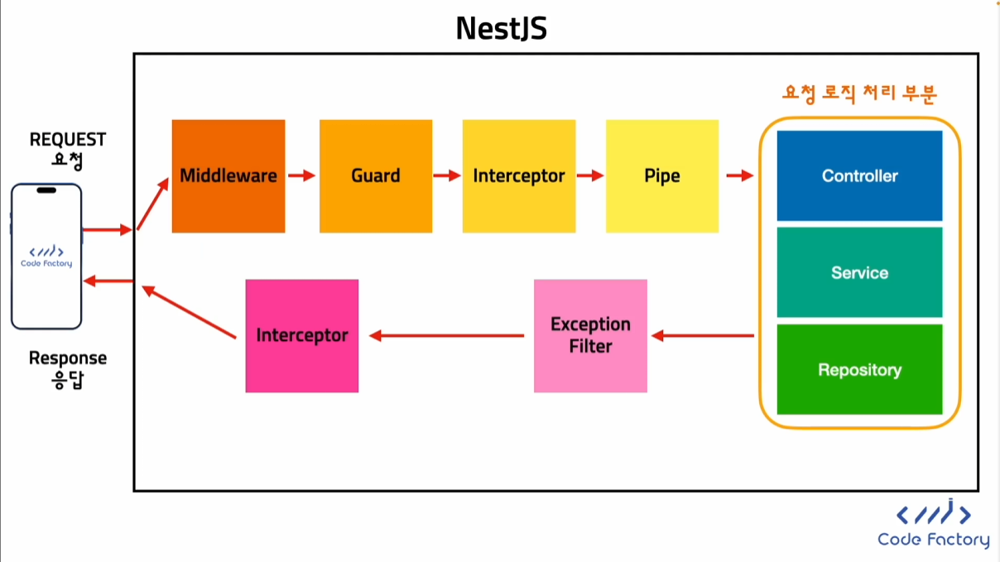

# Nestjs


# 설치


### MAC 설치

1. node 설치
2. terminal 접속 후 `node —version` `npm —version`로 설치 확인
3. `sudo corepack enable` 입력 후 엔터
4. 비밀번호 입력
5. `yarn —version`을 통해 yarn 설치 확인
6. `sudo npm i -g @nestjs/cli` 설치 후 확인


### Windows 설치

1. node 설치
2. powershell 접속 후 `node —version` `npm —version`로 설치 확인
3. `corepack enable` 입력 후  엔터
4. `yarn —version`을 통해 yarn 설치 확인
5. `npm i -g @nestjs/cli` 설치 후  확인


# 프로젝트 생성


## 프로젝트 생성

```bash
nest new nest_project
```


# 요청 라이프 사이클




# HTTP METHOD


## HTTP METHOD


# Nest개요

CRUD 생성기 사용

[Documentation | NestJS - A progressive Node.js framework](https://docs.nestjs.com/recipes/crud-generator)

```jsx
nest g resoure [name]
```

컨트롤러만 생성

```jsx
nest g controller [name]
```


## 컨트롤러

컨트롤러 → 특정 요청에 대한 수신

라우트 → 어떤 컨트롤러가 어떤 요청을 수신하는지 제어

`@Controller` 데코레이터를 사용하여 정의

```jsx
import { Controller, Get } from '@nestjs/common';

@Controller('cats')
export class CatsController {
  @Get()
  findAll(): string {
    return 'This action returns all cats';
  }
}
```


### 직렬화

자바스크립트 객체 또는 배열 반환 시 자동으로 JSON 직렬화,

단 자바스크립트 기본 유형은 그대로 전송


### 요청 및 응답 관련 객체 접근

```tsx
@Get()
  findAll(@Req() request: Request): string {
    return 'This action returns all cats';
  }
```

| 데코레이터 | 일반 플랫폼에서의 객체 |
| --- | --- |
| @Request(), @Req() | req |
| @Response(), @Res()* | res |
| @Next() | next |
| @Session() | req.session |
| @Param(key?: string) | req.params/req.params[key] |
| @Body(key?: string) | req.body/req.body[key] |
| @Query(key?: string) | req.query/req.query[key] |
| @Headers(name?: string) | req.headers/req.headers[name] |
| @Ip() | req.ip |
| @HostParam() | req.hosts |


### HTTP 메서드

`@Get()`, `@Post()`, `@Put()`, `@Delete()`, `@Patch()`, `@Options()` ,`@head()`

`@all()` → 모두 처리하는 엔드포인트


### 상태 코드

기본 상태 응답은 200, POST는 201

`@HttpCode()` 데코레이터를 통해 변경 가능

```jsx
@Post()
@HttpCode(204)
create() {
  return 'This action adds a new cat';
}
```


### 헤더 지정

`@Header()` 데코레이터를 사용하여 응답 헤더 지

```tsx
@Post()
@Header('Cache-Control', 'none')
create() {
  return 'This action adds a new cat';
}
```


### 리디렉션

`@Redirect(url,statusCode)`

```tsx
@Get()
@Redirect('https://nestjs.com', 301)
```


### 경로 매개변수

```tsx
@Get(':id')
findOne(@Param('id') id: string): string {
  return `This action returns a #${id} cat`;
}

```


### 하위 도메인 라우팅

```tsx
@Controller({ host: 'admin.example.com' })
export class AdminController {
  @Get()
  index(): string {
    return 'Admin page';
  }
}
```


### 요청 본문 사용

```jsx
@Post()
async create(@Body() createCatDto: CreateCatDto) {
  return 'This action adds a new cat';
}
```

`ValidationPipe` 을 사용하여 수신해서는 안되는 속성을 제거(필터링)할 수 있다


## Module

인스턴스가 아닌 클래스를 그대로 넣음. `@Injectable`을 사용

→ IoC Container가 자동으로 인스턴스를 생성

```tsx
import { Module } from '@nestjs/common';
import { PostsService } from './posts.service';
import { PostsController } from './posts.controller';

@Module({
  controllers: [PostsController],
  providers: [PostsService],
})
export class PostsModule {}
```

```tsx
@Injectable()
export class PostsService {
}
```


## Provider

```tsx
import { Injectable } from '@nestjs/common';
import { Cat } from './interfaces/cat.interface';@Injectable()
export class CatsService {
  private readonly cats: Cat[] = [];create(cat: Cat) {
    this.cats.push(cat);
  }findAll(): Cat[] {
    return this.cats;
  }
}
```

서비스 생성

```bash
nest g service cats
```

서비스 등록

```tsx
import { Module } from '@nestjs/common';
import { CatsController } from './cats/cats.controller';
import { CatsService } from './cats/cats.service';@Module({
  controllers: [CatsController],
  providers: [CatsService],
})
export class AppModule {}
```

의존성 주입

```tsx
constructor(private catsService: CatsService) {}
```


## 의존성 주입 · 제어의 역전

클래스 A의 constructor에 클래스 B의 인스턴스를 입력으로 넣어준다.
→ 클래스 A는 클래스 B의 의존성을 가진다


nestjs IoC Container가 자동으로 생성하여 주입


## 모듈

```bash
nest g module cats
```

모듈은 기본적으로 공급자를 **캡슐화합니다** . 이는 현재 모듈의 직접 일부도 아니고 가져온 모듈에서 내보내지지도 않은 공급자를 주입하는 것이 불가능하다는 것을 의미

| providers | Nest 인젝터에 의해 인스턴스화되고 적어도 이 모듈 전체에서 공유될 수 있는 공급자 |
| --- | --- |
| controllers | 인스턴스화되어야 하는 이 모듈에 정의된 컨트롤러 세트 |
| imports | 이 모듈에 필요한 공급자를 내보내는 가져온 모듈 목록 |
| exports | 그 하위 집합은 providers이 모듈에서 제공되며 이 모듈을 가져오는 다른 모듈에서 사용할 수 있어야 합니다. 공급자 자체 또는 해당 토큰( provide값) 만 사용할 수 있습니다. |


### 공유 모듈로 사용

`exports`를 통해 외부로 서비스를 내보낸다

```tsx
import { Module } from '@nestjs/common';
import { CatsController } from './cats.controller';
import { CatsService } from './cats.service';

@Module({
  controllers: [CatsController],
  providers: [CatsService],
  exports: [CatsService]
})
export class CatsModule {}
```


### 전역 모듈로 만들기

`@Global()` 데코레이터 사용

루트 또는 코어 모듈에 한 번만 등록하여 사

```tsx

import { Module, Global } from '@nestjs/common';
import { CatsController } from './cats.controller';
import { CatsService } from './cats.service';

@Global()
@Module({
  controllers: [CatsController],
  providers: [CatsService],
  exports: [CatsService],
})
export class CatsModule {}
```


## 미들웨어


### 미들웨어 만들기

```tsx

import { Injectable, NestMiddleware } from '@nestjs/common';
import { Request, Response, NextFunction } from 'express';@Injectable()
export class LoggerMiddleware implements NestMiddleware {
  use(req: Request, res: Response, next: NextFunction) {
    console.log('Request...');
    next();
  }
}

```


### 미들웨어 적용

```tsx
import { Module, NestModule, MiddlewareConsumer } from '@nestjs/common';
import { LoggerMiddleware } from './common/middleware/logger.middleware';
import { CatsModule } from './cats/cats.module';@Module({
  imports: [CatsModule],
})
export class AppModule implements NestModule {
  configure(consumer: MiddlewareConsumer) {
    consumer
      .apply(LoggerMiddleware)
      .forRoutes('cats');
  }
}
```


### 함수 미들웨어

미들웨어에 대한 종속성이 필요 없다면 더 간단한 함수적 미들웨어를 고려

```tsx
import { Request, Response, NextFunction } from 'express';export function logger(req: Request, res: Response, next: NextFunction) {
  console.log(`Request...`);
  next();
};
```


### **다중 미들웨어**

위에서 언급했듯이 순차적으로 실행되는 여러 미들웨어를 바인딩하려면 `apply()`메서드 내부에 쉼표로 구분된 목록을 제공하면 됩니다.

```tsx
consumer.apply(cors(), helmet(), logger).forRoutes(CatsController);
```


### **글로벌 미들웨어**

등록된 모든 경로에 미들웨어를 한 번에 바인딩하려면 인스턴스 `use()`에서 제공하는 메서드를 사용할 수 있습니다 `INestApplication`.

```tsx
const app = await NestFactory.create(AppModule);
app.use(logger);
await app.listen(3000);
```


## 예외처리


### 표준 예외 처리

`HttpException` 내장 클래를 사용

```tsx

@Get()
async findAll() {
  throw new HttpException('Forbidden', HttpStatus.FORBIDDEN);
}
```


### 내장 HTTP 예외

- `BadRequestException`
- `UnauthorizedException`
- `NotFoundException`
- `ForbiddenException`
- `NotAcceptableException`
- `RequestTimeoutException`
- `ConflictException`
- `GoneException`
- `HttpVersionNotSupportedException`
- `PayloadTooLargeException`
- `UnsupportedMediaTypeException`
- `UnprocessableEntityException`
- `InternalServerErrorException`
- `NotImplementedException`
- `ImATeapotException`
- `MethodNotAllowedException`
- `BadGatewayException`
- `ServiceUnavailableException`
- `GatewayTimeoutException`
- `PreconditionFailedException`


### 오류 설명 제공

```bash
throw new BadRequestException('Something bad happened', { cause: new Error(), description: 'Some error description' })
```

```json
{
  "message": "Something bad happened",
  "error": "Some error description",
  "statusCode": 400,
}

```


### 예외 필터 사용하기

```tsx
import { ExceptionFilter, Catch, ArgumentsHost, HttpException } from '@nestjs/common';
import { Request, Response } from 'express';@Catch(HttpException)
export class HttpExceptionFilter implements ExceptionFilter {
  catch(exception: HttpException, host: ArgumentsHost) {
    const ctx = host.switchToHttp();
    const response = ctx.getResponse<Response>();
    const request = ctx.getRequest<Request>();
    const status = exception.getStatus();
    response.status(status)
      .json({
        statusCode: status,
        timestamp: new Date().toISOString(),
        path: request.url,
      });
  }
}
```


### 전역 필터

```tsx
async function bootstrap() {
  const app = await NestFactory.create(AppModule);
  app.useGlobalFilters(new HttpExceptionFilter());
  await app.listen(3000);
}
bootstrap();
```


### 모든 모듈에 전역 범위 필터 등록

```tsx
import { Module } from '@nestjs/common';
import { APP_FILTER } from '@nestjs/core';@Module({
  providers: [
    {
      provide: APP_FILTER,
      useClass: HttpExceptionFilter,
    },
  ],
})
export class AppModule {}
```


## 파이프

일반적으로 입력 데이터 변환, 유효성 검사 등을 수행


### 내장 파이프

- `ValidationPipe`
- `ParseIntPipe`
- `ParseFloatPipe`
- `ParseBoolPipe`
- `ParseArrayPipe`
- `ParseUUIDPipe`
- `ParseEnumPipe`
- `DefaultValuePipe`
- `ParseFilePipe`

params 가져오

```tsx
@Get(':id')
async findOne(@Param('id', ParseIntPipe) id: number) {
  return this.catsService.findOne(id);
}
```

query string 가져오기

```tsx
@Get()
async findOne(@Query('id', ParseIntPipe) id: number) {
  return this.catsService.findOne(id);
}
```


# SQL


## Table


`SELECT {columns} FROM {table}`

`UPDATE {table} SET {column} WHERE {condition}`

`DELETE FROM {table} WHERE {condition}`

`INSERT INTO {table} {column1, column2, …} VALUES {value1, value2, …}`


# Docker


## Docker


쿠버네티스: 여러 기기에서의 컨테이터 관리 용이

도커 컴포즈: 하나의 기기에서의 컨테이너 관리 용이


### mac 도커 설치

홈페이지에서 설치


### 도커 허브

[Docker Hub Container Image Library | App Containerization](https://hub.docker.com/)

docker-compose.yaml

```tsx
services:
  postgres:
    image: postgres:16.1 [사용할 이미지]
    restart: always
    volumes: [폴더 매핑]
      - ./postgres-data:/var/lib/postgresql/data
    ports: [포트 매핑]
      - "5432:5432"
    environment: [환경변수?]
      POSTGRES_USER: postgres
      POSTGRES_PASSWORD: postgres
      POSTGRES_DB: postgres
```

1. 도커 실행
2. doker-compose up
3. nestjs 실행


# TypeORM


## 함수

find 전부 찾기

findOne 하나만 찾기

create → 저장할 객체를 생성

save → 객체를 db에 저장


## Column 속성

```tsx
@Column({
    // 컬럼의 타입 지정
    // 기본값: 유추
    type: 'text',
    // 기본값: 유추
    name: 'title',
    // 컬럼의 길이 지정
    length: 100,
    // null 값이 가능한지 여부
    // 기본값: false
    nullable: true,
    // 값을 업데이트 할 수 있는지 여부
    // 기본값: true
    update: false,
    // find() 실행 시에 기본적으로 값을 불러올 지 여부
    // 기본값: true
    select: false,
    // 입력이 없을 때 db에 저장될 기본값
    default: 'default title',
   // 컬럼에서 값이 유일무이해야 하는지 여부
    unique: true,
  })
```


## Class 상속

```tsx
export class BaseModel {
  @PrimaryGeneratedColumn()
  id: number;

  @CreateDateColumn()
  createdAt: Date;

  @UpdateDateColumn()
  updatedAt: Date;
}

@Entity()
export class BookModel extends BaseModel {
  @Column()
  name: string;
}
```


## Single Table 상속

```tsx
@Entity()
@TableInheritance({
  column: {
    name: 'type',
    type: 'varchar',
  },
})
export class SingleBaseModel {
  @PrimaryGeneratedColumn()
  id: number;

  @CreateDateColumn()
  createdAt: Date;

  @UpdateDateColumn()
  updatedAt: Date;
}

@ChildEntity()
export class ComputerModel extends SingleBaseModel {
  @Column()
  brand: string;
}

@ChildEntity()
export class AirplaneModel extends SingleBaseModel {
  @Column()
  country: string;
}
```


## 날짜 컬럼 자동 생성

```tsx
@UpdateDateColumn()
  updatedAt: Date;

  @CreateDateColumn()
  createdAt: Date;
```


# 관계

<aside>
🔄 관계 설정 시에 연결된 데이터 가져오기

</aside>

```tsx
this.postRepository.find({
      relations: {
        tags: true,
      },
    });
```


### One to One

유저 - 프로필 테이블


```tsx
@Entity()
export class UserModel {
  @PrimaryGeneratedColumn('increment')
  id: number;

  @Column()
  email: string;

  @CreateDateColumn()
  createdAt: Date;

  @UpdateDateColumn()
  updatedAt: Date;

  @VersionColumn()
  version: number;

  @Column()
  @Generated('increment')
  additionalId: number;

  @Column({
    type: 'enum',
    enum: UserRole,
    default: UserRole.USER,
  })
  role: UserRole;

  @OneToOne(() => ProfileModel, (profile) => profile.user)
  profile: ProfileModel;

  @OneToMany(() => PostModel, (post) => post.author)
  posts: PostModel[];
}
```

```tsx
@Entity()
export class ProfileModel {
  @PrimaryGeneratedColumn()
  id: number;

  @OneToOne(() => UserModel, (user) => user.profile)
  @JoinColumn()
  user: UserModel;

  @Column()
  profileImg: string;
}
```


### One to Many

유저 → 게시글 테이블


ManyToOne에서 Many 입장의 테이블에서 상대방 테이블의 key값을 저장

```tsx
@Entity()
export class PostModel {
  @PrimaryGeneratedColumn()
  id: number;

  @ManyToOne(() => UserModel, (user) => user.posts)
  author: UserModel;

  @Column()
  title: string;
}
```


### Many to Many

게시글 - 태그 테이블


```tsx
@Entity()
export class TagModel {
  @PrimaryGeneratedColumn()
  id: number;

  @ManyToMany(() => PostModel, (post) => post.tags)
  posts: PostModel[];

  @Column()
  name: string;
}
```

```tsx
@Entity()
export class PostModel {
  @PrimaryGeneratedColumn()
  id: number;

  @ManyToOne(() => UserModel, (user) => user.posts)
  author: UserModel;

  @ManyToMany(() => TagModel, (tag) => tag.posts)
  @JoinTable()
  tags: TagModel[];

  @Column()
  title: string;
}
```


## eager 속성

데이터를 로드할 때 자동으로 엔티티를 추가한다

기본값: false

```tsx
@OneToOne(() => ProfileModel, (profile) => profile.user, {
    eager: true,
  })
  profile: ProfileModel;
```


## cascade 속성

데이터를 생성할 때 연결된 데이터를 함께 생성할 수 있다

기본값: false

```tsx
@Entity()
export class UserModel {
  ...

  @OneToOne(() => ProfileModel, (profile) => profile.user, {
    eager: true,
    cascade: true,
  })
  profile: ProfileModel;

  ...
}

```

```tsx
const profile = await this.profile.Repository.save({
    profileImg: 'test.png',
})

const user = await this.userRepository.save({
    email: 'cascade@gmail.com',
    rofile,
});
```

```tsx
const user = await this.userRepository.save({
    email: 'cascade@gmail.com',
    profile: {
        profileImg: 'test.png',
    },
});
```


## nullable 속성

null 값이 될 수 있는지 여부

기본값: true

```tsx
@OneToOne(() => ProfileModel, (profile) => profile.user, {
    eager: true,
    cascade: true,
    nullable: true,
  })
  profile: ProfileModel;
```


## onDelete 속성

삭제할 때 함께 할 동작

- `NO ACTION`: 아무것도 안함
- `CASCADE`: 참조하는 Row도 함께 삭제 → 프로필 삭제 시 유저도 삭제 됨
- `SET NULL` 참조하는 Row에서 참조 id 값을 null로 변경 → 프로필 삭제 시 유저 테이블의 프로필에는 null값이 들어감
- `SET DEFAULT`: (테이블의) 기본 세팅으로 지정
- `RESTRICT`: 참조하고 있는 Row가 있는 경우 참조당하는 Row를 삭제 불가 → 프로필 삭제 시 연결된 유저가 있으면 삭제 불가(500에러)

```tsx
@OneToOne(() => ProfileModel, (profile) => profile.user, {
    eager: true,
    cascade: true,
    nullable: true,
    onDelete: 'CASCADE'
  })
  profile: ProfileModel;
```


## find 메서드 속성


### select

어떤 컬럼을 가져올 지 지정

기본값: 모든 컬럼을 가져옴

```tsx
return this.userRepository.find({
      select: {
        id: true,
      },
    });
```


### where

특정 조건을 가진 Row만 가져오는 필터

where 같은 객체 안의 속성 간에는 end 로 묶임

or로 묶기 위해서는 배열을 사용

`Not()`  : 아닌 경우 가져오기 `id: Not(1)` → 아이디가 1이 아닌 경우

`Equal()`

`LessThanOrEqual()` : 미만인 경우 가져오기 `id: LessThan(10)` → 아이디가 10 미만인 경우

`LessThanOrEqual()` : 이하인 경우 가져오기 `id: LessThanOrEqual(10)` → 아이디가 10 이하인 경우

`MoreThan()`

`MoreThanOrEqual()`

```tsx
return this.userRepository.find({
      where: {
          id: 1,
        },
    });
```

```tsx
return this.userRepository.find({
      where: [
        {
          id: 1,
        },
        {
          id: 2,
        },
      ],
    });
```

`Like()` :  문자열 패턴 검색 연산자

`email: Like(’%google.com%’)` → 구글 메일 가져오기

`ILike(’%GOOGLE%’)` → 대소문자 구분없이 가져오기

`Between(10,15)` : 사이 값만 가져오기

`In([1,2,3,4])`: 배열에 포함되는 값만 가져오기

`IsNull()`: null인 경우 가져오기


### relations

관계 가져오기

```tsx
return this.userRepository.find({
      relations: {
        profile: true,
      },
    });
```


### order

컬럼 기준 정렬

“ASC” 오름차순

“DESC” 내림차

```
return this.userRepository.find({
      order: {
        id: 'DESC',
      },
    });
```


### skip

Rows를 가져올 때 건너뛸(제외할) Row 수

```tsx
return this.userRepository.find({
      order: {
        id: 'DESC',
      },
      skip: 1,
    });
```


### take

가져올 Rows 수

```tsx
return this.userRepository.find({
      order: {
        id: 'DESC',
      },
      take: 1,
    });
```


## repository 함수

```tsx
@Post('method-test')
  async methodTest() {
    // 인스턴스만 생성
     const user1 = await this.userRepository.create({
       email: 'test@gmail.com',
     });

    // 저장
     const user2 = await this.userRepository.save({
       email: 'test@gmail.com',
     });

    //preload
    // 입력된 값ㅇ들 기반으로 데이터베이스에서 데이터를 가져오고
    // 추가 입력된 값으로 값을 대체
    // 저장하지는 않음
     const user3 = await this.userRepository.preload({
       id: 9,
       email: 'preload@gmail.com',
     });

    // 삭제
     await this.userRepository.delete(9);

    // id값이 1인 row의 count 값을 2 증가
     await this.userRepository.increment(
       {
         id: 2,
       },
       'count',
       200,
     );

     await this.userRepository.decrement(
       {
         id: 1,
       },
       'count',
       2,
     );

    // rows 개수 반환
     const count = await this.userRepository.count({
       where: {
         email: Like('%@gmail.com'),
       },
     });

    // column 값 합 반환
     const countSum = await this.userRepository.sum('count', {
       email: Like('%@gmail.com'),
     });

    // column 값 평균 반환
     const countAvg = await this.userRepository.average('count');

    // colimn 값 최소값 반환
     const countMin = await this.userRepository.minimum('count');
     const countMax = await this.userRepository.maximum('count');

    // rows를 필터 전의 전체 개수와 함께 반환
     const [users, count] = await this.userRepository.findAndCount({
       take: 3,
     });

    return true;
  }
```


# Auth (JWT)


Access Token: api 요청 검증 / 짧은 유효 기간 /

Refresh Token: Access Token 추가 발급 / 긴 유효 기간


```tsx
/**
   * 1) 회원가입 registerWithEmail
   *    - email, password, nickname을 받아서 새로운 유저를 생성한다.
   *    - 이미 존재하는 email이라면 에러를 발생시킨다.
   *    - 생성된 유저, accessToken, refreshToken을 반환한다.
   *
   * 2) 로그인 loginWithEmail
   *    - email, password를 받아서 해당 유저가 존재하는지 확인한다.
   *    - 존재하지 않는다면 에러를 발생시킨다.
   *    - 존재한다면 accessToken, refreshToken을 반환한다.
   *
   *  3) loginUser
   *    - accessToken, refreshToken을 반환하는 함수
   *
   *  4) signToken
   *    - payload를 받아서 accessToken, refreshToken을 생성하는 함수
   *
   *  5) authenticateWithEmailAndPassword
   *    - email, password를 받아서 해당 유저가 존재하는지 확인하는 함수
   *    - 존재하지 않는다면 에러를 발생시킨다.
   *    - 존재한다면 해당 유저를 반환한다.
   */
```


## 베이스 모델 사용

```tsx
//base.entity.ts
import {
  CreateDateColumn,
  PrimaryGeneratedColumn,
  UpdateDateColumn,
} from 'typeorm';

export abstract class BaseModel {
  @PrimaryGeneratedColumn()
  id: number;

  @UpdateDateColumn()
  updatedAt: Date;

  @CreateDateColumn()
  createdAt: Date;
}
```

```tsx
export class PostsModel extends BaseModel {
...
}
```


## pgAdmin

PostgreSQL 툴

데이터 그립 → 인텔리제이의 유료 제품. 더 좋음


# Guard


## basic 토큰 가드

```tsx
@Post('login/email')
@UseGuards(BasicTokenGuard)
loginEmail(@Headers('authorization') authorization: string) {
  const token = this.authService.extractTokenFormHeader(authorization, false);
  const credentials = this.authService.decodeBasicToken(token);
  return this.authService.loginWithEmail(credentials);
}
```

```tsx
// auth/guard/basic-token.guard.ts

import {
  CanActivate,
  ExecutionContext,
  Injectable,
  UnauthorizedException,
} from '@nestjs/common';
import { AuthService } from '../auth.service';

@Injectable()
export class BasicTokenGuard implements CanActivate {
  constructor(private readonly authService: AuthService) {}
  async canActivate(context: ExecutionContext): Promise<boolean> {
    const request = context.switchToHttp().getRequest();

    const rawToken = request.headers['authorization'];
    if (!rawToken) {
      throw new UnauthorizedException('토큰이 없습니다.');
    }

    const token = this.authService.extractTokenFormHeader(rawToken, false);

    const { email, password } = this.authService.decodeBasicToken(token);

    const user = await this.authService.authenticateWithEmailAndPassword({
      email,
      password,
    });

    request.user = user;

    return true;
  }
}
```


## Bearer 토큰 가드

```tsx
// auth/guard/bearer-token.guard.ts

import {
  CanActivate,
  ExecutionContext,
  Injectable,
  UnauthorizedException,
} from '@nestjs/common';
import { AuthService } from '../auth.service';
import { UsersService } from 'src/users/users.service';

@Injectable()
export class BearerTokenGuard implements CanActivate {
  constructor(
    private readonly authService: AuthService,
    private readonly usersService: UsersService,
  ) {}
  async canActivate(context: ExecutionContext): Promise<boolean> {
    const request = context.switchToHttp().getRequest();

    const rawToken = request.headers['authorization'];
    if (!rawToken) {
      throw new UnauthorizedException('토큰이 없습니다.');
    }

    const bearerToken = this.authService.extractTokenFormHeader(rawToken, true);

    const result = await this.authService.verifyToken(bearerToken);

    const user = await this.usersService.getUserByEmail(result.email);

    request.user = user;
    request.token = bearerToken;
    request.tokenType = result.type;

    return true;
  }
}

@Injectable()
export class AccessTokenGuard extends BearerTokenGuard {
  async canActivate(context: ExecutionContext): Promise<boolean> {
    await super.canActivate(context);

    const req = context.switchToHttp().getRequest();

    if (req.tokenType !== 'access') {
      throw new UnauthorizedException('access 토큰 타입이 아닙니다.');
    }

    return true;
  }
}

@Injectable()
export class RefreshTokenGuard extends BearerTokenGuard {
  async canActivate(context: ExecutionContext): Promise<boolean> {
    await super.canActivate(context);

    const req = context.switchToHttp().getRequest();

    if (req.tokenType !== 'refresh') {
      throw new UnauthorizedException('refresh 토큰 타입이 아닙니다.');
    }

    return true;
  }
}
```


# Custom Decorator

유저 커스텀 데코레이터

다른 모듈에서 사용하려면 exports후에 사용하는 모듈에서 imports

```tsx
// users/decorator/user.decorator.ts

import {
  ExecutionContext,
  InternalServerErrorException,
  createParamDecorator,
} from '@nestjs/common';
import { UsersModel } from '../entities/users.entity';

export const User = createParamDecorator(
  (data: keyof UsersModel | undefined, context: ExecutionContext) => {
    const req = context.switchToHttp().getRequest();
    const user = req.user as UsersModel;
    if (!user) throw new InternalServerErrorException('User not found');

    if (data) return user[data];

    return user;
  },
);
```


# Postman 토큰 자동화

1. Environments 생성
2. 토큰 변수 생성
3. Environments 저장
4. 우측 상단에서 Environments 선택하여 변경


1. 토큰을 받아오는 회원가입, 로그인 api에서 test 작성
2. 받아온 token 값을 환경변수에 지정

    ```tsx
    pm.test('Store access Token', () => {
        pm.environment.set('accessToken', pm.response.json().accessToken)
    })
    
    pm.test('Store access Token', () => {
        pm.environment.set('refreshToken', pm.response.json().refreshToken)
    })
    ```

3. Headers가 아닌 Auth 탭에서 변수를 사용하여 토큰 지정

    


# Class-Validator

[https://github.com/typestack/class-validator#validation-decorators](https://github.com/typestack/class-validator#validation-decorators)


## 1. dto만들기

```tsx
// /posts/dto/create-post.dto.ts

import { PickType } from '@nestjs/mapped-types';
import { PostsModel } from '../entities/posts.entity';

export class CreatePostDto extends PickType(PostsModel, ['title', 'content']) {}
```


## 2. entity에서 validation하기

```tsx
// /posts/entities/posts.entity.ts

import { IsString } from 'class-validator';
import { BaseModel } from 'src/common/entity/base.entity';
import { UsersModel } from 'src/users/entities/users.entity';
import { Column, Entity, ManyToOne } from 'typeorm';

@Entity()
export class PostsModel extends BaseModel {
  @ManyToOne(() => UsersModel, (user) => user.posts, {
    nullable: false,
  })
  author: UsersModel;

  @Column()
  @IsString({
    message: '제목은 문자열로 입력해주세요.',
  })
  title: string;

  @Column()
  @IsString({
    message: '내용은 문자열로 입력해주세요.',
  })
  content: string;

  @Column()
  likeCount: number;

  @Column()
  commentCount: number;
}
```


### 3. validationMessage 함수 만들기

```tsx
import { ValidationArguments } from 'class-validator';

export const lengthValidationMessage =
  (name: string) => (args: ValidationArguments) => {
    if (args.constraints.length === 1) {
      return `${name}(${args.property})은(는) 최소${args.constraints[0]}자리로 입력해주세요.`;
    } else {
      return `${name}(${args.property})은(는) ${args.constraints[0]}~${args.constraints[1]}자리로 입력해주세요.`;
    }
  };
```


# Class-Transformer

```tsx
@Exclude()
@Expose()
```

 frontend -> backend
 JSON -> DTO -> Entity
 backend -> frontend
 Entity -> DTO -> JSON
 toClassOnly -> 클래스 인스턴스로 변환될 때 적용(요청을 받을 때)
 toPlainOnly -> JSON으로 변환될 때 적용(응답을 보낼 때)

```tsx
@Column()
  @IsString({
    message: stringValidationMessage('비밀번호'),
  })
  @Length(8, 20, {
    message: lengthValidationMessage('비밀번호'),
  })
  @Exclude({
    toPlainOnly: true,
  })
  password: string;
```


# snake case db와 연동

[https://github.com/tonivj5/typeorm-naming-strategies](https://github.com/tonivj5/typeorm-naming-strategies)
