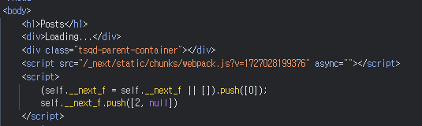
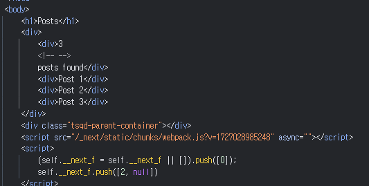
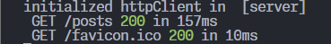
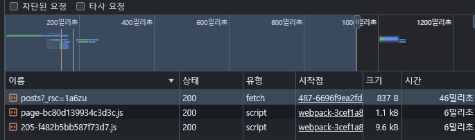
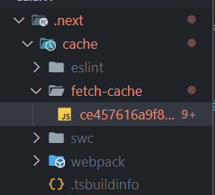
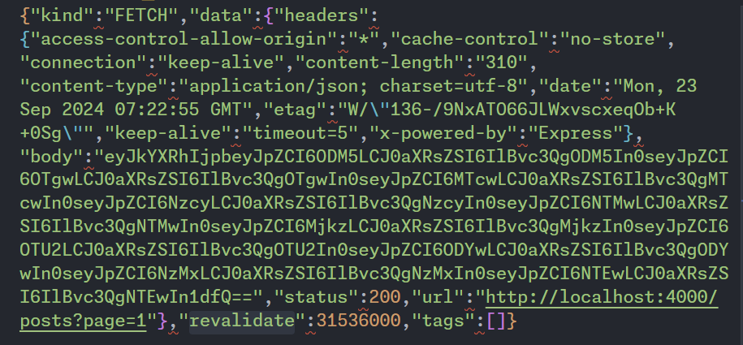

# nextjs에서 fetching

여기서는 일반 fetch api가 아닌 http client 인스턴스를 만들어 사용한다고 가정(여러 가지 공통 로직을 쉽게 관리 하기 위해서)

ex. axios instance, ky instance

아래와 같이 httpClient 인스턴스를 생성하고 **어디에서 초기화(initialize)되는지** 확인하기 위해 console 작성

```typescript
import clientEnv from '@/lib/env/clientEnv';
import { getToken } from '@/lib/session/universal';
import ky, { type KyInstance } from 'ky';

const httpClient: KyInstance = ky.create({
  prefixUrl: clientEnv.NEXT_PUBLIC_API_BASE_URL,
  hooks: {
    beforeRequest: [
      (request) => {
        const token = getToken();
        if (token) {
          request.headers.set('Authorization', `Bearer ${token}`);
        }
      },
    ],
  },
});
console.log(
  'initialized httpClient in ',
  typeof window === 'undefined' ? '[server]' : '[client]',
);

export default httpClient;
```


## 일반적인 client 컴포넌트를 사용하는 경우


### 전체 페이지 렌더링 시

- 서버에서는 isLoading 상태로 간주하고 `<div>Loading...</div>` 반환

  

- httpClient는 client 측에서만 초기화되고 api가 호출됨

  

  
### 클라이언트 측 렌더링 시

일반적인 react 컴포넌트처럼 클라이언트 측에서만 렌더링

```tsx
'use client';
...

export default function Posts() {
  const postsQuery = useQuery({
    queryKey: ['posts'],
    queryFn: () =>
      httpClient
        .get<{
          postList: [
            {
              id: number;
              title: string;
              createdAt: string;
              tagList: string[];
            },
          ];
        }>('post')
        .json(),
  });

  if (postsQuery.isLoading) {
    return <div>Loading...</div>;
  }

  if (postsQuery.isError) {
    return <div>Error: {postsQuery.error.message}</div>;
  }

  if (!postsQuery.data) {
    return <div>No posts found</div>;
  }

  return (
    <div>
      <div>{postsQuery.data.postList.length} posts found</div>
      {postsQuery.data.postList.map((post) => (
        <div key={post.id}>{post.title}</div>
      ))}
    </div>
  );
}
```


## Prefetch를 사용한 클라이언트 컴포넌트

위와 동일 클라이언트 컴포넌트를 사용하되 서버 측에서 초기 렌더링이 가능하도록 prefetch를 사용

prefetch된 데이터를 페이지(html)에 함께 넣어 보내기 위해 직렬화(dehydrate())를 거쳐 전달


### 전체 페이지 렌더링 시

- 서버에서는 prefetchQuery를 사용하여 데이터를 실제로 가져오고 결과값을 렌더링

  

- httpclient는 서버와 클라이언트 양 쪽 모두에서 각각 초기화

  

  


### 클라이언트 측 렌더링 시



```tsx
export default async function PostsPage() {
  const queryClient = getQueryClient();

  await queryClient.prefetchQuery({
  ...
  });

  return (
    <HydrationBoundary state={dehydrate(queryClient)}>
      <h1>Posts</h1>
      <Posts />
    </HydrationBoundary>
  );
}
```


## fetch의 캐싱

- `.next/cache/fetch-cache`  경로에 fetch의 응답을 저장



- `cache-control`에 상관없이 자체적인 **revalidate**값을 가지고 캐싱




- 이상한 것은 http의 cache-control을 "no-store"로 지정해뒀음에도 nextjs에서 자체적으로 캐싱을하고 그기간(revalidate)을 `31536000` 아주 길게 잡는다는 것입니다. 따라서 아무 지시사항 없이 사용하면 모든 요청이 캐싱되어 사이트가 바라던대로 동작하지 않을 가능성이 큽니다
- 클라이언트 측에서 tanstack-query가 자체적인 캐싱을 제공하듯이 next에서도 서버 측의 캐싱을 주도적으로 하여 api를 보내는 서버가 아닌 받는 next 측에서 캐싱을 관리하고 싶어 하는 것 같습니다
- next 측에서도 이러한 방식의 문제점을 알고 있는 것 같습니다. `next 15`부터는 <u>fetch 요청이 기본적으로 캐싱되지 않을 것</u>으로 보입니다
  - <https://github.com/vercel/next.js/discussions/53504>
  - <https://nextjs.org/blog/next-15-rc#fetch-requests-are-no-longer-cached-by-default>


------

<https://vercel.com/templates/next.js/app-directory>

<https://nextjs.org/docs/app/building-your-application/caching>

<https://nextjs.org/docs/app/building-your-application/data-fetching/incremental-static-regeneration>

<https://mycodings.fly.dev/blog/2024-03-02-nextjs-fetchcache>
