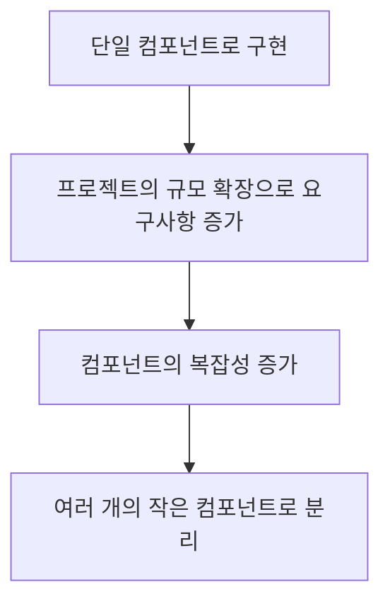

## Provider 패턴

컴포넌트 트리의 깊은 곳에 있는 컴포넌트에 데이터를 전달할 때 사용하는 패턴

Provider 패턴은 React에서 컴포넌트 간에 데이터를 전달하는 방법 중 하나입니다. 이 패턴은 React의 내장된 Context API를 사용하여 구현할 수 있습니다. Provider 패턴은 컴포넌트 트리의 깊은 곳에 있는 컴포넌트에 데이터를 전달할 때 유용합니다.


## Provider 패턴의 구현

Provider 패턴을 사용하여 Dark Mode 테마를 적용하는 예제를 살펴보겠습니다.


### 1. Context 생성

- `DarkModeProvider` 컴포넌트는 초기상태와 상태를 변경하는 함수를 제공합니다.
- `useDarkMode` 훅은 `DarkModeProvider` 컴포넌트에서 제공하는 상태와 함수를 사용할 수 있습니다.

```tsx
// DarkModeContext.tsx
import React, { createContext, useContext, useState } from "react";

type DarkModeContextType = {
  isDarkMode: boolean;
  setIsDarkMode: (isDarkMode: boolean) => void;
  toggleDarkMode: () => void;
};

const DarkModeContext = createContext<DarkModeContextType | undefined>(
  undefined
);

export const useDarkMode = () => {
  const context = useContext(DarkModeContext);
  if (!context) {
    throw new Error("useDarkMode must be used within a DarkModeProvider");
  }
  return context;
};

export const DarkModeProvider = ({ children }) => {
  const [isDarkMode, setIsDarkMode] = useState(false);

  const toggleDarkMode = useCallback(() => {
    setIsDarkMode((prev) => !prev);
  }, []);

  return (
    <DarkModeContext.Provider
      value={{ isDarkMode, setIsDarkMode, toggleDarkMode }}
    >
      {children}
    </DarkModeContext.Provider>
  );
};
```


### 2. Provider 사용

`context`를 사용할 가장 상위 위치에서 `DarkModeProvider` 컴포넌트를 감싸 주어야 합니다.

```tsx
// App.tsx
import React from "react";

import { DarkModeProvider } from "./DarkModeContext";

const App = () => {
  return (
    <DarkModeProvider>
      <div>
        <h1>Dark Mode Example</h1>
        <DarkModeToggle />
      </div>
    </DarkModeProvider>
  );
};

export default App;
```


### 3. Consumer 사용

`useDarkMode` 훅은 공통된 `context`를 가져와 사용할 수 있습니다.

```tsx
// DarkModeToggle.tsx
import React from "react";

import { useDarkMode } from "./DarkModeContext";

const DarkModeToggle = () => {
  const { isDarkMode, setIsDarkMode } = useDarkMode();

  return (
    <button onClick={() => setIsDarkMode(!isDarkMode)}>
      {isDarkMode ? "Light Mode" : "Dark Mode"}
    </button>
  );
};

export default DarkModeToggle;
```


## Provider 패턴의 주의사항

- Provider 패턴은 컴포넌트 트리의 깊은 곳에 있는 컴포넌트에 데이터를 전달할 때 유용합니다. `props-drilling`을 피하기 위해 사용할 수 있습니다.
- 하지만 Provider 패턴은 만능이 아닙니다. 너무 많이 사용하면 컨텍스트의 복잡성이 증가할 수 있습니다. 어느 컴포넌트에서 어떤 컨텍스트를 사용가능한지 파악하기 어려워질 수 있습니다.
- `props`로 충분히 전달할 수 있는 데이터는 Provider 패턴을 사용하지 않는 것이 좋습니다. 또한 컴포넌트 간의 관계가 명확하고 간단할 때는 Provider 패턴을 사용하지 않는 것이 좋습니다.
- 앱 전체에서 사용해야 하는 데이터가 있다면 `Redux`나 `Zustand`와 같은 전역 상태 관리 라이브러리를 사용하는 것이 더 적합할 수 있습니다. 이 라이브러리들은 데이터 관리에 특화되어 더 많은 기능을 제공합니다.


## Composite 패턴

비대해진 컴포넌트를 작은 여러 개의 컴포넌트로 분리하여 조합하는 패턴



Composite 패턴은 여러 개의 객체를 하나의 객체로 묶어서 사용하는 패턴입니다. React에서는 컴포넌트를 조합하여 더 큰 컴포넌트를 만들 수 있습니다. 이 패턴은 컴포넌트의 재사용성을 높이고, 컴포넌트 간의 관계를 명확하게 만들어 줍니다.

프로젝트의 초반부에서 간단한 기능을 구현하기 위해서는 단일 구성 요소로 충분할 수 있지만, 프로젝트가 커지면 하나의 구성 요소 안에 여러 가지 기능과 요구 사항이 추가될 수 있습니다. 이때 단일 구성 요소를 사용하는 경우 유지보수가 어렵고 유연성이 떨어지는 등의 한계가 분명해집니다. Composite 패턴은 하나의 구성 요소를 단일 책임 원칙에 따라 작은 여러 개의 구성 요소로 분리합니다. 분리된 구성 요소들은 하나의 구성 요소로 묶어 내보내지며, 사용하는 곳에서 원하는 작은 구성 요소들을 선택적으로 조합하여 사용할 수 있습니다.


## Composite 패턴의 구현

Composite 패턴을 사용하여 `Card` 컴포넌트를 구현하는 예제를 살펴보겠습니다.


### Composite 패턴 없이 구현

Composite 패턴을 사용하지 않고 Card를 렌더링하기 위해 필요한 모든 값을 `props`로 전달받을 수 있습니다. 이러한 구성 요소는 정해진 값을 입력으로 받아 렌더링하는 역할을 충분히 수행하는 것 같지만, Card의 요구사항이 추가되거나 변경될 때마다 `props`를 추가하거나 변경해야 하는 문제가 발생할 수 있습니다.

```tsx
// Card.tsx
import React from "react";

type CardProps = {
  title: string;
  content: string;
  image: string;
  onClickSubmit: () => void;
  onClickCancel: () => void;
};

const Card = ({
  title,
  content,
  image,
  onClickSubmit,
  onClickCancel,
}: CardProps) => {
  return (
    <div>
      <div>
        <h2>{title}</h2>
      </div>
      <div>
        <p>{content}</p>
        
      </div>
      <div>
        <button onClick={onClickSubmit}>Submit</button>
        <button onClick={onClickCancel}>Cancel</button>
      </div>
    </div>
  );
};
```

```tsx
// App.tsx

import React from "react";

import Card from "./Card";

const App = () => {
  return (
    <Card
      title="Card Title"
      content="Card Content"
      image="https://via.placeholder.com/150"
      onClickSubmit={() => alert("Submit")}
      onClickCancel={() => alert("Cancel")}
    />
  );
};

export default App;
```


### Composite 패턴으로 구현

Composite 패턴을 사용하여 Card의 각 부분을 별도의 작은 구성 요소로 분리합니다. 이렇게 하면 Card 컴포넌트는 작은 구성 요소들을 조합하여 렌더링하는 역할만 수행하게 됩니다. 이렇게 하면 Card 컴포넌트는 단일 책임 원칙을 준수하게 되며, Card의 요구사항이 추가되거나 변경될 때마다 작은 구성 요소들을 추가하거나 변경하면 되기 때문에 유지보수가 용이해집니다.

```tsx
// Card.tsx

import React from "react";

const CardHeader = ({ children }) => {
  return <div>{children}</div>;
};

const CardBody = ({ children }) => {
  return <div>{children}</div>;
};

const CardFooter = ({ children }) => {
  return <div>{children}</div>;
};

const Card = ({ children }) => {
  return <div>{children}</div>;
};

Card.Header = CardHeader;
Card.Body = CardBody;
Card.Footer = CardFooter;

export default Card;
```

```tsx
// App.tsx

import React from "react";

import Card from "./Card";

const App = () => {
  return (
    <Card>
      <Card.Header>
        <h2>Card Title</h2>
      </Card.Header>
      <Card.Body>
        <p>Card Content</p>
        
      </Card.Body>
      <Card.Footer>
        <button onClick={() => alert("Submit")}>Submit</button>
        <button onClick={() => alert("Cancel")}>Cancel</button>
      </Card.Footer>
    </Card>
  );
};

export default App;
```


### Composite 패턴의 주의사항

- Composite 패턴은 컴포넌트의 재사용성을 높이고, 컴포넌트 간의 관계를 명확하게 만들어 줍니다. 이는 컴포넌트의 구조를 밖으로 노출함으로써 달성됩니다.
- 하지만 Composite 패턴을 사용할 때는 각각의 작은 구성 요소들이 어떻게 조합되어야 하는지 명확하게 정의해야 합니다. 예를 들어 `CardFooter`를 Card의 맨 위에 사용하는 것은 옳지 못한 사용 방법이 될 수 있습니다.
- Composite 패턴은 작은 컴포넌트 간의 의존성을 만드는 것으로 볼 수 있습니다. 따라서 여러 컴포넌트들이 혼합되어 배치될 때 의도치 않은 결과가 발생할 수 있습니다. 이러한 문제를 방지하기 위해서는 각 컴포넌트가 독립적으로 동작할 수 있도록 설계하는 것이 중요합니다.
