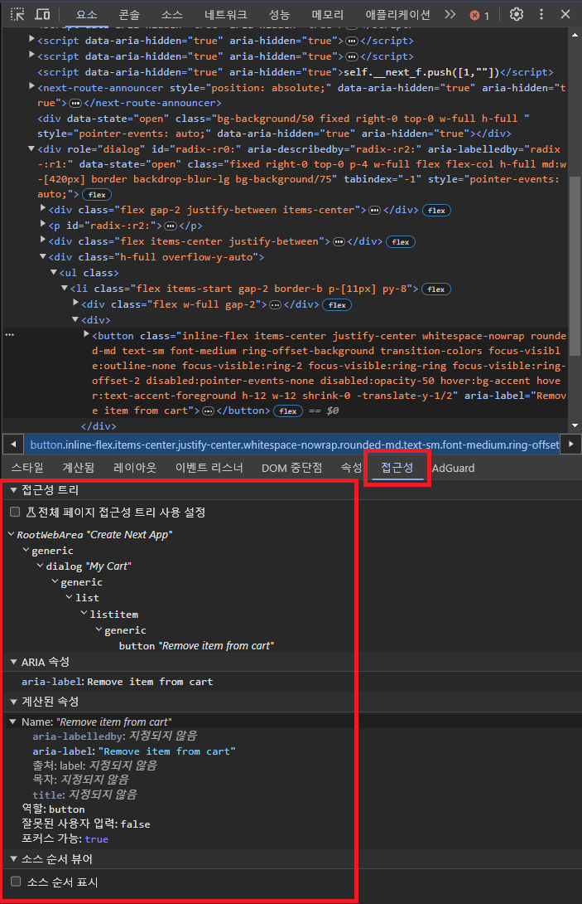

# web-accessibility

- <https://nuli.navercorp.com/>


## 크롬 개발자 도구 활용하기





### Icon Button

```tsx
    <Button
      aria-label="Remove item from cart"
      onClick={handleRemoveCartItem}
    >
      <X aria-hidden={true} />
    </Button>
```


### Image Link

링크나 버튼과 같이 기능적으로 사용되는 이미지의 대체 텍스트는 이미지 자체보다는 해당 기능에 대해서 설명해야 합니다

```html
<a href="/posts/about-our">
 
</a>
```

