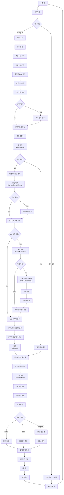

## Web Flow

사용자로부터 HTTP 요청을 받아 사용자가 원하는 페이지를 보는 과정을 설명한다.

```mermaid
graph TD
    A[사용자] --> B[브라우저]
    B --> C{캐시 확인}
    C -->|캐시 있음| D[캐시된 리소스 사용]
    C -->|캐시 없음| E[DNS 조회]
    
    E --> F[ISP DNS]
    F --> G[루트 DNS 서버]
    G --> H[TLD DNS 서버]
    H --> I[도메인 DNS 서버]
    I --> J[IP 주소 반환]
    
    J --> K[TCP 연결 설정]
    K --> L{HTTPS?}
    L -->|Yes| M[TLS 핸드셰이크]
    L -->|No| N[HTTP 요청 전송]
    M --> N
    
    N --> O[로드 밸런서]
    O --> P[웹 서버<br/>Nginx/Apache]
    
    P --> Q{정적 파일?}
    Q -->|Yes| R[정적 파일 서빙]
    Q -->|No| S[애플리케이션 서버]
    
    S --> T[프레임워크<br/>Express/Django/Spring]
    T --> U{인증 필요?}
    U -->|Yes| V[인증/권한 검사]
    U -->|No| W[비즈니스 로직 처리]
    V --> W
    
    W --> X{DB 접근 필요?}
    X -->|Yes| Y[캐시 확인<br/>Redis/Memcached]
    X -->|No| CC[응답 데이터 생성]
    
    Y --> Z{캐시 히트?}
    Z -->|Yes| AA[캐시된 데이터 사용]
    Z -->|No| BB[데이터베이스 쿼리<br/>MySQL/PostgreSQL]
    
    BB --> DD[쿼리 실행]
    DD --> EE[데이터 캐싱]
    EE --> AA
    AA --> CC
    
    CC --> FF[HTML/JSON 응답 생성]
    FF --> GG[HTTP 응답 헤더 설정]
    GG --> HH[압축<br/>Gzip/Brotli]
    
    HH --> II[웹 서버로 응답 전달]
    II --> JJ[로드 밸런서 통과]
    JJ --> KK[CDN 캐싱<br/>CloudFlare/AWS]
    
    KK --> LL[네트워크 전송]
    LL --> MM[브라우저 수신]
    
    MM --> NN[응답 파싱]
    NN --> OO{리소스 타입}
    
    OO -->|HTML| PP[DOM 생성]
    OO -->|CSS| QQ[CSSOM 생성]
    OO -->|JavaScript| RR[JS 엔진 실행]
    
    PP --> SS[렌더 트리 구성]
    QQ --> SS
    RR --> TT[DOM 조작]
    TT --> SS
    
    SS --> UU[레이아웃 계산]
    UU --> VV[페인트]
    VV --> WW[컴포지트]
    
    WW --> XX[화면 렌더링]
    XX --> A
    
    R --> II
    D --> XX
```
