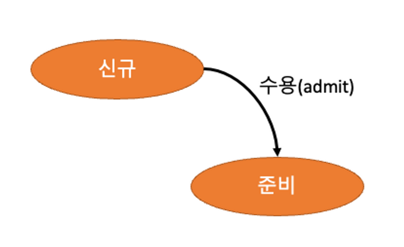

# CPU / Memory

### CPU

컴퓨터에서 처리를 담당하는 “중앙 처리 장치”. 계산을 잘하지만 다른 지능적인 행위를 하지 못한다.

### Arithmetic Logic Unit(ALU)

산술 논리 장치로 산술이나 논리같은 수학적 연산을 담당

AU (산술 장치) + LU (논리 장치)를 합친 디지털 회로

**정수 산술 연산:** 더하기, 빼기, 부호 뒤집기, 증가, 감소 등

**비트 논리 연산:** OR AND NOT 등

### Control Unit(CU)

제어 장치로 프로세서의 작업을 제어(=지시를 받아서 명령어로 디코딩)하는 회로

**제어부**:  주기억 장치에 저장되어 있는 **명령어를 순서대로 호출하여 해독**하고, 제어 신호를 발생시켜 컴퓨터의 각 장치의 동작을 제어 (스케쥴링)

**내부버스**: 기억, 연산, 제어 기능을 실현하기 위한 CPU와 주기억 장치, 입출력 장치, 외부 기억 장치, 주변 장치, 통신 처리 장치 등의 제어부 사이를 연결하는 버스

### Memory Unit(MU)

* 레지스터:  처리할 명령어를 저장
* 캐시 메모리(L1):  처리 속도를 높여주는 역할

### Register

작업을 빠르게 처리하기 위한 CPU의 **고속 메모리**

**처리 속도**: 레지스터(CPU) >캐시(주) > RAM(주) > 하드디스크(보조)

**범용 레지스터**: 연산에 필요한 데이터나 연산 결과를 임시로 저장

**특수목적 레지스터**: 특수 목적을 가진 레지스터

* 메모리 주소 레지스터: (MAR) : 읽고 쓰기 위한 주기억장치의 주소를 저장
* 프로그램 카운터 (PC) : 다음에 수행할 명령어의 주소를 저장
* 명령어 레지스터 (IR) : 현재 실행 중인 명령어를 저장
* 메모리 버퍼 레지스터 (MBR) : 주기억장치에서 읽어온 데이터나 저장할 데이터를 임시로 저장
* 누산기 (AC, ACCUMULATOR) : 연산 결과를 임시로 저장

### Cache Memory

`L2, L3 캐시 메모리:` CPU와 별도의 공간에 존재하고 RAM과 CPU 사이에서 버퍼 역할

`CPU 레지스터`: CPU안에서 연산을 처리하고 데이터를 저장하는 공간

메인 메모리에서 데이터 접근하는 시간을 줄이기 위한 메모리

CPU에서 자주 사용하는 데이터나 명령을 저장하여 CPU 성능 향상

CPU 메모리보다 싸고 메인 메모리보다 비싸다

L1은 L2보다 비싸지만 빠르고 용량이 크다.

L2도 L3에 비해 비싸지만 용량이 크다

### BUS

컴퓨터에서, 컴퓨터 간에 데이터를 전송하는 통로

물리적(하드웨어), 추상적(소프트웨어)인 요소를 모두 포함

**내부 버스**: 메인보드에 연결된 메모리 입출력 장치, CPU 간에 데이터 통신과 같이 컴퓨터 내부 요소 간 통신

**외부 버스**: usb로 연결되는 장치, 프린터와 같이 외부 장치를 컴퓨터에 연결하는 통로

### 주기억장치

RAM은 휘발성 메모리로 전원이 공급되지 않으면 데이터가 사라진다.

**정적 메모리(SRAM, Static RAM)**: 기억 장치에 전원이 공급되는 한 그 내용이 계속 보존. CPU 레지스터, 캐시 메모리에 사용

**동적 메모리(DRAM; Dynamic RAM)**: 일반적으로 RAM이라  부르는 것. 계속 공급되어도 재충전을 주기적으로 해야만 내용을 유지할 수 있는 메모리이다.

### 보조기억장치

주 기억장치보다 속도가 느리지만 전원이 공급이 중단되어도 데이터가 유지되는 비휘발성 메모리로 데이터를 오래 저장할 수 있다

**하드디스크(HDD):** 돌아가는 플래터 위에 전자적인 힘을 가해 데이터를 기록

**솔리드스테이드드라이브(SSD**): 순수 전자식으로 동작하고 HDD보다 속도가 빠르다

기타: 플로피 디스크, CD ROM, DVD, Blu-ray, 플래시 메모리

### CPU 동작

### 1. 인출(fetch)

프로그램 메모리에서 명령을 검색하고 다음 명령의 주소를 식별

### 2. 해독(decode)

메모리에서 받아온 명령을 제어 신호로 변환(명령코드)

“**명령 코드(opcode;operation code)**”: 명령어를 부호로 나타낸 기계어

### 3. 실행(execute)

제어 신호에 의해 CPU의 다양한 부분이 활성화, 비활성화 되면서 작업을 처리하고

일반적으로 클럭 펄스에 대한 응답 으로 작업이 완료되고,

다음 명령어에서 빠른 접근을 위해 CPU 레지스터에 결과가 기록된다

### 4. 반영(write back)

결과를 메모리에 쓰기

### CPU의 성능

`CPU 클럭`: 초당 명령어를 처리할 수 있는 횟수

`CPU 코어`: 물리적인 CPU의 코어 개수

## 스케쥴링

### 프로세스

프로그램을 실행해주는 주체

### 쓰레드

작업을 처리해주는 주체

### 스케쥴링 단위

**CPU Burst**: 프로세스의 사용중에 연속적으로 CPU를 사용하는 구간. 실제 CPU 를 사용하는 스케쥴링의 단위

**I/O Burst**: I/O작업이 끝날때까지 Block되는 구간

<figure><figcaption></figcaption></figure>

### 스케쥴링 평가 기준

* **CPU 이용률** :  CPU가 작업을 처리하는 시간 / 전체 시스템 시간
* **처리량** : CPU가 처리하는 프로세스의 개수 / 단위 시간
* **총 처리 시간** : 프로세스가 시작해서 끝날때 까지 걸린 시간
* **대기시간** : 프로세스가 준비완료 큐에서 대기하는 시간의 총 합
* **응답시간** : 대화식 시스템에서 요청 후 첫 응답이 오기까지 걸린 시간

### Preemptive Scheduling


OS가 CPU의 사용권을 선점할 수 있는 경우, 강제 회수하는 경우


선점 스케쥴링:  OS가 CPU이 사용권을 선점하고, 특정 요건에 따라 각 프로세스의 요청이 있을 때 프로세스에게 분배하는 방식

따라서 빠른 응답시간을 요하는 대화식 시분할 시스템에 적합하고긴급한 프로세스를 제어 가능

#### Priority Scheduling(우선순위 스케쥴링)

정적/동적으로 우선순위를 부여하고 우선순위 순서대로 처리 (최소 버스트 시간 기준)

Starvation(기아  현상): 우선순위가 낮은 프로세스는 무한정 기다릴 수도 있다

\-> Aging(노화) 기법으로 해결. 시간에 따라 우선순위를 증가

#### Round Robin(라운드로빈)


FCFS에 의해 프로세스들이 보내지면 각 프로세스는 동일한 시간의 Time Quantum 만큼 CPU 할당


정해진 시간 할당량 동안 프로세스를 할당하고, 준비완료의큐 마지막으로 이동

시간 할당량이 너무 작을 경우: 빈번한 문맥 전환

시간 할당량이 너무 클 경우: FCFS와 비슷해짐

#### MultiLevel-Queue(다단계 큐)

준비완료 큐를 여러 개의 큐로 분할하여, 각각  큐의  우선순위를  정한다

프로세스를 우선순위에 따라 해당하는 큐에 배치.

우선순위가 높은 큐부터 순서대로 처리

### Non-Preemptive Scheduling


프로세스 종료 or I/O 등 이벤트가 있을 때까지 실행 보장 (처리시간 예측 용이)


어떤 프로세스가 CPU를 할당받으면 그 프로세스가 종료되거나, 입출력 요구가 발생하여 자발적으로 중지될 때 까지 계속 실행되도록 보장

* 순서대로 처리되는 공정성이 있고, 다음에 처리해야할 프로세스와 상관없이 응답시간을 예상 가능
* 선점방식보다 스케쥴러 호출 빈도가 낮고, 문맥교환에 의한 오버헤드가 적다.
* 일괄처리 시스템에 적합하며 자칫 CPU사용시간이 긴 프로세스가 다른 프로세스들을 대기시킬 수 있으므로 처리율이 떨어질 수 있다는 단점이 있습니다.

#### FCFS(First Come, First Serve)


큐에 도착한 순서대로 CPU 할당

실행 시간이 짧은 게 뒤로 가면 평균 대기 시간이 길어짐


**먼저 도착한 프로세스를 먼저 처리**하는 기본적인 스케쥴링 알고리즘

FIFO큐(먼저 입력된것 먼저 출력)를 이용하여 간단하게 구현

**Convoy Effect(호위 효과)**: 처리시간이 긴 프로세스가 선점되면, 나머지 프로세스의 대기 시간이 매우 길어짐

#### SJF(Shorted Job First)


수행시간이 가장 짧다고 판단되는 작업 먼저 수행

FCFS 보다 평균 대기 시간 감소, 짧은 작업에 유리


CPU 버스트 타임이 가장 짦은, **최단작업을 우선** 스케쥴링

* 가장 적은 평균 대기 시간을 가짐
* 만약 CPU버스트 시간이 동일하다면 FCFS방식을 따름
* 다만 선점형인 경우에는 위와같이 진행이 되지만 비 선점형일 경우엔 최소잔여시간우선 법칙을 따름
* 현재 CPU에 할당된 프로세스의 남은 잔여시간과, 새로 들어온 프로세스의 CPU버스트 타임을 비교하여 더 적은 프로세스에게 할당

#### HRN( Highest Response-ratio Next)


우선순위 = (대기시간 + 실행시간) / (실행시간)


### 스케쥴링 동작 시점

1. 수행 -> 대기 (Running->Waiting) : I/O요청이 발생하거나, 자식 프로세스가 종료 대기를 할 때
2. 수행 -> 종료 (Running -> Terminate) : 프로세스를 종료시켯을때
3. 수행 -> 준비 (Running-> Ready) : 인터럽트가 발생했을때
4. 대기 -> 준비 (Waiting -> Ready) : I/O가 완료되었을때

<figure><figcaption></figcaption></figure>

#### 선점 스케쥴링 발생 시점

<figure><figcaption></figcaption></figure>

#### 비선점 스케쥴링 발생 시점

<figure><figcaption></figcaption></figure>

### Locality(지역성)


자주 사용되는 데이터의 특성


#### 시간 지역성

* 최근 액세스 된 기억 장소가 가까운 미래에 다시 액세스 가능성 높음

#### 공간 지역성

* 액세스된 기억장소와 인접한 기억장소가 액세스될 가능성 높음

### Cache  Hit

CPU가 데이터를 요청하여 캐시 메모리에 접근했을 때 캐시 메모리에 해당 데이터가 있는 것

* 위치도 가깝고 CPU 내부버스를 기반으로 작동하여 빠르다
* 👉 캐시히트를 하게 되면 해당 데이터를 제어장치를 거쳐 가져오게 된다.

### Cache Miss

해당 데이터가 캐시에 없어서 주 기억장치(RAM)로 가서 데이터를 찾아오는 것

* 👉 메모리를 가져올때 시스템 버스를 기반으로 작동하기 때문에 느리다

### Cache Mapping

캐시의 데이터를 메모리와 어떻게 대응시킬지를 결정하는 방법

#### Direct Mapping

직접 매핑 방식

캐시 슬롯과 메모리 주소를 일대일 대응

각 메모리 블록은 고정된 위치의 캐시 슬롯에 저장

처리가 빠르지만 충돌 발생 위험

#### Set Associative Mapping

집합 연관 매핑 방식

캐시를 여러 개의 집합으로 나누고 각 집합은 여러 개의 슬롯으로 구성

충돌을 줄이면서 성능을 향상

#### Fully Associative Mapping

완전 연관 매핑 방식

캐시 슬롯의 개수에 제한없이, 메모리 블록은 어떤 슬롯에든 저장될 수 있음

가장 유연하여 충돌 위험이 가장 적음

검색 시간이 오래 걸리고 하드웨어 복잡성이 증가

### 메모리 할당 방식

