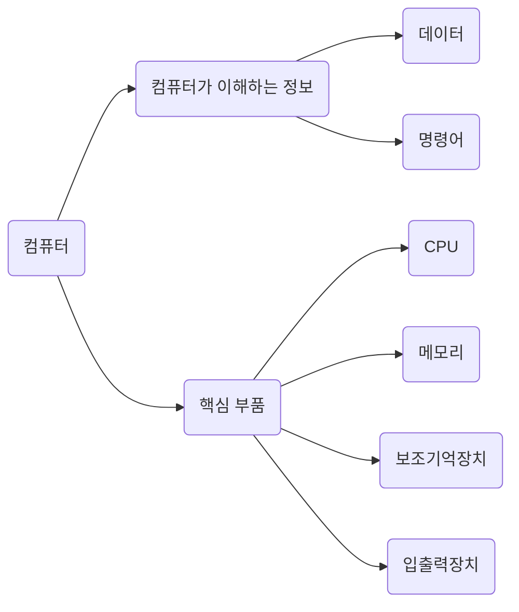

# Computer Science

### 컴퓨터의 구성

```mermaid
flowchart LR
    id0(컴퓨터) --> id1(컴퓨터가 이해하는 정보)
    id1(컴퓨터가 이해하는 정보) --> id2(데이터)
    id1(컴퓨터가 이해하는 정보) --> id3(명령어)
    id0(컴퓨터) --> id4(핵심 부품)
    id4(핵심 부품) --> id5(CPU)
    id4(핵심 부품) --> id6(메모리)
    id4(핵심 부품) --> id7(보조기억장치)
    id4(핵심 부품) --> id8(입출력장치)
```
