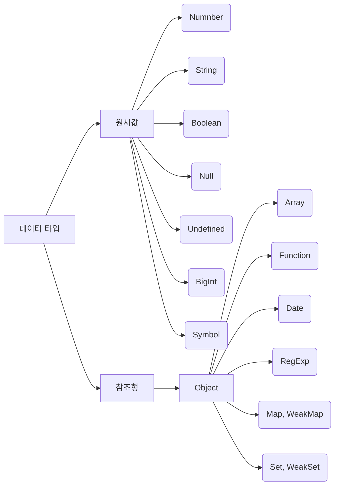
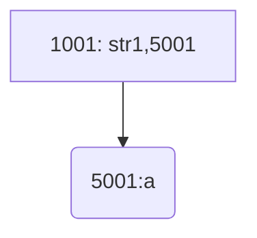
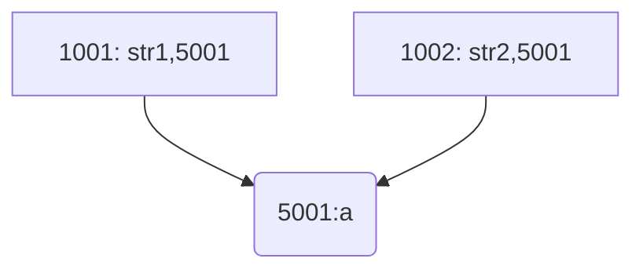
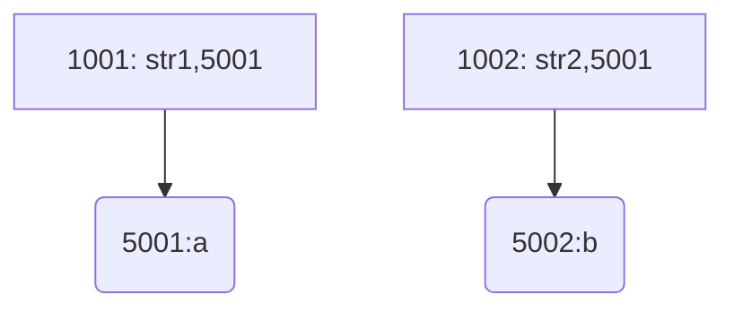
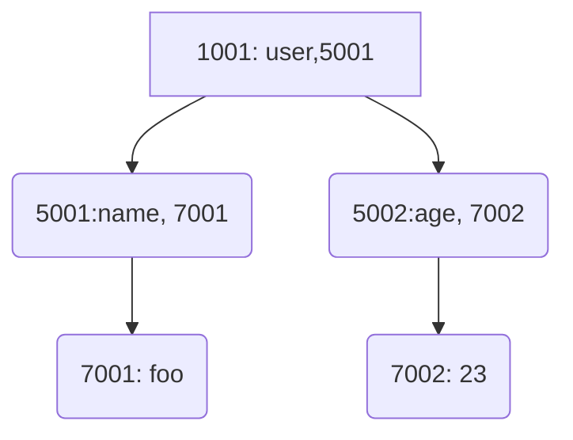
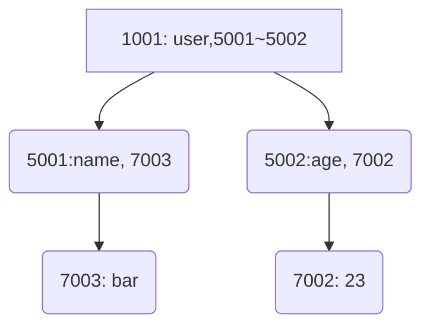

**변수와 객체**

[TOC]

## 변수

## 변수 선언

- 변수: 값을 담기 위해 이름을 붙인 상자
- var(선언자) number(변수 이름);
- 변수는 최대한 변하지 않는 것이 좋다.

```javascript
var number;
var number_1 = 1,
  number_2 = 2;
```

- ❗변수를 선언하지 않고 값을 대입하면 자바스크립트 엔진이 자동으로 변수를 전역 변수로 선언

```javascript
x = 2;
console.log(typeof x); // number
```

## 전역변수(global variable)와 지역변수(local variable)

- 전역변수: 전역 객체(`window`)에서 접근 가능한 변수

  > ❗전역 변수는 높은 접근성 때문에 사용하지 않는 것이 좋다

- 지역변수: 함수 또는 블록 내에서만 접근 가능한 변수

|          | var | let | const |
| -------- | --- | --- | ----- |
| 호이스팅 | O   | X   | X     |
| 재선언   | O   | X   | X     |
| 재할당   | O   | O   | X     |

## var 변수

현재 실행 컨텍스트와 클로저 범위의 선택적인 값 초기화를 하는 변수

- ❗`var`은 어느 위치에서 선언되든 코드의 최상단으로 끌어 올려져 가장 먼저 실행된다.(호이스팅)
- 따라서 변수의 범위의 최상단에서 선언하는 것이 읽기 쉽다.
- 변수의 선언만 호이스팅 될 뿐, 변수 초기화는 호이스팅 되지 않는다. (초기화 전까지 `undefined`를 반환)
- NodeJS, CommonJS 모듈에서 최상위 변수를 선언해도
  범위는 모듈로 한정되어 전역 객체에 속성으로 추가되지 않는다.

> ❗재선언을 하더라도 오류를 발생 시키지 않는다.

```javascript
var a = 1;
var a = 2; // 재선언 가능
let b = 1;
let b = 2; // Uncaught SyntaxError: Identifier 'b' has already been declared
```

> 전역 컨텍스트에서 선언되면 전역 객체(window)의 속성으로 추가된다.

```javascript
var x = "var type";
let y = "let type";
console.log(this.x); // var type
console.log(this.y); // undefined
console.log(this); // Window(전역객체)
```

## let 변수

ES2015부터 도입된 재선언이 불가능한 **블록 스코프**를 갖는 선택적인 값 초기화를 하는 변수

- 선언부에 도달하기 전까지 액세스 불가 -> TDZ
- ❗`let`과 `const`는 var와 달리 전역 변수가 되더라도 전역 객체(window)의 속성이 되지 않는다.

```javascript
let foo = 1;
```

## const 변수

재할당, 재선언이 불가능한 상수(constant) 값을 갖는 변수

- 배열일 때는 항목에 대한 업데이트 및 제거 가능
- 재할당 되지 않을 것임을 알려줌으로써 코드 읽기가 쉬워진다.
- 선언할 때 값을 지정해야 한다.

> `const`를 `let`보다 위에서 선언하자.

```javascript
const PI = 3.14;
```

## 변수 끌어올림(hoisting)

- 변수 선언부를 프로그램 첫 머리로 끌어올림

- 같은 이름으로 끌어 올려지는 변수는 모두 끌어올린 후 하나의 영역에 할당된다.

- ❗`var` 변수는 호이스팅 시 `underfined`로 변수를 초기화

- ❗`let`과 `const`도 호이스팅 되나 선언부 전에 사용하면 에러가 발생

- 선언을 해야만 호이스팅이 작동

  - ```javascript
    //선언을 통한 호이스팅
    console.log(x); // undefined
    var x;
    ```

  - ```javascript
    //선언을 통한 호이스팅
    console.log(x); // undefined
    var x = 2;
    console.log(x); // 2
    ```

- ❗선언하지 않으면 호이스팅이 되지 않음

  - ```javascript
    console.log(x); // Uncaught ReferenceError: x is not defined
    x;
    ```

  - ```javascript
    console.log(x); // Uncaught ReferenceError: x is not defined
    x = 2;
    ```

## let 과 const 호이스팅 (Temporal dead zone;TDZ)

- 일반적으로 let과 const는 호이스팅되지 않는 것으로 간주된다.

- `let`과 `const`도 선언 시 블록의 시작부로 호이스팅되지만

  선언 및 초기화 코드가 실행되기 전까지 TDZ에 있기 때문이다.

> TDZ에 있는 동안은 변수에 **액세스가 불가능(ReferenceError)**하고 초기화되지 않는다.
>
> `Temporal `은 코드가 실행되는 **시간적 순서**를 의미한다.

- TDZ에 대한 예제

  ```javascript
  {
      //TDZ starts
      ...
  console.log(x); // Uncaught ReferenceError: Cannot access 'num' beforeinitialization
      ...
  let x = 2;//TDZ end
  }

  ```

- TDZ로 인한 오류 발생 예제

  ```javascript
  function test() {
    var foo = 33; // 1. var foo 선언
    if (foo) {
      // 2. var foo 참조
      let foo = foo + 55; // 3. let foo는 현재 TDZ에 있으므로 ReferenceError
    }
  }
  test();
  ```

  ```javascript
  function go(n) {
    // n here is defined!
    console.log(n); // { a: [1, 2, 3] }
  
    for (let n of n.a) {
      //let n은 호이스팅되어 for문 블록의 최상위에서 선언, TDZ존 시작
      //n.a를 참조할 때 선언되지 않은 let n을 참조하여 오류 발생
      // ReferenceError
      console.log(n);
    }
  }
  
  go({ a: [1, 2, 3] });
  ```

## 변수 명명 규칙

- 사용 가능 문자: 알파벳(a~z, A~Z), 숫자(0~9), 밑줄(\_), 달러 기호($)
- ❗첫 글자로 숫자는 사용 불가
- ❗예약어를 식별자로 사용 불가
- 지역 변수 명은 '\_'로 시작한다.
- 자주 쓰이는 상수는 대문자만으로 작성하여 눈에 띄기 쉽게 할 수 있다.

### 캐멀 표기법(로어 캐멀 표기법)

- 두 번째 이후 단어의 첫 글자를 대문자로 표기 -> <u>함수 및 변수 표기</u>
- ex) newName, createLifeGame

### 파스칼 표기법(어퍼 캐멀 표기법)

- 각 단어의 첫 글자를 대문자로 표기 -> <u>생성자, 클래스 표기</u>
- ex) NewName, CreateLiftGame

### 밑줄 표기법(스네이크 표기법)

- 모든 단어를 소문자로 표기하고 단어 사이를 밑줄(\_)로 구분 -> 상수 표기
- ex) new_name, create_life_game

# 데이터 타입

- 자바스크립트는 동적 타입 언어

## 데이터 타입 분류



원시값은 불변값이다. 변경할 수 없다. 복제 시에 값이 담긴 주소값을 복제한다.

참조형은 변경이 가능하다. 값이 담긴 주소값을 묶고 그 묶음을 가리키는 주소값을 복제한다.

## 원시 값 데이터 할당

```javascript
let str1 = 'a';
let str2 = str1;
str2 = 'b';
```

| 주소 (변수)  | 1001       | 1002 |
| ------------ | ---------- | ---- |
| 데이터       | str1, 5001 |      |
| 주소(데이터) | 5001       | 5002 |
| 데이터       | a          |      |




| 주소(변수)   | 1001       | 1002       |
| ------------ | ---------- | ---------- |
| 데이터       | str1, 5001 | str2, 5001 |
| 주소(데이터) | 5001       | 5002       |
| 데이터       | a          |            |




| 주소(변수)   | 1001       | 1002       |
| ------------ | ---------- | ---------- |
| 데이터       | str1, 5001 | str2, 5002 |
| 주소(데이터) | 5001       | 5002       |
| 데이터       | a          | b          |




- 변수는 값 자체를 가지고 있는 것이 아니라 값을 별도의 메모리 주소에 할당하고 그 메모리 주소를 가지고 있다.
- 이러한 데이터 할당은 <u>자유로운 형 변환</u>을 가능하게 하고, 값을 재사용할 때 <u>메모리를 효율적으로 관리</u>할 수 있다.
- 데이터 재할당은 새로운 메모리에 값을 할당하고 그 메모리 주소로 데이터 값 주소를 변경하는 것이다.
- 상수는 변수 영역 메모리(데이터 값을 가지고 있는 주소)를 변경할 수 없다.
- 불변성은 데이터 영역 메모리( 데이터 값이 있는 주소의 값 자체)를 변경할 수 없다.

## 객체 데이터 할당

```javascript
let user = {
	name: 'foo',
	age: 23
};
user.name = 'bar';
```


| 주소(변수)   | 1001              | 1002      | 1003 |
| ------------ | ----------------- | --------- | ---- |
| 데이터       | user, [5001,5002] |           |      |
| 주소(속성)   | 5001              | 5002      | 5003 |
| 데이터       | name, 7001        | age, 7002 |      |
| 주소(데이터) | 7001              | 7002      | 7003 |
| 데이터       | foo               | 23        |      |




| 주소(변수)   | 1001              | 1002      | 1003 |
| ------------ | ----------------- | --------- | ---- |
| 데이터       | user, [5001,5002] |           |      |
| 주소(속성)   | 5001              | 5002      | 5003 |
| 데이터       | name, 7003        | age, 7002 |      |
| 주소(데이터) | 7001              | 7002      | 7003 |
| 데이터       | ~~foo~~           | 23        | bar  |




## 숫자(Number)

- 자바스크립트에서는 숫자를 모두 64비트 부동소수점으로 표현
- 배열 인덱스와 비트 연산은 32비트 정수 처리
- **리터럴(literal)**: 프로그램에 직접 작성할 수 있는 상수 값
- `NaN`값은 `isNaN(value)`을 통해 비교한다 (NaN === NaN -> false이기 때문)

```javascript
Number(1234);
```

### 숫자 리터럴

|         분류          |    표기법     |    예시     |           설명            | 비고 |
| :-------------------: | :-----------: | :---------: | :-----------------------: | :--: |
|    **정수 리터럴**    |    10진수     |     123     |     정수 그대로 표현      |      |
|                       |    16진수     |    0x2a     |       숫자 앞에 0x        |      |
|                       |     8진수     |    0o73     |       숫자 앞에 0o        | ES6  |
|                       |     2진수     |    0b101    |       숫자 앞에 0b        | ES6  |
| **부동소수점 리터럴** |   정수.소수   |    3.14     |     소수 그대로 표현      |      |
|                       |     소수      |    0.123    | 정수부 0일때 0은 생략가능 |      |
|                       | 가수부e지수부 |   6.02e23   |        6.02\*10^23        |      |
|                       | 가수부E지수부 | 1.16199E-35 |     1.1616199\*10^-35     |      |

### 특수한 값

| 분류              | 표기법                   | 설명                    | 비고 |
| ----------------- | ------------------------ | ----------------------- | ---- |
| 전역 변수         | Infinity                 | 플러스 무한대           |      |
| 전역 변수         | NaN                      | 부정 값(수치 계산 오류) |      |
| Number의 프로퍼티 | Number.PISITIVE_INFINITY | 플러스 무한대           |      |
| Number의 프로퍼티 | Number.NEGATIVE_INFINITY | 마이너스 무한대         |      |
| Number의 프로퍼티 | Number.MAX_VALUE         | 표현 가능한 최댓값      |      |
| Number의 프로퍼티 | Number.MIN_VALUE         | 표현 가능한 최소값      |      |
| Number의 프로퍼티 | Number.NaN               | 부정 값                 |      |
| Number의 프로퍼티 | Number.EPSILON           | 2.22044604925031e-16    | ES6  |
| Number의 프로퍼티 | Number.MIN_SAFE_INTEGER  | -9007199254740990       | ES6  |
| Number의 프로퍼티 | Number.MAX_SAFE_INTEGER  | 9007199254740990        | ES6  |

## 문자열(String)

- 16비트 유니코드 문자(UTF-16)
- 문자열에 '' 또는 ""를 감싸서 사용.
- 문자열 템플릿으로 백틱(`)도 사용 가능
- HTML 요소에 자바스크립트를 넣을 때는 문자열처럼 감싸서 작성

```javascript
String("hello");
```

```html
<input type="button" value="Click" onClick="alert('Thanks!')" />
```

- 문자열안에서 특수한 문자들은 이스케이프 시퀀스로 표현해야 한다.
- 이스케이프 시퀀스는 역슬래시(\) 뒤에 특정 문자를 넣어 표현

| 이스케이프 스퀀스 | 의미                                             | 비고 |
| ----------------- | ------------------------------------------------ | ---- |
| \0                | 널(null)문자                                     |      |
| \b                | 백스페이스 문자                                  |      |
| \t                | 수평 탭 문자                                     |      |
| \n                | 개행 문자                                        |      |
| \v                | 수직 탭 문자                                     |      |
| \f                | 다음 페이지 문자                                 |      |
| \r                | 캐리지 리턴 문자(CR)                             |      |
| \\'               | 작은따옴표 문자                                  |      |
| \\"               | 큰따옴표 문자                                    |      |
| \\                | 역슬래시 문자                                    |      |
| \xXX              | 두 자릿수 16진수 XX로 지정된 Latin-1 문자        |      |
| \uXXXX            | 네 자릿수 16진수 XXXX로 지정된 유니코드 문자     |      |
| \u{XXXXX}         | 16진수 코드 포인트 XXXXXX로 지정된 유니코드 문자 | ES6  |

## 논리값(Boolean)

- 논리 데이터 유형으로 true 또는 false 두 가지 종류를 가짐
- false인 경우
  - 0 , -0
  - null
  - false
  - NaN
  - undefined
  - ""

## 특수한 값(Undefined, Null)

- **undefined**: 정의되지 않은 상태
  - 값을 아직 할당하지 않은 변수의 값
  - 없는 객체의 프로퍼티를 읽으려고 했을 때의 값
  - 없는 배열의 요소를 읽으려고 했을 때의 값
  - 아무것도 반환하지 않는 함수가 반환하는 값
  - 함수를 호출했을 때 전달받지 못한 인수의 값
  - 숫자로서 `NaN`
- **null**: 아무것도 없음
  - 보통 프로그램에서 무언가를 검색했지만 찾지 못했을 때 반환되는 값
  - 숫자로서 `0`
  - null 값 확인: `nullVar === null`을 통해 확인 (typeof null은 object를 가리키므로 사용하면 안됨)

```javascript
undefined === undefined; // true
undefined === null; // false
null === null; // true
Number(undefined); // NaN
Number(null); // 0
String(undefined); // "undefined"
String(null); // null
Boolean(undefined); // false
Boolean(null); // false
```

# ECMAScript 6부터 추가된 데이터 타입

## 1.심벌(symbol)

- 자기 자신을 제외한 그 어떤 값과도 유일힌 값
- 호출할 때마다 새로운 값을 반환

```javascript
var sym1 = Symbol();
var sym2 = Symbol();
console.log(sym1 == sym2); // false
```

```javascript
var HEART = Symbol("하트");
console.log(HEART.toString()); // Symbol(하트)
```

- 심벌과 문자열 연결

```javascript
var sym1 = Symbol.for("club");
var sym2 = Symbol.for("club");
console.log(sym1 == sym2); // true
```

- 심벌에 for로 연결된 문자열은 keyFor을 통해 구할 수 있다

```javascript
var sym1 = Symbol.for("club");
console.log(Symbol.keyFor(sym1)); // club

var sym2 = Symbol("club");
console.log(Symbol.keyFor(sym2)); // undefined
```

## 2.템플릿 리터럴(templete literals )

- ``로 묶은 문자열
- \n이 아닌 일반적인 줄 바꿈을 통해 줄바꿈 가능

```javascript
`I'm going to learn Javascript`;
```

- 보간 표현식: 템프릿 리터럴 안에 플레이스 홀더를 ${...}을 통해 넣을 수 있다

```javascript
var a = 2,
  b = 3;
console.log(`${a} + ${b} = ${a + b}`); // 2 + 3 = 5
```

---

# 형 변환

## 암시적 형 변환

엔진에 의해 암묵적으로 타입이 자동 변환

- 다른 타입 (+) '문자열' -> 문자열 타입
  - 1+'1' -> '11'
- 숫자 (-,\*,/) 다른 타입 -> 숫자 타입
  - 1 - '1' -> 0
- 조건식에서 표현식 -> 불리언 타입
  - 1 ? 'true' : 'false' -> true

## 명시적 형 변환

개발자가 의도적으로 타입을 변환

- 문자열 -> String() / '123'.toString()
- 숫자 -> Number() / parseInt('123') / parseFloat('3.14')
- 부울 -> Boolean() / !!'false'

### 데이터 타입 확인

```javascript
typeof <Variable>
```

| Type                                                                                                                      | Result                                                                                                         |
| :------------------------------------------------------------------------------------------------------------------------ | :------------------------------------------------------------------------------------------------------------- |
| [Undefined](https://developer.mozilla.org/ko/docs/Glossary/Undefined)                                                     | `"undefined"`                                                                                                  |
| [Null](https://developer.mozilla.org/ko/docs/Glossary/Null)                                                               | `"object"` ([아래](https://developer.mozilla.org/ko/docs/Web/JavaScript/Reference/Operators/typeof#null) 참고) |
| [Boolean](https://developer.mozilla.org/ko/docs/Glossary/Boolean)                                                         | `"boolean"`                                                                                                    |
| [Number (en-US)](https://developer.mozilla.org/en-US/docs/Glossary/Number)                                                | `"number"`                                                                                                     |
| [BigInt (en-US)](https://developer.mozilla.org/en-US/docs/Glossary/BigInt)                                                | `"bigint"`                                                                                                     |
| [String](https://developer.mozilla.org/ko/docs/Glossary/String)                                                           | `"string"`                                                                                                     |
| [Symbol](https://developer.mozilla.org/ko/docs/Web/JavaScript/Reference/Global_Objects/Symbol) (ECMAScript 2015에서 추가) | `"symbol"`                                                                                                     |
| 호스트 객체 (JS 환경에서 제공)                                                                                            | _구현체마다 다름_                                                                                              |
| [Function](https://developer.mozilla.org/ko/docs/Glossary/Function) 객체 (ECMA-262 표현으로는 [[Call]]을 구현하는 객체)   | `"function"`                                                                                                   |
| 다른 모든 객체                                                                                                            | `"object"`                                                                                                     |

# 자바스크립트 연산자

## 연산자 우선순위

https://developer.mozilla.org/ko/docs/Web/JavaScript/Reference/Operators/Operator_precedence

## 사칙연산 연산자

### + 연산자

- 숫자 타입으로써 덧셈을 할 수 있다.
- 문자열 타입으로써 문자열 합치기를 할 수 있다.
- 숫자 + 문자열은 문자열 타입니다
- 숫자 타입과의 덧셈에서 논리 타입 true는 1, false는 0으로 간주된다.
- 문자열 타입과의 합치기에서 논리 타입 true는 "true", false는 "false"로 간주된다.

```javascript
console.log(1 + 2); // number + number ->  3 (number)
console.log(1 + ""); // number + string -> "1" (string)
console.log(1 + "2"); // number + string -> "12" (string)
console.log(2 + 2 + "1"); // number(4) + string('1') -> "41" (string)
console.log(2 + (2 + "1")); // number(2) + string('21') -> "221" (string)
console.log(1 + true); // number + true(1) -> 2 (number)
console.log(1 + false); // number + false(0) -> 1 (number)

console.log("hello" + "world"); // string + string -> "helloworld" (string)
console.log("hello" + 1); // string + numbmer -> hello1 (string)
console.log("hello" + true); // string + true -> "hellotrue" (string)
console.log("hello" + false); // string + true -> "hellofalse" (string)
console.log(true + false); // true + false -> 1 (number)
```

### - 연산자

- 두 연산자의 차이를 구할 수 있다.
- 빈 문자열이 아닌 문자열과의 연산은 NaN을 반환한다

```javascript
console.log(5 - 2); // 3
console.log(5 - true); // 4
console.log(5 - ""); // 5
console.log(5 - "2"); // 3
console.log(5 - "hello"); // NaN
```

### \* 연산자

- 두 연산자를 곱한다.

```javascript
console.log(4 * 2); // 8
console.log(4 * "100"); // 400
console.log(4 * "hello"); // NaN
console.log(4 * "true"); // NaN
```

### / 연산자

- 두 연산자를 나눈다.
- 0으로 나누면 Infinity을 반환
- 숫자로 이루어진 문자열로 나누면 숫자로 취급하여 연산
- 글자가 있는 문자열은 NaN을 반환

```javascript
console.log(4 / 2); // 2
console.log(4 / 3); // 1.3333333333333333
console.log(4 / 0); // Infinity
console.log(4 / -0); // -Infinity
console.log(4 / "4"); // 1
console.log(4 / "h"); // NaN
```

### % 연산자

- 나눴을 때의 나머지를 구한다.
- NaN, Infinity에 대해서는 나머지를 구할 수 없어 NaN을 반환

```javascript
console.log(17 % 4); // 1
console.log(-17 % 4); // -1
console.log(3.14 % 3); // 0.14000000000000012
console.log(NaN % 2); // NaN
console.log(Infinity % 2); // NaN
```

### \*\* 연산자

- 거듭제곱을 구한다.

```javascript
console.log(2 ** 2); // 2*2 ->  4
console.log(2 ** (2 ** 2)); // 2**4 -> 2*2*2*2  16
console.log(2 ** -1); // 1/2 -> 0.5
console.log(2 ** -2); // 1/2 * 1/2 -> 0.25
```

## 비교 연산자

### Boolean 비교

- 비교 연산자들은 결과 값으로 `true`, `false` 값을 반환한다.

### 문자열 비교

- 문자열은 사전편집순으로 비교된다.
- 즉 사전 앞쪽에 나오는 문자열이 값이 낮다. a < b < c ...
- 문자열은 앞에서부터 한 글자씩 차례대로 비교한다.
- 문자열 길이가 다르고 앞에 문자열이 같을 경우, 더 긴 문자열이 더 높은 값을 가진다.
- 값 순서(크기): 숫자 < 알파벳 대문자 < 알파벳 소문자 < 한글

```javascript
console.log("a" < "b"); // true
console.log("abuse" < "apple"); // true
console.log("ab" < "abc"); // true
console.log("a" > "A"); // true
```

### == 과 === 연산자

- `==`(동등 연산자): 피연산자의 타입이 다를 경우 타입 변환 후 비교
- `===`(엄격한 동등 연산자) : 타입 변환없이 비교

```javascript
console.log(1 == "1"); // true
console.log(1 == [1]); // true
console.log(1 === [1]); // false
console.log(1 === "1"); // false
```

### !! 연산자

- 숫자는 0일 경우 false
- 문자열은 비어있을 경우 false
- 예외값 false
- 객체는 비어 있어도 true

```javascript
console.log(!!-1); // true
console.log(!!1); // true
console.log(!!0); // false

console.log(!!"a"); // true
console.log(!!""); // false

console.log(!!true); // true
console.log(!!false); // false

console.log(!!null); // false
console.log(!!NaN); // false
console.log(!!undefined); // false
console.log(!!{}); // true
console.log(!![]); // true
```

### Number.isNaN 연산자

- 엄격한 isNaN 연산자

```javascript
isNaN(100 + "a"); // true
Number.isNaN(100 + "a"); // false
```

## 논리 연산자

### || 연산자

- 피연산자 들을 왼쪽에서 오른쪽으로 평가하며, true를 만나면 true를 반환, 없다면 false 반환
- 피연산자가 `boolean` true 값이면 `boolean` true을 반환하지만,
  다른 값이면 그 값을 반환한다.
- 모든 값이 `falsy`이면 마지막 피연산자 값을 반환
- && 연산자보다 우선순위가 낮다

```javascript
console.log(3 > 2 || 1 > 4); // true
console.log(3 < 2 || "hello"); // "hello"
console.log(124 || "hello"); // 124  : 0이 아닌 숫자는 true이므로 그대로 반환
console.log(0 || "hello"); // "hello" : 숫자 0은 false이므로 "hello"가 true이므로 그대로 반환
console.log(0 || ""); // ''
console.log(0 || null); // null
console.log(true || (false && false)); // true || false ->  true
```

### && 연산자

- 피연산자들을 왼쪽에서 오른쪽으로 평가하며, false를 만나면 false를 반환, 없다면 true 반환
- 피연산자가 `boolean` false 값이면 `boolean` false을 반환하지만,
  다른 값이면 그 값을 반환한다.
- 모든 값이 `truthy`이면 마지막 피연산자를 반환
- false인 값은 `false`, `null`, `NaN`, `0`, `''`, `undefined` 같은 것들이 있다.

```javascript
console.log(0 && "hello"); // 0
console.log(1 && "hello"); // "hello"
console.log("foo" && 4); // 4
```

### ! 연산자

- 논리적 부정으로 참은 거짓으로, 거짓은 참으로 바꾼다.
- 반환 값이 항상 `boolean`이라고 할 수는 없다.
- `boolean`값으로 명시적으로 반환하기 위해 `!!` 또는 `Boolean` 생성자를 사용할 수 있다.

```javascript
console.log(!0); // true
console.log(!""); // true
console.log(!"hello"); // false
console.log(!true); // false
console.log(!false); // true
console.log(!!NaN); // false
```

### !! 연산자

- `! 연산자`를 두 번 사용하여 boolean 값으로 변환할 수 있다.
- 반대의 반대는 같기 때문이다

```javascript
console.log(!!0); // !0 -> true, !true -> false
```

## 비트 연산자

### & 연산자

- 각 자리의 비트에 대해서 and 연산

```javascript
console.log(2 & 3); // 2
```

### | 연산자

- 각 자리의 비트에 대해서 or 연산

```javascript
console.log(2 | 1); // 3
```

### ^ 연산자

- 각 자리의 비트에 대해서 xor 연산
- 같으면 0, 다르면 1

```javascript
console.log(15 ^ 1); // 14
```

### ~ 연산자

- 각 자리의 비트에 비트가 있으면 0 없으면 1

```javascript
console.log(~0); // -1
console.log(~1); // -2
console.log(~-1); // -0
```

### <<, >> 연산자

- 각 자리의 비트를 각 방향으로 원하는 만큼 이동

```javascript
console.log(2 << 1); // 4
console.log(16 >> 1); // 8
```

### >>> 연산자

- 부호없는 오른쪽 시프트 연산자
- 오른쪽으로 밀리는 비트는 폐기되고, 0은 왼쪽 끝으로 이동한다

```javascript
console.log(-1 >>> 1); // 2147483647
console.log(-1 >>> 31); // 1
```

## 그 외 연산자

### = 연산자

- 변수에 값을 대입(할당)

```javascript
x = 10;
y = z = x; // x -> y -> z

console.log(x); // 10
console.log(y); // 10
console.log(z); // 10
```

### , 연산자

- 각 피연자를 왼쪽부터 오른쪽으로 평가하고, 마지막 피연산자의 값을 반환
- 한 줄에서 여러 연산자를 평가할 수 있다
- 가독성이 좋지 않다. 때문에 잘 사용하지 않는다..

### typeof 연산자

- 타입을 문자열로 리턴

```javascript
console.log(typeof 1); // "number"
console.log(typeof "1"); // "string"
console.log(typeof 1n); // "bigint"
console.log(typeof true); // "boolean"
console.log(typeof {}); // "object"
console.log(typeof []); // "object"
console.log(typeof function () {}); // "function"
console.log(typeof null); // "object"
```

### instanceof 연산자

- `object`의 프토토타입 체인에 `constructor.prototype`이 존재하는지 판별

```javascript
object instanceof constructor;
```

### ? 연산자 (삼항 연산자)

- 자바스크립트에서 세 개의 피연산자를 사용하는 유일한 연산자

```javascript
condition ? exprIfTrue : exprIfFalse;
```

- else if 문과 비슷하게 연결하여 사용할 수 있다.

```javascript
condition1 ? value1 : condition2 ? value2 : value3;
```

### ?. 연산자(선택적 연결; optional chaining)

- 개체의 속성이나 함수를 호출 할때, 연산자의 값이 `undefined`이거나 `null`일 경우
- 에러를 발생시키지 않고, `undefined`나 `null`을 반환한다.

```javascript
const user = {
  name: "foo",
  age: 20,
};

console.log(user?.name); // "foo"
console.log(user.a?.b); // undefined
console.log(user.a.b); // "TypeError: Cannot read properties of undefined (reading 'b')"
```
