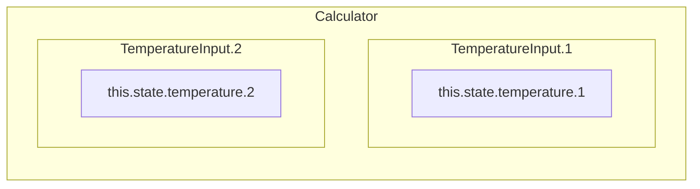
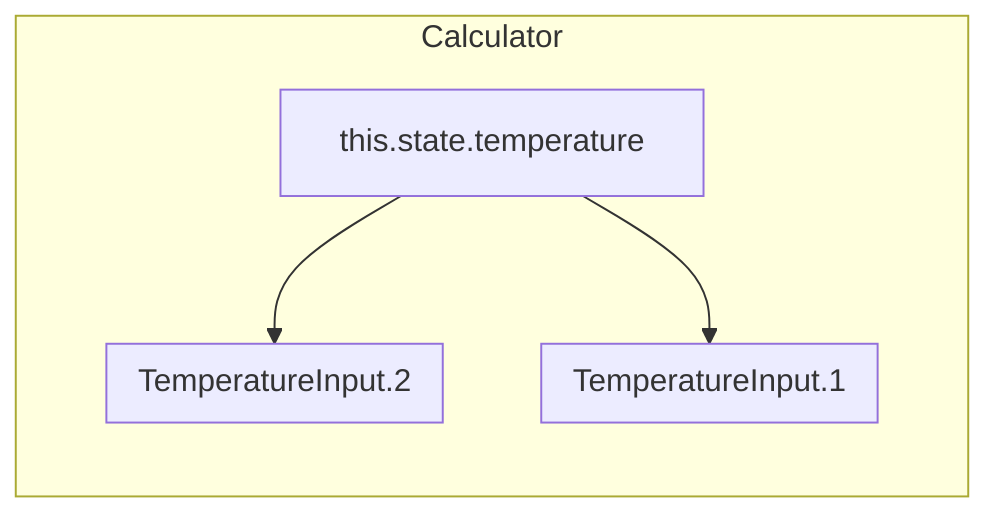

# React

## React

***

> 리액트처럼 사고하기 https://ko.reactjs.org/docs/thinking-in-react.html

### React는 무엇인가

* JavaScript 라이브러리
* Facebook에서 만든 오픈 소스 프로젝트
* 재사용 가능한 요소를 통해 UI를 효율적으로 빌드

#### React 프로젝트 시작하기

* 기본 주소: `localhost:3000`
* react 앱 시작하기

```bash
npx	create-react-app [project-name]
```

* 개발용 CDN 링크

```html
<script crossorigin src="https://unpkg.com/react@18/umd/react.development.js"></script>
<script crossorigin src="https://unpkg.com/react-dom@18/umd/react-dom.development.js"></script>
```

* 배포용 CDN 링크

```html
<script crossorigin src="https://unpkg.com/react@18/umd/react.production.min.js"></script>
<script crossorigin src="https://unpkg.com/react-dom@18/umd/react-dom.production.min.js"></script>
```

#### React 프로젝트 구조

* /public
* /node\_modules
* /src
  * App.js
  * index.js
  * index.css
* .gitignore
* package.json
* README.md

#### React 개발자 도구

리액트 디버깅 툴

https://github.com/facebook/react/tree/main/packages/react-devtools-extensions

### JSX

* JavaScript를 확장한 문법으로서 React 엘리먼트를 생성

#### JSX 에서 표현식 넣기

* `{}` 중괄호 안에서는 JavaScript 표현식을 사용할 수 있다.

```jsx
const name = 'John';
const element = <h1>My name is {name}</h1>;
```

#### JSX에서 속성 넣기

* `속성={값}` `속성="문자열"` 형태

```jsx
const color = "red"
const element = <h1 color="red">My name is {name}</h1>;
const element = <h1 color={color}>My name is {name}</h1>;
```

### 엘리먼트

* React 앱에서 사용되는 가장 작은 단위

#### 엘리먼트 렌더링

* `루트 DOM 노드`는 리액트 앱에서 일반적으로 하나지만, 기존 앱에 통합할 때 여러 개의 독립적인 `루트 DOM 노드`를 만들 수도 있다.
* 리액트 DOM이 `루트 DOM 노드` 아래의 모든 엘리먼트를 관리한다.

```html
<div id="root"></div>
```

* 따라서 리액트 DOM에게 `루트 DOM 노드`와 렌더링할 엘리먼트를 전달하여 렌더링을 지시한다.

```jsx
const root = ReactDOM.createRoot(
  document.getElementById('root')
);
const element = <h1>Hello, world</h1>;
root.render(element);
```

#### 변경된 부분만 업데이트

* 리액트 DOM은 현재 상태와 변경될 상태를 비교하여 변경이 필요한 부분만 업데이트한다.


### Components

#### Component 정의

* `props`를 입력으로 받아 React 엘리먼트를 반환
* 함수형 컴포넌트

```jsx
function Component(props) {
	return <h1> Component </h1>;
}
```

* 함수형 컴포넌트 - ES6 Arrow function 문법

```jsx
const Component = (props) => {
	return <h1> Component </h1>;
}
```

* 클래스 컴포넌트 - ES6 Class 문법

```jsx
class Component extends React.Component {
	render() {
		return <h1> Component </h1>;
	}
}
```

#### rendering

부모 컴포넌트가 리렌더링되면 모든 하위 컴포넌트가 리렌더링

#### props

* 상위 컴포넌트에서 전달받는 값
* `props`는 Read Only 값으로 컴포넌트에서 임의로 변경해서는 안된다.
* 따라서 순수함수를 통해 `props`를 다룬다.
* 함수형 컴포넌트에서는 `{props.속성명}`
* 클래스형 컴포넌트에서는 `{this.props.속성명}`

#### children prop 상속

* 자신 컴포넌트의 태그 사이로 들어오는 `content` 값으로
* `props.children`으로 사용

```jsx
<TitleContainer>
<h1>Title: React</h1>
</TitleContainer>
```

```jsx
const TitleContainer ({ chlidren }) => {
	return(
        <div className="TitleContainer">
            {children}
        </div>
        );
}
```

* 자신의 `content`로 어떤 자식 엘리먼트가 올 지 예측하기 어려울 때 그대로 출력으로 전달 할 수 있다.

#### 컴포넌트 구체화(특수화)

* `구체적인`컴포넌트 => `일반적인`컴포넌트를 렌더링
* 구체적인 컴포넌트(`WelcomeDialog`)에서`props`를 전달하여 일반적인 컴포넌트(`Dialog`) 구체화

```jsx
function WelcomeDialog() {
  return (
    <Dialog
      title="Welcome"
      message="Thank you for visiting our spacecraft!" />
  );
}
```

###

### Virtual DOM

> The virtual DOM (VDOM) is a programming concept where an ideal, or “virtual”, representation of a UI is kept in memory and synced with the “real” DOM by a library such as ReactDOM. This process is called [reconciliation](https://legacy.reactjs.org/docs/reconciliation.html). -react docs

가상 UI를 메모리에서 관리하고 이를 실제 DOM에 동기화하는 방식

`렌더 단계`: 컴포넌트를 렌더링하고 변경 사항을 계산

`커밋 단계`: 변경 사항을 DOM에 적용

가상DOM이라는 단어를 점점 안쓰는 추세이다. 컴포넌트가 항상 DOM을 나타내는 것도 아니다.

## Hooks

함수 컴포넌트에서 React state와 생명주기 기능(lifecycle features)을

“연동(hook into)“할 수 있게 해주는 함수

Class없이 React를 사용 -> 함수형 컴포넌트

> Hook은 계층의 변화 없이 상태 관련 로직을 재사용할 수 있도록 도와줍니다.

<figure><figcaption></figcaption></figure>

### Hook 2가지 규칙

* 최상위 레벨에서만 Hook 호출 (반복문, 조건문, 중첩된 함수 내 호출 X)
* React 함수 컴포넌트 또는 `Custom Hook` 내에서만 호출
* Hook 은 기능 단위로 여러 개 나누는 것이 좋다.

> 규칙을 지키기 위한 플러그인 https://www.npmjs.com/package/eslint-plugin-react-hooks

### Hook 발생 순서

1. React 렌더링
2. `useLayoutEffect` 호출
3. 브라우저 DOM에 실제 화면 그리기
4. `useEffect` 호출

### useState

* 비공개 값으로 컴포넌트에 의해 제어된다.
* `state(current state)`를 통해 접근하고, `setState(set function)`를 통해 변경할 수 있다.
* 배열 구조 분해를 통해 `state`값과 `state를 변경하는 함수`를 반환 받는다.

```jsx
const [state, setState] = useState(initialValue);
```

#### State 배치 처리

비동기적 특성을 가졌기 때문에 state는 즉시 반영되지 않는다.

만약 즉시 반영되게 된다면 onClick 함수에서 3번의 리렌더링이 발생해야 하는 낭비가 발생하게 된다.

```jsx
const [counter, setCounter] = useState(0);

const onClick = async () => {
  setCounter(counter + 1);
  setCounter(counter + 1);
  setCounter(counter + 1);
};
// 1
```

```jsx
const [counter, setCounter] = useState(0);

const onClick = async () => {
  setCounter(prevState => prevState + 1);
  setCounter(prevState => prevState + 1);
  setCounter(prevState => prevState + 1);
};
// 1
```

#### State 직접 수정하지 않기

* State를 변경하면 리액트는 변경 부분을 리렌더링하지만, 직접 변경(`this.state.value = "foo"`)하면 리렌더링하지 않는다.

```jsx
this.state.value = "foo" // 리렌더링X
```

```jsx
this.setState({value: "foo"}) //리렌더링O
```

#### State 이전 상태 기반 업데이트

* 업데이트되는 상태가 이전 상태를 필요로 하는 계산일 때, 이전 상태를 가져와서 계산한다

```jsx
addCount(count+1) // 
-> addCount(prevState => prevState + 1 )
updateUser(prevUser => {prevUser...,age: 20})
```

#### State 업데이트 - 비동기

* State와 props는 비동기적으로 업데이트될 수 있다 -> State 변경 시 의존하면 안된다.
* 객체 형태 보다는 함수 형태로 상태 업데이트를 전달한다.

```jsx
//Class형
<button onClick={() => this.setState({count: this.state.count + 1})}>
	button
</button>
```

```jsx
//Function형
<button onClick={() => setCount(count + 1)}>
    Click me
</button>
```

#### State 업데이트 - 병합(클래스형)

* React `this.state`는 State 변경 함수(`setState`)를 통해 받은 값과 기존 State를 병합한다.
* State에서 특정 변수에 대한 업데이트는 다른 변수에 영향을 주지 않는다.
* 따라서 변경되지 않는 state 값은 그대로 남아 있는다.

```jsx
//Class형
this.state = { a: "a", b: "b"}
<button onClick={() => this.setState({ a: "b" })}></button>
// state: { a: "c", b: "b" } b에는 영향이 없다.
```

#### State 업데이트 - 병합(함수형)

* 함수형 `useState`에서는 병합이 아닌 대체로 이루어진다.
* `state`의 일부를 변경하기 위해서 `...`연산자를 통해 전체와 변경 부분을 같이 전달한다.

```jsx
//Function형
const [state, setState] = usestate({ a: "a", b: "b" });
<button onClick={() => setState({ ...state, a: "C" })}></button>
// state: { a: "c", b: "b" } b에는 영향이 없다.
```

#### 하향식(단방향) 데이터 흐름

* State는 어느 컴포넌트의 소유이며, State로부터 나온 UI나 데이터는 오직 **하위 컴포넌트**에 영향
* 컴포넌트는 자신의 State를 자식 컴포넌트의 props로 전달 할 수 있다.

#### State 끌어올리기

* `State`는 하위 컴포넌트로만 전달이 가능하기 때문에 다른 컴포넌트와 `State`를 공유하기 위해 공통 조상으로 `State`를 끌어 올려 사용한다.



```jsx
class Calculator extends React.Component {
  render() {
    return (
      <div>
        <TemperatureInput scale="c" />
        <TemperatureInput scale="f" />
      </div>
    );
  }
}
```

* `state.temperature` 끌어 올리기
  * state와 setState 함수를 자식 컴포넌트 props로 전달하여
  * 공통 조상에서 State를 관리

```jsx
class Calculator extends React.Component {
...
    this.state = {temperature: '', scale: 'c'};
...
  render() {
...
    return (
      <div>
        <TemperatureInput
          scale="c"
          temperature={celsius}
          onTemperatureChange={this.handleCelsiusChange} />
        <TemperatureInput
          scale="f"
          temperature={fahrenheit}
          onTemperatureChange={this.handleFahrenheitChange} />
        <BoilingVerdict
          celsius={parseFloat(celsius)} />
      </div>
    );
  }
}
```



#### State를 찾는 3가지 질문

1. 부모로부터 props를 통해 전달됩니까? 그러면 확실히 state가 아닙니다.
2. 시간이 지나도 변하지 않나요? 그러면 확실히 state가 아닙니다.
3. 컴포넌트 안의 다른 state나 props를 가지고 계산 가능한가요? 그렇다면 state가 아닙니다.

* \-> https://ko.reactjs.org/docs/thinking-in-react.html

### useEffect

* 함수형 컴포넌트 안에서 데이터 조작, DOM 조작과 같은 `side effects`를 실행
* React class의 `componentDidMount` 나 `componentDidUpdate`, `componentWillUnmount` 를 수행
* `clean-up`이 필요한 side effect와 필요없는 side effect로 나뉜다.

> Hook는 `생명주기 메서드`와 달리 코드가 무엇을 하는지에 따라 나눌 수 있어 읽기 쉽다.

#### 기본 사용법

* 첫 번째 렌더링(`componentDidMount()`)과 이후 모든 업데이트(`componentDidUpdate()`)시 실행

```jsx
//첫 번째 렌더링과 이후 모든 업데이트 시 실행 
useEffect(() => {
    console.log("Updated")
  });
```

#### clean-up이 필요한 effect

*   **이벤트 리스너, 데이터 구독**과 같은 초기 설정, 마지막 설정이 필요한 경우를

    clean-up이 필요한 effect로 볼 수 있다.
* 엘리먼트를 마운트할 떄와 언마운트 할 때 두 가지 시점으로 볼 수 있다.

```jsx
//Class형
componentDidMount() {ChatAPI.subscribeToFriendStatus(...)}
componentWillUnmount() { ChatAPI.unsubscribeFromFriendStatus(...)}
```

* 함수형에서는 `return` 반환 값을 통해 정리를 위한 함수를 전달하여 언마운트 시 실행한다.

```jsx
//Function형
useEffect(() => {
    ChatAPI.subscribeToFriendStatus(...);
    return function cleanup() {
      ChatAPI.unsubscribeFromFriendStatus(props.friend.id, handleStatusChange);
    };
  });
```

#### 데이터 변경을 감지하여 Effect 실행

* 기존의 클래스형에서는 이전의 상태(`prevProps, prevState`)와 현재 상태 비교를 통해 변화를 감지하여 실행할 수 있다.

```jsx
//Class형
componentDidUpdate(prevProps, prevState) {
  if (prevState.count !== this.state.count) {
    document.title = `You clicked ${this.state.count} times`;
  }
}
```

* `useEffect`에서는 \*\*`의존 관계 배열`\*\*을 통한 배열의 요소가 변경되었을 때만 실행하도록 할 수 있다.

```jsx
useEffect(() => {
  document.title = `You clicked ${count} times`;
}, [count]); // count가 바뀔 때만 effect를 재실행합니다.
```

### useMemo

함수에 의해 반환된 값을 메모이제이션하여 반환

💥불필요한 함수 재호출 방지💥

```jsx
const memoizedValue = useMemo(() => computeExpensiveValue(a, b), [a, b]);
```

* `useMemo()`는 콜백함수에 의해 계산된 값을 기억하고 있다가 `의존 관계 배열`이 변경될 때만 실행되어 계산된 값을 반환한다.
* 함수형 컴포넌트를 쓰는 react에서는
* useMemo를 컴포넌트에 사용하여 컴포넌트의 불필요한 리렌더링을 방지한다.

```jsx
const WordCount = ({ children= ""}) => {
    //const words = children; // 렌더링마다 선언되어 useEffect가 실행됨
	const words = useMemo(() => children.split(" "), [children]);
    
    useEffect(() => {
	console.log("fresh render");
	},[words]);
    return (...);
}
```

### useCallback

함수 자체를 메모이제이션하여 반환

💥불필요한 함수 재정의 방지💥

```javascript
const cachedFn = useCallback(fn, dependencies)
```

* 아래 함수는 isOpen 불리언값을 전달받아 false일 경우 onClose()를 호출한다
* 함수내에서 호출되는 onClose()함수가 같다면
* 매번 리렌더링 시 불필요한 함수 재정의를 하지 않도록 하면 성능을 최적화할 수 있다
* `useCallback`은 의존 배열 전달 받아 `의존 관계 배열`에 속하는 값이 변경되었을 때만 함수를 재정의한다.

```typescript
 const handleOpenChange = React.useCallback(
    (isOpen: boolean) => {
      if (!isOpen) {
        onClose?.();
      }
    },
    [onClose],
  );
```

### useMemo vs useCallBack

두 가지 모두 메모이제이션을 한다는 관점에서 리렌더링을 방지하여

성능 최적화를 하는 hooks이다

* `useMemo`는 함수 결과를 메모이제이션한다.
* `useCallback`은 함수 자체를 메모이제이션한다.

### useLayoutEffect

* useEffect와 동일하지만 모든 DOM이 변경된 후, 브라우저가 화면을 그리기 이전에 동기적으로 실행
* 일반적으로 화면 레이아웃과 관련된 작업을 수행하는데 사용

```jsx
const useWindowSize = () => {
    const [width, setWidth] = useState(0);
    const [height, setHeight] = useState(0);
    
    const resize = () => {
		setWidth(window.innerWidth);
    	setHeight(window.innerHeight);
    }
    
    useLayoutEffect(() => {
		window.adddEventListener("resize", resize);
    	resize();
    	return () => window.removeEventListener("resize", resize);
    }, []);
    
    return [width,height];
}
```

### useReducer

* `Array.reduce`처럼 현재 상태를 사용해 새로운 상태를 업데이트하는 함수
* `dispatch(action)`를 호출 -> `reducer(state,action)` 수행-> New State 업데이트
* `reducer`는 현재 상태(state)와 액션 객체(action)를 통해 다음 상태를 업데이트
* `action`의 `type`값은 대문자와 언더스코어(\_)로 작성

```jsx
const initialState = {count: 0};

function reducer(state, action) {
  switch (action.type) {
    case 'increment':
      return {count: state.count + 1};
    case 'decrement':
      return {count: state.count - 1};
    default:
      throw new Error();
  }
}

function Counter() {
  const [state, dispatch] = useReducer(reducer, initialState);
  return (
    <>
      Count: {state.count}
      <button onClick={() => dispatch({type: 'decrement'})}>-</button>
      <button onClick={() => dispatch({type: 'increment'})}>+</button>
    </>
  );
}
```

#### useReducer를 통한 State 병합

* 위에서 State를 병합하는 방법으로 setState(...state,newState)를 사용하였다.
* 하지만 코드를 실수로 setState(newState)와 같이 작성하면 state가 전부 대체될 위험이 있다.
* `useReducer()`를 통해 이를 방지하고, State 병합을 쉽게 할 수 있다.

```jsx
const foo = { name: "foo", age: 20 };
const [user, setUser] = useState(foo); 
//age 변경
setUser({ age: 22}); // user -> { age: 22 }
setUser({ ...user, age: 22 }); // user -> { name: "foo", age: 22 }
```

```jsx
// useReducer를 통한 age 변경
const [user, setUser] = useReducer(
	(user,Changes) => ({...user, ...Changes}),
	foo
);
setUser({ age: 22 }); // user -> { name: "foo", age: 22 }
```

## 렌더링


```jsx
// ❌ 매번 새로운 ChildCo// ❌ BAD!mponent 참조를 생성
function ParentComponent() {
  function ChildComponent() {
    return <div>Hi</div>;
  }

  return <ChildComponent />;
}
```

```
// ✅ 다른 컴포넌트로 분리하여 사용
function ParentComponent() {
  function ChildComponent() {
    return <div>Hi</div>;
  }

  return <ChildComponent />;
}
```

### 이벤트 처리

* 캐멀 케이스 사용
* 함수로 이벤트 핸들러 전달

```jsx
<button onClick={activateLasers}>
  Activate Lasers
</button>
```

* `false` 반환 만으로 기본 동작이 방지 되지 않는다. -> `preventDefault()` 호출 필요

### 조건부 렌더링

#### if 문 조건에 따른 렌더링

```jsx
if(isLogged) {
	<h1>로그인 상태</h1>
} else {
	<h1>로그아웃 상태</h1>
}
```

#### && 연산자 렌더링

* `&&`앞의 조건이 `true`일 때 뒤의 엘리먼트가 출력
* `true && expression` -> `expression`
* `false && expression` -> false

```jsx
{ isLogged && <h1> 로그인 상태입니다.</h1>}
```

#### 삼항 연산자 렌더링

* `condition` ? `exprIfTrue` : `exprIfFalse`
* ```jsx
  {isLogged ? '로그인 상태' : '로그아웃 상태'}
  ```

#### 렌더링 안하기

* 엘리먼트가 아닌 `null`을 반환하여 렌더링을 막을 수 있다.

```jsx
const LoginBanner = (props) => {
	if(!isLogged) {
		return null;
	}
	return (
        <div>
        로그인 상태입니다.
        </div>)
}
```

### 리스트와 key

#### 배열로 컴포넌트 렌더링

* `map()`함수를 통해 리스트를 각각 엘리먼트로 만들어 반환
* `key` 필요 -> 명시하지 않으면 map 함수의 index를 사용

```jsx
item = [2,4,6,8]
return(
    <ul>
        {items.map((item,index) => <li key={index}>{item}</li>)}
    </ul>)
```

#### Key

* React가 배열 요소의 식별을 위해 사용하는 값
* 고유하게 식별할 수 있는 문자열을 지정
* 요소 삭제, 변경에 따른 순서 변경이 일어날 수 있는 경우 인덱스 값 사용은 피하는 것이 좋다

```jsx
// ❌ 2번 인덱스의 6이 사라졌지만 리액트는 8이 사라진 것으로 생각할 수 있다
item = [2,4,6,8]
item = item.splice(2,1) // [2,4,8]
return(
    <ul>
        {items.map((item,index) => <li key={index}>{item}</li>)}
    </ul>)

```

* `map()`가 반환하는 엘리먼트 혹은 컴포넌트에 key값을 지정
* `key`값은 같은 배열 안에서만 고유하면 되며, 다른 배열의 `key` 값과 같은 값이 있어도 사용할 수 있다.

```jsx
const Item = (props) => {
    return <li>{props.children}</li>
}
const item = [2,4,6,8]
return(
    <ul>
        {items.map((item,index) => 
        	<Item key={item.toString()}>{item}</Item>
        )}
    </ul>)
```

* `key` 값이 props를 넘기는 것 처럼 보이지만 `props`는 아니다.
* 컴포넌트로 `key`값을 `props`로 넘기고 싶다면, `key`와 같은 다른 `prop`를 명시하여 전달

### React.memo

* 고차 컴포넌트 형태로 사용
* props가 동일하면 마지막으로 렌더링된 결과를 재사용하여 성능을 최적화
* props는 **얕은 비교**로 수행되고, 두 번째 인자로 비교 함수를 지정할 수 있다.
* 비교함수가 true를 반환하면 같은 상태로 간주하고, false를 반환하면 다시 렌더링된다.

> 함수를 props로 전달하면 함수가 매번 새로운 함수로 정의되어 다시 렌더링된다.
>
> 이럴 때는 비교함수를 통해 구체적인 규칙을 지정할 수 있다.

```jsx
function MyComponent(props) {
  /* props를 사용하여 렌더링 */
}
function areEqual(prevProps, nextProps) {
  /*
  nextProps가 prevProps와 동일한 값을 가지면 true를 반환하고, 그렇지 않다면 false를 반환
  */
}
export default React.memo(MyComponent); 
//export default React.memo(MyComponent, areEqual);
```

### 폼

#### 제어 컴포넌트

* HTML에서의 폼은 엘리먼트 자체가 내부 상태를 가진다
* React에서는 `State`를 사용해 \*\*`신뢰 가능한 단일 출처`\*\*를 통해 제어된다.

#### 기본적인 Input 사용법

```jsx
<input type="text" value={value} onChange={handleChange} />
<textarea value={this.state.value} onChange={this.handleChange} />
<select value={this.state.value} onChange={this.handleChange}>
            <option value="grapefruit">Grapefruit</option>
            <option value="lime">Lime</option>
            <option value="coconut">Coconut</option>
            <option value="mango">Mango</option>
</select>
<select multiple={true} value={['grapefruit', 'lime']}>
```

#### file Input

* 읽기 전용 값으로 React에서 비제어 컴포넌트

#### 핸들링 함수 재사용

* `input`의 `name` 속성과 `State`의 키값을 동일하게 사용

```jsx
handleInputChange(event) {
    const target = event.target;
    const value = target.type === 'checkbox' ? target.checked : target.value;
    const name = target.name;

    this.setState({
      [name]: value
    });
  }
```

#### Input Null값 조심하기

* `input`의 value `prop`으로 `null`이나 `undefined`를 넘기지 않아야 한다.

```jsx
 const [value, setValue] = useState("");
    const handleSubmit = () => {
      alert(value)
    }
      return (
        <form onSubmit={handleSubmit}>
          <label>
            Name:
            <input type="text" value={value} onChange={(e) => 						         setValue(e.target.value)} />
          </label>
          <input type="submit" value="Submit" />
        </form>
      );
```

#### 폼 라이브러리

https://formik.org/

## 외부 데이터

> HTTP 요청과 Promise에는 3가지 상태 진행중, 성공,실패가 있다.
>
> 반드시 3가지 상태에 대해 모두 처리를 해야 한다.

### fetch() 로 가져오기

* `useEffect()` -> `fetch()`
* `useState()` ->

```jsx
import React, { useState, useEffect } from "react";
const GitHubUser = ({ username }) => {
  const [data, setData] = useState();

  useEffect(() => {
    if (!login) return;
    fetch(`https://api.github.com/users/${login}`)
      .then((res) => res.json())
      .then(setData)
      .catch(console.error);
  }, [login]);
  if (data) return <pre>{JSON.stringify(data, null, 2)}</pre>;
  return null;
};

export default GitHubUser;
```

### 로컬 스토리지로 가져오기

* key값을 사용해 문자열 형태로 저장
* 객체 저장 => JSON 문자열로 저장
* 객체 불러오기 => JSON 문자열 파싱

> 모두 동기적인 작업이므로 성능에 영향을 미친다.

```javascript
const loadJSON = key =>
	key && JSON.parse(localStorage.getItem(key));
const saveJSON = (key, data) => 
	localStorage.setItem(key, JSON.stringify(data));
```

```jsx
const [data, setData] = useState(loadJSON(`user: ${login}`));
useEffect(() => {
	if(!data) return;
	if (data.login === login) return;
	const {name, avatar_url, location} = data;
	saveJSON(`user: ${login}`, {
		name, 
		login,
		avatar_url,
		location,
	});
}, [data]);
```

### Context

* 컴포넌트 트리 전체에 데이터를 제공
* 전역적인 데이터를 공유하기 위한 방법
* ex. 현재 로그인 유저, 테마, 선호하는 언어 등
* 실제 사용되는 곳은 최하위 컴포넌트인데 props로 계속 내려 받는 것은 비효율적이기 때문
* ```react
  const MyContext = React.createContext(defaultValue);
  ```

#### `Context.Provider`

* 리액트 context에 데이터를 넣는 곳
* context를 구독하는 컴포넌트에게 context의 변화를 알림

```react
<MyContext.Provider value={/* 어떤 값 */}>
```

#### `Context.Consumer`

* 리액트 context로 부터 데이터를 가져오는 곳
* context 변화를 구독하는 컴포넌트.
* 상위 컴포넌트 중 가장 가까운 `Provider`컴포넌트가 전달하는 데이터를 사용
* `Context.Consumer`의 자식은 함수로서 context의 현재값을 받아 -> React 노드를 반환

```react
<MyContext.Consumer>
  {value => /* context 값을 이용한 렌더링 */}
</MyContext.Consumer>
```

## Render Props

* 렌더링되는 프로퍼티
* 무엇을 렌더링할지 알려주는 함수
* 컴포넌트 재사용성을 올릴 수 있다.

```jsx
<List 
    data ={data}
    renderItem={item => (<li>item.name</li>)} 
/>

const List ({ render,data }) => {
    return (
        <ul>
            {data.map((item,idx) => renderItem(item))}
        </ul>)
}
```

https://ko.reactjs.org/docs/render-props.html

## 목록 가상화

https://ko.reactjs.org/docs/optimizing-performance.html#virtualize-long-lists

## 스타일링

### 클래스

#### 클래스 동적으로 할당하기

```jsx
<div className={`body` ${isOpen ? 'open' : ''}}></div>
```
