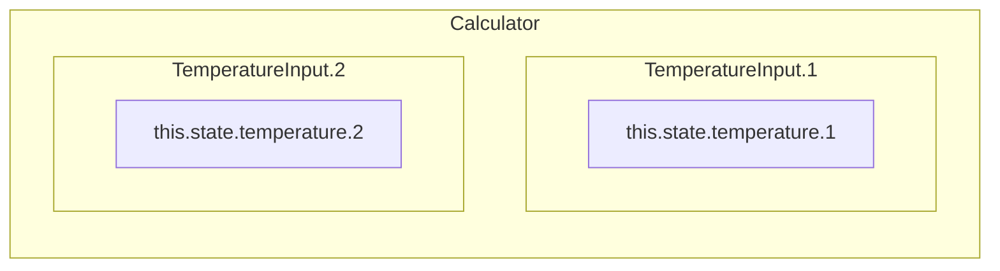
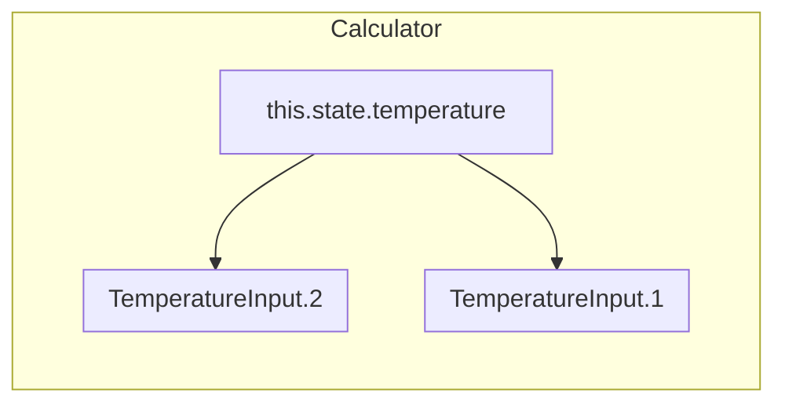

# React Hooks

## Hooks

함수 컴포넌트에서 React state와 생명주기 기능(lifecycle features)을

“연동(hook into)“할 수 있게 해주는 함수

Class없이 React를 사용 -> 함수형 컴포넌트

> Hook은 계층의 변화 없이 상태 관련 로직을 재사용할 수 있도록 도와줍니다.

<figure><figcaption></figcaption></figure>

### Hook 2가지 규칙

* 최상위 레벨에서만 Hook 호출 (반복문, 조건문, 중첩된 함수 내 호출 X)
* React 함수 컴포넌트 또는 `Custom Hook` 내에서만 호출
* Hook 은 기능 단위로 여러 개 나누는 것이 좋다.

> 규칙을 지키기 위한 플러그인 https://www.npmjs.com/package/eslint-plugin-react-hooks

### Hook 발생 순서

1. React 렌더링
2. `useLayoutEffect` 호출
3. 브라우저 DOM에 실제 화면 그리기
4. `useEffect` 호출

### useState

* 비공개 값으로 컴포넌트에 의해 제어된다.
* `state(current state)`를 통해 접근하고, `setState(set function)`를 통해 변경할 수 있다.
* 배열 구조 분해를 통해 `state`값과 `state를 변경하는 함수`를 반환 받는다.

```jsx
const [state, setState] = useState(initialValue);
```

#### 불변성을 지키면서 업데이트하기

리액트에서 상태 업데이트는 **항상 불변**하게 수행되어야 한다

불변하지 않으면, 상태를 업데이트 했지만 리렌더링이 되지 않은 상황이 발생할 수 있다

```jsx
const [todos, setTodos] = useState([
    { name: 1, completed: false },
    { name: 2, completed: false },
    { name: 3, completed: false }
  ]);

// ❌ 리렌더링되지 않음
const onClick = () => {
  todos[2].completed = true;
  setTodos(todos);
};

// ✅  얕은 복사를 통해 가장 바깥 참조를 불변하게 업데이트하여 리렌더링
const onClick2 = () => {
  const newTodos = todos.slice();
  newTodos[2].completed = true;
  setTodos(newTodos);
};

// ✅  얕은 복사를 통해 가장 바깥 참조를 불변하게 업데이트하여 리렌더링
const onClick3 = () => {
  setTodos((prev) => {
    const newTodos = prev.slice();
    newTodos[2].completed = true;
    return newTodos;
  });
};
```

#### State 배치 처리

비동기적 특성을 가졌기 때문에 state는 즉시 반영되지 않는다.

만약 즉시 반영되게 된다면 onClick 함수에서 3번의 리렌더링이 발생해야 하는 낭비가 발생하게 된다.

```jsx
const [counter, setCounter] = useState(0);

const onClick = async () => {
  setCounter(counter + 1);
  setCounter(counter + 1);
  setCounter(counter + 1);
};
// 1
```

```jsx
const [counter, setCounter] = useState(0);

const onClick = async () => {
  setCounter(prevState => prevState + 1);
  setCounter(prevState => prevState + 1);
  setCounter(prevState => prevState + 1);
};
// 1
```

#### State 직접 수정하지 않기

* State를 변경하면 리액트는 변경 부분을 리렌더링하지만, 직접 변경(`this.state.value = "foo"`)하면 리렌더링하지 않는다.

```jsx
this.state.value = "foo" // 리렌더링X
```

```jsx
this.setState({value: "foo"}) //리렌더링O
```

#### State 이전 상태 기반 업데이트

* 업데이트되는 상태가 이전 상태를 필요로 하는 계산일 때, 이전 상태를 가져와서 계산한다

```jsx
addCount(count+1) // 
-> addCount(prevState => prevState + 1 )
updateUser(prevUser => {prevUser...,age: 20})
```

#### State 업데이트 - 비동기

* State와 props는 비동기적으로 업데이트될 수 있다 -> State 변경 시 의존하면 안된다.
* 객체 형태 보다는 함수 형태로 상태 업데이트를 전달한다.

```jsx
//Class형
<button onClick={() => this.setState({count: this.state.count + 1})}>
	button
</button>
```

```jsx
//Function형
<button onClick={() => setCount(count + 1)}>
    Click me
</button>
```

#### State 업데이트 - 병합(클래스형)

* React `this.state`는 State 변경 함수(`setState`)를 통해 받은 값과 기존 State를 병합한다.
* State에서 특정 변수에 대한 업데이트는 다른 변수에 영향을 주지 않는다.
* 따라서 변경되지 않는 state 값은 그대로 남아 있는다.

```jsx
//Class형
this.state = { a: "a", b: "b"}
<button onClick={() => this.setState({ a: "b" })}></button>
// state: { a: "c", b: "b" } b에는 영향이 없다.
```

#### State 업데이트 - 병합(함수형)

* 함수형 `useState`에서는 병합이 아닌 대체로 이루어진다.
* `state`의 일부를 변경하기 위해서 `...`연산자를 통해 전체와 변경 부분을 같이 전달한다.

```jsx
//Function형
const [state, setState] = usestate({ a: "a", b: "b" });
<button onClick={() => setState({ ...state, a: "C" })}></button>
// state: { a: "c", b: "b" } b에는 영향이 없다.
```

#### 하향식(단방향) 데이터 흐름

* State는 어느 컴포넌트의 소유이며, State로부터 나온 UI나 데이터는 오직 **하위 컴포넌트**에 영향
* 컴포넌트는 자신의 State를 자식 컴포넌트의 props로 전달 할 수 있다.

#### State 끌어올리기

* `State`는 하위 컴포넌트로만 전달이 가능하기 때문에 다른 컴포넌트와 `State`를 공유하기 위해 공통 조상으로 `State`를 끌어 올려 사용한다.



```jsx
class Calculator extends React.Component {
  render() {
    return (
      <div>
        <TemperatureInput scale="c" />
        <TemperatureInput scale="f" />
      </div>
    );
  }
}
```

* `state.temperature` 끌어 올리기
  * state와 setState 함수를 자식 컴포넌트 props로 전달하여
  * 공통 조상에서 State를 관리

```jsx
class Calculator extends React.Component {
...
    this.state = {temperature: '', scale: 'c'};
...
  render() {
...
    return (
      <div>
        <TemperatureInput
          scale="c"
          temperature={celsius}
          onTemperatureChange={this.handleCelsiusChange} />
        <TemperatureInput
          scale="f"
          temperature={fahrenheit}
          onTemperatureChange={this.handleFahrenheitChange} />
        <BoilingVerdict
          celsius={parseFloat(celsius)} />
      </div>
    );
  }
}
```



#### State를 찾는 3가지 질문

1. 부모로부터 props를 통해 전달됩니까? 그러면 확실히 state가 아닙니다.
2. 시간이 지나도 변하지 않나요? 그러면 확실히 state가 아닙니다.
3. 컴포넌트 안의 다른 state나 props를 가지고 계산 가능한가요? 그렇다면 state가 아닙니다.

* \-> https://ko.reactjs.org/docs/thinking-in-react.html

### useEffect

* 함수형 컴포넌트 안에서 데이터 조작, DOM 조작과 같은 `side effects`를 실행
* React class의 `componentDidMount` 나 `componentDidUpdate`, `componentWillUnmount` 를 수행
* `clean-up`이 필요한 side effect와 필요없는 side effect로 나뉜다.

> Hook는 `생명주기 메서드`와 달리 코드가 무엇을 하는지에 따라 나눌 수 있어 읽기 쉽다.

#### 기본 사용법

* 첫 번째 렌더링(`componentDidMount()`)과 이후 모든 업데이트(`componentDidUpdate()`)시 실행

```jsx
//첫 번째 렌더링과 이후 모든 업데이트 시 실행 
useEffect(() => {
    console.log("Updated")
  });
```

#### clean-up이 필요한 effect

* **이벤트 리스너, 데이터 구독**과 같은 초기 설정, 마지막 설정이 필요한 경우를

  clean-up이 필요한 effect로 볼 수 있다.

* 엘리먼트를 마운트할 떄와 언마운트 할 때 두 가지 시점으로 볼 수 있다.

```jsx
//Class형
componentDidMount() {ChatAPI.subscribeToFriendStatus(...)}
componentWillUnmount() { ChatAPI.unsubscribeFromFriendStatus(...)}
```

* 함수형에서는 `return` 반환 값을 통해 정리를 위한 함수를 전달하여 언마운트 시 실행한다.

```jsx
//Function형
useEffect(() => {
    ChatAPI.subscribeToFriendStatus(...);
    return function cleanup() {
      ChatAPI.unsubscribeFromFriendStatus(props.friend.id, handleStatusChange);
    };
  });
```

#### 데이터 변경을 감지하여 Effect 실행

* 기존의 클래스형에서는 이전의 상태(`prevProps, prevState`)와 현재 상태 비교를 통해 변화를 감지하여 실행할 수 있다.

```jsx
//Class형
componentDidUpdate(prevProps, prevState) {
  if (prevState.count !== this.state.count) {
    document.title = `You clicked ${this.state.count} times`;
  }
}
```

* `useEffect`에서는 \*\*`의존 관계 배열`\*\*을 통한 배열의 요소가 변경되었을 때만 실행하도록 할 수 있다.

```jsx
useEffect(() => {
  document.title = `You clicked ${count} times`;
}, [count]); // count가 바뀔 때만 effect를 재실행합니다.
```

### useMemo

함수에 의해 반환된 값을 메모이제이션하여 반환

💥불필요한 함수 재호출 방지💥

```jsx
const memoizedValue = useMemo(() => computeExpensiveValue(a, b), [a, b]);
```

* `useMemo()`는 콜백함수에 의해 계산된 값을 기억하고 있다가 `의존 관계 배열`이 변경될 때만 실행되어 계산된 값을 반환한다.
* 함수형 컴포넌트를 쓰는 react에서는
* useMemo를 컴포넌트에 사용하여 컴포넌트의 불필요한 리렌더링을 방지한다.

```jsx
const WordCount = ({ children= ""}) => {
    //const words = children; // 렌더링마다 선언되어 useEffect가 실행됨
	const words = useMemo(() => children.split(" "), [children]);
    
    useEffect(() => {
	console.log("fresh render");
	},[words]);
    return (...);
}
```

### useCallback

함수 자체를 메모이제이션하여 반환

💥불필요한 함수 재정의 방지💥

```javascript
const cachedFn = useCallback(fn, dependencies)
```

* 아래 함수는 isOpen 불리언값을 전달받아 false일 경우 onClose()를 호출한다
* 함수내에서 호출되는 onClose()함수가 같다면
* 매번 리렌더링 시 불필요한 함수 재정의를 하지 않도록 하면 성능을 최적화할 수 있다
* `useCallback`은 의존 배열 전달 받아 `의존 관계 배열`에 속하는 값이 변경되었을 때만 함수를 재정의한다.

```typescript
 const handleOpenChange = React.useCallback(
    (isOpen: boolean) => {
      if (!isOpen) {
        onClose?.();
      }
    },
    [onClose],
  );
```

### useMemo vs useCallBack

두 가지 모두 메모이제이션을 한다는 관점에서 리렌더링을 방지하여

성능 최적화를 하는 hooks이다

* `useMemo`는 함수 결과를 메모이제이션한다.
* `useCallback`은 함수 자체를 메모이제이션한다.

### useLayoutEffect

* useEffect와 동일하지만 모든 DOM이 변경된 후, 브라우저가 화면을 그리기 이전에 동기적으로 실행
* 일반적으로 화면 레이아웃과 관련된 작업을 수행하는데 사용

```jsx
const useWindowSize = () => {
    const [width, setWidth] = useState(0);
    const [height, setHeight] = useState(0);
    
    const resize = () => {
		setWidth(window.innerWidth);
    	setHeight(window.innerHeight);
    }
    
    useLayoutEffect(() => {
		window.adddEventListener("resize", resize);
    	resize();
    	return () => window.removeEventListener("resize", resize);
    }, []);
    
    return [width,height];
}
```

### useReducer

* `Array.reduce`처럼 현재 상태를 사용해 새로운 상태를 업데이트하는 함수
* `dispatch(action)`를 호출 -> `reducer(state,action)` 수행-> New State 업데이트
* `reducer`는 현재 상태(state)와 액션 객체(action)를 통해 다음 상태를 업데이트
* `action`의 `type`값은 대문자와 언더스코어(\_)로 작성

```jsx
const initialState = {count: 0};

function reducer(state, action) {
  switch (action.type) {
    case 'increment':
      return {count: state.count + 1};
    case 'decrement':
      return {count: state.count - 1};
    default:
      throw new Error();
  }
}

function Counter() {
  const [state, dispatch] = useReducer(reducer, initialState);
  return (
    <>
      Count: {state.count}
      <button onClick={() => dispatch({type: 'decrement'})}>-</button>
      <button onClick={() => dispatch({type: 'increment'})}>+</button>
    </>
  );
}
```

#### useReducer를 통한 State 병합

* 위에서 State를 병합하는 방법으로 setState(...state,newState)를 사용하였다.
* 하지만 코드를 실수로 setState(newState)와 같이 작성하면 state가 전부 대체될 위험이 있다.
* `useReducer()`를 통해 이를 방지하고, State 병합을 쉽게 할 수 있다.

```jsx
const foo = { name: "foo", age: 20 };
const [user, setUser] = useState(foo); 
//age 변경
setUser({ age: 22}); // user -> { age: 22 }
setUser({ ...user, age: 22 }); // user -> { name: "foo", age: 22 }
```

```jsx
// useReducer를 통한 age 변경
const [user, setUser] = useReducer(
	(user,Changes) => ({...user, ...Changes}),
	foo
);
setUser({ age: 22 }); // user -> { name: "foo", age: 22 }
```

## 