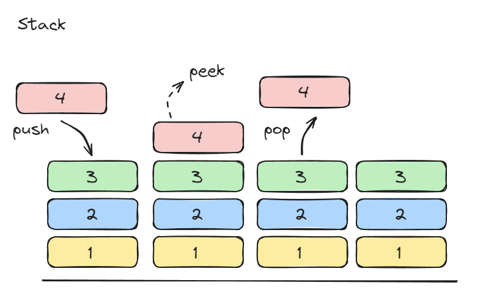

# STACK



스택은 접시가 아래에서 부터 쌓이는 것 처럼 요소가 추가되고 제거되는 순서는 후입선출(Last In First Out) 방식에 따라 이루어진다.

- Push: 컬렉션에 요소를 추가합니다
- Pop: 가장 최근에 추가된 요소를 제거하고 반환합니다
- Peek: 가장 최근에 추가된 요소를 반환합니다

```javascript
class Stack {
  constructor(maxSize = 10) {
    this.storage = [];
    this.top = -1;
    this.maxSize = maxSize;
  }

  push(element) {
    if (this.isFull()) {
      return false;
    }
    this.storage[++this.top] = element;
    return true;
  }

  pop() {
    return this.isEmpty() ? false : this.storage[this.top--];
  }

  isFull() {
    return this.top === this.maxSize - 1;
  }

  isEmpty() {
    return this.top === -1;
  }

  peek() {
    return this.isEmpty() ? false : this.storage[this.top];
  }
    
  size() {
    return this.top + 1;
  }
}
```

