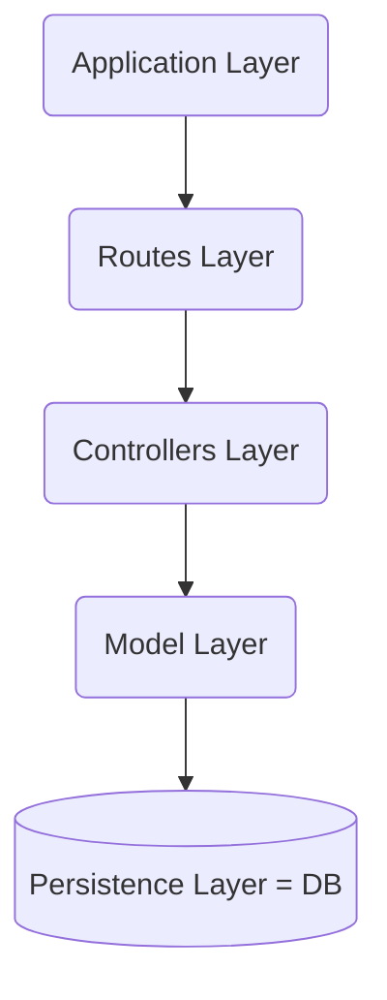

## REST API 특성

- Stateless: 각 요청은 필요한 모든 정보를 가지고 있다.
- Resource-based: 리소스를 기반으로 고유한 URI로 식별되며, HTTP 메서드를 사용하여 액세스한다
- Uniform Interface: 클라이언트는 표준화된 메서드와 응답 형식을 사용하여 상호작용한다
- Cacheable: 응답을 캐싱하여 성능을 향상시키고 네트워크 트래픽을 줄일 수 있다
- Layered System: 전체 시스템에 영향을 주지 않고 클라이언트와 서버 사이에 중재자를 추가할 수 있다


## 명확한 네이밍

post-> 게시글에 대한 컬렉션이므로 복수형 사

```
/post/123 -> /posts/123
```


## HTTP METHOD

멱등성: 서버에 보낸 동일한 요청이 한 번 보낼 때와 여러 번 보낼 때 같은 효과를 만들 때 멱등성을 가진다

안전성: 리소스를 변경하지 않는 메서드는 안전성을 가진다

| Method  | Request body / Response body | Safe | Idempotent |
| ------- | ---------------------------- | ---- | ---------- |
| CONNECT | No / Yes                     | No   | No         |
| DELETE  | May / May                    | No   | **Yes**    |
| GET     | No / Yes                     | Yes  | **Yes**    |
| HEAD    | No / No                      | Yes  | **Yes**    |
| OPTIONS | No / Yes                     | Yes  | **Yes**    |
| PATCH   | Yes / Yes                    | No   | No         |
| POST    | Yes / Yes                    | No   | No         |
| PUT     | Yes / No                     | No   | **Yes**    |
| TRACE   | No / Yes                     | Yes  | **Yes**    |


## API Versioning

이미 API를 사용하고 있는 애플리케이션이 있을 때 API를 중단시키지 않고 API를 변경하기 위한 버전 관리

개발자는 자신의 일정에 따라 선택적으로 api 버전을 업그레이드하고, 이전 버전은 여전히 사용 가능

`api/v1` -> `api/v2` -> `api/v3`


## Pagination

데이터 목록을 보여줄 때는 모든 데이터를 한 번에 주지 않도록 페이지네이션을 사용해야 한다

### offset based

`page`와 `page_size`를 사용

### cursor based

`cursor`와 `limit`를 사용


## filter,sort

query string을 사용하여 리소스에 대한 필터와 정렬 기능을 수행

`?sort_by=price` 가격 순으로 정렬

`?filter=color:red` 빨간 색만 필터링


## TLS 암호화

민감한 자격 증명은 `Authorization`와 같은 HTTP 헤더를 사용하여 전달

TLS 암호화를 통해 엔드투엔드 전송을 보호


## API rate limit


## Wire model vs storage model

### Wire model(와이어 모델)

서버 ↔ 클라이언트 통신 시에 사용하는 데이터 모델

: 이 용어는 일반적으로 네트워크 통신을 위해 데이터를 표현하는 모델을 가리킵니다. 데이터를 전송하기 위해 사용되는 프로토콜에 따라 데이터의 형식이 결정됩니다. 예를 들어, 웹 서비스에서는 JSON(JavaScript Object Notation)이나 XML(Extensible Markup Language) 형식으로 데이터를 전송하는 것이 일반적입니다. 이런 형식들은 데이터를 전송하는 데 사용되는 '와이어'나 네트워크 상에서의 통신을 위한 모델을 정의합니다.


### Storage model(스토리지 모델)

서버 ↔ 데이터베이스 통신 시에 사용하는 데이터 모델

이 용어는 데이터베이스에서 데이터를 저장하는 방식을 설명합니다. 데이터베이스 관리 시스템(DBMS)은 데이터를 디스크에 저장하고, 필요할 때 검색하고 조작하는 방법을 결정해야 합니다. 이러한 스토리지 모델은 데이터베이스 시스템의 성능, 안정성, 확장성 등에 영향을 미칩니다. 스토리지 모델에는 관계형 데이터베이스의 테이블, NoSQL 데이터베이스의 문서, 키-값 쌍, 그래프 등이 포함될 수 있습니다.


## 애플리케이션 아키텍처




------

wix의 rest api 문서 https://dev.wix.com/docs/rest

wordpress rest api 문서 https://developer.wordpress.com/docs/api/

strapi rest api 문서 https://docs.strapi.io/dev-docs/api/rest

cafe24 rest api 문서 https://developers.cafe24.com/docs/api/admin/

github rest api 문서 https://docs.github.com/en/rest

google api 개선 제안 https://google.aip.dev/